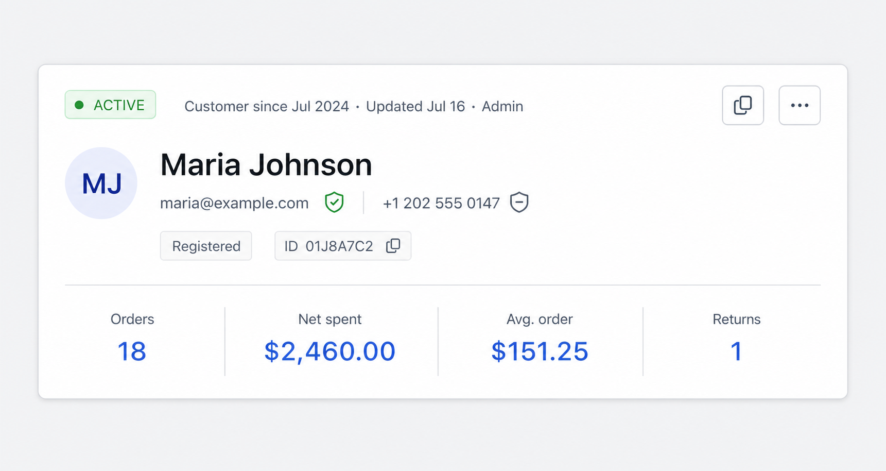
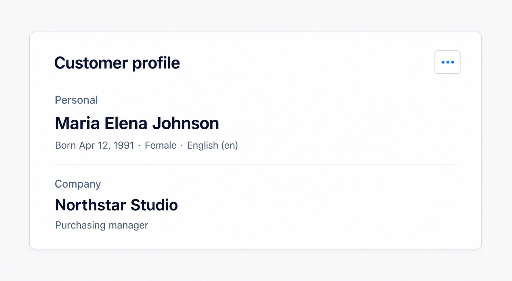
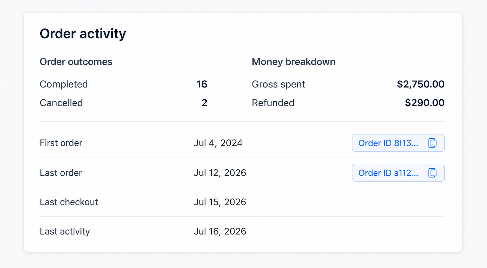
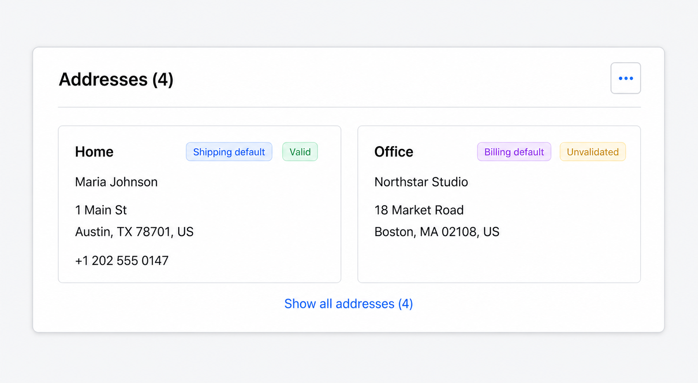
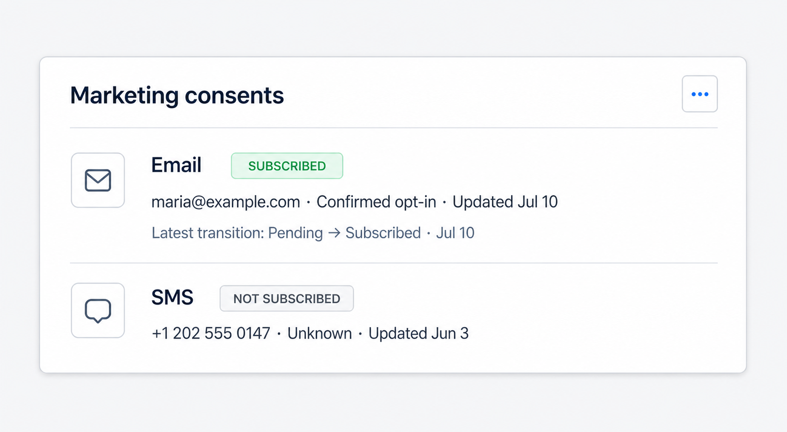
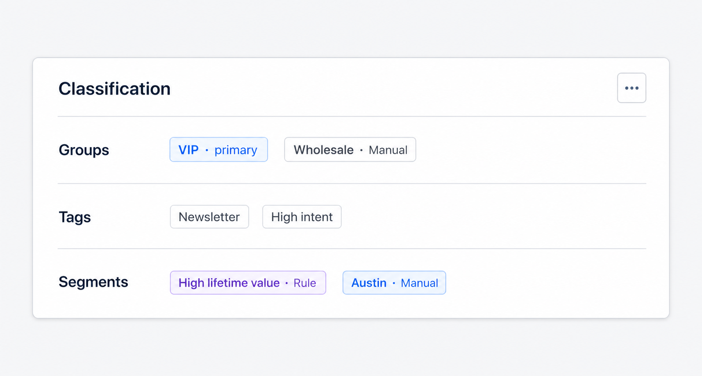
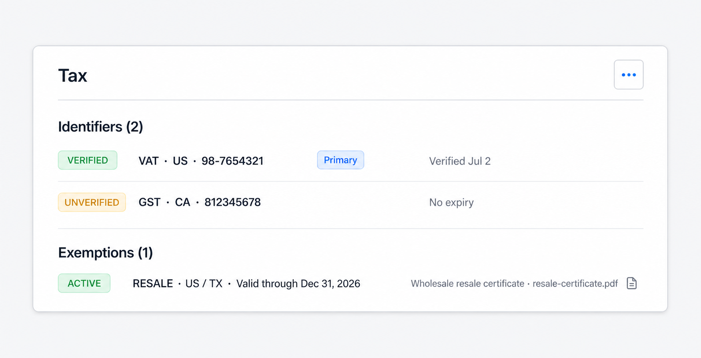
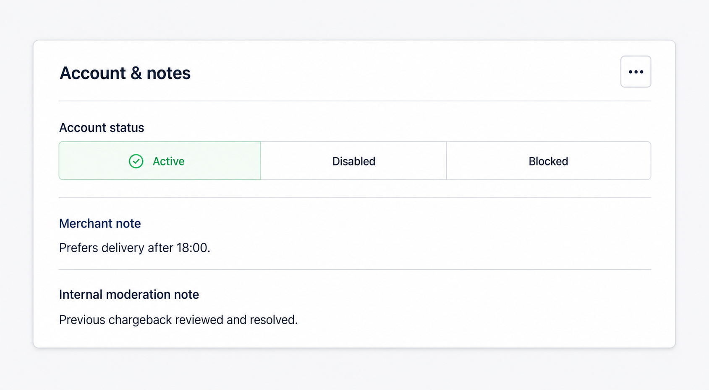

# Customer Details: redesign details card и section edit modals

## Цель

Спроектировать новый UI для `CustomerDetailsCard`, details modal и связанных модалок редактирования секций. Новый экран должен выглядеть как часть той же системы, что `ProductDetailsCard`, `CategoryDetailsCard` и спроектированный `ReviewDetailsCard`: компактная summary-карточка сверху, последовательные `Paper`-секции, локальные действия секций и предсказуемый Modal Stack.

Документ описывает presentation и interaction design. Он сохраняет существующий `Customer`, `CustomerUpdateInput`, lifecycle workflows и modal flow; отдельная customer page и новый GraphQL contract не предлагаются.

Референсы в текущем Admin UI:

- `admin/src/domains/customers/all-customers/components/customer-details-card`;
- `admin/src/domains/customers/all-customers/modals/customer-modal`;
- `admin/src/domains/customers/all-customers/modals/customer-edit-modal`;
- `admin/src/domains/customers/lifecycle/modals/merge-modal`;
- `admin/src/domains/customers/lifecycle/modals/data-request-modal`;
- `admin/src/domains/customers/all-customers/picker/customer-picker-config`;
- `admin/src/domains/inventory/products/components/product-info-header`;
- `admin/src/domains/inventory/categories/components/category-info-header`;
- `admin/src/domains/inventory/components/entity-details-sections`;
- `admin/src/layouts/modals`;
- `admin/src/ui-kit/paper`;
- `admin/src/ui-kit/kpi-tile`;
- `admin/src/ui-kit/copyable-chip`;
- `admin/src/shared/components/entity-picker-modal`.

## Что меняется относительно текущего UI

Текущий экран уже использует `Paper`, но остаётся длинной технической карточкой: header не повторяет устойчивую Product/Category композицию, KPI вынесены в отдельный тяжёлый блок, почти каждая секция построена на одинаковом `Descriptions`, audit metadata занимает основной scroll, а один `CustomerEditModal` одновременно гидратирует все editable collections независимо от выбранной секции.

В новом варианте:

1. Details modal получает стабильный заголовок `Customer details`; display name живёт только в summary-card.
2. Верхняя карточка повторяет композицию Product/Category info header: lifecycle/meta, identity, contact summary, actions, divider и четыре реальных KPI.
3. В начале показываются данные для ежедневной работы: кто этот клиент, как с ним связаться, его value и последние commerce events.
4. `Activity & value` не остаётся второй KPI-карточкой: основные metrics находятся только в header, а section показывает недублируемые breakdown и timestamps.
5. `Company` объединяется с personal profile в одну reading section, но сохраняет отдельный edit flow и отдельный API subtree.
6. `Notes & moderation` и `Lifecycle` объединяются в `Account & notes`, чтобы account decision, blocked reason и внутренний контекст читались вместе.
7. `Audit metadata` удаляется из основного scroll и открывается через `View technical metadata` из header overflow.
8. Все секционные действия используют существующий `EditAction` с `⋯`; primary-кнопка остаётся только в modal header.
9. Монолитный `CustomerEditModal` разделяется по `CustomerUpdateInput` subtrees. Изменение профиля больше не гидратирует и не пересылает addresses, consents, classification или tax collections.
10. Address и tax collection editors используют parent draft + nested item modal, чтобы длинные inline forms не превращали экран в анкету.
11. Merge и privacy request остаются отдельными workflow modals и переиспользуют существующий Customer Picker.
12. Empty/loading/error states используют те же визуальные принципы, что Product/Category/Review details.

## Визуальные правила

- Контент details и edit modals использует стандартный `ModalLayout`, `max-width: 800px`.
- Между карточками — `12px`, внутри `Paper` — текущий token-based padding.
- Одна карточка отвечает на один пользовательский вопрос: «кто этот клиент», «какова его commerce activity», «куда доставлять», «можно ли отправлять marketing», «к каким группам он относится».
- `Typography.Title level={3}` используется один раз — в `CustomerInfoHeader`.
- `PaperHeader` используется для всех секций; локальное действие находится справа.
- Цвет используется только семантически: lifecycle, verification, consent, address validation, tax status и errors.
- Системные ID показываются через `CopyableChip` или `Typography.Text copyable`, а не как обычный длинный текст.
- Не использовать отдельные декоративные градиенты, большие цветные hero-блоки и новые card primitives.
- Не использовать `Descriptions` как единственный layout для каждой секции; списки, компактные rows и semantic panels должны соответствовать характеру данных.
- Тексты controls остаются на английском, как в существующем Admin UI.
- Email, phone, tax identifiers и address values не должны попадать в decorative tooltip, `title` attribute или analytics event labels.

## Information architecture

```text
Customer details modal
├── CustomerInfoHeader
│   ├── lifecycle status + created/updated/source meta
│   ├── avatar + display name + account status
│   ├── email / phone verification summary + customer ID
│   └── orders / net spent / average order / returns KPI
├── CustomerProfileSection
│   └── personal profile + company
├── CustomerOrderActivitySection
│   └── outcome breakdown + money breakdown + first/last activity
├── CustomerAddressesSection
├── CustomerConsentsSection
├── CustomerClassificationSection
│   └── groups + tags + rule/manual segments
├── CustomerTaxSection
│   └── identifiers + exemptions
└── CustomerAccountSection
    └── lifecycle decision + merchant/moderation notes + terminal events
```

Порядок намеренный: оператор может идентифицировать клиента и оценить его relationship с магазином до прокрутки через classification, tax и системные lifecycle details.

## Modal Stack

```text
Customers page
└── Customer details                              level 0
    ├── Edit personal profile                     level 1
    ├── Edit contact details                      level 1
    ├── Edit company                              level 1
    ├── Manage addresses                          level 1
    │   └── Add / edit address                    level 2
    ├── Edit marketing consents                   level 1
    ├── Edit customer groups                      level 1
    ├── Edit customer tags                        level 1
    ├── Edit manual segments                      level 1
    ├── Change customer status                    level 1
    ├── Edit merchant note                        level 1
    ├── Edit moderation note                      level 1
    ├── Manage tax identifiers                    level 1
    │   └── Add / edit tax identifier             level 2
    ├── Manage tax exemptions                     level 1
    │   ├── Add / edit tax exemption              level 2
    │   └── Media picker / upload certificate     level 2
    ├── View technical metadata                   level 1
    ├── Merge customer                            level 1
    │   └── Customer picker                       level 2
    └── New privacy request                       level 1
```

После сохранения дочерняя modal вызывает `onSaved`, details query refetch выполняется до закрытия child modal, затем пользователь возвращается к актуальному Customer Details. Отмена nested item modal или picker не меняет draft родительской формы.

Рекомендуемые section keys:

```ts
type CustomerEditSection =
  | "profile"
  | "contact"
  | "company"
  | "addresses"
  | "consents"
  | "groups"
  | "tags"
  | "segments"
  | "status"
  | "note"
  | "moderation"
  | "taxIdentifiers"
  | "taxExemptions";
```

Текущие composite keys `classification`, `notes` и `tax` удаляются после миграции callers на независимые flows.

## Customer Details Modal

### Полный wireframe

```text
┌──────────────────────────────────────────────────────────────────────────┐
│ ×  Customer details                                                     │
├──────────────────────────────────────────────────────────────────────────┤
│                                                                          │
│  [API error alert — only when present]                                   │
│                                                                          │
│  ┌─ CustomerInfoHeader ───────────────────────────────────────────────┐  │
│  │ [ACTIVE ✓]  Customer since Jul 2024 · Updated Jul 16 · Admin [⋯] │  │
│  │                                                                    │  │
│  │ [MJ]  Maria Johnson                                                │  │
│  │       maria@example.com [verified] · +1 202 555 0147              │  │
│  │       [Registered] [ID 01J8A7C2]                                   │  │
│  │                                                                    │  │
│  │ ─────────────────────────────────────────────────────────────────  │  │
│  │                                                                    │  │
│  │ ┌─────────────┐ ┌─────────────┐ ┌─────────────┐ ┌─────────────┐   │  │
│  │ │ Orders      │ │ Net spent   │ │ Avg. order  │ │ Returns     │   │  │
│  │ │ 18          │ │ $2,460.00   │ │ $151.25     │ │ 1           │   │  │
│  │ └─────────────┘ └─────────────┘ └─────────────┘ └─────────────┘   │  │
│  └────────────────────────────────────────────────────────────────────┘  │
│                                                                          │
│  ┌─ Customer profile ─────────────────────────────────────────── [⋯] ┐  │
│  │ Personal                                                         │  │
│  │ Maria Elena Johnson · English (en) · Born Apr 12, 1991           │  │
│  │ Gender: Female                                                   │  │
│  │                                                                   │  │
│  │ Company                                                          │  │
│  │ Northstar Studio · Purchasing manager                            │  │
│  └────────────────────────────────────────────────────────────────────┘  │
│                                                                          │
│  ┌─ Order activity ──────────────────────────────────────────────────┐  │
│  │ Completed 16 · Cancelled 2          Gross $2,750 · Refunded $290 │  │
│  │                                                                    │  │
│  │ First order   Jul 4, 2024  [Order ID copy]                         │  │
│  │ Last order    Jul 12, 2026 [Order ID copy]                         │  │
│  │ Last checkout Jul 15, 2026 · Last activity Jul 16, 2026           │  │
│  └────────────────────────────────────────────────────────────────────┘  │
│                                                                          │
│  ┌─ Addresses (2) ──────────────────────────────────────────── [⋯] ┐  │
│  │ ┌────────────────────────────┐ ┌────────────────────────────┐     │  │
│  │ │ Home [Shipping] [Valid]    │ │ Office [Billing] [Unvalid.]│     │  │
│  │ │ Maria Johnson              │ │ Northstar Studio           │     │  │
│  │ │ 1 Main St, Austin, TX...   │ │ 18 Market Rd, Boston...    │     │  │
│  │ └────────────────────────────┘ └────────────────────────────┘     │  │
│  └────────────────────────────────────────────────────────────────────┘  │
│                                                                          │
│  ┌─ Marketing consents ─────────────────────────────────────── [⋯] ┐  │
│  │ Email     [SUBSCRIBED] maria@example.com · Confirmed opt-in      │  │
│  │           Updated Jul 10 · Latest: pending → subscribed          │  │
│  │ SMS       [NOT SUBSCRIBED] +1 202 555 0147 · Unknown             │  │
│  │           Updated Jun 3                                         │  │
│  └────────────────────────────────────────────────────────────────────┘  │
│                                                                          │
│  ┌─ Classification ─────────────────────────────────────────── [⋯] ┐  │
│  │ Groups    [VIP · primary] [Wholesale]                            │  │
│  │ Tags      [Newsletter] [High intent]                             │  │
│  │ Segments  [High lifetime value · Rule] [Austin · Manual]         │  │
│  └────────────────────────────────────────────────────────────────────┘  │
│                                                                          │
│  ┌─ Tax ────────────────────────────────────────────────────── [⋯] ┐  │
│  │ Identifiers (1)                                                   │  │
│  │ [VERIFIED] VAT · US · 98-7654321 [Primary]                        │  │
│  │                                                                   │  │
│  │ Exemptions (1)                                                    │  │
│  │ [ACTIVE] RESALE · US / TX · Valid through Dec 31, 2026            │  │
│  │          resale-certificate.pdf                                   │  │
│  └────────────────────────────────────────────────────────────────────┘  │
│                                                                          │
│  ┌─ Account & notes ────────────────────────────────────────── [⋯] ┐  │
│  │ [✓ Active        ][  Disabled      ][  Blocked        ] read-only │  │
│  │                                                                   │  │
│  │ Merchant note                                                    │  │
│  │ Prefers delivery after 18:00.                                    │  │
│  │                                                                   │  │
│  │ Internal moderation note                                         │  │
│  │ Previous chargeback reviewed and resolved.                       │  │
│  └────────────────────────────────────────────────────────────────────┘  │
│                                                                          │
└──────────────────────────────────────────────────────────────────────────┘
```

### CustomerInfoHeader



Композиция повторяет `ProductInfoHeader` и `CategoryInfoHeader`, но показывает только customer-relevant actions.

```text
┌──────────────────────────────────────────────────────────────────────────┐
│ [ACTIVE ✓]  Customer since Jul 2024 · Updated Jul 16 · Admin      [⋯] │
│                                                                          │
│ [MJ]  Maria Johnson                                                      │
│       maria@example.com [verified] · +1 202 555 0147 [not verified]     │
│       [Registered] [ID 01J8A7C2]                                         │
│                                                                          │
│ ──────────────────────────────────────────────────────────────────────── │
│                                                                          │
│ ┌──────────────┐ ┌──────────────┐ ┌──────────────┐ ┌──────────────┐    │
│ │ Orders       │ │ Net spent    │ │ Avg. order   │ │ Returns      │    │
│ │ 18           │ │ $2,460.00    │ │ $151.25      │ │ 1            │    │
│ └──────────────┘ └──────────────┘ └──────────────┘ └──────────────┘    │
└──────────────────────────────────────────────────────────────────────────┘
```

`PaperHeader title`:

- lifecycle `Tag` с icon и tooltip:
  - `ACTIVE` — green, check, `Customer can participate in normal store flows`;
  - `DISABLED` — default, pause, `Customer account is disabled by an administrator`;
  - `BLOCKED` — red, ban, `Customer is blocked; see account details for the reason`;
  - `MERGED` — purple, merge, `Profile was merged into another customer`;
  - `REDACTED` — default, lock, `Personal data was redacted by a privacy workflow`;
- compact meta: `Customer since {createdAt} · Updated {updatedAt} · {source}`;
- `source` форматируется human-readable; пустые значения не создают dangling separator;
- `createdByUserId` не показывается как actor name: API не возвращает связанную Admin identity.

`PaperHeader actions`:

- text button `LinkOutlined` — copy current Admin URL;
- `Dropdown` с `MoreOutlined`:

```text
Edit personal profile
Edit contact details
Edit company
Manage addresses
────────────────────────
Edit marketing consents
Edit customer groups
Edit customer tags
Edit manual segments
────────────────────────
Change customer status
Edit merchant note
Edit moderation note
Manage tax identifiers
Manage tax exemptions
View technical metadata
────────────────────────
Merge customer
Create privacy request
────────────────────────
Delete customer                 danger
```

Dropdown является fallback navigation. Основной путь редактирования — `EditAction` соответствующей секции.

Title area:

- `Avatar size={56}` с initials; при отсутствии имени — `UserOutlined`;
- title с ellipsis максимум две строки, fallback `Unnamed customer`;
- email и phone выводятся как copyable text; отсутствующие contacts не создают пустые chips;
- verification icon всегда имеет text tooltip и accessible name `Email verified`, `Email not verified`, `Phone verified` или `Phone not verified`;
- `accountStatus` отображается отдельным neutral `Tag`: `Guest`, `Invited`, `Registered`;
- `CopyableChip label="ID"` показывает короткий display value и копирует полный global ID;
- storefront/open/share actions Product/Category здесь не используются: у Customer нет публичного customer URL.

KPI panel:

- `KPITile` для `statistics.ordersCount`;
- `KPITile` для default-currency `monetaryStatistics.netSpentMinor`;
- `KPITile` для default-currency `monetaryStatistics.averageOrderValueMinor`;
- `KPITile` для `statistics.returnsCount`.

`PeriodSwitch` и trends не используются: API содержит lifetime projections без временных рядов. Нельзя переносить mock trends из Product/Category.

Денежные значения форматируются только с `useDefaultCurrency()`. Запрещено использовать `monetaryStatistics.edges[0].node.currencyCode` как display source или fallback на первую доступную currency row.

### CustomerProfileSection



```text
┌─ Customer profile ─────────────────────────────────────────────── [⋯] ┐
│ Personal                                                               │
│ Maria Elena Johnson                                                     │
│ Born Apr 12, 1991 · Female · English (en)                               │
│                                                                         │
│ ─────────────────────────────────────────────────────────────────────── │
│                                                                         │
│ Company                                                                │
│ Northstar Studio · Purchasing manager                                  │
└─────────────────────────────────────────────────────────────────────────┘
```

- Full name собирается из `prefix`, `firstName`, `middleName`, `lastName`, `suffix` без пустых separators.
- `preferredLocale` выводится через `shopLocales` как human label + code.
- `dateOfBirth` форматируется как date без времени.
- Gender остаётся текстовым значением из API; UI не придумывает enum, которого нет в schema.
- Company block не рендерит отдельную пустую карточку. При отсутствии обоих значений показывается compact empty text `No company information`.
- Email и phone не повторяются: они уже принадлежат header summary.
- Section menu содержит независимые действия `Edit personal profile`, `Edit contact details`, `Edit company`.

### CustomerOrderActivitySection



```text
┌─ Order activity ────────────────────────────────────────────────────────┐
│ Order outcomes                        Money breakdown                    │
│ Completed  16                         Gross spent   $2,750.00            │
│ Cancelled   2                         Refunded        $290.00            │
│                                                                         │
│ ─────────────────────────────────────────────────────────────────────── │
│                                                                         │
│ First order       Jul 4, 2024    [Order ID 8f13… copy]                  │
│ Last order        Jul 12, 2026   [Order ID a112… copy]                  │
│ Last checkout     Jul 15, 2026                                         │
│ Last activity     Jul 16, 2026                                         │
└─────────────────────────────────────────────────────────────────────────┘
```

- Section read-only и не имеет `EditAction`: statistics являются rebuildable projections.
- Header KPI здесь не повторяются. Section показывает только `completedOrdersCount`, `cancelledOrdersCount`, `totalSpentMinor`, `totalRefundedMinor` и timestamps.
- `firstOrderId` и `lastOrderId` показываются как `CopyableChip` рядом с соответствующей датой.
- Не показывать `Open order`: комментарий API прямо указывает, что Orders Admin type не является federation entity.
- Не добавлять recent orders list: `Customer` contract её не возвращает.
- Если `statistics` отсутствует, одна compact empty state объясняет `No customer activity statistics yet`; не рендерится сетка из нулей и dash.
- Если default-currency monetary row отсутствует, money values показывают `—`, а не значения другой currency.

### CustomerAddressesSection



```text
┌─ Addresses (4) ────────────────────────────────────────────────── [⋯] ┐
│ ┌───────────────────────────────┐ ┌───────────────────────────────┐   │
│ │ Home [Shipping default]       │ │ Office [Billing default]      │   │
│ │ [✓ Valid]                     │ │ [◷ Unvalidated]               │   │
│ │                               │ │                               │   │
│ │ Maria Johnson                 │ │ Northstar Studio              │   │
│ │ 1 Main St                     │ │ 18 Market Road                │   │
│ │ Austin, TX 78701, US          │ │ Boston, MA 02108, US          │   │
│ │ +1 202 555 0147               │ │                               │   │
│ └───────────────────────────────┘ └───────────────────────────────┘   │
│ [Show all addresses (4)]                                               │
└─────────────────────────────────────────────────────────────────────────┘
```

- Default shipping и billing addresses идут первыми; далее стабильный API order.
- По умолчанию показываются максимум три address cards; `Show all addresses (N)` раскрывает остальные в текущей details modal.
- Address line формируется без лишних commas из `address1`, `address2`, city, region, postal code и country.
- Country code отображается как country label через `shopCountries`, с code в secondary text.
- Validation status:
  - `VALID` — green check;
  - `UNVALIDATED` — gold clock;
  - `INVALID` — red warning;
- `validatedAt` доступен в tooltip/status detail только когда присутствует.
- Latitude/longitude, address ID и created/updated timestamps не участвуют в основном reading flow.
- Empty state: `No addresses added` + section action `Manage addresses`.
- Единственное действие секции — `Manage addresses`.

### CustomerConsentsSection



```text
┌─ Marketing consents ───────────────────────────────────────────── [⋯] ┐
│ [mail] Email       [SUBSCRIBED]                                      │
│        maria@example.com · Confirmed opt-in · Updated Jul 10          │
│        Latest transition: Pending → Subscribed · Jul 10              │
│ ───────────────────────────────────────────────────────────────────── │
│ [sms]  SMS         [NOT SUBSCRIBED]                                  │
│        +1 202 555 0147 · Unknown · Updated Jun 3                      │
└─────────────────────────────────────────────────────────────────────────┘
```

- Рендерятся только существующие consent records; отсутствие record не приравнивается визуально к `NOT_SUBSCRIBED`.
- Один row показывает channel, semantic state tag, contact point, opt-in level, updated date и latest transition.
- Latest event берётся из уже запрошенного newest-first `events.edges[0]`.
- `SUBSCRIBED` — green; `PENDING` — gold; `UNSUBSCRIBED` — default; `INVALID` — red; `REDACTED` — locked/default.
- `sourceIp`, `userAgent`, `actorId` и raw `evidence` не показываются в основной section.
- Empty state: `No marketing consent records`.
- Единственное действие секции — `Edit marketing consents`.

### CustomerClassificationSection



```text
┌─ Classification ──────────────────────────────────────────────── [⋯] ┐
│ Groups                                                                  │
│ [VIP · primary] [Wholesale · Manual]                                   │
│                                                                         │
│ Tags                                                                    │
│ [Newsletter] [High intent]                                             │
│                                                                         │
│ Segments                                                                │
│ [High lifetime value · Rule] [Austin · Manual]                         │
└─────────────────────────────────────────────────────────────────────────┘
```

- Groups показывают `isPrimary`, assignment source и inactive/expired state.
- Tags показываются простыми chips; assignment audit не перегружает основную строку.
- Segments показывают source: `Manual`, `Rule`, `Import`, `System`.
- Rule/import/system memberships являются read-only. `Edit manual segments` управляет только manual subset.
- Inactive membership остаётся видимым muted row/tag с `Inactive`; оно не маскируется как активное.
- Section menu содержит три независимых действия: `Edit customer groups`, `Edit customer tags`, `Edit manual segments`.
- Для каждого пустого subsection используется secondary text `No groups`, `No tags`, `No segments`, а не три больших `Empty` illustrations.

### CustomerTaxSection



```text
┌─ Tax ──────────────────────────────────────────────────────────── [⋯] ┐
│ Identifiers (2)                                                        │
│ [VERIFIED] VAT · US · 98-7654321 [Primary]      Verified Jul 2       │
│ [UNVERIFIED] GST · CA · 812345678                     No expiry       │
│                                                                         │
│ ─────────────────────────────────────────────────────────────────────── │
│                                                                         │
│ Exemptions (1)                                                         │
│ [ACTIVE] RESALE · US / TX · Valid through Dec 31, 2026                 │
│          Wholesale resale certificate · resale-certificate.pdf        │
└─────────────────────────────────────────────────────────────────────────┘
```

- Identifier row показывает type, country, copyable value, status, primary marker и validity.
- `normalizedValue` не дублируется рядом с value; это server normalization detail.
- Exemption row показывает code, jurisdiction, reason, status, validity и certificate link.
- Certificate открывается как file URL с `rel="noreferrer"`; raw `certificateFileId` пользователю не показывается.
- Status colors используются семантически и одинаково в details/edit flows.
- Section menu содержит `Manage tax identifiers` и `Manage tax exemptions`.
- Пустые identifiers/exemptions показывают компактный subsection empty state.

### CustomerAccountSection

Секция объединяет account decision, notes и terminal lifecycle evidence. Lifecycle status в header остаётся summary badge; здесь находится полный контекст решения.



```text
┌─ Account & notes ──────────────────────────────────────────────── [⋯] ┐
│ Account status                                                          │
│ ┌──────────────────┬──────────────────┬──────────────────┐              │
│ │ ✓ Active         │   Disabled       │   Blocked        │ read-only    │
│ └──────────────────┴──────────────────┴──────────────────┘              │
│                                                                         │
│ Merchant note                                                           │
│ Prefers delivery after 18:00.                                          │
│                                                                         │
│ Internal moderation note                                                │
│ Previous chargeback reviewed and resolved.                             │
│                                                                         │
│ [Only when present] Blocked reason / merged target / redacted date     │
└─────────────────────────────────────────────────────────────────────────┘
```

- Для `ACTIVE`, `DISABLED`, `BLOCKED` details использует static horizontal status strip без hover/focus/select behavior.
- В edit modal та же геометрия становится настоящим selectable `Segmented block`.
- Для terminal `MERGED` или `REDACTED` вместо трёх selectable-looking segments показывается semantic context panel с target/timestamp.
- `blockedReason` показывается только для `BLOCKED`; пустой `Blocked reason: —` при других statuses отсутствует.
- Merchant note и moderation note разделены labels и helper copy. Обе заметки internal, но принадлежат разным API operations.
- `mergedInto`, `redactedAt` и `deletedAt` показываются только когда присутствуют.
- Section menu содержит `Change customer status`, `Edit merchant note`, `Edit moderation note`, `Merge customer`, `Create privacy request`.

### Почему нет отдельных Activity & value, Company, Lifecycle и Audit metadata

```text
CURRENT                          REDESIGN
────────────────────────────     ───────────────────────────────────
Header                           CustomerInfoHeader
Activity & value                 ├─ lifetime KPI only once
                                 └─ Order activity: breakdown/dates

Profile & contacts               Header: contact summary
Company                          Customer profile: profile + company

Notes & moderation               Account & notes
Lifecycle                        └─ decision + notes + terminal events

Audit metadata                   View technical metadata modal
```

- KPI не дублируются между header и отдельной statistics grid.
- Маленькая Company card не создаёт самостоятельный vertical stop, но company edit остаётся независимым.
- Account decision невозможно корректно читать отдельно от blocked reason и moderation context.
- Технические IDs/revision/source timestamps доступны, но не конкурируют с operational content.

### View technical metadata

Read-only utility modal открывается из header overflow:

```text
┌──────────────────────────────────────────────────────────────────────────┐
│ ×  Customer technical metadata                                          │
├──────────────────────────────────────────────────────────────────────────┤
│  ┌─ Identity ─────────────────────────────────────────────────────────┐  │
│  │ Customer ID       [gid://shopana/Customer/… copy]                 │  │
│  │ IAM principal     [principal_… copy]                              │  │
│  │ Source            Admin import                                    │  │
│  │ Created by ID     [admin_… copy]                                  │  │
│  └────────────────────────────────────────────────────────────────────┘  │
│                                                                          │
│  ┌─ Audit ────────────────────────────────────────────────────────────┐  │
│  │ Revision          14                                               │  │
│  │ Created           Jul 4, 2024 10:15                               │  │
│  │ Updated           Jul 16, 2026 14:32                              │  │
│  │ Activity stats    Jul 16, 2026 14:25                              │  │
│  │ Money stats       Jul 16, 2026 14:25                              │  │
│  └────────────────────────────────────────────────────────────────────┘  │
└──────────────────────────────────────────────────────────────────────────┘
```

- Modal не имеет `Save`.
- IDs copyable, dates используют общий formatter.
- Consent evidence и workflow raw JSON не добавляются сюда автоматически: это отдельные records, а не Customer metadata.
- Пустой `iamPrincipalId` объясняется как `No linked IAM principal`, а не показывается dash без контекста.

## Section Edit Modals

### Общий pattern

Каждая edit modal использует:

```text
ModalLayout
├── ModalHeader: close / stable title / primary Save
└── scrollable body, max-width 800
    ├── API Alert, only when present
    └── one or more Paper sections
```

Общие правила:

1. `Save` disabled, пока detail loading, форма невалидна, submit выполняется или form не dirty.
2. Любое изменение вызывает `setDirty(true)`; закрытие обрабатывается стандартным Modal Stack confirmation.
3. Field errors находятся под конкретным control; operation/network error — `Alert` над первой `Paper`.
4. После submit ошибка не закрывает modal и не очищает draft.
5. При success: refetch details, success toast, `setDirty(false)`, `forcePop()`.
6. Каждая modal повторно загружает актуального Customer и отправляет только свой subtree с текущим `expectedRevision`.
7. `operationResults.errors` и top-level `userErrors` объединяются hook, затем mapper раскладывает их по section field paths.
8. Формы используют `react-hook-form` и section Zod schemas вместо одного набора локальных `useState` для всех customer sections.
9. Form controls имеют видимые labels; placeholders не заменяют labels.
10. Read-only API values не включаются в submit только потому, что были показаны рядом с form.

### 1. Edit Personal Profile

```text
┌──────────────────────────────────────────────────────────────────────────┐
│ ×  Edit personal profile                                    [Save]      │
├──────────────────────────────────────────────────────────────────────────┤
│  ┌─ Name ─────────────────────────────────────────────────────────────┐  │
│  │ Prefix            First name *             Middle name            │  │
│  │ [Ms__________]    [Maria_______________]   [Elena____________]    │  │
│  │                                                                    │  │
│  │ Last name *                              Suffix                    │  │
│  │ [Johnson____________________________]    [___________________]    │  │
│  └────────────────────────────────────────────────────────────────────┘  │
│                                                                          │
│  ┌─ Personal details ────────────────────────────────────────────────┐  │
│  │ Preferred locale *                  Date of birth                 │  │
│  │ [English (en)________________⌄]    [1991-04-12____________]      │  │
│  │                                                                    │  │
│  │ Gender                                                             │  │
│  │ [Female____________________________________________________]      │  │
│  └────────────────────────────────────────────────────────────────────┘  │
└──────────────────────────────────────────────────────────────────────────┘
```

- `shopLocales` используется для locale select.
- Email, phone, company и status отсутствуют.
- Empty optional strings нормализуются в `null` mapper-ом.
- Submit subtree: `{ profile: { prefix, firstName, middleName, lastName, suffix, preferredLocale, dateOfBirth, gender } }`.

### 2. Edit Contact Details

```text
┌──────────────────────────────────────────────────────────────────────────┐
│ ×  Edit contact details                                     [Save]      │
├──────────────────────────────────────────────────────────────────────────┤
│  ┌─ Contact details ─────────────────────────────────────────────────┐  │
│  │ Email                                                             │  │
│  │ [maria@example.com__________________________________________]     │  │
│  │ Current state: ✓ Verified                                         │  │
│  │                                                                    │  │
│  │ Phone                                                             │  │
│  │ [+12025550147_______________________________________________]     │  │
│  │ Current state: Not verified                                       │  │
│  │                                                                    │  │
│  │ ℹ Changing a contact value does not mark it as verified.          │  │
│  └────────────────────────────────────────────────────────────────────┘  │
└──────────────────────────────────────────────────────────────────────────┘
```

- Email валидируется как email и нормализуется consistently с create flow.
- Phone валидируется/нормализуется в E.164 на display boundary/schema policy.
- `emailVerified` и `phoneVerified` read-only; API не предоставляет update input для этих flags.
- Consent contact points не обновляются молча вместе с customer contact. После save можно показать non-blocking notice, если существующий consent использует старое значение.
- Submit subtree: `{ contact: { email, phoneE164 } }`.

### 3. Edit Company

```text
┌──────────────────────────────────────────────────────────────────────────┐
│ ×  Edit company                                             [Save]      │
├──────────────────────────────────────────────────────────────────────────┤
│  ┌─ Company ──────────────────────────────────────────────────────────┐  │
│  │ Company name                                                       │  │
│  │ [Northstar Studio___________________________________________]      │  │
│  │                                                                    │  │
│  │ Job title                                                          │  │
│  │ [Purchasing manager________________________________________]      │  │
│  └────────────────────────────────────────────────────────────────────┘  │
└──────────────────────────────────────────────────────────────────────────┘
```

- Tax identifiers не находятся в этой modal.
- Submit subtree: `{ company: { companyName, jobTitle } }`.

### 4. Manage Addresses

```text
┌──────────────────────────────────────────────────────────────────────────┐
│ ×  Manage addresses                                         [Save]      │
├──────────────────────────────────────────────────────────────────────────┤
│  ┌─ Addresses ─────────────────────────────────────────── 2 total ───┐  │
│  │ [Home]   1 Main St, Austin, TX         [Shipping] [Valid]   [⋯]  │  │
│  │ [Office] 18 Market Rd, Boston, MA      [Billing] [Unvalid.] [⋯]  │  │
│  │                                                                    │  │
│  │ [+ Add address]                                                    │  │
│  └────────────────────────────────────────────────────────────────────┘  │
│                                                                          │
│  Defaults: Shipping [Home________⌄]  Billing [Office________⌄]          │
└──────────────────────────────────────────────────────────────────────────┘
```

- Parent modal хранит address collection draft и explicit `created`, `updated`, `deleted` state.
- Row menu: `Edit address`, `Set as shipping default`, `Set as billing default`, `Remove`.
- `Remove` меняет только draft. Existing address попадает в `deleteIds` исключительно после explicit remove.
- Нельзя определять deletion как «ID отсутствует в текущей загруженной странице».
- Default selects используют existing или newly created draft identity; mapper преобразует new item default в корректные create flags, а existing — в `defaultShippingAddressId` / `defaultBillingAddressId`.
- Validation status read-only и не сбрасывается обычным edit UI.
- Submit subtree: `{ addresses: { create, update, deleteIds, defaultShippingAddressId, defaultBillingAddressId } }`.

Nested address item modal:

```text
┌──────────────────────────────────────────────────────────────────────────┐
│ ×  Edit address                                             [Apply]     │
├──────────────────────────────────────────────────────────────────────────┤
│  ┌─ Address identity ─────────────────────────────────────────────────┐  │
│  │ Label                 Company                                    │  │
│  │ [Home___________]     [____________________________________]      │  │
│  │ Name fields: prefix / first / middle / last / suffix              │  │
│  │ Phone [_______________________________________________]           │  │
│  └────────────────────────────────────────────────────────────────────┘  │
│  ┌─ Location ─────────────────────────────────────────────────────────┐  │
│  │ Address line 1 * / Address line 2                                  │  │
│  │ City * / Region / Region code / Postal code                        │  │
│  │ Country *                                                          │  │
│  └────────────────────────────────────────────────────────────────────┘  │
│  [ ] Default shipping       [ ] Default billing                        │
└──────────────────────────────────────────────────────────────────────────┘
```

- `Apply` обновляет только parent draft; server mutation выполняется по parent `Save`.
- `shopCountries` используется для country select.
- Latitude/longitude не добавляются как raw text fields в основной editor.
- Закрытие nested modal без `Apply` не меняет parent draft.

### 5. Edit Marketing Consents

```text
┌──────────────────────────────────────────────────────────────────────────┐
│ ×  Edit marketing consents                                  [Save]      │
├──────────────────────────────────────────────────────────────────────────┤
│  ┌─ Email ────────────────────────────────────────────────────────────┐  │
│  │ Current: Subscribed · Confirmed opt-in · Updated Jul 10            │  │
│  │ State *        [Subscribed__________________________________⌄]    │  │
│  │ Opt-in level   [Confirmed opt-in____________________________⌄]    │  │
│  │ Contact point  [maria@example.com___________________________]     │  │
│  └────────────────────────────────────────────────────────────────────┘  │
│  ┌─ SMS ──────────────────────────────────────────────────────────────┐  │
│  │ Current: No record                                                 │  │
│  │ [+ Add consent state]                                              │  │
│  └────────────────────────────────────────────────────────────────────┘  │
└──────────────────────────────────────────────────────────────────────────┘
```

- Rows строятся по `CustomerConsentChannel`, но absent channel явно обозначается `No record`, а не `Not subscribed`.
- Admin-selectable states ограничены `CustomerConsentAdminState`.
- Existing `INVALID` и `REDACTED` не преобразуются в `NOT_SUBSCRIBED` при hydration. Любой переход начинается только после explicit user choice; redacted record может быть read-only согласно backend policy.
- Contact point required для изменяемого/new row.
- `set` содержит только dirty channel transitions. Неизменённые rows не должны создавать новые immutable consent events.
- `sourceIp`, `userAgent`, `evidence` и source metadata не редактируются raw JSON controls в этой modal.
- Submit subtree: `{ consents: { set: changedChannels } }`.

### 6. Edit Customer Groups

```text
┌──────────────────────────────────────────────────────────────────────────┐
│ ×  Edit customer groups                                     [Save]      │
├──────────────────────────────────────────────────────────────────────────┤
│  ┌─ Manual group memberships ────────────────────────────────────────┐  │
│  │ Groups *        [VIP, Wholesale____________________________⌄]     │  │
│  │ Primary group   [VIP_______________________________________⌄]     │  │
│  │                                                                    │  │
│  │ Rule/import/system memberships remain unchanged.                   │  │
│  └────────────────────────────────────────────────────────────────────┘  │
└──────────────────────────────────────────────────────────────────────────┘
```

- Options загружаются из active customer groups editor context.
- Primary group обязан входить в selected group IDs; удаление primary очищает/переназначает selection явно.
- Input contract заменяет только manual memberships; non-manual memberships не включаются в form values.
- Submit subtree: `{ groups: { memberships: [{ groupId, isPrimary }] } }`.

### 7. Edit Customer Tags

```text
┌──────────────────────────────────────────────────────────────────────────┐
│ ×  Edit customer tags                                       [Save]      │
├──────────────────────────────────────────────────────────────────────────┤
│  ┌─ Tags ─────────────────────────────────────────────────────────────┐  │
│  │ [Newsletter, High intent___________________________________⌄]     │  │
│  │                                                                    │  │
│  │ Selected tags replace the customer's current tag assignments.      │  │
│  └────────────────────────────────────────────────────────────────────┘  │
└──────────────────────────────────────────────────────────────────────────┘
```

- Используется searchable multi-select из customer tags editor context.
- Save явно является complete replacement для tag IDs.
- Submit subtree: `{ tags: { tagIds } }`.

### 8. Edit Manual Segments

```text
┌──────────────────────────────────────────────────────────────────────────┐
│ ×  Edit manual segments                                     [Save]      │
├──────────────────────────────────────────────────────────────────────────┤
│  ┌─ Manual memberships ──────────────────────────────────────────────┐  │
│  │ [Austin, Wholesale prospects______________________________⌄]     │  │
│  │                                                                    │  │
│  │ Read-only calculated memberships                                  │  │
│  │ [High lifetime value · Rule] [Recent buyer · System]              │  │
│  └────────────────────────────────────────────────────────────────────┘  │
└──────────────────────────────────────────────────────────────────────────┘
```

- Select предлагает только active `MANUAL` segments.
- Rule/import/system memberships показываются для context, но не входят в editable array.
- Submit subtree: `{ segments: { segmentIds } }`; API заменяет только manual memberships.

### 9. Change Customer Status

```text
┌──────────────────────────────────────────────────────────────────────────┐
│ ×  Change customer status                                   [Save]      │
├──────────────────────────────────────────────────────────────────────────┤
│  ┌─ Account status ──────────────────────────────────────────────────┐  │
│  │ [✓ Active        ] [  Disabled      ] [⊘ Blocked        ]         │  │
│  │                                                                    │  │
│  │ ┌────────────────────────────────────────────────────────────────┐ │  │
│  │ │ Active                                                         │ │  │
│  │ │ Customer can participate in normal store flows.                │ │  │
│  │ └────────────────────────────────────────────────────────────────┘ │  │
│  │                                                                    │  │
│  │ Block reason *  [visible only for Blocked]                         │  │
│  └────────────────────────────────────────────────────────────────────┘  │
│  Current status: Active · Updated Jul 16                               │
└──────────────────────────────────────────────────────────────────────────┘
```

- Selectable values ограничены `CustomerAdminLifecycleStatus`: Active, Disabled, Blocked.
- Merge и redaction не являются status options; это dedicated workflows.
- Consequence copy показывается один раз для выбранного status.
- `BLOCKED` требует non-empty `blockedReason`; для Active/Disabled mapper отправляет `blockedReason: null` согласно API policy.
- Modal недоступна для terminal `MERGED`/`REDACTED` state.
- Submit subtree: `{ status: { status, blockedReason } }`.

### 10. Edit Merchant Note

```text
┌──────────────────────────────────────────────────────────────────────────┐
│ ×  Edit merchant note                                       [Save]      │
├──────────────────────────────────────────────────────────────────────────┤
│  ┌─ Merchant note ───────────────────────────────────────────────────┐  │
│  │ [Prefers delivery after 18:00.                                ]   │  │
│  │ [                                                               ]   │  │
│  │                                                     31 / 2000       │  │
│  │ Visible only to store administrators.                             │  │
│  └────────────────────────────────────────────────────────────────────┘  │
└──────────────────────────────────────────────────────────────────────────┘
```

- Moderation note отсутствует.
- Submit subtree: `{ note: { note } }`.

### 11. Edit Moderation Note

```text
┌──────────────────────────────────────────────────────────────────────────┐
│ ×  Edit moderation note                                     [Save]      │
├──────────────────────────────────────────────────────────────────────────┤
│  ┌─ Internal moderation context ─────────────────────────────────────┐  │
│  │ [Previous chargeback reviewed and resolved.                  ]    │  │
│  │ [                                                               ]   │  │
│  │                                                     43 / 2000       │  │
│  │ This note is never shown to the customer.                         │  │
│  └────────────────────────────────────────────────────────────────────┘  │
└──────────────────────────────────────────────────────────────────────────┘
```

- Merchant note и status отсутствуют.
- Submit subtree: `{ moderation: { moderationNote } }`.

### 12. Manage Tax Identifiers

```text
┌──────────────────────────────────────────────────────────────────────────┐
│ ×  Manage tax identifiers                                   [Save]      │
├──────────────────────────────────────────────────────────────────────────┤
│  ┌─ Tax identifiers ────────────────────────────────────────────────┐   │
│  │ VAT · US · 98-7654321       [Verified] [Primary]          [⋯]  │   │
│  │ GST · CA · 812345678        [Unverified]                 [⋯]  │   │
│  │                                                                  │   │
│  │ [+ Add identifier]                                               │   │
│  └──────────────────────────────────────────────────────────────────┘   │
└──────────────────────────────────────────────────────────────────────────┘
```

- Parent draft хранит stable keys, create/update/delete intent.
- Nested item form редактирует type, country, value, status, primary, valid from/to.
- `normalizedValue` и `verifiedAt` read-only и не отправляются обратно.
- В каждый момент не более одного primary identifier; conflict решается в draft до submit.
- Existing identifier попадает в `deleteIds` только после explicit remove.
- Submit subtree: `{ taxIdentifiers: { create, update, deleteIds } }`.

### 13. Manage Tax Exemptions

```text
┌──────────────────────────────────────────────────────────────────────────┐
│ ×  Manage tax exemptions                                    [Save]      │
├──────────────────────────────────────────────────────────────────────────┤
│  ┌─ Tax exemptions ────────────────────────────────────────────────┐    │
│  │ RESALE · US / TX · through Dec 31     [Active]          [⋯]  │    │
│  │   resale-certificate.pdf                                       │    │
│  │                                                                │    │
│  │ [+ Add exemption]                                              │    │
│  └────────────────────────────────────────────────────────────────┘    │
└──────────────────────────────────────────────────────────────────────────┘
```

Nested exemption form:

```text
┌──────────────────────────────────────────────────────────────────────────┐
│ ×  Edit tax exemption                                       [Apply]     │
├──────────────────────────────────────────────────────────────────────────┤
│ Code * / Country / Region code / Status *                               │
│ Valid from / Valid to                                                    │
│ Reason                                                                   │
│ Certificate  [resale-certificate.pdf________] [Select] [Remove]         │
└──────────────────────────────────────────────────────────────────────────┘
```

- Certificate выбирается существующим Media Picker или upload flow; raw `certificateFileId` не является пользовательским text input.
- `Apply` изменяет parent draft; parent `Save` выполняет server mutation.
- Existing exemption удаляется только explicit remove action.
- Submit subtree: `{ taxExemptions: { create, update, deleteIds } }`.

## Existing Lifecycle Workflow Modals

### Merge Customer

Существующий `CustomerMergeModal` переиспользуется, но при запуске из details получает более строгий context:

```text
┌──────────────────────────────────────────────────────────────────────────┐
│ ×  Merge customer                                      [Request merge]  │
├──────────────────────────────────────────────────────────────────────────┤
│  ┌─ Source customer ─────────────────────────────────────────────────┐  │
│  │ Maria Johnson · maria@example.com                         read-only │  │
│  │ This profile will be merged and closed.                           │  │
│  └────────────────────────────────────────────────────────────────────┘  │
│  ┌─ Target customer ─────────────────────────────────────────────────┐  │
│  │ [Maria J.________________________________________] [Select]        │  │
│  │ The target remains active and receives consolidated data.         │  │
│  └────────────────────────────────────────────────────────────────────┘  │
│  Reason [________________________________________________________]       │
└──────────────────────────────────────────────────────────────────────────┘
```

- Source prefilled текущим Customer и read-only; нельзя случайно запросить merge другого source из открытых details.
- Target использует существующий Customer Picker и исключает source ID.
- Source/target equality валидируется до mutation.
- После request details refetch показывает актуальный lifecycle state. Details не обещает synchronous completion workflow.

### New Privacy Request

Существующий `CustomerDataRequestModal` сохраняется:

- Customer prefilled и read-only при запуске из details.
- Type, legal basis и due date находятся в основной `Request` Paper.
- `requestMetadata` JSON скрывается в collapsed `Advanced` и валидируется как object; пустой/default `{}` не занимает восемь строк основного form.
- Copy объясняет, что privacy erasure и обычный customer delete — разные действия.
- Existing Customer Picker остаётся доступным при запуске modal с lifecycle page, но не нужен в customer-scoped details flow.

## Destructive Confirmation

### Delete Customer

```text
┌──────────────────────────────────────────────────────────────┐
│ Delete customer?                                             │
│                                                              │
│ Maria Johnson will be soft-deleted and removed from active   │
│ customer views. This does not erase personal data. Use a     │
│ privacy request when data erasure is required.                │
│                                                              │
│                                      [Cancel] [Delete]        │
└──────────────────────────────────────────────────────────────┘
```

- `Delete` — danger button.
- Mutation отправляет current `expectedRevision`.
- При revision conflict confirmation закрывается, details остаётся открытой и показывает reload action.
- После success details modal закрывается и Customers list refetch выполняется.
- Copy не обещает hard delete: backend `CustomerDeleteScript` выполняет soft delete.

## Component Reuse Matrix

| UI responsibility | Переиспользовать | Решение |
|---|---|---|
| Modal shell | `ModalLayout`, `ModalHeader` | Без нового shell/footer |
| Section surface | `Paper`, `PaperHeader` | Один pattern для всех sections |
| Local section action | `EditAction` | `⋯` с понятными menu labels |
| Status/meta header | composition Product/Category `InfoHeader` | Новый `CustomerInfoHeader`, та же структура |
| Avatar | Ant Design `Avatar` | Initials, без fake image |
| IDs | `CopyableChip` | Customer и raw Order IDs |
| Header metrics | `KPITile` | Только реальные lifetime values |
| Dates | `formatDetailDate` + date-only wrapper | Один formatter вместо scattered `toLocaleString()` |
| Currency source | `useDefaultCurrency` | Никогда не брать currency из monetary row |
| Minor money formatting | один shared customer money helper | Убрать два локальных `Intl.NumberFormat` implementations |
| Locale/country | `shopLocales`, `shopCountries` | Human label + stable code |
| Empty content | `EntityDetailsEmptyState` | Customer-specific copy/icon |
| Customer selection | existing Customer Picker | Merge target; не создавать второй picker |
| Certificate selection | existing Media Picker/upload primitives | Не вводить raw file ID field |
| Forms | `react-hook-form`, section Zod schemas | Dirty/errors/submit единообразны |
| Unsaved close | Modal Stack built-in confirmation | Не создавать локальный confirm |
| Merge/privacy workflows | existing lifecycle modals/hooks | Customer details только задаёт scoped payload |

## Что должно стать отдельными Customer Components

```text
admin/src/domains/customers/all-customers/components/customer-details-card/
├── customer-details-card.tsx
├── customer-details-card.styles.ts
├── customer-info-header.tsx
├── sections/
│   ├── customer-profile-section.tsx
│   ├── customer-order-activity-section.tsx
│   ├── customer-addresses-section.tsx
│   ├── customer-consents-section.tsx
│   ├── customer-classification-section.tsx
│   ├── customer-tax-section.tsx
│   └── customer-account-section.tsx
└── hooks/
    └── use-customer-modals.ts
```

Текущий single-file `CustomerDetailsCard` не должен продолжать владеть formatters, confirmation, section composition и всеми modal callbacks одновременно.

Edit modals рекомендуется разделить физически:

```text
admin/src/domains/customers/all-customers/modals/
├── customer-modal/
├── edit-customer-profile-modal/
├── edit-customer-contact-modal/
├── edit-customer-company-modal/
├── manage-customer-addresses-modal/
├── edit-customer-address-modal/
├── edit-customer-consents-modal/
├── edit-customer-groups-modal/
├── edit-customer-tags-modal/
├── edit-customer-segments-modal/
├── edit-customer-status-modal/
├── edit-customer-note-modal/
├── edit-customer-moderation-modal/
├── manage-customer-tax-identifiers-modal/
├── edit-customer-tax-identifier-modal/
├── manage-customer-tax-exemptions-modal/
├── edit-customer-tax-exemption-modal/
└── customer-technical-metadata-modal/
```

Address/tax item modals работают с parent draft payload и не вызывают `customerUpdate` самостоятельно.

## Section/API Ownership

| Section modal | Единственный update subtree |
|---|---|
| Edit personal profile | `{ profile: { ... } }` |
| Edit contact details | `{ contact: { ... } }` |
| Edit company | `{ company: { ... } }` |
| Manage addresses | `{ addresses: { create, update, deleteIds, defaults } }` |
| Edit marketing consents | `{ consents: { set: changedChannels } }` |
| Edit customer groups | `{ groups: { memberships } }` |
| Edit customer tags | `{ tags: { tagIds } }` |
| Edit manual segments | `{ segments: { segmentIds } }` |
| Change customer status | `{ status: { status, blockedReason } }` |
| Edit merchant note | `{ note: { note } }` |
| Edit moderation note | `{ moderation: { moderationNote } }` |
| Manage tax identifiers | `{ taxIdentifiers: { create, update, deleteIds } }` |
| Manage tax exemptions | `{ taxExemptions: { create, update, deleteIds } }` |
| Merge customer | отдельные customer merge create/update mutations |
| New privacy request | отдельные data request create/update mutations |

Это ключевое правило redesign: открытие `Edit personal profile` не должно гидратировать или повторно отправлять contacts, addresses, consents, groups, tags, segments, status, notes или tax collections из устаревшего snapshot.

## Data Readiness

Большая часть wireframe уже поддерживается `CustomerDetailsFields`, но read path должен быть скорректирован:

- `Customer($id)` получает `$currencyCode` из `useDefaultCurrency()`;
- `monetaryStatistics` запрашивается как `first: 1, where: { currencyCode: { _eq: $currencyCode } }`, а не `first: 50`;
- UI не выбирает `edges[0]` как currency fallback;
- `statistics.updatedAt` и selected monetary statistics `updatedAt` достаточно для technical metadata;
- `accountStatus`, `emailVerified`, `phoneVerified` read-only: update contract для них отсутствует;
- avatar/image отсутствует: используются initials, не fake remote image;
- order list и federated Orders Admin entity отсутствуют: показываются только statistics и copyable raw first/last Order IDs;
- trend/time-series отсутствуют: `PeriodSwitch` не используется;
- active privacy request count и current merge workflow не вложены в Customer query: details не показывает фиктивные counters;
- `createdByUserId` не является Admin user object: не форматировать его как имя;
- consent details используют только latest event из existing newest-first events connection; full audit history потребует отдельного paginated flow;
- tax certificate выбирается через existing Media Picker; schema extension не требуется.

Collection limits требуют отдельной защиты:

- details fragment сейчас ограничивает addresses 50, groups 100, segments/tags 250, tax collections 50;
- если `totalCount > edges.length`, details показывает `Showing N of M` и не притворяется complete;
- complete-replacement editors groups/tags/segments не могут сохранять truncated snapshot;
- перед Save такой editor обязан загрузить полный editable manual/tag set либо использовать отдельный paginated selection flow, который хранит selected IDs независимо от текущей page;
- addresses/tax editors строят deletion только из explicit user actions, никогда из отсутствия item в загруженной page;
- default address management должно учитывать defaults, находящиеся за пределами первой page.

Edit modal получает `entityId`, повторно загружает актуальную entity и использует её `revision` для optimistic concurrency.

При conflict:

```text
This customer changed after the editor was opened.
[Reload latest data]
```

Автоматически повторять update с новой revision нельзя. Reload заменяет form draft только после explicit confirmation, если form dirty.

## Loading, Empty и Error States

### Details Loading

- Skeleton повторяет примерную геометрию header + первые sections, а не один paragraph на 12 rows.
- Старые `previousData` могут оставаться видимыми при background refetch с небольшим loading indicator; нельзя заменять весь modal skeleton при каждом child save.

### Not Found

```text
Customer not found
It may have been deleted or is no longer available in this store.
[Close]
```

### Section Empty States

- Profile company: `No company information`.
- Activity: `No customer activity statistics yet`.
- Addresses: `No addresses added`.
- Consents: `No marketing consent records`.
- Classification: subsection-level `No groups`, `No tags`, `No segments`.
- Tax: subsection-level `No tax identifiers`, `No tax exemptions`.
- Notes: `No merchant note` / `No moderation note` as secondary text.

Empty state не скрывает section action, если пользователь может добавить данные.

### Errors

- Initial details query error без data — один `Alert` + retry action.
- Background refetch error сохраняет текущий content и показывает non-destructive alert.
- Mutation transport error и `userErrors` не закрывают child modal.
- Collection operation error привязывается к соответствующему address/tax/consent row, если API возвращает field path.
- Delete conflict оставляет details открытой и предлагает reload.

## Responsive Behavior

- При ширине `< 720px` header meta и actions переносятся, avatar/title остаются на одной логической линии.
- KPI grid становится `2 × 2`; при ещё меньшей ширине — одна колонка.
- Profile rows и Order activity two-column breakdown складываются вертикально.
- Address cards из двух колонок переходят в одну.
- Contact line переносится между email и phone; значение не обрезается без copy access.
- Status strip сохраняет три равных segments, пока labels помещаются; на очень узкой ширине labels остаются text + icon и допускают vertical stack.
- Nested item forms используют одну колонку; `grid-template-columns` не создаёт горизонтальный scroll.
- Tables для addresses/tax не вводятся: compact rows/cards лучше переживают узкий viewport.

## Accessibility и Keyboard Behavior

- Все icon-only header actions имеют `aria-label` и Tooltip.
- Verification не зависит только от green icon: accessible text сообщает verified state.
- Details status strip не имеет `role=tab`, `button` или selectable keyboard behavior.
- Edit status segmented control доступен стрелками и объявляет selected value.
- Dropdown menu items получают `data-testid` на item object по принятому Ant Design pattern.
- Copyable email, phone и IDs доступны с клавиатуры; success state объявляется без переноса focus.
- Address/tax row `⋯` имеет accessible label с item identity, например `Actions for Home address`.
- Nested modal возвращает focus на row/action, из которой была открыта.
- Error summary ведёт к первому invalid field; field errors связаны через `aria-describedby`.
- Semantic status всегда имеет text label, не только цвет.

## Acceptance Criteria

- Customer Details modal имеет стабильный title `Customer details`; display name находится в `CustomerInfoHeader`.
- Header повторяет Product/Category composition и показывает только реальные customer values.
- Header использует Orders, Net spent, Average order и Returns без fake trends/periods.
- Monetary values используют default currency проекта; fallback на первую monetary statistics row отсутствует.
- Activity KPI не дублируются отдельной тяжёлой `Statistic` grid.
- Profile, order activity, addresses, consents, classification, tax и account context имеют domain-specific presentation вместо одинаковых `Descriptions` blocks.
- Company включена в profile reading section, но имеет отдельный edit flow.
- Audit metadata отсутствует в основном scroll и доступна через read-only utility modal.
- Lifecycle status, blocked reason и internal notes находятся в одной `Account & notes` section.
- Terminal `MERGED`/`REDACTED` не выглядят как admin-selectable statuses.
- Profile, contact, company, addresses, consents, groups, tags, segments, status, note, moderation, tax identifiers и tax exemptions имеют независимые edit flows.
- Каждая edit modal отправляет только собственный `CustomerUpdateInput` subtree и current revision.
- Consent hydration не преобразует `INVALID`/`REDACTED` в `NOT_SUBSCRIBED` и не создаёт events для unchanged channels.
- Rule/import/system segment memberships остаются read-only; manual editor не удаляет их.
- Complete-replacement collection editors не сохраняют truncated snapshots.
- Address/tax deletion возникает только из explicit remove action.
- Address и tax item nested modals изменяют parent draft по `Apply`, а server mutation выполняется parent `Save`.
- Tax certificate выбирается через media picker/upload, raw file ID не вводится вручную.
- Merge использует текущего Customer как read-only source и existing Customer Picker для target.
- Privacy request и soft delete имеют разный consequence copy.
- Delete confirmation точно сообщает soft-delete semantics и отправляет `expectedRevision`.
- Loading, not found, empty, refetch error и revision conflict states описаны и не уничтожают form draft.
- Узкий viewport не создаёт горизонтальный scroll основной формы.
- Все actions доступны с клавиатуры и имеют текстовые accessible names.
