# Discounts Admin: list page, details и editor modals

## Цель

Спроектировать полноценный Admin UI для скидок Pricing Service: страницу списка, создание четырёх native discount kinds, details modal и связанные модалки редактирования и управления. UI должен покрывать текущую database model, но выглядеть как часть Shopana Admin: `DataLayout` и AG Grid на list page, `ModalLayout`/Modal Stack для details и editor flows, компактный info header, последовательные `Paper`-секции и переиспользуемые entity pickers.

Документ описывает presentation, interaction design и требования к будущему Admin GraphQL contract. Pricing Service пока содержит database model/read views, но не публикует готовый Admin GraphQL API; имена операций и inputs ниже являются design requirements, а не описанием уже существующей schema.

Источники функциональности:

- `services/pricing/README.md`;
- `services/pricing/docs/discounts-database-design.md`;
- screenshots в `services/pricing/docs/Screenshot 2026-07-17 at *.png`;
- `services/pricing/src/repositories/models/*`;
- `services/pricing/migrations/domains/9000_read_models/*`.

Референсы Shopana Admin UI:

- `admin/src/domains/inventory/tags/page`;
- `admin/src/domains/inventory/bundles/page`;
- `admin/src/domains/inventory/products/components/product-details-card`;
- `admin/src/domains/inventory/categories/components/category-details-card`;
- `admin/src/domains/customer-content/reviews/components/review-details-card`;
- `admin/src/shared/components/entity-picker-modal`;
- `admin/src/layouts/data`;
- `admin/src/layouts/modals`;
- `admin/src/ui-kit/paper`;
- `admin/src/ui-kit/kpi-tile`;
- `admin/src/ui-kit/copyable-chip`;
- `admin/src/ui-kit/cursor-pagination`.

## Product scope

| Kind | User-facing label | Class | Rule |
|---|---|---|---|
| `AMOUNT_OFF_PRODUCTS` | Amount off products | Product | percentage/fixed value + benefit targets |
| `BUY_X_GET_Y` | Buy X get Y | Product | qualifier + benefit + quantities/value |
| `AMOUNT_OFF_ORDER` | Amount off order | Order | percentage/fixed value |
| `FREE_SHIPPING` | Free shipping | Shipping | optional maximum shipping price |

Общие возможности:

- code или automatic activation;
- lifecycle `DRAFT / ACTIVE / PAUSED / ARCHIVED` и effective status `SCHEDULED / EXPIRED`;
- buyer eligibility: all, customers или customer segments;
- minimum subtotal/quantity для обычных скидок;
- общий usage limit и one use per customer для code discounts;
- one-time purchase/subscription applicability;
- sales channels и featured access;
- combinations с product/order/shipping classes;
- start/end schedule;
- tags;
- несколько redeem codes с отдельными limits/status;
- usage counters, reservations, redemptions и reversals;
- revisions/events;
- external references.

### Осознанно не входит

- Country targeting для free shipping отсутствует: database design откладывает страны на отдельную модель. Reference control `All countries / Selected countries` не переносится.
- `Apply on POS Pro locations` не переносится. POS/app availability представлена обычными `discount_channel.channelCode`.
- Base product price editing остаётся ответственностью Catalog.
- Manual redemption/reversal не показывается без отдельного Pricing command contract. Usage activity на первом этапе read-only.
- Priority скрыт в `Advanced processing` и не является основным merchant field.

## Адаптация reference forms к Shopana

1. Длинная create page с правой summary column заменяется standard Shopana modal шириной `800px`.
2. Создание начинается с компактной type selector modal.
3. Форма группируется в четыре `Paper`: Identity, Rule, Audience & access, Limits & schedule.
4. Existing discount открывается в read-first Details modal.
5. Codes, usage, revisions и integrations получают самостоятельные nested flows.
6. Product/variant/customer selection использует существующий `EntityPickerContent`; collection/segment/channel configs расширяют ту же infrastructure.
7. Денежные значения используют только default currency проекта согласно `knowledge/vault/patterns/currency-handling.md`.

## Визуальные правила

- List: `DataLayout fullWidth`, `FilterWidget`, AG Grid, `CursorPagination`.
- Details/edit/create: `ModalLayout`, sticky `ModalHeader`, `max-width: 800px`.
- Между `Paper` — `12px` в details и `16px` в forms.
- `PaperHeader` используется для всех sections.
- `Typography.Title level={3}` используется один раз в `DiscountInfoHeader`.
- Синий — interactive accent; green/gold/red/default — semantic status.
- Status всегда имеет icon + text label.
- Money форматируется через default project currency context.
- IDs выводятся через `CopyableChip`.
- Raw metadata/snapshots не участвуют в основном reading flow.
- Controls остаются на английском.

## Information architecture

```text
Discounts page
├── Search / filters
├── Discounts AG Grid
├── Cursor pagination
└── Create
    └── Select discount type
        └── Create discount

Discount details modal
├── DiscountInfoHeader
│   ├── effective status + audit/schedule
│   ├── title or primary code
│   ├── method / kind / class / ID
│   └── reserved / used / reversed / remaining KPI
├── DiscountRuleSection
├── EligibilitySection
├── AvailabilitySection
├── CodesSection (CODE only)
├── LimitsAndScheduleSection
├── UsageActivitySection
├── ExternalReferencesSection
└── HistorySection
```

Порядок намеренный: merchant сначала видит правило и доступность; accounting, integrations и audit находятся ниже.

## Modal Stack

```text
Discounts page
├── Select discount type                           level 0
│   └── Create discount                            level 1
│       ├── Product / variant / collection picker  level 2
│       ├── Customer / segment picker              level 2
│       └── Sales channel picker                   level 2
└── Discount details                               level 0
    ├── Edit identity                              level 1
    ├── Edit amount-off rule                       level 1
    │   └── Target picker                          level 2
    ├── Edit Buy X get Y rule                      level 1
    │   ├── Qualifier picker                       level 2
    │   └── Benefit picker                         level 2
    ├── Edit free shipping rule                    level 1
    ├── Edit eligibility                           level 1
    │   └── Customer / segment picker              level 2
    ├── Edit availability & combinations           level 1
    │   └── Sales channel picker                   level 2
    ├── Edit limits & schedule                     level 1
    ├── Manage discount codes                      level 1
    │   └── Add / edit code                        level 2
    ├── Usage activity                             level 1
    │   └── Order details                          level 2
    ├── Revision history                           level 1
    │   └── Revision snapshot                      level 2
    ├── External reference create/edit             level 1
    └── View technical metadata                    level 1
```

После section save details query refetch выполняется до закрытия child modal. Все updates передают текущий `expectedRevision`; conflict не перезаписывается автоматически.

## Discounts List Page

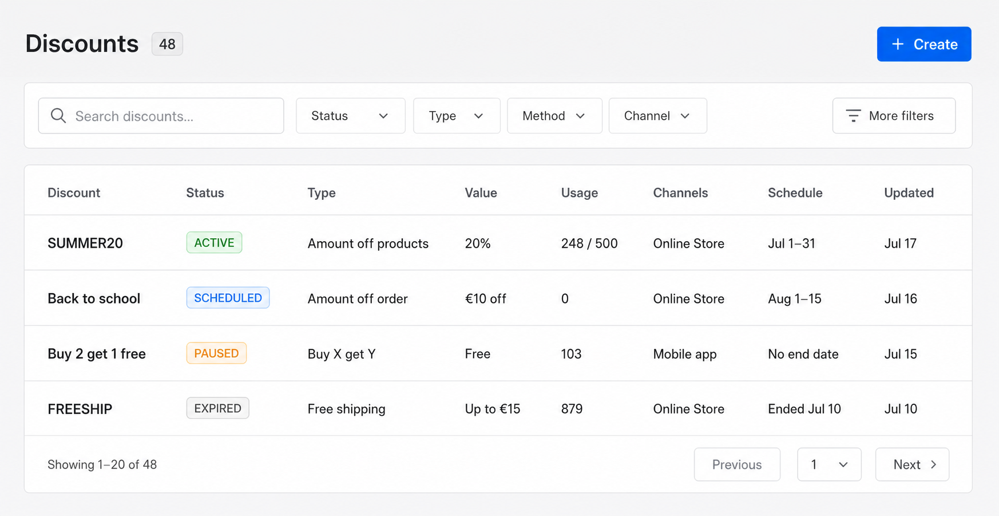

```text
┌──────────────────────────────────────────────────────────────────────────────┐
│ Discounts  48                                                [+ Create]     │
│                                                                              │
│ [Search discounts…] [Status] [Type] [Method] [Channel] [More filters]       │
│                                                                              │
│ ┌──────────────────────────────────────────────────────────────────────────┐ │
│ │ Discount          Status    Type           Value      Used    Schedule   │ │
│ ├──────────────────────────────────────────────────────────────────────────┤ │
│ │ SUMMER20          ACTIVE    Products       20%        248     Jul 1–31   │ │
│ │ Back to school    SCHEDULED Order           €10       0       Aug 1–15   │ │
│ │ Buy 2 get 1 free  PAUSED    Buy X get Y    Free      103     No end     │ │
│ │ FREESHIP          EXPIRED   Free shipping  ≤ €15      879     Ended      │ │
│ └──────────────────────────────────────────────────────────────────────────┘ │
│ Showing 1–20 of 48                                [‹ Previous] [Next ›]     │
└──────────────────────────────────────────────────────────────────────────────┘
```

### Grid columns

| Column | Presentation |
|---|---|
| Discount | strong title/primary code; secondary Automatic or Code · N codes |
| Status | effective status `Tag` |
| Type | human-readable kind |
| Value | `20%`, `€10 off`, `Buy 2, get 1 free`, `Free shipping ≤ €15` |
| Usage | `248 / 500`, `103`, or `Unlimited`; reserved secondary when >0 |
| Channels | first two labels + `+N` |
| Schedule | compact start/end; `No end date` |
| Updated | `formatDetailDate(updatedAt)` |

Rows имеют `52px` height. Click открывает details modal.

Search condition:

```text
title containsi query
OR primaryCode containsi query
OR tags containsi query
```

Filters:

- Effective status: Draft, Scheduled, Active, Paused, Expired, Archived.
- Type, method, class, channel, tag.
- Starts/ends date range.
- Usage/remaining range.
- Created/updated date range.

Default list excludes `ARCHIVED`. Empty filtered state предлагает `Clear filters`; empty store state — `Create discount`.

## Select Discount Type Modal

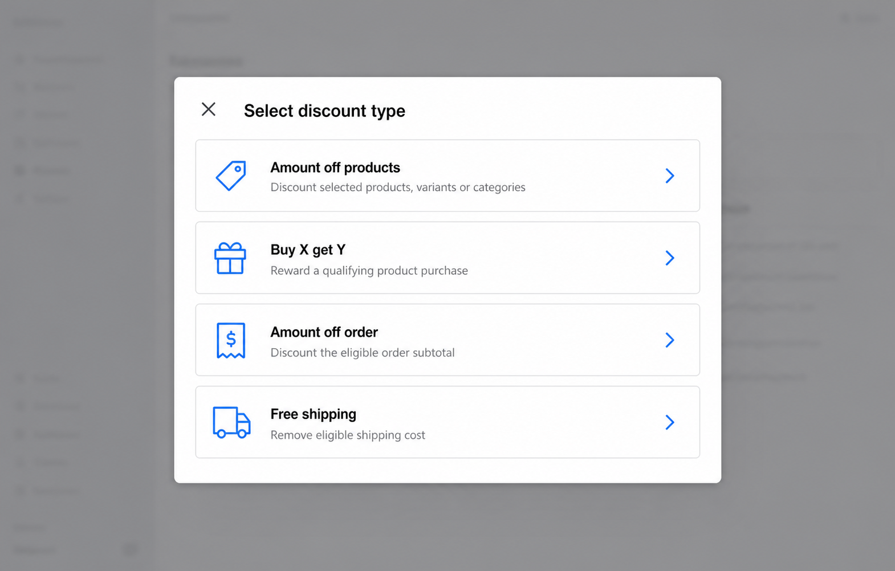

```text
┌────────────────────────────────────────────────────────────────────┐
│ ×  Select discount type                                            │
├────────────────────────────────────────────────────────────────────┤
│ [tag]     Amount off products                                  [›] │
│           Discount selected products, variants or collections       │
│ [gift]    Buy X get Y                                         [›] │
│           Reward a qualifying product purchase                      │
│ [receipt] Amount off order                                    [›] │
│           Discount the eligible order subtotal                     │
│ [truck]   Free shipping                                       [›] │
│           Remove eligible shipping cost                            │
└────────────────────────────────────────────────────────────────────┘
```

- Stable title; no submit button.
- Rows are semantic buttons with icon/title/description/chevron.
- Selecting kind pushes `Create discount` with immutable `kind` and derived `discountClass`.

## Discount Details Modal

Modal header title: `Discount details`; discount title/code живёт только в `DiscountInfoHeader`.

```text
┌──────────────────────────────────────────────────────────────────────────┐
│ ×  Discount details                                                     │
├──────────────────────────────────────────────────────────────────────────┤
│ ┌─ DiscountInfoHeader ─────────────────────────────────────────────────┐ │
│ │ [ACTIVE ✓] Updated Jul 17 by Admin · Active until Jul 31      [⋯]   │ │
│ │ SUMMER20                                                             │ │
│ │ [Discount code] [Amount off products] [Product] [ID 01J…]           │ │
│ │ [Reserved 3] [Used 248] [Reversed 4] [Remaining 252]                │ │
│ └──────────────────────────────────────────────────────────────────────┘ │
│ ┌─ Discount rule ───────────────────────────────────────────── [Edit] ┐ │
│ │ 20% off selected collections · Maximum €100 per order               │ │
│ └──────────────────────────────────────────────────────────────────────┘ │
│ ┌─ Eligibility & requirements ──────────────────────────────── [⋯]   ┐ │
│ │ All customers · Minimum subtotal €50 · One-time purchases           │ │
│ └──────────────────────────────────────────────────────────────────────┘ │
│ ┌─ Availability & combinations ─────────────────────────────── [⋯]   ┐ │
│ │ Online Store [Featured], Mobile app · Shipping combinations         │ │
│ └──────────────────────────────────────────────────────────────────────┘ │
│ ┌─ Discount codes (12) ──────────────────────────────────── [Manage] ┐ │
│ │ SUMMER20 [ACTIVE] 198 / 300 · VIP20 [ACTIVE] 50 / unlimited         │ │
│ └──────────────────────────────────────────────────────────────────────┘ │
│ ┌─ Limits & schedule ───────────────────────────────────────── [⋯]   ┐ │
│ │ 248 / 500 · One use per customer · Jul 1 — Jul 31                   │ │
│ └──────────────────────────────────────────────────────────────────────┘ │
│ ┌─ Usage activity ────────────────────────────────────── [View all]  ┐ │
│ │ #10482 · SUMMER20 · €18.40 · Committed · Jul 17                    │ │
│ └──────────────────────────────────────────────────────────────────────┘ │
│ ┌─ External references (1) ──────────────────────────────── [+ Add]  ┐ │
│ │ [SYNCED] Klaviyo · PROMOTION · summer-2026                          │ │
│ └──────────────────────────────────────────────────────────────────────┘ │
│ ┌─ History ─────────────────────────────────────────────── [View all] ┐ │
│ │ Activated · revision 7 · Admin · Jul 17                             │ │
│ └──────────────────────────────────────────────────────────────────────┘ │
└──────────────────────────────────────────────────────────────────────────┘
```

### DiscountInfoHeader

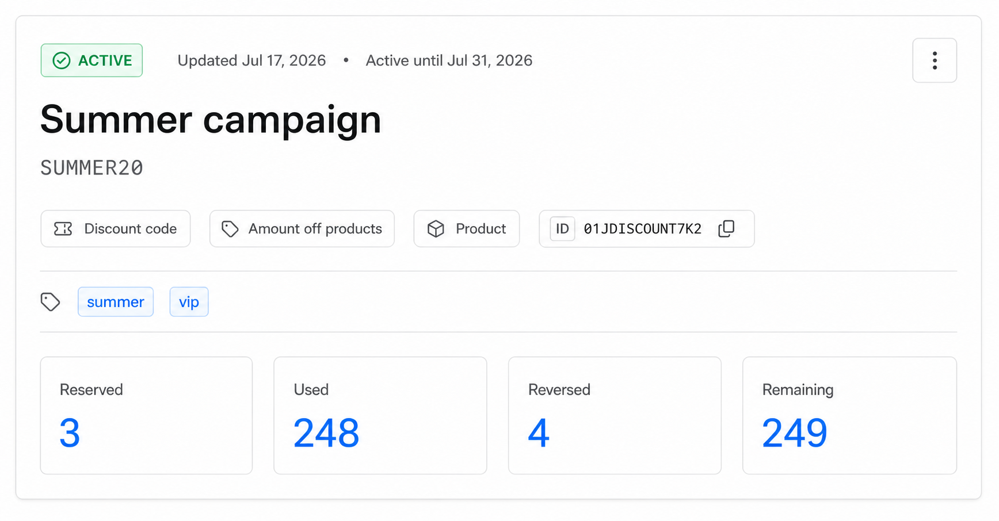

Effective status tags:

- `DRAFT` — default + edit;
- `SCHEDULED` — blue + calendar;
- `ACTIVE` — green + check;
- `PAUSED` — gold + pause;
- `EXPIRED` — default + clock;
- `ARCHIVED` — default + archive.

Header overflow:

```text
Edit identity
Manage codes                  CODE only
────────────────────────
Activate                      DRAFT / PAUSED
Pause                         ACTIVE / SCHEDULED
Duplicate
────────────────────────
View usage activity
View revision history
View technical metadata
────────────────────────
Archive discount              danger
```

Title uses primary active code for code discounts and title for automatic discounts. Below: method/kind/class tags, ID, merchant tags.

KPI use real `discount_usage_summary_view`:

- Reserved — `reservedCount`;
- Used — `netCommittedCount`;
- Reversed — `reversedCount`;
- Remaining — `remainingCount`, or `Unlimited` when null.

No period switch or fake trends.

## Discount Rule Section

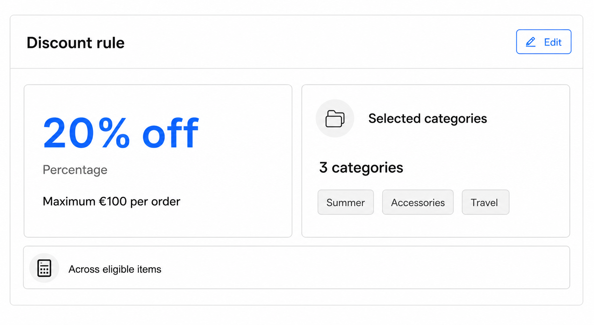

Presentation by kind:

```text
Amount off products
20% off selected collections
Maximum discount: €100 per order
Allocation: Across eligible items
Collections (3): Summer, Accessories, Travel

Amount off order
€10 off eligible order subtotal
Allocation: Across the order

Buy X get Y
Customer buys 2 items from Products (4)
Customer gets 1 item from Products (1)
Benefit: 50% off each · Maximum 2 uses per order

Free shipping
Free shipping for rates up to €15
```

Rules:

- basis points convert at UI boundary;
- money uses project default currency;
- stale targets remain visible with warning;
- large selections show first five + `+N more`;
- product/variant opens existing details modal;
- collection uses new picker config on shared infrastructure;
- one explicit `Edit` action.

## Eligibility & Requirements

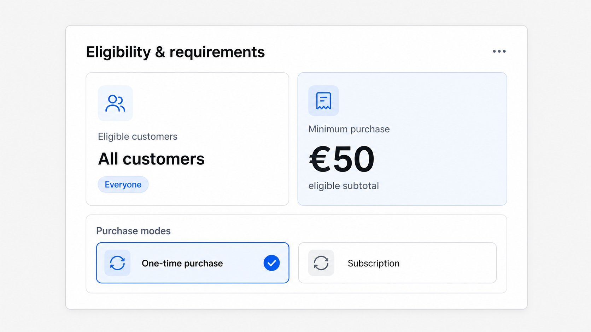

Full-data state with a specific-customer audience, overflow handling and both purchase modes:

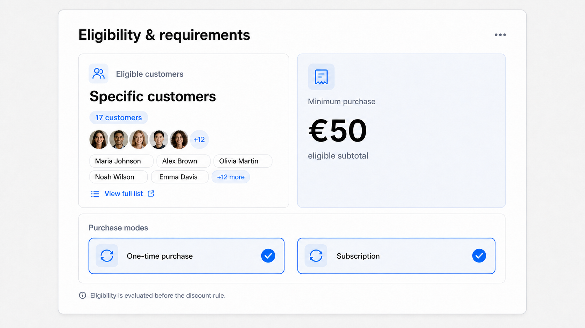

```text
┌─ Eligibility & requirements ───────────────────────────────────── [⋯] ┐
│ Eligible customers: All customers                                     │
│ Minimum purchase: €50 eligible subtotal                               │
│ Purchase modes: [One-time purchase]                                   │
└────────────────────────────────────────────────────────────────────────┘
```

- `ALL`: All customers.
- `CUSTOMERS`: count + first customer chips.
- `SEGMENTS`: count + segment chips.
- Buy X get Y does not render ordinary minimum requirement.
- At least one purchase mode is required.

## Availability & Combinations

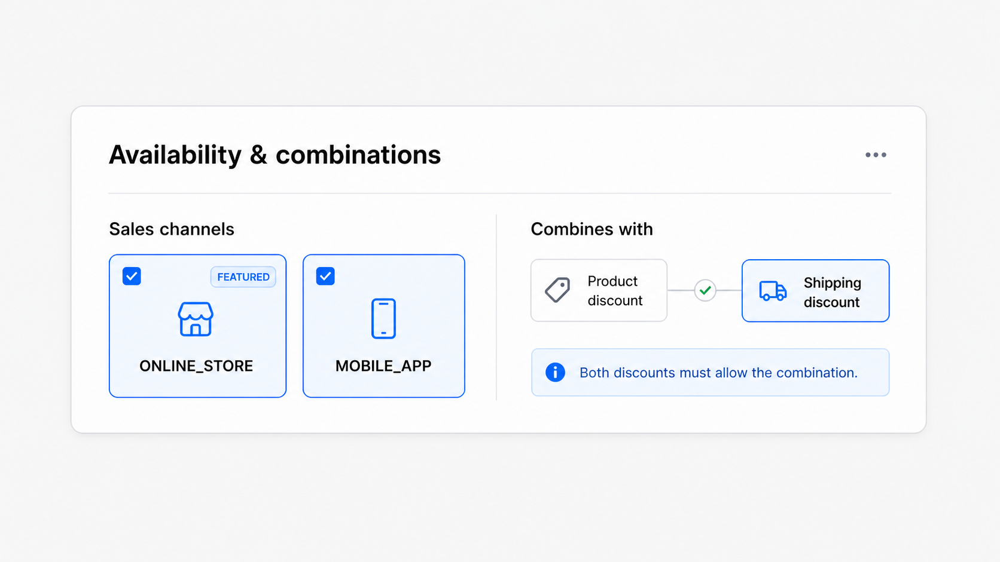

Full-data state with every supported combination class enabled:

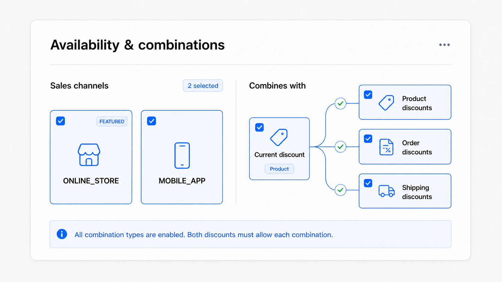

```text
┌─ Availability & combinations ─────────────────────────────────── [⋯] ┐
│ Sales channels: [Online Store · Featured] [Mobile app]               │
│ Combines with: [Shipping discounts]                                  │
│ Both discounts must allow the combination.                           │
└───────────────────────────────────────────────────────────────────────┘
```

- Channel registry provides human label; raw code stays in tooltip.
- `isFeatured` belongs to selected channel.
- Empty combinations: `Does not combine with other discounts`.

## Codes Section and Manager

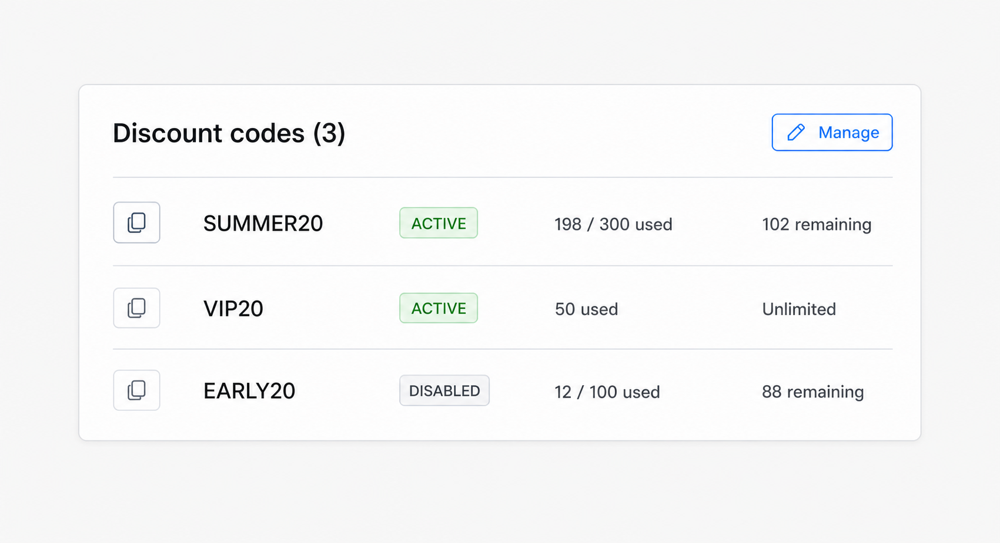

Codes section renders only for `method=CODE`.

- Up to five codes, active first, then disabled.
- Row: code, status, used/limit, remaining, copy action.
- Active non-draft code discount must have at least one active code.

Manager wireframe:

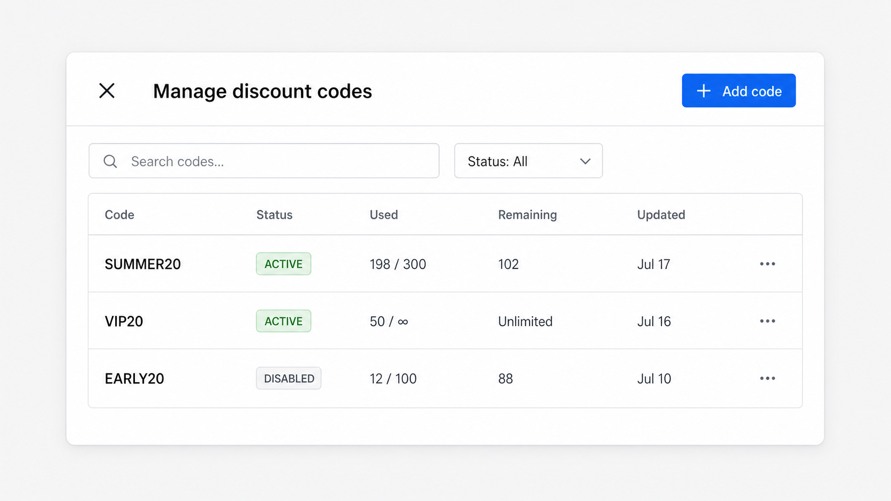

```text
┌────────────────────────────────────────────────────────────────────────┐
│ ×  Manage discount codes                                   [+ Add code]│
├────────────────────────────────────────────────────────────────────────┤
│ [Search codes…] [Status: All]                                          │
│ Code          Status     Used       Remaining      Updated       [⋯]   │
│ SUMMER20      ACTIVE     198 / 300  102            Jul 17              │
│ VIP20         ACTIVE      50 / ∞    Unlimited      Jul 16              │
│ EARLY20       DISABLED    12 / 100   88            Jul 10              │
└────────────────────────────────────────────────────────────────────────┘
```

Row actions: Copy, Edit limit, Disable/Enable. Code value becomes immutable after create. Disable retains usage history. Aggregate and per-code limits both apply.

Add code:

```text
Code * [VIP20____________________________] [Generate random code]
[ ] Limit uses for this code [100________]
```

## Limits & Schedule

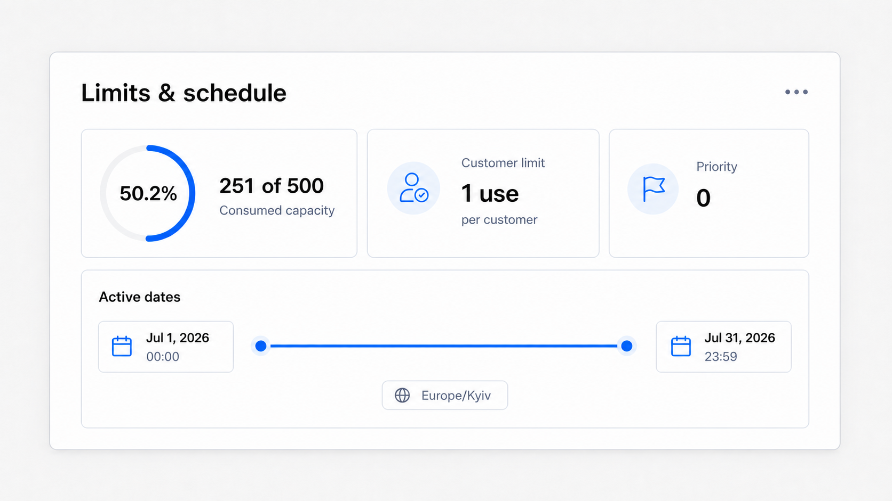

The read view uses data-native components rather than a description list: progress for aggregate usage, a compact customer-limit statistic, priority badge and an explicit active-date timeline.

## Usage Activity

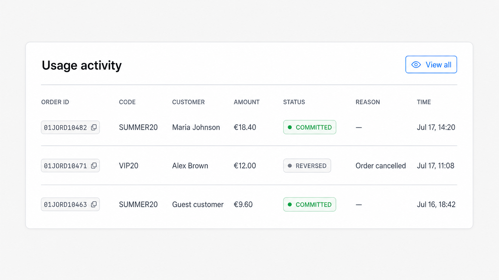

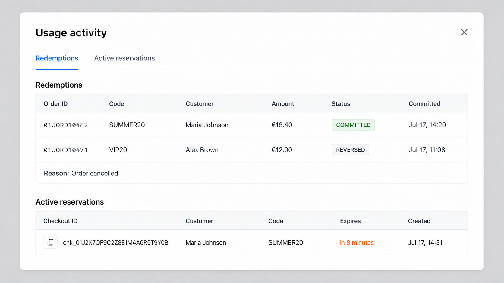

```text
┌──────────────────────────────────────────────────────────────────────────┐
│ ×  Usage activity                                                        │
├──────────────────────────────────────────────────────────────────────────┤
│ [Redemptions] [Active reservations]                                      │
│ Order   Code      Customer       Amount    Status      Committed          │
│ #10482  SUMMER20  Maria Johnson  €18.40    COMMITTED   Jul 17, 14:20      │
│ #10471  VIP20     Alex Brown     €12.00    REVERSED    Jul 17, 11:08      │
│                                      Reason: Order cancelled             │
│                                                                          │
│ Checkout ID       Customer       Code      Expires       Created          │
│ [ID copy]         Maria Johnson  SUMMER20  in 8 minutes  Jul 17, 14:31    │
└──────────────────────────────────────────────────────────────────────────┘
```

- Read-only projections.
- Order/customer open existing details modals when resolvable.
- Reservation countdown has absolute timestamp tooltip.
- No manual Reverse action without dedicated API policy.

## Create Discount Modal

```text
ModalLayout
├── ModalHeader: close / Create discount / Save draft
└── body, max-width 800
    ├── API Alert
    ├── live configuration summary
    ├── Identity Paper
    ├── Rule Paper
    ├── Audience & access Paper
    └── Limits & schedule Paper
```

Primary action is `Save draft`. Activation is a separate validated command from details.

Shared behavior:

1. Kind/class are immutable.
2. Method uses `Discount code / Automatic` segmented control.
3. Code method shows initial code; automatic shows required title.
4. Switching method confirms before incompatible values are cleared.
5. Save disabled while invalid/submitting/unchanged.
6. `userErrors` map to concrete fields; network errors use global Alert.
7. Any change sets Modal Stack dirty.
8. Picker cancel preserves parent draft.
9. Success refetches list, closes create stack and opens created details.

### Identity

```text
Type        Amount off products [Product discount] (read-only)
Method      [Discount code] [Automatic]
Discount code * [SUMMER20________________] [Generate random code]
Internal title  [Summer campaign_______________________________]
Tags            [summer] [vip] [+ Add tags]
```

Automatic title is required and customer-visible. Code discount title is optional internal identity.

### Amount off products

```text
Value type *   [Percentage] [Fixed amount]
Value *        [20________] %
Maximum discount [100_____] €  percentage only
Allocation *   ( ) Each target  (●) Across eligible items
Applies to *   [All products / Products / Variants / Collections]
[Summer] [Accessories] [Browse]
```

- Percentage `0.01–100`, maps to `1..10000` bps.
- Fixed amount >0.
- Specific target type requires selection before activation.
- Changing type confirms removal of old selection.

### Buy X get Y

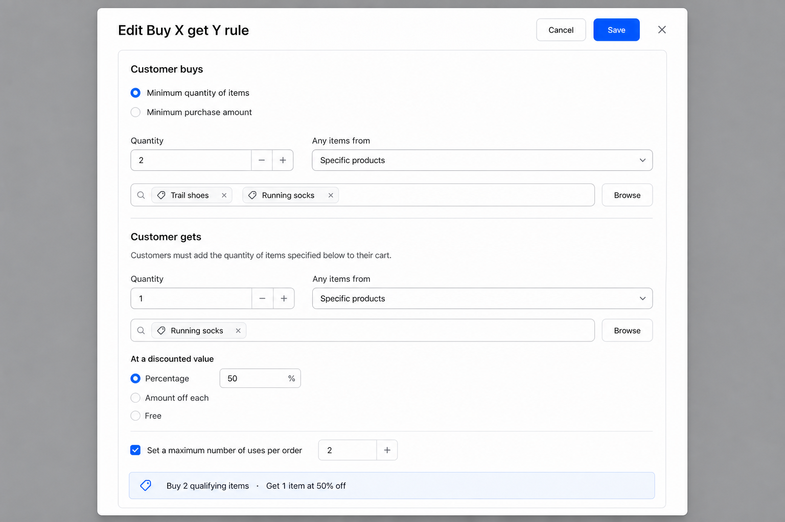

```text
Customer buys
Requirement *  (●) Minimum quantity of items  ( ) Minimum purchase amount
Quantity *     [2____]
Any items from * [Specific products________________]
[Trail shoes] [Running socks] [Browse]

Customer gets
Customers must add the quantity of items specified below to their cart.
Quantity *     [1____]
Any items from * [Specific products________________]
[Running socks] [Browse]
At a discounted value
(●) Percentage [50____] %  ( ) Amount off each  ( ) Free
[✓] Set a maximum number of uses per order [2____]
```

- Qualifier maps to `QUALIFIER`; benefit to `BENEFIT`.
- Target dropdown exposes the Pricing model types: all products, specific products, specific variants and specific categories.
- `Minimum purchase amount` maps to `requiredSubtotalMinor` in the project default currency.
- `FREE` sends no amount/percentage.
- Ordinary minimum requirement is absent.

### Amount off order

```text
Value type *   [Percentage] [Fixed amount]
Value *        [10________] €
Maximum discount [________] €  percentage only
Allocation     Across eligible order (read-only)
```

No catalog target picker.

### Free shipping

```text
Free shipping applies to eligible shipping lines.
[ ] Exclude shipping rates over a maximum amount
    Maximum shipping price * [15________] €
Country restrictions are not supported by the current Pricing model.
```

Disabled maps to null. Zero is permitted but helper copy explains its effect.

### Audience & access

```text
Customer eligibility *
(●) All customers  ( ) Specific customers  ( ) Customer segments
[Selected entities] [Browse]

Minimum purchase requirement
(●) None  ( ) Minimum subtotal  ( ) Minimum quantity

Purchase modes *
[✓] One-time purchase   [ ] Subscription

Sales channels *
[Online Store · Featured] [Mobile app] [Select]

Combines with
[ ] Product discounts [ ] Order discounts [✓] Shipping discounts
```

- Minimum requirement absent for Buy X get Y.
- Customers and segments are mutually exclusive.
- At least one channel and purchase mode are required for activation.
- Featured toggles independently per channel.

### Limits & schedule

```text
[ ] Limit total uses [500____]
[ ] One use per customer
Automatic discounts are always unlimited.

Starts [Jul 20, 2026] [00:00]
[ ] Set end date  Ends [Jul 31, 2026] [23:59]
Timezone: Europe/Kyiv

> Advanced processing
  Priority [0____]
```

- Usage limit/once per customer are hidden and cleared for automatic discounts.
- End must be after start.
- Dates are timezone-aware.
- Priority is non-negative.

## Section Edit Modals

Every editor reloads current details, submits only owned fields and includes `expectedRevision`.

| Modal | Owned fields |
|---|---|
| Edit identity | title, tags; method only for safe DRAFT transition |
| Edit amount-off rule | amount-off subtype + BENEFIT targets |
| Edit Buy X get Y rule | subtype + QUALIFIER/BENEFIT targets |
| Edit free shipping rule | maximumShippingPriceMinor |
| Edit eligibility | buyer context, eligible IDs, minimum requirement, purchase modes |
| Edit availability | channels/featured flags, combination classes |
| Edit limits & schedule | usage limit, once-per-customer, startsAt/endsAt, priority |
| Manage codes | independent code commands |
| External reference | independent create/update/delete commands |

Kind/class are immutable. Method transition is allowed only in `DRAFT`, before usage, after confirmation.

Conflict:

```text
This discount changed after the editor was opened.
[Reload latest data]
```

No automatic retry with new revision.

## External References

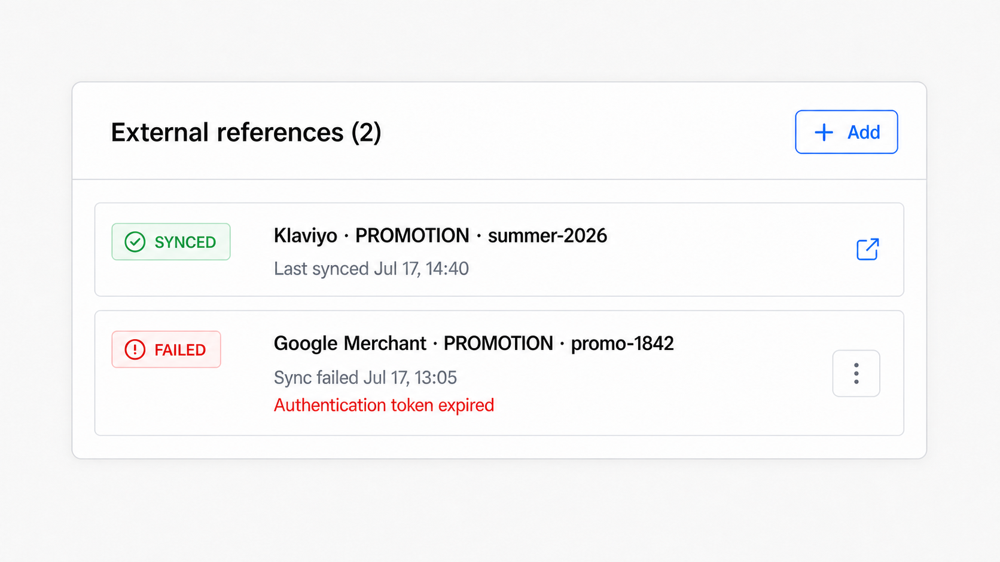

- Row: sync status, system/type/id, sync timestamp/error, external link.
- Header action `+ Add`.
- Row overflow opens create/edit modal.
- Metadata/etag/checksum under `Advanced`.
- Failed sync accents only error line.

## Revision History


```text
Revision 7  Activated         Admin         Jul 17, 09:00 [View]
Revision 6  Schedule updated Admin         Jul 16, 18:20 [View]
Revision 5  Code added       Campaign app  Jul 16, 10:10 [View]
```

Events define order; revisions provide snapshots. Snapshot modal is read-only, formatted JSON, horizontal scroll and copy action. Raw event payload is collapsed.

## Technical Metadata

```text
Discount ID        [01J… copy]
Explicit state     ACTIVE
Effective status  ACTIVE
Revision           7
Priority           0
Created by         [principal… copy]
Stored currency    EUR
Metadata           { ... }
```

Stored currency is audit/configuration data; normal money still uses project default currency.

## Lifecycle Confirmations

### Activate

Activation validates complete aggregate and reports linked missing sections.

```text
This discount cannot be activated yet.
• Add at least one active discount code.
• Select at least one sales channel.
[Review configuration]
```

### Pause

```text
Pause discount?
New checkouts will not apply this discount until it is activated again.
Existing committed redemptions are not changed.
[Cancel] [Pause]
```

### Archive

```text
Archive discount?
The discount will be removed from active management and cannot apply to new
checkouts. Usage history, revisions and external references are retained.
[Cancel] [Archive]
```

No hard delete is exposed.

### Duplicate

Copies rule, targeting, eligibility, channels, combinations and tags into a new `DRAFT`. Does not copy codes, counters, redemptions, events, external references or revisions.

## Loading, Empty and Error States

List:

- AG Grid loading overlay; stable header/count.
- Query failure Alert above grid.
- Empty store: `No discounts yet` + `Create discount`.
- Empty filtered: `No discounts match these filters` + `Clear filters`.

Details:

- Skeleton mirrors header + first sections.
- Not found: `Discount not found / It may have been archived or is no longer available.`
- Query failure uses global Alert.
- Stale external references show row warnings without failing whole details.

Forms:

- operation error above first Paper;
- validation inline + focus first invalid;
- stale picker entity remains visible and must be replaced before activation;
- submit failure preserves draft;
- reload conflict asks confirmation if local draft is dirty.

Empty section copy:

| Section | Copy |
|---|---|
| Codes | `No discount codes yet` / `Add a code before activation.` |
| Usage | `No discount usage yet` |
| Reservations | `No active reservations` |
| External refs | `No external references` |
| History | `No configuration history yet` |
| Targets | `No targets selected` |

## Responsive Behavior

Below `640px`:

- KPI becomes `2 × 2`, then one column;
- form field pairs stack;
- qualifier/benefit summaries stack;
- date/time groups stack;
- code table hides Updated then Remaining;
- header actions wrap without hiding primary action;
- only raw JSON and operational tables may scroll horizontally.

## Accessibility

- Status has icon + text.
- Type rows are buttons.
- Icon actions have tooltip and `aria-label`.
- All fields have visible labels.
- Money/percentage suffixes are announced.
- Chips have accessible remove names.
- Picker works by keyboard and announces selected count.
- First editable/invalid control receives focus.
- `Esc` closes only top stack level; dirty forms confirm.
- External links announce new tab.
- Table row opening has keyboard equivalent.

## Component Reuse Matrix

| Responsibility | Reuse |
|---|---|
| Page shell | `DataLayout fullWidth` |
| Search/filter | `FilterWidget` |
| Grid | AG Grid + `useAgGridTheme` |
| Pagination | `CursorPagination` |
| Modal | `ModalLayout`, `ModalHeader` |
| Sections | `Paper`, `PaperHeader` |
| Header | Product/Category/Review info-header composition |
| Metrics | `KPITile` |
| IDs | `CopyableChip` |
| Dates | `formatDetailDate` + timezone formatter |
| Products/variants | existing Entity Picker configs |
| Customers | existing customer picker |
| Collections/segments/channels | new configs on `EntityPickerContent` |
| Money | default currency context + shared formatter |
| Forms | `react-hook-form` + Zod |
| Unsaved close | Modal Stack confirmation |
| External refs | Review external reference pattern |

## Proposed Module Structure

```text
admin/src/domains/inventory/discounts/
├── graphql/
├── hooks/
├── mappers/
├── page/
│   ├── page.tsx
│   ├── page-config.ts
│   └── filter-schema.ts
├── components/
│   ├── discount-details-card/
│   │   ├── discount-details-card.tsx
│   │   ├── discount-info-header.tsx
│   │   └── sections/
│   ├── discount-status-tag.tsx
│   ├── discount-value-summary.tsx
│   └── discount-target-summary.tsx
├── modals/
│   ├── select-discount-type-modal/
│   ├── create-discount-modal/
│   ├── discount-details-modal/
│   ├── edit-discount-identity-modal/
│   ├── edit-amount-off-rule-modal/
│   ├── edit-buy-x-get-y-rule-modal/
│   ├── edit-free-shipping-rule-modal/
│   ├── edit-discount-eligibility-modal/
│   ├── edit-discount-availability-modal/
│   ├── edit-discount-limits-schedule-modal/
│   ├── manage-discount-codes-modal/
│   ├── edit-discount-code-modal/
│   ├── discount-usage-modal/
│   ├── discount-history-modal/
│   ├── discount-revision-snapshot-modal/
│   ├── discount-external-reference-modal/
│   └── discount-technical-metadata-modal/
└── pickers/
    ├── collection-picker-config.tsx
    ├── customer-segment-picker-config.tsx
    └── sales-channel-picker-config.tsx
```

Generated API types are imported directly from `@/graphql/types`; only form/draft state gets local types.

## Required Admin GraphQL Surface

Queries:

```text
discounts(first, after, last, before, where, orderBy)
discount(id)
discountCodes(discountId, pagination, where, orderBy)
discountRedemptions(discountId, pagination, where, orderBy)
discountActiveReservations(discountId, pagination)
discountEvents(discountId, pagination)
discountRevisions(discountId, pagination)
discountExternalReferences(discountId, pagination)
```

Commands:

```text
discountCreate(input)
discountUpdateIdentity(input, expectedRevision)
discountUpdateAmountOffRule(input, expectedRevision)
discountUpdateBuyXGetYRule(input, expectedRevision)
discountUpdateFreeShippingRule(input, expectedRevision)
discountUpdateEligibility(input, expectedRevision)
discountUpdateAvailability(input, expectedRevision)
discountUpdateLimitsAndSchedule(input, expectedRevision)
discountActivate(id, expectedRevision)
discountPause(id, expectedRevision)
discountArchive(id, expectedRevision)
discountDuplicate(id, expectedRevision)
discountCodeCreate(input, expectedRevision)
discountCodeUpdateLimit(input, expectedRevision)
discountCodeEnable/Disable(input, expectedRevision)
discountExternalReferenceCreate/Update/Delete(...)
```

All mutations return `userErrors` and new revision.

Read model requirements:

- list uses `discount_list_view` without per-row queries;
- details uses `discount_configuration_view` + usage summary;
- codes use `discount_code_list_view`;
- resolved cross-service labels use federation/batched loaders;
- effective status remains server-derived;
- `remainingCount=null` means Unlimited;
- large JSON is fetched only on drilldown.

## Acceptance Criteria

- `/discounts` is a real list page with search, filters, sorting and cursor pagination.
- Create begins with four supported kinds and opens a Modal Stack form.
- Supported reference capabilities are represented; countries/POS controls are not faked.
- Details follows info header + `Paper` sections + local actions.
- KPIs use real counters and show Unlimited correctly.
- All four kinds have distinct rule views/editors.
- Code/automatic methods enforce different constraints.
- Existing picker infrastructure is reused/extended.
- Eligibility, minimums, purchase modes, channels, featured flags, combinations, limits, schedule and tags are editable.
- Multiple codes can be added, limited and enabled/disabled without losing history.
- Reservations, redemptions and reversals are visible read-only.
- Revisions/events and external references have utility flows.
- Every update is revision-aware.
- Archive replaces hard delete.
- Money uses default project currency.
- Loading, empty, stale, conflict and error states are specified.
- Narrow modals avoid horizontal scroll in primary forms.
- All actions are keyboard accessible.
