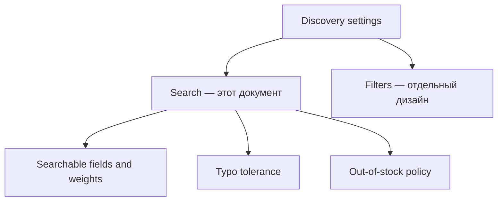

# Discovery Settings: Search UI wireframes и API integration

## Цель

Спроектировать секцию `Search` для страницы Discovery Settings и описать её интеграцию с
существующим GraphQL API.

На странице также будет секция настроек фильтров, но её UI, поведение и API integration не входят в
этот документ. В wireframe для неё зарезервировано только место.

Search-блок должен визуально соответствовать секциям существующих Admin UI модалок: `Paper`,
`PaperHeader`, стандартные Ant Design controls, `Alert` и `Skeleton`.

Документ опирается на:

- `admin/src/domains/discovery/search/settings/page/page.tsx`;
- `admin/src/ui-kit/paper`;
- `admin/src/layouts/data`;
- `admin/src/domains/discovery/search/graphql`;
- `services/listing/src/api/graphql-admin/schema/search.graphql`;
- `knowledge/vault/patterns/admin-graphql-layer.md`.

## Scope

В scope:

- searchable fields и их relevance weights;
- typo tolerance;
- out-of-stock policy;
- чтение, инициализация и обновление `SearchSettings`;
- loading, validation, API errors и version conflict;
- accessibility behavior секции Search.

Не в scope:

- проектирование секции Filters;
- GraphQL-интеграция настроек фильтров;
- Product Boosts и Synonyms;
- Search Explain preview;
- изменение API-контракта или route страницы.

## Route и page composition

Текущая страница зарегистрирована по адресу:

```text
/:orgName/:storeName/search/settings
```

Путь сохраняется: на него уже ведут Product Boost и Synonym Group модалки.



`DataLayout` владеет page header и основным scroll-контейнером. Search рендерится отдельным `Paper`.
Секция Filters располагается ниже, но её состав здесь не определяется.

## Desktop wireframe

```text
┌────────────────────────────────────────────────────────────────────────────┐
│ Discovery settings                                          [Save changes] │
│ Configure storefront discovery.                                            │
├────────────────────────────────────────────────────────────────────────────┤
│                                                                            │
│ [Search API / version conflict alert — only when present]                  │
│                                                                            │
│ ┌─ Search ────────────────────────────────────────────────────────────────┐ │
│ │ Choose what shoppers can search and how results are ranked.            │ │
│ │                                                                          │ │
│ │ Searchable fields                                      Weight            │ │
│ │ [●] Product title                                      [ 8.0 ]           │ │
│ │     Main product name shown in the storefront.                           │ │
│ │ [●] Variant title                                      [ 5.0 ]           │ │
│ │     Variant-specific title and identifying text.                         │ │
│ │ [●] Vendor name                                        [ 2.0 ]           │ │
│ │     Brand or supplier name.                                              │ │
│ │ [●] Category name                                      [ 1.0 ]           │ │
│ │     Category assigned to the product.                                    │ │
│ │                                                                          │ │
│ │ ──────────────────────────────────────────────────────────────────────── │ │
│ │                                                                          │ │
│ │ Typo tolerance                                          [○ Off]          │ │
│ │ Retry eligible searches with typo expansion when exact search is weak.   │ │
│ │                                                                          │ │
│ │ Out-of-stock products                                                     │ │
│ │ (●) Show in relevance order                                               │ │
│ │ ( ) Show after available products                                         │ │
│ │ ( ) Hide from search results                                              │ │
│ │                                                                          │ │
│ │ Updated 14 Jul 2026, 14:42                                                │ │
│ └──────────────────────────────────────────────────────────────────────────┘ │
│                                                                            │
│ ┌─ Filters ───────────────────────────────────────────────────────────────┐ │
│ │ Separate design.                                                        │ │
│ └──────────────────────────────────────────────────────────────────────────┘ │
│                                                                            │
└────────────────────────────────────────────────────────────────────────────┘
```

Filters placeholder показывает только положение второй секции. Текст `Separate design` не является
предложенным production empty state.

Контент страницы ограничен `max-width: 1000px`, как в существующем `SettingsLayout`. Для Search
используется стандартный `Paper` без повторного создания border, radius и shadow в page styles.

## Header и save action

- Title: `Discovery settings`.
- Subtitle: `Configure storefront discovery.`
- Primary action: `Save changes`.
- Это page-level action: она сохраняет все editable секции страницы. Пока editable является только
  Search, submit содержит только Search. Editable Filters нельзя добавлять без включения её dirty
  state, validation и submit в тот же page-level orchestration.
- При неинициализированных settings label единственной primary action меняется на
  `Initialize search`. Внутри Search Paper в этом состоянии второй submit button не показывается.
- `Save changes` disabled, пока Search form не dirty, выполняется query/mutation либо есть
  client-side ошибки.
- `Initialize search` доступна после загрузки валидного initial draft.
- Во время mutation кнопка показывает loading и запрещает повторный submit.
- Успех показывает toast `Search settings saved.` и сбрасывает dirty state.

При появлении editable Filters label остаётся `Save changes`, а disabled/loading state вычисляется
из всех editable секций. Частичное сохранение одной секции глобальной кнопкой запрещено.

Если form dirty, переход на другой route, browser back/forward или закрытие страницы требует
подтверждения потери изменений. Guard снимается после успешного submit или явного discard. Во время
mutation повторная навигация и submit блокируются.

## Search Paper

### Searchable fields

Каждая строка соответствует одному значению `SearchField`:

| API value       | Label         | Help text                                    | Default weight |
| --------------- | ------------- | -------------------------------------------- | -------------: |
| `PRODUCT_TITLE` | Product title | Main product name shown in the storefront.   |              8 |
| `VARIANT_TITLE` | Variant title | Variant-specific title and identifying text. |              5 |
| `VENDOR_NAME`   | Vendor name   | Brand or supplier name.                      |              2 |
| `CATEGORY_NAME` | Category name | Category assigned to the product.            |              1 |

Строка содержит:

- `Switch`, включающий поле в поиск;
- `InputNumber` для relevance weight;
- короткое описание источника searchable text.

Правила:

- включённые поля отправляются в `SearchSettingsValuesInput.fields`;
- weight должен быть конечным числом `> 0` и `<= 100`;
- weight disabled, когда поле выключено;
- draft сохраняет последнее значение weight при выключении поля;
- минимум одно поле должно оставаться включённым;
- последнее поле разрешено выключить, после чего группа показывает
  `At least one search field must be enabled.`, Save становится disabled, а пользователь может
  включить любое поле обратно;
- group error получает `role="alert"`, а все field switches связаны с ним через `aria-describedby`;
- порядок строк фиксирован registry-порядком API;
- drag-and-drop не используется;
- weight является относительным коэффициентом, поэтому UI не нормализует сумму и не показывает
  проценты.

`InputNumber` использует `min={0.01}`, `max={100}`, `step={0.1}` и precision до двух знаков после
десятичного разделителя. Decimal separator следует текущей Ant Design locale. Значение из paste или
ручного ввода дополнительно проверяется schema как конечное число в диапазоне `(0, 100]`.

Form draft хранит все известные поля, включая выключенные:

```ts
interface SearchSettingsFormValues {
  fields: Array<{
    field: SearchField;
    enabled: boolean;
    weight: number;
  }>;
  typoToleranceEnabled: boolean;
  outOfStockPolicy: SearchOutOfStockPolicy;
}
```

Mapper исключает disabled fields из GraphQL input.

### Typo tolerance

Один `Switch` мапится напрямую в `typoToleranceEnabled`.

Label: `Typo tolerance`.

Help text:

```text
Retry eligible searches with typo expansion when exact search is weak.
```

UI не обещает исправление каждого запроса и не воспроизводит server-side typo algorithm.

### Out-of-stock policy

Используется вертикальный `Radio.Group`, поскольку варианты взаимоисключающие:

| UI label                      | API value    | Поведение                                             |
| ----------------------------- | ------------ | ----------------------------------------------------- |
| Show in relevance order       | `SHOW`       | Availability не меняет search ordering.               |
| Show after available products | `PLACE_LAST` | Недоступные товары остаются в выдаче после доступных. |
| Hide from search results      | `HIDE`       | Недоступные товары исключаются из search membership.  |

UI не вычисляет availability самостоятельно и не связывает policy напрямую с quantity. Источник
истины — canonical listing availability.

### Metadata

Внизу Search Paper вторичным текстом показывается `Updated <formatted updatedAt>`. Version является
внутренним optimistic concurrency token и в пользовательском UI не отображается.

## Loading и initialization states

### Initial loading

- Header отображается сразу.
- Search Paper показывает `Skeleton` с геометрией будущих field rows.
- Save disabled.
- При background refetch сохраняется `previousData`; fullscreen spinner не нужен.

### Settings не инициализированы

`listingQuery.search.settings === null` является отдельным состоянием, а не transport error.

Search Paper показывает явный initialize flow:

```text
Search is not configured
Set the initial searchable fields, typo tolerance, and inventory policy.

[prefilled editable Search form]
```

Submit выполняется единственной page header action `Initialize search`.

Initial draft:

```json
{
  "fields": [
    { "field": "PRODUCT_TITLE", "enabled": true, "weight": 8 },
    { "field": "VARIANT_TITLE", "enabled": true, "weight": 5 },
    { "field": "VENDOR_NAME", "enabled": true, "weight": 2 },
    { "field": "CATEGORY_NAME", "enabled": true, "weight": 1 }
  ],
  "typoToleranceEnabled": false,
  "outOfStockPolicy": "SHOW"
}
```

Значения повторяют текущие `SearchFieldRegistry` и store initialization handler. Они показаны
пользователю до submit и могут быть изменены.

Initialize вызывает существующую `settingsUpdate` mutation с `expectedVersion: 0`. После успеха API
возвращает settings с `version: 1`.

### Query error

При query error Search Paper показывает retryable `Alert` и `Retry`. Client не подставляет initial
defaults, потому что error нельзя трактовать как `settings === null`.

## Validation и error states

### Client validation

Клиент проверяет только быстрые детерминированные правила:

- минимум одно enabled field;
- отсутствие duplicate field;
- weight `> 0` и `<= 100` для каждого enabled field;
- наличие `outOfStockPolicy`.

### API error mapping

| API field suffix              | UI target                           |
| ----------------------------- | ----------------------------------- |
| `input.fields`                | Searchable fields group             |
| `input.fields.<index>.field`  | соответствующая field row           |
| `input.fields.<index>.weight` | weight input отправленной field row |
| `input.typoToleranceEnabled`  | Typo tolerance row                  |
| `input.outOfStockPolicy`      | Out-of-stock group                  |
| `expectedVersion`             | version conflict alert              |
| unknown / empty               | Search Paper alert                  |

Поскольку mapper удаляет disabled fields, API index относится к отправленному массиву. Mapper submit
должен сохранить lookup `submittedIndex → SearchField`, чтобы `fields.1.weight` отображалась на
правильной строке полного draft.

Network и unexpected errors показываются в Search Paper `Alert` с `role="alert"`. Draft не
сбрасывается.

### Version conflict

При `VERSION_CONFLICT` или field suffix `expectedVersion`:

```text
These search settings changed after the page was opened.
[Reload latest settings]
```

Автоматический retry с новой version запрещён. Если form dirty, reload требует подтверждение перед
заменой draft. Save disabled до успешной загрузки актуальных settings. После reload кнопка снова
включается только после нового изменения.

## GraphQL read integration

Текущий `SearchSettingsEditorFields` содержит только `version` и `updatedAt`. Для Search form
fragment расширяется editable fields:

```graphql
fragment SearchSettingsEditorFields on SearchSettings {
  version
  fields {
    field
    weight
  }
  typoToleranceEnabled
  outOfStockPolicy
  updatedAt
}
```

Query:

```graphql
query SearchSettingsEditor {
  listingQuery {
    search {
      settings {
        ...SearchSettingsEditorFields
      }
    }
  }
}
```

Компоненты получают `ApiSearchSettings` и другие generated API types напрямую из `@/graphql/types`.
Отдельная API-output view model не создаётся. Form draft остаётся UI-local моделью.

## GraphQL write integration

Используется существующая mutation:

```graphql
mutation SearchSettingsUpdate($expectedVersion: Int!, $operations: SearchSettingsOperationsInput!) {
  listingMutation {
    search {
      settingsUpdate(expectedVersion: $expectedVersion, operations: $operations) {
        settings {
          ...SearchSettingsEditorFields
        }
        operationResults {
          ...SearchSettingsOperationResultFields
        }
        userErrors {
          code
          field
          message
        }
      }
    }
  }
}
```

Update variables:

```json
{
  "expectedVersion": 3,
  "operations": {
    "settings": {
      "fields": [
        { "field": "PRODUCT_TITLE", "weight": 8 },
        { "field": "VARIANT_TITLE", "weight": 5 },
        { "field": "VENDOR_NAME", "weight": 2 }
      ],
      "typoToleranceEnabled": true,
      "outOfStockPolicy": "PLACE_LAST"
    }
  }
}
```

Submit flow:

1. Выполнить client validation.
2. Построить полный replacement `operations.settings`; mutation не является patch.
3. Для update взять `expectedVersion` из последнего загруженного `SearchSettings.version`; для
   initialization использовать `0`.
4. Найти в `operationResults` результат с `type === SETTINGS_UPDATE`. Считать submit успешным только
   если payload и этот result существуют, `userErrors` пуст, `result.applied === true`, а
   `result.errors` пусты. Пустой массив или отсутствие matching result не являются успехом.
5. Заменить form baseline данными `payload.settings`.
6. Сбросить dirty state и показать success toast.
7. Не закрывать страницу и не выполнять navigation.

Mutation возвращает расширенный `SearchSettingsEditorFields`, чтобы получить canonical fields, новую
version и `updatedAt` без обязательного refetch.

## Frontend ownership

```text
admin/src/domains/discovery/search/
  graphql/
    index.ts                  # compatibility re-exports only
  settings/
    graphql/
      fragments.ts
      queries.ts
      mutations.ts
      operation-types.ts
      index.ts
    hooks/
      use-search-editor-context.ts
      use-update-search-settings.ts
      index.ts
    mappers/
      search-settings-form.mapper.ts
      search-errors.mapper.ts
      index.ts
    page/
      page.tsx
      search-settings-paper.tsx
      schema.ts
      types.ts
```

- `page.tsx` владеет page composition, Search dirty state, notification и submit orchestration.
- `use-search-editor-context.ts` владеет Apollo read state и возвращает `ApiSearchSettings | null`.
- `use-update-search-settings.ts` владеет mutation и объединяет top-level `userErrors` с errors
  matching `SETTINGS_UPDATE` operation result.
- `search-settings-form.mapper.ts` преобразует API settings в form draft и form draft в
  `ApiSearchSettingsOperationsInput`.
- `search-errors.mapper.ts` расширяется Search Settings targets, сохраняя существующие mappings
  Product Boost и Synonym Group.
- Структура и ownership секции Filters здесь не определяются.

## Accessibility

- Каждый `Switch`, `InputNumber` и radio имеет видимый label.
- Field switch получает accessible name `Search product title` и связан с help text/error через
  `aria-describedby`.
- Weight label включает field name: `Product title weight`.
- Ошибки submit получают `role="alert"`; focus переходит к первому ошибочному Search control.
- Enabled/disabled state не передаётся только цветом.
- После успешного сохранения focus остаётся на Save button.

## Test IDs

| Element            | `data-testid`                                      |
| ------------------ | -------------------------------------------------- |
| Page               | `discovery-settings-page`                          |
| Save               | `discovery-settings-save-button`                   |
| Search Paper       | `search-settings-section`                          |
| Field switch       | `search-field-<normalized-api-value>-switch`       |
| Weight input       | `search-field-<normalized-api-value>-weight-input` |
| Typo tolerance     | `search-typo-tolerance-switch`                     |
| Out-of-stock group | `search-out-of-stock-policy`                       |

API value нормализуется один раз: `PRODUCT_TITLE → product-title`.

Test IDs секции Filters будут определены вместе с её отдельным дизайном.

## Acceptance criteria

- Search оформлен стандартными `Paper`/`PaperHeader` и визуально совпадает с modal sections.
- Filters обозначен только как соседняя секция без спроектированных controls, поведения или API
  integration.
- Search form показывает четыре `SearchField`, enabled state и weight из API.
- Минимум одно поле включено; при выключении всех полей показывается group error и Save блокируется;
  enabled weights валидны в диапазоне `(0, 100]`.
- Typo tolerance и out-of-stock policy мапятся напрямую в GraphQL input.
- `settings === null` запускает initialization flow с `expectedVersion: 0`.
- Query error не маскируется под неинициализированные settings.
- Update отправляет full replacement и использует актуальный `SearchSettings.version`.
- Version conflict не перезаписывает чужие изменения автоматически.
- API errors с путями `input.fields...` отображаются у соответствующих controls.
- После успешной mutation form baseline строится из возвращённых canonical settings, dirty state
  сбрасывается, страница остаётся открытой.
- Dirty form защищена от случайной потери при navigation или закрытии страницы.
