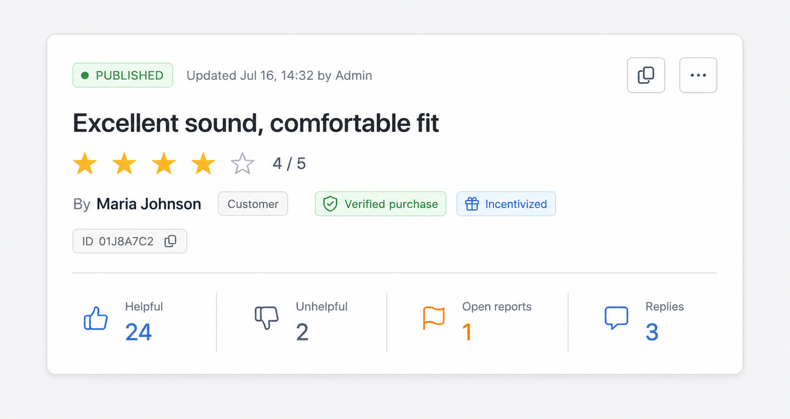
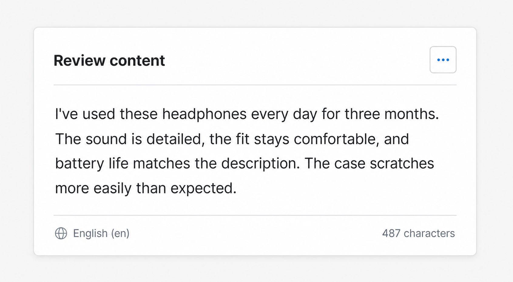
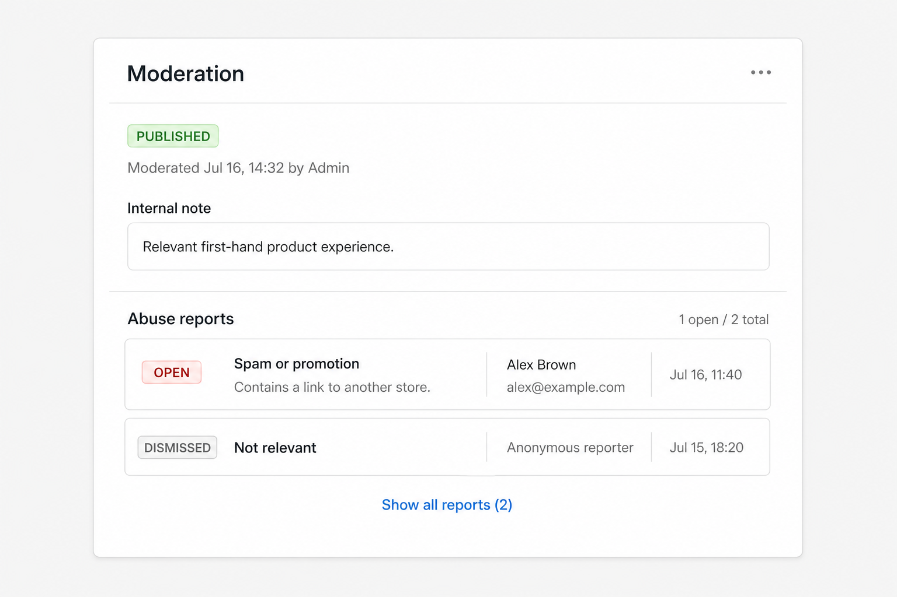
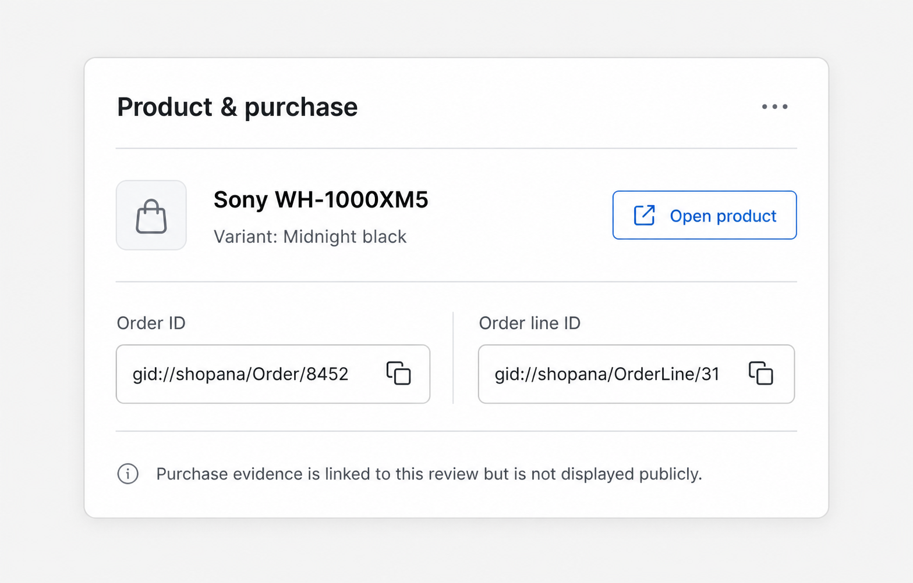
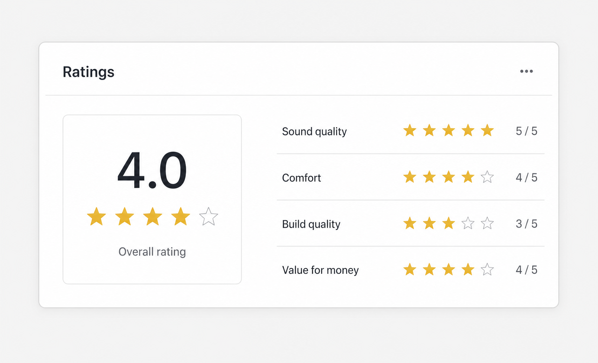
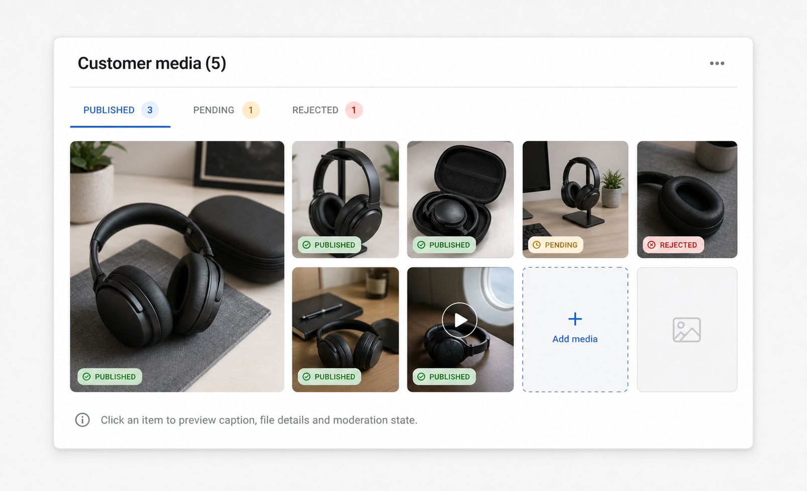
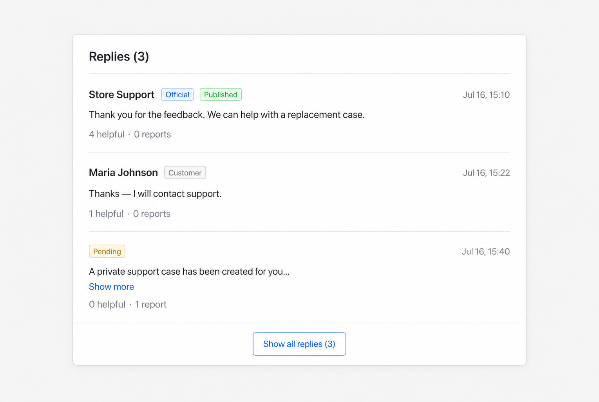
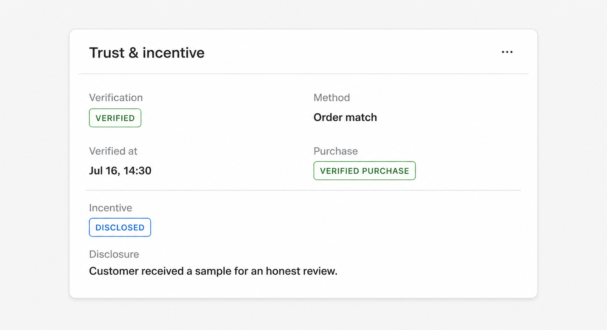
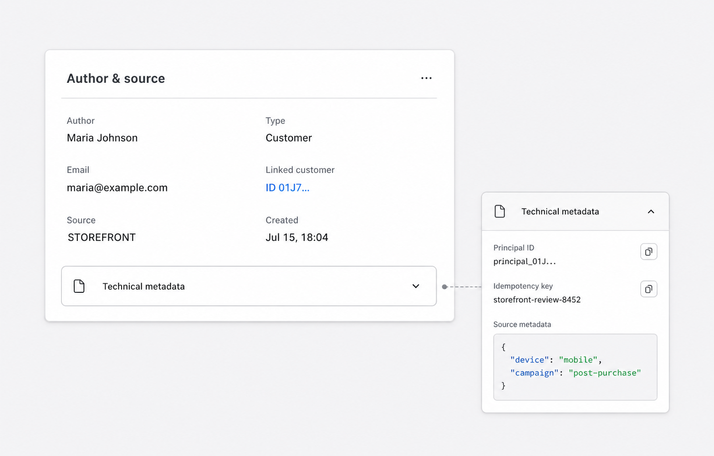
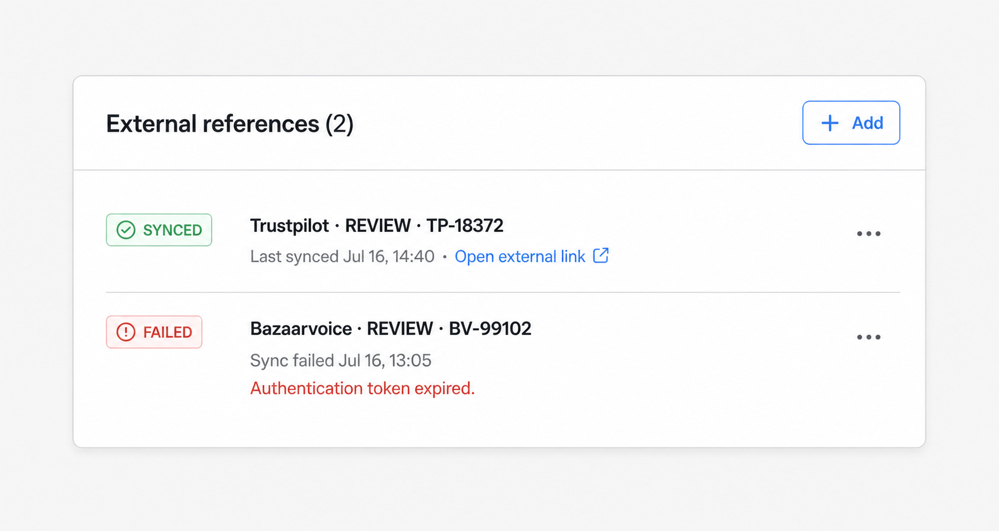

# Review Details: redesign details card и section edit modals

## Цель

Спроектировать новый UI для `ReviewDetailsCard`, details modal и связанных модалок редактирования секций. Новый экран должен выглядеть как часть той же системы, что `ProductDetailsCard` и `CategoryDetailsCard`: компактная summary-карточка сверху, последовательные `Paper`-секции, локальные действия секций и предсказуемый Modal Stack.

Документ описывает presentation и interaction design. Он не меняет GraphQL-контракт и не предлагает отдельную страницу вместо существующего modal flow.

Референсы в текущем Admin UI:

- `admin/src/domains/inventory/products/components/product-details-card`;
- `admin/src/domains/inventory/products/components/product-info-header`;
- `admin/src/domains/inventory/categories/components/category-details-card`;
- `admin/src/domains/inventory/categories/components/category-info-header`;
- `admin/src/domains/inventory/components/entity-details-sections`;
- `admin/src/domains/inventory/components/entity-edit-forms`;
- `admin/src/domains/media/components/entity-media-gallery`;
- `admin/src/layouts/modals`;
- `admin/src/ui-kit/paper`;
- `admin/src/ui-kit/kpi-tile`;
- `admin/src/ui-kit/copyable-chip`.

## Что меняется относительно чернового UI

Текущий экран показывает данные, но воспринимается как техническая выгрузка: много одинаковых `Descriptions`, повторяющиеся статусы, несколько видимых кнопок `Edit`, необработанный JSON и слабая визуальная иерархия.

В новом варианте:

1. Details modal получает стабильный заголовок `Review details`; пользовательский title живёт только в summary-card.
2. Верхняя карточка повторяет композицию Product/Category info header: status/meta, title, chips, actions, divider и реальные KPI.
3. Сначала показываются данные для принятия решения: текст review и moderation reports. Технические интеграционные поля находятся внизу.
4. Engagement metrics показываются один раз в header и не дублируются отдельной тяжёлой секцией.
5. Все секционные действия используют существующий `EditAction` с `⋯`; явные primary-кнопки остаются только в modal header.
6. Большая общая edit-modal разделяется по агрегатным API-секциям. Каждая форма отправляет только собственный subtree `ReviewUpdateInput`.
7. `Author & source`, reports и external references остаются информативными, но raw metadata скрывается в `Collapse`.
8. Empty/loading/error states используют те же визуальные принципы, что Product/Category details.

## Визуальные правила

- Контент details и edit modals использует стандартный `ModalLayout`, `max-width: 800px`.
- Между карточками — `12px`, внутри `Paper` — текущий token-based padding.
- Одна карточка отвечает на один пользовательский вопрос: «что написал клиент», «какое принято решение», «к чему относится review».
- `Typography.Title level={3}` используется один раз — в `ReviewInfoHeader`.
- `PaperHeader` используется для всех секций; локальное действие находится справа.
- Цвет используется только семантически: status, report severity, verification и errors.
- Системные ID показываются через `CopyableChip` или `Typography.Text copyable`, а не как обычный длинный текст.
- Не использовать отдельные декоративные градиенты, большие цветные hero-блоки и новые card primitives.
- Тексты controls остаются на английском, как в существующем Admin UI.

## Information architecture

```text
Review details modal
├── ReviewInfoHeader
│   ├── lifecycle status + updated meta
│   ├── title + overall rating
│   ├── author/trust badges + review ID
│   └── helpful / unhelpful / open reports / replies KPI
├── ReviewContentSection
├── ReviewModerationSection
│   └── decision + abuse reports
├── ReviewSubjectSection
│   └── product / variant / order evidence
├── ReviewRatingsSection
├── ReviewMediaSection
├── ReviewRepliesSection
├── ReviewTrustSection
├── ReviewAuthorSourceSection
└── ReviewExternalReferencesSection
```

Порядок намеренный: review можно прочитать и модерировать в верхней части modal, не прокручивая через source metadata, integration IDs и sync state.

## Modal Stack

```text
Reviews page
└── Review details                         level 0
    ├── Edit review content                level 1
    ├── Edit reviewer                      level 1
    │   └── Customer picker                level 2
    ├── Edit product & purchase            level 1
    │   ├── Product picker                 level 2
    │   └── Variant picker                 level 2
    ├── Edit ratings                       level 1
    ├── Review moderation                  level 1
    ├── Edit trust & incentive             level 1
    ├── Edit customer media                level 1
    │   ├── Media picker / upload          level 2
    │   └── Edit media details             level 2
    └── External reference create/edit     level 1
```

После сохранения дочерняя modal вызывает `onSaved`, details query refetch выполняется до закрытия child modal, затем пользователь возвращается к актуальному Review Details. Отмена вложенного picker не меняет draft родительской формы.

Рекомендуемые section keys:

```ts
type ReviewEditSection =
  | "content"
  | "reviewer"
  | "subject"
  | "ratings"
  | "moderation"
  | "trust"
  | "media";
```

## Review Details Modal

### Полный wireframe

```text
┌──────────────────────────────────────────────────────────────────────────┐
│ ×  Review details                                                       │
├──────────────────────────────────────────────────────────────────────────┤
│                                                                          │
│  [API error alert — only when present]                                   │
│                                                                          │
│  ┌─ ReviewInfoHeader ─────────────────────────────────────────────────┐  │
│  │ [PUBLISHED ✓]  Updated Jul 16, 14:32 by Admin       [link] [⋯]   │  │
│  │                                                                    │  │
│  │ Excellent sound, comfortable fit                                   │  │
│  │ ★ ★ ★ ★ ☆  4 / 5                                                  │  │
│  │                                                                    │  │
│  │ By Maria Johnson  [Customer] [Verified purchase] [Incentivized]    │  │
│  │ [ID 01J8…]                                                         │  │
│  │                                                                    │  │
│  │ ─────────────────────────────────────────────────────────────────  │  │
│  │                                                                    │  │
│  │ ┌─────────────┐ ┌─────────────┐ ┌─────────────┐ ┌─────────────┐   │  │
│  │ │ Helpful     │ │ Unhelpful   │ │ Open reports│ │ Replies     │   │  │
│  │ │ 24          │ │ 2           │ │ 1           │ │ 3           │   │  │
│  │ └─────────────┘ └─────────────┘ └─────────────┘ └─────────────┘   │  │
│  └────────────────────────────────────────────────────────────────────┘  │
│                                                                          │
│  ┌─ Review content ────────────────────────────────────────────── [⋯] ┐  │
│  │ I've used these headphones every day for three months. The sound   │  │
│  │ is detailed, the fit stays comfortable, and battery life matches   │  │
│  │ the description. The case scratches more easily than expected.     │  │
│  │                                                                    │  │
│  │ Locale: English (en)                         487 characters         │  │
│  └────────────────────────────────────────────────────────────────────┘  │
│                                                                          │
│  ┌─ Moderation ────────────────────────────────────────────────── [⋯] ┐  │
│  │ [PUBLISHED]  Moderated Jul 16, 14:32 by Admin                      │  │
│  │ Internal note: Relevant first-hand product experience.             │  │
│  │                                                                    │  │
│  │ Abuse reports                                      1 open / 2 total │  │
│  │ ┌────────────────────────────────────────────────────────────────┐ │  │
│  │ │ [OPEN] [Spam or promotion]  Alex Brown           Jul 16, 11:40│ │  │
│  │ │ “Contains a link to another store.”                            │ │  │
│  │ └────────────────────────────────────────────────────────────────┘ │  │
│  │ [Show all reports]                                                  │  │
│  └────────────────────────────────────────────────────────────────────┘  │
│                                                                          │
│  ┌─ Product & purchase ───────────────────────────────────────── [⋯] ┐  │
│  │ [bag] Sony WH-1000XM5                              [Open product]  │  │
│  │       Variant: Midnight black                                      │  │
│  │                                                                    │  │
│  │ Order ID       [gid://… copy]    Order line      [gid://… copy]    │  │
│  └────────────────────────────────────────────────────────────────────┘  │
│                                                                          │
│  ┌─ Ratings ───────────────────────────────────────────────────── [⋯] ┐  │
│  │ ┌──────────────────┐   Sound quality            ★ ★ ★ ★ ★  5/5   │  │
│  │ │       4.0        │   Comfort                 ★ ★ ★ ★ ☆  4/5   │  │
│  │ │   ★ ★ ★ ★ ☆    │   Build quality           ★ ★ ★ ☆ ☆  3/5   │  │
│  │ │ Overall rating   │                                              │  │
│  │ └──────────────────┘                                              │  │
│  └────────────────────────────────────────────────────────────────────┘  │
│                                                                          │
│  ┌─ Customer media (3) ───────────────────────────────────────── [⋯] ┐  │
│  │ [ image 1 ] [ image 2 ] [ video 3 ] [ + add ] [ placeholder ... ] │  │
│  │    [PUBLISHED]  Captions and moderation state appear in preview.   │  │
│  └────────────────────────────────────────────────────────────────────┘  │
│                                                                          │
│  ┌─ Replies (3) ──────────────────────────────────────────────────────┐  │
│  │ Store Support [Official] [Published]                 Jul 16, 15:10 │  │
│  │ Thank you for the feedback. We can help with a replacement case.   │  │
│  │ 4 helpful · 0 reports                                              │  │
│  │ ─────────────────────────────────────────────────────────────────  │  │
│  │ Maria Johnson [Customer] [Published]                 Jul 16, 15:22 │  │
│  │ Thanks — I will contact support.                                   │  │
│  └────────────────────────────────────────────────────────────────────┘  │
│                                                                          │
│  ┌─ Trust & incentive ────────────────────────────────────────── [⋯] ┐  │
│  │ Verification  [VERIFIED]     Method       Order match              │  │
│  │ Verified at   Jul 16, 14:30  Incentive    [DISCLOSED]              │  │
│  │ Disclosure    “Customer received a sample for an honest review.”   │  │
│  └────────────────────────────────────────────────────────────────────┘  │
│                                                                          │
│  ┌─ Author & source ──────────────────────────────────────────── [⋯] ┐  │
│  │ Author       Maria Johnson       Type          Customer             │  │
│  │ Email        maria@example.com   Customer      [ID copy]            │  │
│  │ Source       STOREFRONT          Created       Jul 15, 18:04        │  │
│  │                                                                    │  │
│  │ > Technical metadata                                               │  │
│  └────────────────────────────────────────────────────────────────────┘  │
│                                                                          │
│  ┌─ External references (1) ─────────────────────────── [+ Add]       ┐  │
│  │ [SYNCED]  Trustpilot · REVIEW · TP-18372                [⋯]        │  │
│  │            Last synced Jul 16, 14:40 · Open external link          │  │
│  └────────────────────────────────────────────────────────────────────┘  │
│                                                                          │
└──────────────────────────────────────────────────────────────────────────┘
```

### ReviewInfoHeader



Композиция повторяет `ProductInfoHeader` и `CategoryInfoHeader`, но показывает только релевантные review actions.

```text
┌──────────────────────────────────────────────────────────────────────────┐
│ [PUBLISHED ✓]  Updated Jul 16, 14:32 by Admin          [Copy link] [⋯] │
│                                                                          │
│ Excellent sound, comfortable fit                                         │
│ ★ ★ ★ ★ ☆  4 / 5                                                       │
│                                                                          │
│ By Maria Johnson  [Customer] [Verified purchase] [Incentivized]          │
│ [ID 01J8A7C2]                                                            │
│                                                                          │
│ ──────────────────────────────────────────────────────────────────────── │
│                                                                          │
│ ┌──────────────┐ ┌──────────────┐ ┌──────────────┐ ┌──────────────┐    │
│ │ Helpful      │ │ Unhelpful    │ │ Open reports │ │ Replies      │    │
│ │ 24           │ │ 2            │ │ 1            │ │ 3            │    │
│ └──────────────┘ └──────────────┘ └──────────────┘ └──────────────┘    │
└──────────────────────────────────────────────────────────────────────────┘
```

`PaperHeader title`:

- status `Tag` с icon и tooltip:
  - `PENDING` — gold, clock, `Awaiting moderation`;
  - `PUBLISHED` — green, check, `Visible in published review surfaces`;
  - `REJECTED` — red, circle-x, `Rejected by moderation`;
- `Updated {formatDetailDate(updatedAt)} by {moderator/author}`;
- если `updatedAt` ещё не запрашивается details fragment, временный fallback — `Created {createdAt}`.

`PaperHeader actions`:

- text button `LinkOutlined` — copy current Admin URL;
- `Dropdown` с `MoreOutlined`:

```text
Edit review content
Edit reviewer
Edit product & purchase
Edit ratings
────────────────────────
Review moderation
Edit trust & incentive
────────────────────────
Redact personal content       danger
Delete review                 danger
```

Dropdown является fallback navigation. Основной путь редактирования — `EditAction` в соответствующей секции.

Title area:

- title с ellipsis максимум две строки, fallback `Untitled review`;
- `Rate disabled` + текстовое значение `{rating} / 5`, чтобы рейтинг не зависел только от формы звёзд;
- author display name, author type `Tag`, условные trust badges;
- `CopyableChip label="ID"` с коротким display value.

KPI panel:

- `KPITile` для `metrics.likeCount`;
- `KPITile` для `metrics.dislikeCount`;
- `KPITile` для `metrics.openReportCount`;
- `KPITile` для `replies.totalCount`.

`PeriodSwitch` не используется: API содержит aggregate counters без временных рядов. Нельзя показывать фиктивную динамику по образцу mock KPI Product/Category.

### ReviewContentSection



```text
┌─ Review content ────────────────────────────────────────────────── [⋯] ┐
│ Full plain-text review body. Preserve user line breaks.                  │
│ No rich HTML rendering and no truncation in details view.                │
│                                                                           │
│ English (en)                                          487 characters     │
└───────────────────────────────────────────────────────────────────────────┘
```

- `Typography.Paragraph`, `whiteSpace: pre-wrap`, комфортный line-height.
- Body показывается полностью; details modal уже имеет собственный scroll.
- Locale выводится читаемым label + code через `shopLocales`, а не только `en`.
- Character count — secondary text, без отдельного `Descriptions` ради одного поля.
- Action: `EditAction`, label `Edit review content`.

### ReviewModerationSection



Секция объединяет текущие `Moderation` и reports. Это убирает дублирование и держит решение рядом с evidence.

```text
┌─ Moderation ─────────────────────────────────────────────────────── [⋯] ┐
│ [PUBLISHED]  Moderated Jul 16, 14:32 by Admin                            │
│                                                                           │
│ Internal note                                                            │
│ Relevant first-hand product experience.                                  │
│                                                                           │
│ ──────────────────────────────────────────────────────────────────────── │
│                                                                           │
│ Abuse reports                                          1 open / 2 total  │
│ ┌───────────────────────────────────────────────────────────────────────┐ │
│ │ [OPEN] [Spam or promotion]                              Jul 16, 11:40 │ │
│ │ Alex Brown · alex@example.com                                        │ │
│ │ “Contains a link to another store.”                                  │ │
│ └───────────────────────────────────────────────────────────────────────┘ │
│ ┌───────────────────────────────────────────────────────────────────────┐ │
│ │ [DISMISSED] [Not relevant]                              Jul 15, 18:20 │ │
│ │ Anonymous reporter                                                   │ │
│ └───────────────────────────────────────────────────────────────────────┘ │
│ [Show all reports (2)]                                                   │
└───────────────────────────────────────────────────────────────────────────┘
```

- Верхняя строка: status tag, moderated timestamp и moderator.
- `moderationNote` отображается как нормальный текст; при отсутствии — `No internal note` secondary.
- Ниже показывается `openReportCount / reportCount`.
- Сначала открытые reports, затем закрытые; внутри одинаковой группы — новые первыми.
- По умолчанию видны максимум три report rows, затем `Show all reports (N)`.
- Report row показывает status, human-readable reason, reporter, date и details.
- `last-child` border отсутствует, как в существующем reports list.
- Action редактирует только moderation decision. Report resolution не смешивается с review status update.
- При отсутствии reports использовать `EntityDetailsEmptyState`, а не большой `Empty` illustration.

### ReviewSubjectSection



```text
┌─ Product & purchase ─────────────────────────────────────────────── [⋯] ┐
│ [bag]  Sony WH-1000XM5                                  [Open product]  │
│        Variant: Midnight black                                           │
│                                                                           │
│ ──────────────────────────────────────────────────────────────────────── │
│                                                                           │
│ Order ID                              Order line ID                       │
│ [gid://shopana/Order/8452       copy] [gid://shopana/OrderLine/31  copy] │
│                                                                           │
│ Purchase evidence is linked to this review but is not displayed publicly.│
└───────────────────────────────────────────────────────────────────────────┘
```

- Product title — link/button, открывающий существующий Product Details modal.
- Variant — link на Variant details, если entity доступна; иначе copyable ID/title.
- Order и Order line остаются copyable global IDs: admin federation entity для orders пока отсутствует.
- Не показывать fake product image: текущий review details fragment возвращает только `product { id title }`.
- Action: `Edit product & purchase`.

### ReviewRatingsSection



```text
┌─ Ratings ────────────────────────────────────────────────────────── [⋯] ┐
│ ┌──────────────────────┐   Sound quality      ★ ★ ★ ★ ★       5 / 5   │
│ │                      │                                               │
│ │         4.0          │   Comfort           ★ ★ ★ ★ ☆       4 / 5   │
│ │     ★ ★ ★ ★ ☆      │                                               │
│ │                      │   Build quality      ★ ★ ★ ☆ ☆       3 / 5   │
│ │   Overall rating     │                                               │
│ └──────────────────────┘   Value for money    ★ ★ ★ ★ ☆       4 / 5   │
└───────────────────────────────────────────────────────────────────────────┘
```

- Слева — общий rating крупным числом, disabled `Rate`, подпись `Overall rating`.
- Справа — criterion ratings в API order: title, disabled `Rate`, `{value}/5`.
- Если detailed ratings отсутствуют, показывать только overall tile и secondary message `No criterion ratings`.
- Не использовать `Statistic` в одну длинную строку: на узкой ширине названия criteria теряют связь со значениями.
- Action: `Edit ratings`.

### ReviewMediaSection



Details presentation переиспользует визуальный grid `MediaSection` Product Details:

```text
┌─ Customer media (5) ────────────────────────────────────────────── [⋯] ┐
│ ┌─────────────────────┐ ┌─────────┐ ┌─────────┐ ┌─────────┐            │
│ │ [PUBLISHED]         │ │ [PUBL.] │ │ [PEND.] │ │ [PUBL.] │            │
│ │                     │ │         │ │         │ │         │            │
│ │      image 1        │ │ image 2 │ │ video 3 │ │ image 4 │            │
│ │                     │ │         │ │   ▶     │ │         │            │
│ │ hover: Preview      │ └─────────┘ └─────────┘ └─────────┘            │
│ └─────────────────────┘ ┌─────────┐ ┌─────────┐ ┌╌╌╌╌╌╌╌╌╌┐            │
│                         │ [REJ.]  │ │         │ ╎    +    ╎            │
│                         │ image 5 │ │ empty   │ ╎ Add media╎            │
│                         └─────────┘ └─────────┘ └╌╌╌╌╌╌╌╌╌┘            │
│                                                                           │
│ Click an item to preview caption, file details and moderation state.     │
└───────────────────────────────────────────────────────────────────────────┘
```

- `hasFeatured={false}`;
- `MediaPreview` для изображений и video;
- максимум 12 cells в overview, `+N` для остатка;
- upload cell открывает edit media modal;
- каждый item может показать компактный moderation status badge;
- caption и moderation note доступны в preview metadata, а не постоянно занимают место под thumbnail.

Если существующий Product `MediaSection` не позволяет передать review item metadata, общий grid следует расширить optional render slots. Не нужно копировать media preview, placeholder и keyboard interaction в новый независимый компонент.

### ReviewRepliesSection



```text
┌─ Replies (3) ────────────────────────────────────────────────────────────┐
│ Store Support  [Official] [Published]                     Jul 16, 15:10 │
│ Thank you for the feedback. We can help with a replacement case.         │
│ 4 helpful · 0 reports                                                    │
│ ──────────────────────────────────────────────────────────────────────── │
│ Maria Johnson  [Customer] [Published]                     Jul 16, 15:22 │
│ Thanks — I will contact support.                                         │
│ 1 helpful · 0 reports                                                    │
│ ──────────────────────────────────────────────────────────────────────── │
│ Store Support  [Official] [Pending]                       Jul 16, 15:40 │
│ A private support case has been created for you…            [Show more] │
│ 0 helpful · 1 report                                                     │
│                                                                           │
│ [Show all replies (3)]                                                    │
└───────────────────────────────────────────────────────────────────────────┘
```

- Reply row: author, official/customer tag, publication status, created date, body, helpful/report counts.
- Длинный body ограничивается четырьмя строками с `Show more`.
- По умолчанию показываются первые пять replies; `Show all (N)` раскрывает список внутри секции.
- Empty state: `No replies yet` + пояснение без action.
- На этом этапе секция read-only: текущий Review Details не имеет отдельного reply management flow. Не показывать неработающую кнопку `Manage`.

### ReviewTrustSection



`Descriptions` подходит для компактных scalar values, но labels должны быть человеческими:

```text
┌─ Trust & incentive ──────────────────────────────────────────────── [⋯] ┐
│ Verification       [VERIFIED]       Method          Order match         │
│ Verified at        Jul 16, 14:30    Purchase        [VERIFIED PURCHASE] │
│                                                                           │
│ ──────────────────────────────────────────────────────────────────────── │
│                                                                           │
│ Incentive          [DISCLOSED]                                            │
│ Disclosure         Customer received a sample for an honest review.      │
└───────────────────────────────────────────────────────────────────────────┘
```

- Verification: `Verified`, `Unverified`, `Revoked`;
- Method;
- Verified at;
- Incentive: `Not incentivized` или `Disclosed`;
- Disclosure.

`isVerifiedPurchase` — производный badge в summary. Источником редактируемого state остаётся `verificationStatus` и verification input contract.

### ReviewAuthorSourceSection



В основной части показываются:

```text
┌─ Author & source ────────────────────────────────────────────────── [⋯] ┐
│ Author          Maria Johnson        Type             Customer           │
│ Email           maria@example.com    Linked customer  [ID 01J7… copy]    │
│ Source          STOREFRONT           Created          Jul 15, 18:04      │
│                                                                           │
│ ┌─ Technical metadata ────────────────────────────────────────────────┐  │
│ │ > collapsed                                                        │  │
│ └─────────────────────────────────────────────────────────────────────┘  │
└───────────────────────────────────────────────────────────────────────────┘

Expanded state:

┌─ Technical metadata ─────────────────────────────────────────────────────┐
│ Principal ID       [principal_01J…                               copy]   │
│ Idempotency key    [storefront-review-8452                       copy]   │
│ Source metadata                                                         │
│ ┌──────────────────────────────────────────────────────────────────────┐ │
│ │ {                                                                    │ │
│ │   "device": "mobile",                                               │ │
│ │   "campaign": "post-purchase"                                       │ │
│ │ }                                                                    │ │
│ └──────────────────────────────────────────────────────────────────────┘ │
└───────────────────────────────────────────────────────────────────────────┘
```

- display name;
- author type;
- email;
- linked customer;
- source channel;
- created timestamp.

Action `Edit reviewer` редактирует author identity, но не source audit data.

Technical metadata находится в collapsed `Collapse`:

```text
> Technical metadata
  Principal ID       [copy]
  Idempotency key    [copy]
  Source metadata    { formatted JSON }
```

JSON показывается в token-based code container с horizontal scroll. Пустой `{}` не рендерится отдельным блоком.

### ReviewExternalReferencesSection



```text
┌─ External references (2) ────────────────────────────────────── [+ Add] ┐
│ [SYNCED]  Trustpilot · REVIEW · TP-18372                         [⋯]    │
│           Last synced Jul 16, 14:40 · Open external link                │
│ ──────────────────────────────────────────────────────────────────────── │
│ [FAILED]  Bazaarvoice · REVIEW · BV-99102                        [⋯]    │
│           Sync failed Jul 16, 13:05                                     │
│           Authentication token expired                                  │
└───────────────────────────────────────────────────────────────────────────┘

Empty state:

┌─ External references (0) ────────────────────────────────────── [+ Add] ┐
│ [link icon]  No external references                                    │
│              Connect this review to an external review system.          │
│              [Add external reference]                                   │
└───────────────────────────────────────────────────────────────────────────┘
```

- Header action — small `+ Add`, потому что это create collection action, а не редактирование всей секции.
- Row: sync status tag, system/type/id, last synced или last error, optional external URL.
- Row `EditAction` открывает существующий `ExternalReferenceModal` с `externalReference`.
- `FAILED` row визуально акцентирует `lastError`, но вся карточка не становится красной.
- Empty state сохраняет contextual action `Add external reference`.

## Section Edit Modals

### Общий pattern

Каждая edit modal использует:

```text
ModalLayout
├── ModalHeader: close / stable title / primary Save
└── scrollable body, max-width 800
    ├── API Alert, only when present
    └── one or more Paper sections
```

Общие правила:

1. `Save` disabled, пока detail loading, форма невалидна, submit выполняется или edit form не dirty.
2. Любое изменение вызывает `setDirty(true)`; закрытие обрабатывается стандартным Modal Stack confirmation.
3. Field errors находятся под конкретным control; operation/network error — `Alert` над первой `Paper`.
4. После submit ошибка не закрывает modal и не очищает draft.
5. При success: refetch details, success toast, `setDirty(false)`, `forcePop()`.
6. Каждая modal отправляет только свою секцию и текущий `expectedRevision`.
7. Валидация и API error mapping должны переиспользовать `reviewFormSchema`/mapper rules, разделённые на section schemas.
8. Form controls имеют видимые labels; placeholders не заменяют labels.

### 1. Edit Review Content

```text
┌──────────────────────────────────────────────────────────────────────────┐
│ ×  Edit review content                                      [Save]      │
├──────────────────────────────────────────────────────────────────────────┤
│                                                                          │
│  ┌─ Content ──────────────────────────────────────────────────────────┐  │
│  │ Locale *                                                          │  │
│  │ [English (en)_______________________________________________⌄]   │  │
│  │                                                                    │  │
│  │ Title                                                              │  │
│  │ [Excellent sound, comfortable fit____________________] 41 / 150   │  │
│  │                                                                    │  │
│  │ Review *                                                           │  │
│  │ [I've used these headphones every day for three months...      ]  │  │
│  │ [                                                               ]  │  │
│  │ [                                                               ]  │  │
│  │                                                       487 / 5000  │  │
│  │ At least 20 characters. Plain text; line breaks are preserved.    │  │
│  └────────────────────────────────────────────────────────────────────┘  │
└──────────────────────────────────────────────────────────────────────────┘
```

- `Select showSearch` для `shopLocales`.
- `Input` title, max 150.
- `Input.TextArea autoSize={{ minRows: 8, maxRows: 16 }}`, body 20–5000.
- Rating, product и author здесь отсутствуют.
- Submit subtree: `content.text`.

### 2. Edit Reviewer

```text
┌──────────────────────────────────────────────────────────────────────────┐
│ ×  Edit reviewer                                            [Save]      │
├──────────────────────────────────────────────────────────────────────────┤
│  ┌─ Reviewer identity ────────────────────────────────────────────────┐  │
│  │ Author type *                                                     │  │
│  │ [Customer____________________________________________________⌄]   │  │
│  │                                                                    │  │
│  │ Linked customer *                                                 │  │
│  │ [Maria Johnson____________________________________] [Select]       │  │
│  │                                                                    │  │
│  │ Display name *                   Email                             │  │
│  │ [Maria Johnson______________]   [maria@example.com____________]   │  │
│  │                                                                    │  │
│  │ ℹ Name and email are stored as the review author snapshot.         │  │
│  └────────────────────────────────────────────────────────────────────┘  │
└──────────────────────────────────────────────────────────────────────────┘
```

- Author type — `Select`, потому что enum содержит больше трёх вариантов.
- Для `CUSTOMER` customer обязателен; используется существующий Customer Picker.
- Для guest/staff/external customer selection скрывается или очищается после подтверждения.
- При выборе Customer display name/email заполняются snapshot values, но остаются редактируемыми.
- Source channel, principal ID и idempotency key не редактируются этой modal.
- Submit subtree: `content.author`.

### 3. Edit Product & Purchase

```text
┌──────────────────────────────────────────────────────────────────────────┐
│ ×  Edit product & purchase                                  [Save]      │
├──────────────────────────────────────────────────────────────────────────┤
│  ┌─ Review subject ───────────────────────────────────────────────────┐  │
│  │ Product *                                                         │  │
│  │ [Sony WH-1000XM5__________________________________] [Select]       │  │
│  │                                                                    │  │
│  │ Variant                                                           │  │
│  │ [Midnight black___________________________________] [Select]       │  │
│  │ Variant options are restricted to the selected product.           │  │
│  └────────────────────────────────────────────────────────────────────┘  │
│                                                                          │
│  ┌─ Order evidence ───────────────────────────────────────────────────┐  │
│  │ Order ID                         Order line ID                     │  │
│  │ [gid://shopana/Order/…_______]  [gid://shopana/OrderLine/…____]   │  │
│  │ Orders currently use global IDs; no order picker is available.    │  │
│  └────────────────────────────────────────────────────────────────────┘  │
└──────────────────────────────────────────────────────────────────────────┘
```

- Product — existing Product Picker, single selection.
- Variant — existing Variant Picker, single selection and constrained to selected Product.
- Если Product меняется и текущий Variant ему не принадлежит, Variant очищается с понятным inline notice.
- Order IDs optional и `allowClear`.
- Submit subtree: `subject`.

### 4. Edit Ratings

```text
┌──────────────────────────────────────────────────────────────────────────┐
│ ×  Edit ratings                                             [Save]      │
├──────────────────────────────────────────────────────────────────────────┤
│  ┌─ Overall rating ───────────────────────────────────────────────────┐  │
│  │ Overall *                                                         │  │
│  │ [★] [★] [★] [★] [☆]   4 / 5                                      │  │
│  └────────────────────────────────────────────────────────────────────┘  │
│                                                                          │
│  ┌─ Rating criteria ──────────────────────────────────────────────────┐  │
│  │ Sound quality       [★] [★] [★] [★] [★]   5 / 5                  │  │
│  │ Comfort            [★] [★] [★] [★] [☆]   4 / 5                  │  │
│  │ Build quality      [★] [★] [★] [☆] [☆]   3 / 5                  │  │
│  │                                                                    │  │
│  │ Values are saved as one complete criterion rating set.             │  │
│  └────────────────────────────────────────────────────────────────────┘  │
└──────────────────────────────────────────────────────────────────────────┘
```

- `Rate` + numeric text для каждого значения.
- Criteria rows используют `criterion.id` как stable key.
- Список не позволяет менять criterion definitions; они настраиваются в отдельном management flow.
- Если criteria отсутствуют, вторая Paper не рендерится.
- Submit subtree: `rating { overall, criteria }`.

### 5. Review Moderation

```text
┌──────────────────────────────────────────────────────────────────────────┐
│ ×  Review moderation                                        [Save]      │
├──────────────────────────────────────────────────────────────────────────┤
│  ┌─ Moderation decision ──────────────────────────────────────────────┐  │
│  │ [ Pending ]       [ Published ]       [ Rejected ]                 │  │
│  │   Awaiting          Visible in          Hidden after               │  │
│  │   decision          review surfaces     moderation                  │  │
│  │                                                                    │  │
│  │ Internal note                                                     │  │
│  │ [Relevant first-hand product experience.                       ]  │  │
│  │ [                                                               ]  │  │
│  │                                                       55 / 1000   │  │
│  │ A note is required when the review is rejected.                   │  │
│  └────────────────────────────────────────────────────────────────────┘  │
│                                                                          │
│  Current decision: Published · Jul 16, 14:32 · Admin                    │
└──────────────────────────────────────────────────────────────────────────┘
```

- Сохраняется существующий `Segmented block`, но рядом с каждым status появляется краткое consequence copy.
- Rejected требует non-empty moderation note.
- Current moderator/time — read-only secondary line вне editable fields.
- Reports видны в parent details и не повторяются внутри edit form.
- Submit subtree: `content.moderation`.

### 6. Edit Trust & Incentive

```text
┌──────────────────────────────────────────────────────────────────────────┐
│ ×  Edit trust & incentive                                   [Save]      │
├──────────────────────────────────────────────────────────────────────────┤
│  ┌─ Purchase verification ────────────────────────────────────────────┐  │
│  │ Status *                                                          │  │
│  │ [ Unverified ]       [ Verified ]       [ Revoked ]                │  │
│  │                                                                    │  │
│  │ Method                          Verified at                        │  │
│  │ [Order match________________]  [Jul 16, 2026  14:30___________]   │  │
│  └────────────────────────────────────────────────────────────────────┘  │
│                                                                          │
│  ┌─ Incentive disclosure ─────────────────────────────────────────────┐  │
│  │ [●] This review was incentivized                                  │  │
│  │                                                                    │  │
│  │ Public disclosure                                                 │  │
│  │ [Customer received a sample for an honest review.              ]  │  │
│  │ This text may be shown next to the review in customer surfaces.   │  │
│  └────────────────────────────────────────────────────────────────────┘  │
└──────────────────────────────────────────────────────────────────────────┘
```

- Verification status — `Segmented` из трёх значений.
- Method и verified datetime доступны для `VERIFIED`; при другом status UI явно показывает, будут ли значения сохранены или очищены согласно mapper policy.
- Incentive — `Switch`; disclosure появляется только при enabled.
- Не использовать одно поле `verificationStatus`, как в текущем draft: API также поддерживает method/time и incentive data.
- Submit subtrees: `verification` и `incentive`.

### 7. Edit Customer Media

```text
┌──────────────────────────────────────────────────────────────────────────┐
│ ×  Edit customer media                                      [Save]      │
├──────────────────────────────────────────────────────────────────────────┤
│  ┌─ Customer media ────────────────────────────── 3 / 8 ─────────────┐  │
│  │ [Add from library] [Upload]                                       │  │
│  │                                                                    │  │
│  │ ↕ [thumb] headphones-front.jpg  JPG · 1.8 MB  [Published]   [⋯]  │  │
│  │ ↕ [thumb] travel-case.jpg       JPG · 1.1 MB  [Published]   [⋯]  │  │
│  │ ↕ [video] unboxing.mp4          MP4 · 8.4 MB  [Pending]     [⋯]  │  │
│  │                                                                    │  │
│  │ Drag to reorder. The first item is not treated as featured.        │  │
│  └────────────────────────────────────────────────────────────────────┘  │
└──────────────────────────────────────────────────────────────────────────┘
```

Переиспользуется `EntityMediaGallery` в `viewMode="list"`:

- media picker, upload modal, preview, DnD и remove остаются общими;
- `hasFeatured={false}`;
- limit берётся из review configuration (`maxReviewMediaCount`), а не дублируется в нескольких компонентах;
- optional item metadata slot показывает review media status;
- item action `Edit details` открывает вложенную modal.

Nested media details:

```text
┌──────────────────────────────────────────────────────────────────────────┐
│ ×  Edit media details                                       [Apply]     │
├──────────────────────────────────────────────────────────────────────────┤
│  ┌─ Preview ──────────────────────────────────────────────────────────┐  │
│  │                    [ image / video preview ]                       │  │
│  └────────────────────────────────────────────────────────────────────┘  │
│  ┌─ Details ──────────────────────────────────────────────────────────┐  │
│  │ Caption                                                            │  │
│  │ [Headphones and travel case on a desk_________________________]   │  │
│  │                                                                    │  │
│  │ Moderation status    [Pending / Published / Rejected]              │  │
│  │ Moderation note      [________________________________________]     │  │
│  └────────────────────────────────────────────────────────────────────┘  │
└──────────────────────────────────────────────────────────────────────────┘
```

`Apply` изменяет только draft родительской media modal. Server update выполняется один раз по `Save` родителя, потому что `ReviewUpdateInput.media` является complete replacement.

### 8. External Reference Create/Edit

Существующая modal сохраняется, но получает более спокойную иерархию:

```text
┌──────────────────────────────────────────────────────────────────────────┐
│ ×  Edit external reference                         [⋯]        [Save]    │
├──────────────────────────────────────────────────────────────────────────┤
│  ┌─ Identity ─────────────────────────────────────────────────────────┐  │
│  │ Review           Excellent sound, comfortable fit  (read-only)     │  │
│  │ External system * [Trustpilot________]  Type * [REVIEW________]    │  │
│  │ External ID *     [TP-18372_______________________________]        │  │
│  │ External URL      [https://…________________________________]      │  │
│  └────────────────────────────────────────────────────────────────────┘  │
│                                                                          │
│  ┌─ Synchronization ──────────────────────────────────────────────────┐  │
│  │ Direction *   [Bidirectional________________________________⌄]    │  │
│  │ Status        [Synced_______________________________________⌄]    │  │
│  │ Last synced   Jul 16, 14:40     Last error   —                    │  │
│  │                                                                    │  │
│  │ > Advanced: ETag, checksum and metadata                            │  │
│  └────────────────────────────────────────────────────────────────────┘  │
└──────────────────────────────────────────────────────────────────────────┘
```

- Metadata JSON, ETag и checksum скрыты в `Collapse` `Advanced`.
- Sync state отображается в той же synchronization Paper, а не отдельной карточкой.
- Delete находится в header `⋯` и требует danger confirmation; отдельная большая `Danger zone` Paper не нужна.
- Enum labels форматируются human-readable: `Bidirectional`, а не `bidirectional`.

## Destructive confirmations

### Redact personal content

```text
┌──────────────────────────────────────────────────────────────┐
│ Redact personal content?                                     │
│                                                              │
│ Personal author data and redactable review content will be   │
│ irreversibly replaced. This action cannot be undone.          │
│                                                              │
│                                      [Cancel] [Redact]        │
└──────────────────────────────────────────────────────────────┘
```

`Redact` — danger button. После success details остаётся открытой и refetch показывает redacted state.

### Delete review

```text
┌──────────────────────────────────────────────────────────────┐
│ Delete review?                                               │
│                                                              │
│ The review will be archived with a soft delete and removed   │
│ from active review surfaces.                                 │
│                                                              │
│                                      [Cancel] [Delete]        │
└──────────────────────────────────────────────────────────────┘
```

После success details modal закрывается и reviews list refetch выполняется.

## Component reuse matrix

| UI responsibility | Переиспользовать | Решение |
|---|---|---|
| Modal shell | `ModalLayout`, `ModalHeader` | Без нового shell/footer |
| Section surface | `Paper`, `PaperHeader` | Один pattern для всех sections |
| Local section action | `EditAction` | `⋯` с понятным menu label |
| Status/meta header | composition Product/Category `InfoHeader` | Новый `ReviewInfoHeader`, та же структура |
| IDs | `CopyableChip` | Review, customer, order IDs |
| Header metrics | `KPITile` | Только реальные aggregate values |
| Dates | `formatDetailDate` | Один formatter вместо `toLocaleString()` в каждом компоненте |
| Empty content | `EntityDetailsEmptyState` | Review-specific copy/icon |
| Media overview | Product `MediaSection` primitives + `MediaPreview` | `hasFeatured=false`, metadata slots |
| Media editor | `EntityMediaGallery` | List mode, DnD, picker, upload, preview |
| Product/customer/variant selection | existing Entity Picker hooks/configs | Не создавать review-specific pickers |
| Locale | `shopLocales` | Human label + locale code |
| Forms | `react-hook-form`, section Zod schemas | Dirty/errors/submit единообразны |
| Unsaved close | Modal Stack built-in confirmation | Не создавать локальный confirm |
| External references | existing `ExternalReferenceModal` | Улучшить layout, сохранить API flow |

## Что должно стать отдельными Review components

```text
admin/src/domains/customer-content/reviews/components/review-details-card/
├── review-details-card.tsx
├── review-details-card.styles.ts
├── review-info-header.tsx
├── sections/
│   ├── review-content-section.tsx
│   ├── review-moderation-section.tsx
│   ├── review-subject-section.tsx
│   ├── review-ratings-section.tsx
│   ├── review-media-section.tsx
│   ├── review-replies-section.tsx
│   ├── review-trust-section.tsx
│   ├── review-author-source-section.tsx
│   └── review-external-references-section.tsx
└── hooks/
    └── use-review-modals.ts
```

`ContentDetailsSections` не должен продолжать рендерить один большой generic хвост для Review. Общие formatter, report row, author summary и external reference row можно вынести в маленькие shared components, но порядок и composition остаются domain-specific.

Edit modals рекомендуется разделить физически, как в Category Details:

```text
admin/src/domains/customer-content/reviews/modals/
├── review-details-modal/
├── edit-review-content-modal/
├── edit-reviewer-modal/
├── edit-review-subject-modal/
├── edit-review-ratings-modal/
├── edit-review-moderation-modal/
├── edit-review-trust-modal/
├── edit-review-media-modal/
└── edit-review-media-item-modal/
```

## Section/API ownership

| Section modal | Единственный update subtree |
|---|---|
| Edit review content | `{ content: { text: { title, body, locale } } }` |
| Edit reviewer | `{ content: { author: { ... } } }` |
| Edit product & purchase | `{ subject: { productId, variantId, orderId, orderLineId } }` |
| Edit ratings | `{ rating: { overall, criteria } }` |
| Review moderation | `{ content: { moderation: { status, moderationNote } } }` |
| Edit trust & incentive | `{ verification: { ... }, incentive: { ... } }` |
| Edit customer media | `{ media: [...] }` complete replacement |
| External reference | отдельные external reference create/update/delete mutations |

Это ключевое правило redesign: открытие `Edit review content` не должно повторно отправлять author, product, rating, moderation, trust или media из устаревшего form snapshot.

## Data readiness

Для wireframe используются уже доступные поля `ReviewDetailsFields`. Небольшие read additions допустимы без изменения API schema:

- добавить `updatedAt`, если header показывает updated meta;
- добавить lifecycle timestamps только если они реально выводятся;
- не запрашивать product media только ради декоративного thumbnail;
- не делать отдельные queries для author, reports или external references, уже вложенных в details operation.

Review details query остаётся источником истины. Edit modal получает `entityId`, повторно загружает актуальную entity и использует `revision` для optimistic concurrency.

При conflict:

```text
This review changed after the editor was opened.
[Reload latest data]
```

Автоматически повторять update с новой revision нельзя.

## Loading, empty и error states

### Details loading

- Skeleton повторяет высоту header card и первых двух секций.
- Не показывать 14 одинаковых paragraph rows.
- Header modal сразу имеет стабильный title `Review details`.

### Not found

```text
Review not found
It may have been deleted or is no longer available.
[Close]
```

### Section empty states

| Section | Copy |
|---|---|
| Media | `No customer media` / `This review has no attached photos or videos.` |
| Replies | `No replies yet` / `No customer or official replies have been added.` |
| Reports | `No abuse reports` / `No customers have reported this review.` |
| Detailed ratings | `No criterion ratings` |
| External references | `No external references` + `Add external reference` |

### Errors

- Detail query failure — global `Alert` вместо частично пустой card.
- Edit network/operation failure — `Alert` над form sections.
- Field validation — inline, с focus на первом invalid control.
- Media item error — привязан к конкретной stable `fileId` row.
- External sync failure — row-level message; остальная details card остаётся нейтральной.

## Responsive behavior

При ширине content меньше `640px`:

- KPI panel становится `2 × 2`, затем одной колонкой на очень узком viewport;
- `Descriptions` — одна колонка;
- label/value pairs Ratings располагаются вертикально;
- Product/Variant и Order/Order line form fields становятся вертикальными;
- media grid уменьшает число колонок, но сохраняет квадратные cells;
- `Rate` не переносит отдельные stars на новую строку: numeric value может перейти ниже целиком;
- Modal header primary action остаётся видимой;
- body scroll не двигает header.

## Accessibility и keyboard behavior

- Status всегда имеет текстовый label, не только цвет.
- Icon-only actions имеют tooltip и `aria-label`.
- `Rate` сопровождается `{value} out of 5` для screen reader.
- Edit menu labels называют объект: `Edit ratings`, а не просто `Edit`.
- После открытия edit modal focus попадает в первое editable поле.
- После validation error focus переходит к первому invalid field.
- `Esc` закрывает только верхний уровень stack; dirty form показывает стандартное confirmation.
- Media reorder доступен keyboard sensor и альтернативными move actions.
- `Show all` и `Show more` — настоящие buttons, не clickable text.
- External links обозначаются как открывающиеся в новой вкладке.

## Acceptance criteria

- Review Details визуально следует Product/Category details pattern: summary header + `Paper` sections + local `EditAction`.
- Modal header называется `Review details`; review title не дублируется в двух headers.
- Header KPI использует только реальные review counters и не показывает fake trends/periods.
- Content и moderation доступны без прокрутки через technical metadata.
- Engagement counters не дублируются отдельной секцией.
- Reports находятся рядом с moderation decision и сортируются open-first.
- Author/source technical JSON скрыт по умолчанию.
- Review content, reviewer, subject, ratings, moderation, trust и media имеют независимые edit flows.
- Каждая edit modal отправляет только собственный `ReviewUpdateInput` subtree.
- Product, Variant, Customer и Media selection переиспользуют существующие pickers.
- Media переиспользует gallery/preview/upload primitives и сохраняет caption/moderation metadata.
- External reference rows открываются в create/edit варианте существующей modal.
- Redact и Delete имеют разные, точные consequence messages.
- Loading, not found, empty, conflict и API error states описаны и не уничтожают form draft.
- Узкий viewport не создаёт горизонтальный scroll основной формы.
- Все actions доступны с клавиатуры и имеют текстовые accessible names.
