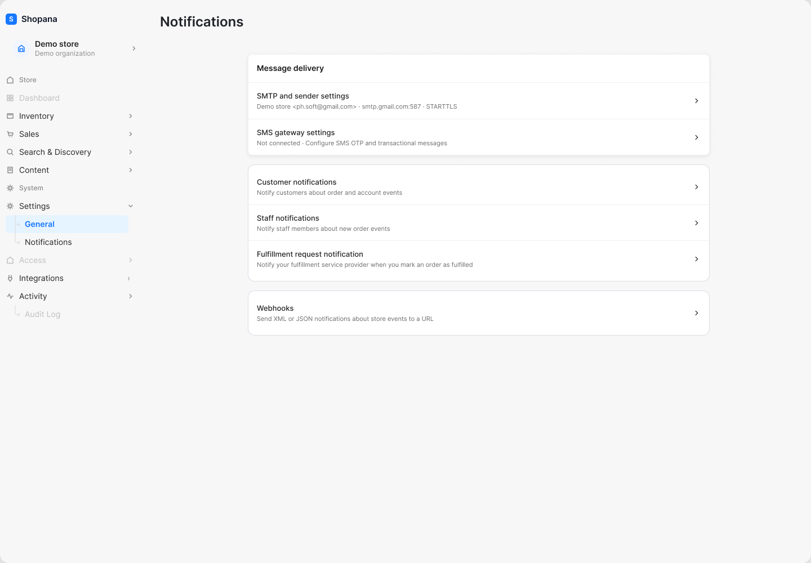
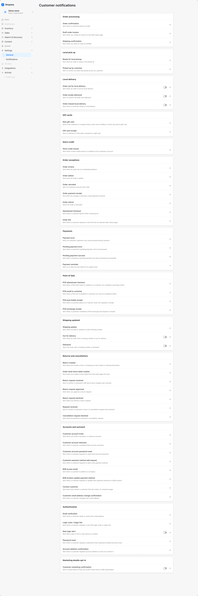
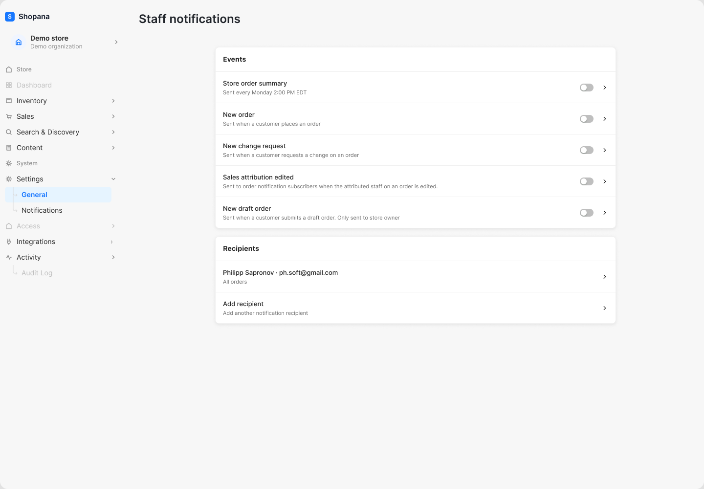
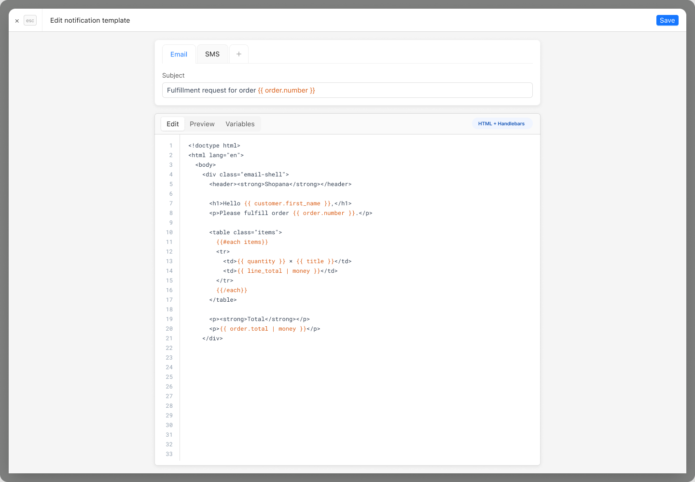
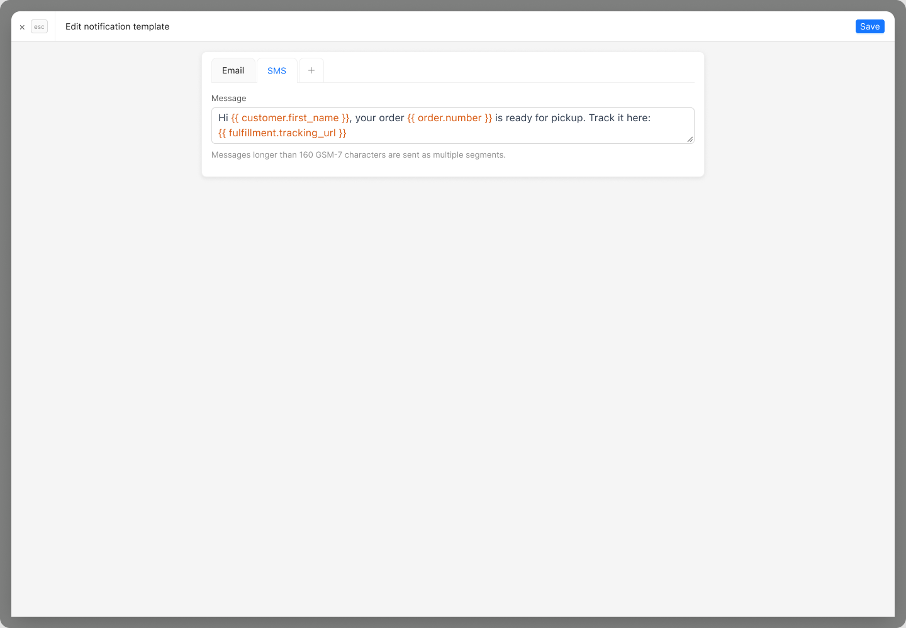
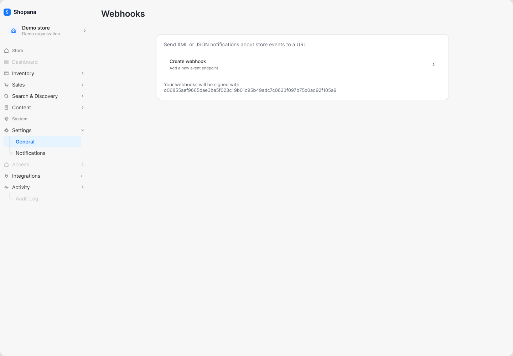
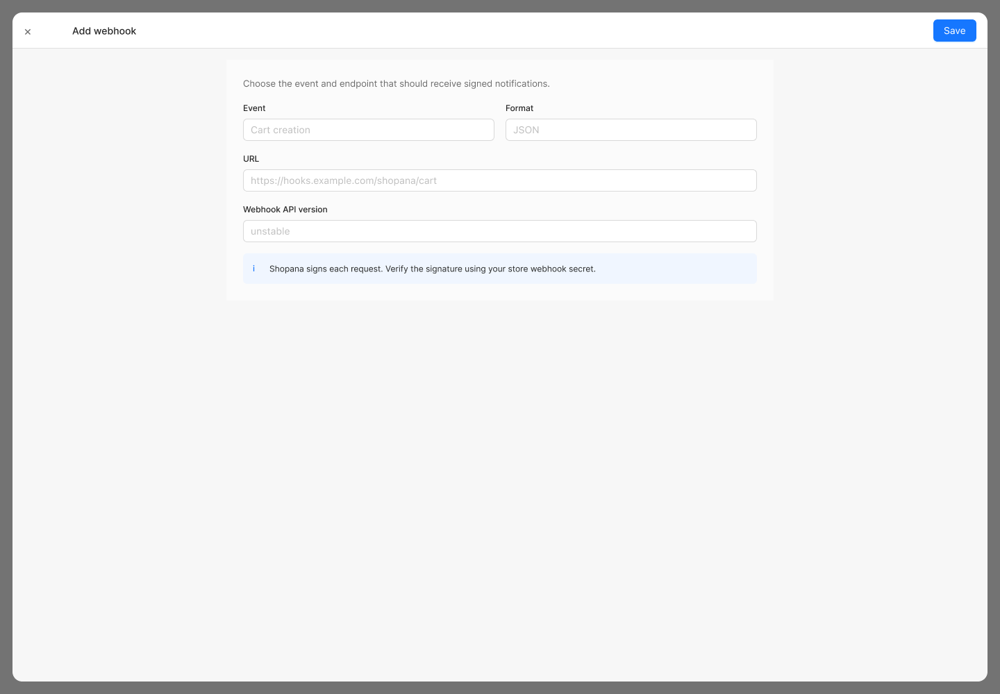
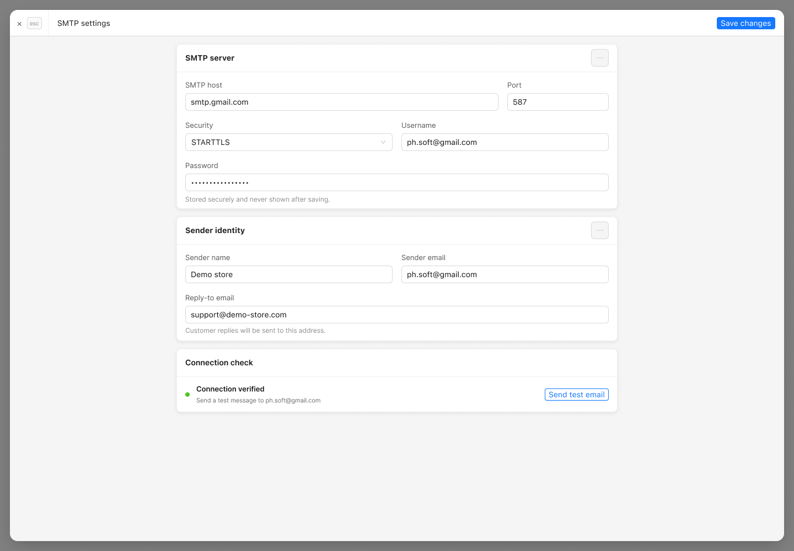
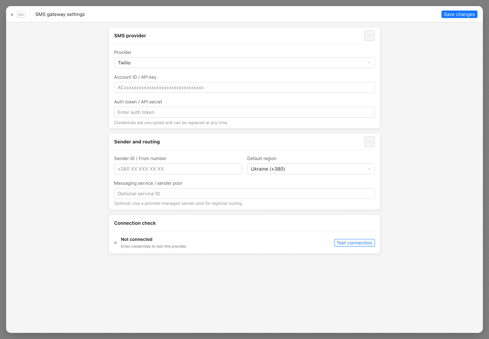

# Система уведомлений Shopana

## Назначение документа

Документ описывает дизайн раздела `Settings → Notifications` по девяти статичным экранам из каталога [`assets/system-notifications`](./assets/system-notifications/). Зафиксированы структура экранов, формы, поля, действия пользователя, переходы, каналы доставки и полный перечень показанных шаблонов.

> Важно: описание основано только на скриншотах. Обязательность полей, точные правила валидации, подтверждения опасных действий, состояния загрузки и ошибок, клавиатурное управление, адаптивность и фактическое поведение после сохранения требуют проверки в работающем интерфейсе.

## Карта раздела

| № | Экран | Назначение | Основные переходы |
|---|---|---|---|
| 1 | Notifications | Точка входа в настройки доставки и группы уведомлений | SMTP, SMS gateway, customer, staff, fulfillment request, webhooks |
| 2 | Customer notifications | Каталог клиентских транзакционных и системных шаблонов | Редактор выбранного шаблона, включение необязательных уведомлений |
| 3 | Staff notifications | Настройка событий для сотрудников и получателей | Редактор события, управление получателем, добавление получателя |
| 4 | Edit notification template — Email | Редактирование темы и HTML-шаблона письма | Email/SMS, Edit/Preview/Variables, Save |
| 5 | Edit notification template — SMS | Редактирование SMS-сообщения | Email/SMS, Save |
| 6 | Webhooks | Список и настройка webhook endpoints | Create webhook |
| 7 | Add webhook | Создание webhook-подписки | Save, Close |
| 8 | SMTP settings | Настройка SMTP и отправителя | Save changes, Send test email |
| 9 | SMS gateway settings | Настройка SMS-провайдера и маршрутизации | Save changes, Test connection |

## Общие паттерны интерфейса

- Раздел открывается из левого меню `Settings → Notifications`.
- Списки организованы в карточки; строка с шевроном открывает вложенный экран или редактор.
- Формы открываются как полноэкранный слой поверх затемнённого интерфейса.
- В формах слева в шапке находится закрытие `×`, справа — основное действие сохранения.
- Необязательные уведомления управляются переключателями непосредственно в строках.
- Каналы шаблона представлены вкладками `Email` и `SMS`; кнопка `+` предполагает добавление ещё одного канала, но её точное поведение на скриншотах не показано.
- Серые переключатели на скриншотах визуально выглядят выключенными. Фактическое значение необходимо подтвердить в реализации.

---

## Экран 1. Notifications



### Назначение

Главная страница системы уведомлений. Объединяет настройки транспортов доставки, каталоги шаблонов и webhooks.

### Блоки и действия

#### Message delivery

1. **SMTP and sender settings**
   - Показывает краткое состояние: магазин, адрес отправителя, SMTP host, порт и режим безопасности.
   - Нажатие по строке открывает экран `SMTP settings`.

2. **SMS gateway settings**
   - Показывает состояние подключения.
   - В показанном состоянии: `Not connected`.
   - Нажатие открывает экран `SMS gateway settings`.

#### Уведомления

1. **Customer notifications**
   - Каталог уведомлений о заказах, аккаунте, платежах, доставке и других клиентских событиях.
   - Нажатие открывает экран `Customer notifications`.

2. **Staff notifications**
   - Уведомления сотрудников о новых событиях заказа.
   - Нажатие открывает экран `Staff notifications`.

3. **Fulfillment request notification**
   - Шаблон запроса fulfillment-провайдеру после перевода заказа в fulfilled.
   - Нажатие открывает редактор шаблона.

#### Webhooks

- Описание: отправка XML- или JSON-уведомлений о событиях магазина на URL.
- Нажатие открывает экран `Webhooks`.

### Состояние экрана

- SMTP настроен.
- SMS gateway не подключён.
- Количество активных шаблонов, ошибки доставки и история отправок на главной странице не отображаются.

---

## Экран 2. Customer notifications



### Назначение

Каталог шаблонов, отправляемых клиентам и получателям. Шаблоны сгруппированы по предметной области.

### Поведение строк

- Нажатие строки или шеврона открывает редактор соответствующего шаблона.
- Если в строке есть переключатель, уведомление можно включить или выключить без входа в редактор.
- Строки без переключателя выглядят как обязательные или системно управляемые, однако это необходимо подтвердить в реализации.

### Полный перечень клиентских шаблонов

#### Order processing — обработка заказа

| Шаблон | Когда отправляется | Переключатель |
|---|---|---|
| Order confirmation | Когда клиент размещает заказ | Нет |
| Draft order invoice | При создании invoice на странице draft order | Нет |
| Shipping confirmation | Когда заказ помечен как fulfilled | Нет |

#### Local pick up — самовывоз

| Шаблон | Когда отправляется | Переключатель |
|---|---|---|
| Ready for local pickup | Когда заказ готов к выдаче | Нет |
| Picked up by customer | Для подтверждения, что клиент забрал заказ | Нет |

#### Local delivery — локальная доставка

| Шаблон | Когда отправляется | Переключатель |
|---|---|---|
| Order out for local delivery | Когда заказ передан на локальную доставку | Да |
| Order locally delivered | Для подтверждения локальной доставки заказа | Да |
| Order missed local delivery | Когда клиент пропустил локальную доставку | Да |

#### Gift cards — подарочные карты

| Шаблон | Когда отправляется | Переключатель |
|---|---|---|
| New gift card | Клиенту или получателю после выпуска либо отправки подарочной карты | Нет |
| Gift card receipt | Клиенту, если к подарочной карте добавлен получатель | Нет |

#### Store credit — кредит магазина

| Шаблон | Когда отправляется | Переключатель |
|---|---|---|
| Store credit issued | Когда сумма store credit зачислена на аккаунт клиента | Нет |

#### Order exceptions — исключения и изменения заказа

| Шаблон | Когда отправляется | Переключатель |
|---|---|---|
| Order invoice | Когда по заказу есть непогашенный остаток | Нет |
| Order edited | Когда заказ изменён | Нет |
| Order canceled | Когда клиент отменяет заказ | Нет |
| Order payment receipt | После списания с сохранённого способа оплаты клиента | Нет |
| Order refund | Когда по заказу оформлен возврат средств | Нет |
| Abandoned checkout | Когда клиент не завершил checkout | Нет |
| Order link | Когда клиент запрашивает новую ссылку вместо истёкшей ссылки страницы статуса заказа | Нет |

#### Payments — платежи

| Шаблон | Когда отправляется | Переключатель |
|---|---|---|
| Payment error | Когда платёж клиента не удалось обработать во время checkout | Нет |
| Pending payment error | Когда отложенный платёж клиента не удалось обработать | Нет |
| Pending payment success | Когда отложенный платёж успешно обработан | Нет |
| Payment reminder | В день срока оплаты или после него для неоплаченного заказа | Нет |

#### Point of Sale — POS

| Шаблон | Когда отправляется | Переключатель |
|---|---|---|
| POS abandoned checkout | Когда создан POS draft order, чтобы клиент мог завершить покупку онлайн | Нет |
| POS email to customer | Когда POS cart отправлен клиенту для завершения онлайн | Нет |
| POS and mobile receipt | Когда клиент размещает очный заказ и запрашивает чек | Нет |
| POS exchange receipt | Когда клиент завершает POS-обмен и запрашивает чек | Нет |

#### Shipping updated — обновления доставки

| Шаблон | Когда отправляется | Переключатель |
|---|---|---|
| Shipping update | При добавлении или обновлении tracking number заказа | Нет |
| Out for delivery | Когда заказ с tracking number передан в доставку | Да |
| Delivered | Когда заказ с tracking number доставлен | Да |

#### Returns and cancellations — возвраты и отмены

| Шаблон | Когда отправляется | Переключатель |
|---|---|---|
| Return created | При создании возврата, включая label или tracking information | Нет |
| Order-level return label created | При создании return label со страницы заказа; в макете отмечено `US only` | Нет |
| Return request received | Клиенту после получения self-service запроса на возврат | Нет |
| Return request approved | После одобрения запроса на возврат | Нет |
| Return request declined | После отклонения запроса на возврат | Нет |
| Request received | После получения клиентского запроса на возврат или отмену | Нет |
| Cancellation request declined | После отклонения запроса клиента на отмену | Нет |

#### Accounts and outreach — аккаунт и коммуникации

| Шаблон | Когда отправляется | Переключатель |
|---|---|---|
| Customer account invite | При приглашении клиента создать аккаунт | Нет |
| Customer account welcome | После завершения активации аккаунта | Нет |
| Customer account password reset | Когда клиент запрашивает сброс пароля аккаунта | Нет |
| Customer payment method add request | Когда клиент запрашивает добавление нового способа оплаты | Нет |
| B2B access email | Когда клиент добавлен в компанию | Нет |
| B2B location update payment method | Когда клиент запрашивает обновление способа оплаты B2B location | Нет |
| Contact customer | При обращении к клиенту со страницы orders или customers | Нет |
| Customer email address change confirmation | Когда клиент изменяет email | Нет |

#### Authentication — аутентификация

| Шаблон | Когда отправляется | Переключатель |
|---|---|---|
| Email verification | Когда клиенту требуется подтвердить email | Нет |
| Login code / magic link | Когда клиент запрашивает одноразовый код или magic link | Нет |
| New login alert | После входа с нового устройства или из нового местоположения | Да |
| Password reset | Когда клиент запрашивает сброс пароля; для password-based accounts | Нет |
| Account deletion confirmation | Когда клиент запрашивает удаление аккаунта и должен подтвердить действие | Нет |

#### Marketing double opt-in — подтверждение подписки

| Шаблон | Когда отправляется | Переключатель |
|---|---|---|
| Customer marketing confirmation | Подписчику для подтверждения email- или SMS-подписки | Да |

### Итог по клиентским шаблонам

- Всего показано **50** шаблонов.
- У **7** шаблонов есть прямой переключатель:
  - Order out for local delivery;
  - Order locally delivered;
  - Order missed local delivery;
  - Out for delivery;
  - Delivered;
  - New login alert;
  - Customer marketing confirmation.

---

## Экран 3. Staff notifications



### Назначение

Настройка уведомлений сотрудников о событиях заказов и списка получателей.

### Блок Events

| Шаблон/событие | Описание | Доступные действия |
|---|---|---|
| Store order summary | Периодическая сводка заказов; на экране указано `Every Monday 2:00 PM EDT` | Включить/выключить |
| New order | Когда клиент размещает заказ | Включить/выключить, открыть настройки |
| New change request | Когда клиент запрашивает изменение заказа | Включить/выключить, открыть настройки |
| Sales attribution edited | Для подписчиков order notification после изменения назначенного сотрудника заказа | Включить/выключить, открыть настройки |
| New draft order | Когда клиент отправляет draft order; только владельцу магазина | Включить/выключить, открыть настройки |

### Блок Recipients

1. **Существующий получатель**
   - В строке показаны имя и email.
   - Подпись `All orders` задаёт область событий/заказов.
   - Нажатие открывает настройки получателя.

2. **Add recipient**
   - Добавляет нового получателя уведомлений.
   - Поля формы добавления на предоставленных экранах не показаны.

### Не показанные, но необходимые состояния

- Форма выбора расписания для `Store order summary`.
- Выбор конкретных событий и области заказов для получателя.
- Удаление получателя и подтверждение удаления.
- Обработка дублирующего email, невалидного адреса и отсутствия получателей.

---

## Экраны 4–5. Редактор шаблона уведомления

### Общая оболочка

- Заголовок: `Edit notification template`.
- Закрытие: `×`; рядом показана подсказка клавиши `esc`.
- Основное действие: `Save`.
- Вкладки каналов: `Email`, `SMS`, `+`.
- Переключение между Email и SMS должно сохранять несохранённый ввод либо явно предупреждать о его потере; требуемое поведение на скриншотах не показано.

### Экран 4. Email template



#### Форма

| Элемент | Назначение |
|---|---|
| Subject | Тема письма; поддерживает переменные Handlebars |
| Edit | Режим редактирования HTML |
| Preview | Предпросмотр итогового письма |
| Variables | Справочник и вставка доступных переменных |
| `HTML + Handlebars` | Индикатор формата шаблона |
| Code editor | Редактор HTML с нумерацией строк и подсветкой переменных |
| Save | Сохранение шаблона |

#### Пример темы

`Fulfillment request for order {{ order.number }}`

#### Переменные и конструкции, показанные в макете

- `{{ customer.first_name }}`
- `{{ order.number }}`
- `{{#each items}} ... {{/each}}`
- `{{ quantity }}`
- `{{ title }}`
- `{{ line_total | money }}`
- `{{ order.total | money }}`

#### Действия

1. Переключить канал на Email.
2. Изменить тему.
3. Отредактировать HTML.
4. Открыть `Variables` и вставить допустимую переменную.
5. Открыть `Preview` и проверить результат.
6. Нажать `Save`.
7. Закрыть редактор через `×` или `Esc`.

#### Ожидаемая валидация

- непустая тема и тело шаблона;
- допустимый HTML;
- корректный синтаксис Handlebars;
- только разрешённые переменные, helpers и filters;
- понятная ошибка с привязкой к строке редактора;
- предупреждение при закрытии с несохранёнными изменениями.

Эти правила логичны для формы, но не подтверждены статичным экраном.

### Экран 5. SMS template



#### Форма

| Элемент | Назначение |
|---|---|
| Message | Текст SMS с переменными шаблона |
| Подсказка о 160 символах | Предупреждает, что сообщения длиннее 160 GSM-7 символов будут отправлены несколькими сегментами |
| Save | Сохранение SMS-шаблона |

#### Пример сообщения

```handlebars
Hi {{ customer.first_name }}, your order {{ order.number }} is ready for pickup. Track it here:
{{ fulfillment.tracking_url }}
```

#### Переменные, показанные в макете

- `{{ customer.first_name }}`
- `{{ order.number }}`
- `{{ fulfillment.tracking_url }}`

#### Действия

1. Переключить канал на SMS.
2. Изменить сообщение.
3. Проверить длину и количество предполагаемых сегментов.
4. Нажать `Save`.

#### Ожидаемая валидация

- непустой текст;
- допустимые переменные;
- отображение текущего количества символов и SMS-сегментов;
- предупреждение для Unicode, поскольку лимит и сегментация отличаются от GSM-7;
- предупреждение при закрытии с несохранёнными изменениями.

Эти правила требуют подтверждения в реализации.

---

## Экран 6. Webhooks



### Назначение

Управление endpoints, получающими подписанные XML- или JSON-уведомления о событиях магазина.

### Содержимое и действия

1. Вводный текст объясняет назначение webhooks.
2. **Create webhook**
   - Подпись: `Add a new event endpoint`.
   - Нажатие открывает форму `Add webhook`.
3. Отображается webhook secret, которым подписываются запросы.

### Требования безопасности

- Полный secret не следует постоянно показывать открытым.
- Предпочтительны маска, явное действие `Reveal`, копирование и ротация секрета.
- Просмотр и ротация должны зависеть от разрешений пользователя.
- Значение из дизайн-макета не переносится в этот документ.

### Не показанные состояния

- Список уже созданных webhooks.
- Редактирование, отключение, удаление и ротация секрета.
- История попыток доставки, HTTP status, retry и тестовая отправка.
- Пустое состояние отдельно от CTA создания.

---

## Экран 7. Add webhook



### Назначение

Создание подписки на событие и указание endpoint, который будет получать подписанные запросы.

### Форма

| Поле | Тип | Пример на экране | Назначение |
|---|---|---|---|
| Event | Выбор события | `Cart creation` | Событие, запускающее отправку |
| Format | Выбор формата | `JSON` | Формат payload; главный экран также упоминает XML |
| URL | URL input | `https://hooks.example.com/shopana/cart` | Endpoint получателя |
| Webhook API version | Выбор версии | `unstable` | Версия контракта webhook |

Информационный блок сообщает, что каждый запрос подписывается и подпись нужно проверять с помощью webhook secret магазина.

### Действия

- `Save` — создать webhook.
- `×` — закрыть форму без сохранения.

### Ожидаемая валидация

- обязательный выбор события, формата и версии API;
- только абсолютный HTTPS URL;
- блокировка loopback/private network endpoints, если они не поддерживаются сознательно;
- проверка синтаксиса и допустимой длины URL;
- обработка дублирующей подписки;
- предупреждение при выборе `unstable`;
- предупреждение при закрытии с несохранёнными изменениями.

Статичный экран не показывает тексты ошибок и поведение после успешного сохранения.

---

## Экран 8. SMTP settings



### Назначение

Настройка SMTP-подключения, identity отправителя и проверка доставки email.

### Форма SMTP server

| Поле | Тип | Назначение |
|---|---|---|
| SMTP host | Text | Host SMTP-сервера |
| Port | Number | Порт подключения |
| Security | Select | Режим безопасности; в примере `STARTTLS` |
| Username | Text | Имя пользователя SMTP |
| Password | Password | Секрет SMTP; после сохранения не показывается |

Подсказка для пароля: значение хранится безопасно и не отображается после сохранения.

### Форма Sender identity

| Поле | Тип | Назначение |
|---|---|---|
| Sender name | Text | Отображаемое имя отправителя |
| Sender email | Email | Адрес в поле From |
| Reply-to email | Email | Адрес для ответов клиентов |

Подсказка сообщает, что ответы клиентов будут отправляться на `Reply-to email`.

### Connection check

- Статус на макете: `Connection verified`.
- Показан адрес, на который можно отправить тестовое письмо.
- `Send test email` запускает тестовую отправку.

### Действия

- `Save changes` — сохранить SMTP и sender identity.
- `Send test email` — проверить подключение и доставку.
- `…` в карточках — дополнительное меню; его пункты не показаны.
- `×`/`Esc` — закрыть форму.

### Ожидаемые правила

- host обязателен;
- port — целое число в диапазоне `1–65535`;
- согласованность port и security;
- валидные email для sender и reply-to;
- пароль не возвращается клиенту после сохранения;
- тест выполняется только после заполнения обязательных полей;
- отдельные состояния `checking`, `verified`, `failed`;
- ошибки подключения не должны раскрывать пароль или лишние детали инфраструктуры.

---

## Экран 9. SMS gateway settings



### Назначение

Подключение SMS-провайдера и настройка sender/routing.

### Форма SMS provider

| Поле | Тип | Назначение |
|---|---|---|
| Provider | Select | SMS-провайдер; в макете выбран `Twilio` |
| Account ID / API key | Text | Идентификатор аккаунта или API key |
| Auth token / API secret | Password | Секрет провайдера |

Подсказка сообщает, что credentials шифруются и могут быть заменены в любое время.

### Форма Sender and routing

| Поле | Тип | Назначение |
|---|---|---|
| Sender ID / From number | Text | Номер или Sender ID исходящих сообщений |
| Default region | Select | Регион и телефонный код по умолчанию; в макете `Ukraine (+380)` |
| Messaging service / sender pool | Text, optional | Идентификатор сервиса/пула отправителей провайдера для региональной маршрутизации |

### Connection check

- Статус на макете: `Not connected`.
- Подсказка предлагает ввести credentials.
- `Test connection` проверяет доступ к провайдеру.

### Действия

- `Save changes` — сохранить настройки.
- `Test connection` — проверить credentials и доступность провайдера.
- `…` в карточках — дополнительное меню; пункты не показаны.
- `×`/`Esc` — закрыть форму.

### Ожидаемые правила

- динамические поля и подсказки в зависимости от провайдера;
- обязательные account ID/API key и secret;
- проверка формата From number/Sender ID для выбранного провайдера и страны;
- валидация совместимости региона и sender;
- секрет не возвращается после сохранения;
- отдельные состояния `testing`, `connected`, `failed`;
- понятная расшифровка ошибок авторизации, sender restrictions и региональных ограничений.

---

## Сводный перечень шаблонов

| Аудитория/назначение | Количество |
|---|---:|
| Customer notifications | 50 |
| Staff notifications | 5 |
| Fulfillment request notification | 1 |
| **Всего показано в дизайне** | **56** |

### Staff templates

1. Store order summary.
2. New order.
3. New change request.
4. Sales attribution edited.
5. New draft order.

### Fulfillment template

1. Fulfillment request notification.

Полный перечень 50 клиентских шаблонов приведён в разделе [«Экран 2. Customer notifications»](#экран-2-customer-notifications).

## Сквозные пользовательские сценарии

### Настроить email-доставку

1. Открыть `Notifications`.
2. Выбрать `SMTP and sender settings`.
3. Заполнить SMTP server.
4. Заполнить Sender identity.
5. Сохранить изменения.
6. Дождаться статуса проверки.
7. Отправить тестовое письмо.

### Настроить SMS-доставку

1. Открыть `Notifications`.
2. Выбрать `SMS gateway settings`.
3. Выбрать провайдера.
4. Ввести credentials.
5. Настроить sender и регион.
6. Сохранить изменения.
7. Проверить подключение.

### Изменить клиентский шаблон

1. Открыть `Customer notifications`.
2. Найти категорию и событие.
3. При необходимости включить событие переключателем.
4. Открыть строку шаблона.
5. Изменить Email и/или SMS.
6. Проверить preview и переменные.
7. Сохранить.

### Настроить уведомления сотрудников

1. Открыть `Staff notifications`.
2. Включить нужные события.
3. Открыть событие и уточнить его настройки.
4. Открыть существующего получателя или добавить нового.
5. Назначить область заказов и события.
6. Сохранить.

### Создать webhook

1. Открыть `Webhooks`.
2. Выбрать `Create webhook`.
3. Выбрать event, format и API version.
4. Указать endpoint URL.
5. Сохранить webhook.
6. На стороне получателя проверять подпись запроса.

## Краткая оценка дизайна

### Сильные стороны

- Настройки транспорта отделены от шаблонов и webhook-интеграций.
- Каталог из 50 клиентских шаблонов разбит на понятные предметные группы.
- Шаблоны Email и SMS редактируются в одной оболочке.
- SMTP и SMS имеют отдельную проверку подключения.
- Редактор явно показывает технологию шаблона и доступ к variables/preview.
- Для секретов SMTP и SMS предусмотрены пояснения о безопасном хранении.

### UX-риски

1. **Длинный каталог без поиска и фильтров.** На странице 50 клиентских шаблонов; поиск по названию, событию и каналу сократит время настройки.
2. **Неочевидная разница между строками с переключателем и без него.** Нужна явная легенда: какие уведомления обязательны, а какие можно отключить.
3. **Нет видимого состояния канала у шаблона.** В каталоге полезно показывать badges `Email`, `SMS`, `Disabled`, `Customized`.
4. **Webhook secret показан открыто.** Это создаёт риск случайного раскрытия при демонстрации экрана.
5. **Нет видимого счётчика SMS.** Подсказка о 160 GSM-7 символах есть, но до отправки нужны live character/segment count и предупреждение о Unicode.
6. **Не показано управление несохранёнными изменениями.** Закрытие, смена канала или вкладки должны предупреждать о потере правок.
7. **Статус подключения не объясняет свежесть проверки.** Полезно показывать время последней успешной проверки и причину последней ошибки.

### Риски доступности

- Серые переключатели имеют слабый визуальный контраст; состояние не должно передаваться только цветом.
- Иконки `×`, `…`, `+` и шевроны нуждаются в доступных названиях и достаточной области нажатия.
- Визуальная подсветка активной вкладки должна сопровождаться корректными tab semantics и фокусом.
- Code editor должен поддерживать клавиатуру, читаемую фокусную рамку и альтернативный режим для screen reader.
- Статусы `verified/not connected` должны объявляться assistive technologies, особенно после асинхронной проверки.
- Ошибки форм должны связываться с конкретными полями и содержать текст, а не только цвет.

### Что проверить в работающем интерфейсе

- клавиатурную навигацию, порядок фокуса и `Esc`;
- labels, roles, accessible names и объявления статусов;
- контраст текста, переключателей, границ и focus states;
- адаптивный reflow и масштабирование до 200–400%;
- loading, success, error, empty и permission-denied states;
- сохранение черновика при переключении Email/SMS;
- серверную валидацию шаблонов, URL и credentials;
- permissions и аудит действий с секретами;
- retry/idempotency для webhook и тестовых отправок.

