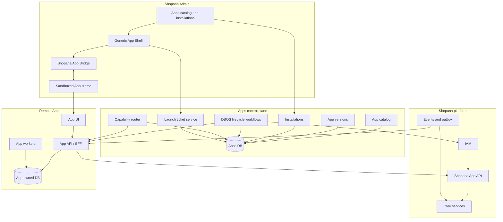
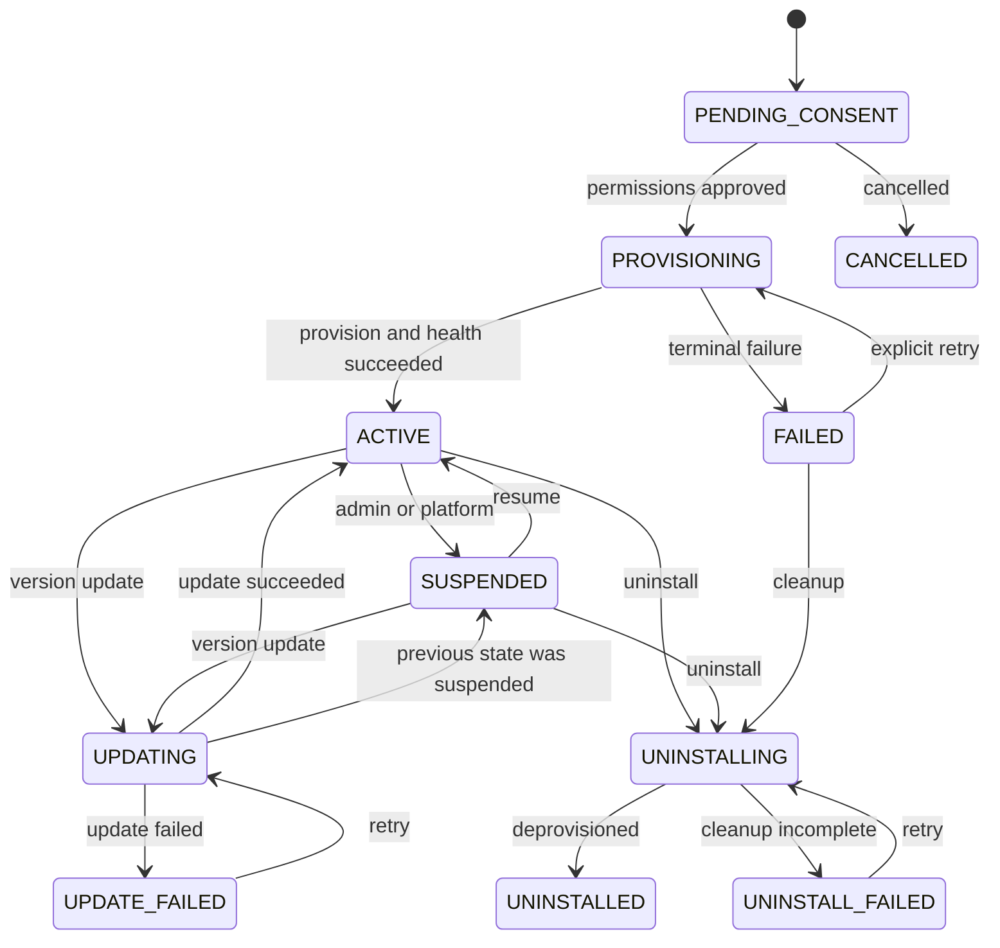
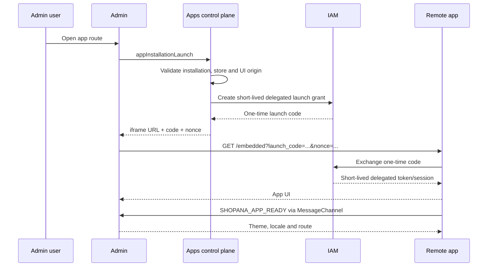
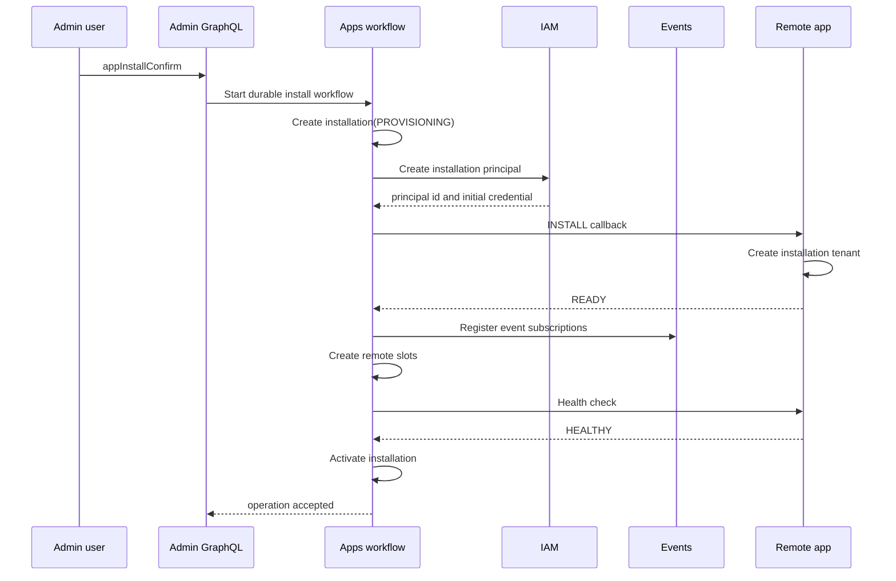
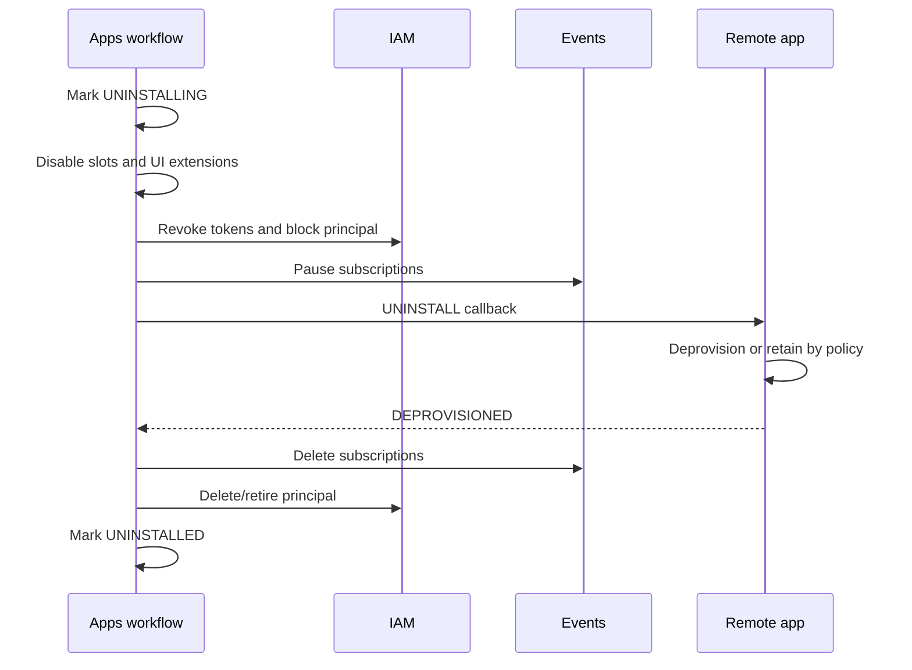

# Архитектура полноценных приложений Shopana

Статус: архитектурное предложение  
Дата: 2026-07-25  
Область: `services/apps`, `packages/plugin-sdk`, `admin`, IAM, Events, GraphQL Gateway  
Язык документа: русский

## Содержание

1. [Резюме решения](#1-резюме-решения)
2. [Контекст и проблема](#2-контекст-и-проблема)
3. [Термины](#3-термины)
4. [Цели](#4-цели)
5. [Не входит в первую версию](#5-не-входит-в-первую-версию)
6. [Текущее состояние](#6-текущее-состояние)
7. [Архитектурные принципы](#7-архитектурные-принципы)
8. [Целевая архитектура](#8-целевая-архитектура)
9. [Границы ответственности](#9-границы-ответственности)
10. [Runtime-типы](#10-runtime-типы)
11. [Модель данных control plane](#11-модель-данных-control-plane)
12. [База данных приложения](#12-база-данных-приложения)
13. [Manifest приложения](#13-manifest-приложения)
14. [API и transport contracts](#14-api-и-transport-contracts)
15. [IAM и авторизация](#15-iam-и-авторизация)
16. [Встраиваемый UI](#16-встраиваемый-ui)
17. [GraphQL API control plane](#17-graphql-api-control-plane)
18. [Lifecycle workflows](#18-lifecycle-workflows)
19. [Security model](#19-security-model)
20. [Reliability и idempotency](#20-reliability-и-idempotency)
21. [Observability и audit](#21-observability-и-audit)
22. [Admin UX](#22-admin-ux)
23. [Структура кода](#23-структура-кода)
24. [Переход от текущей реализации](#24-переход-от-текущей-реализации)
25. [Этапы реализации](#25-этапы-реализации)
26. [Pilot: Tilda Import App](#26-pilot-tilda-import-app)
27. [Проверка и критерии качества](#27-проверка-и-критерии-качества)
28. [Критерии готовности первой версии](#28-критерии-готовности-первой-версии)
29. [Отклонённые альтернативы](#29-отклонённые-альтернативы)
30. [Принятые default decisions](#30-принятые-default-decisions)
31. [Связанные файлы](#31-связанные-файлы)

## 1. Резюме решения

Текущий `apps-service` является менеджером встроенных provider-плагинов. Он
загружает npm-пакеты в свой Node.js-процесс, хранит конфигурацию provider и
маршрутизирует вызовы по доменам `shipping`, `payment`, `pricing`, `inventory`,
`import` и `notifications`.

Такая модель подходит для небольших доверенных адаптеров, но не позволяет
создавать полноценные приложения со следующими свойствами:

- независимый deployment;
- собственный API;
- собственная база данных;
- фоновые workers и jobs;
- независимый lifecycle и versioning;
- собственный UI, встроенный в Admin;
- изолированные permissions и credentials;
- независимое масштабирование и fault isolation.

Целевое решение разделяет два runtime-типа:

1. **Plugin** — доверенный адаптер, выполняющийся внутри процесса Shopana.
2. **App** — независимо развёрнутый сервис со своей БД, API, UI и
   installation identity.

`apps-service` становится **control plane приложений** и **capability router**.
Он управляет каталогом, версиями, установками, permissions, UI extensions,
event subscriptions, credentials и состоянием приложения, но не исполняет
бизнес-код remote app и не хранит принадлежащие приложению бизнес-данные.

Основные решения:

- одна установка представляется сущностью `app_installation`, а не набором
  `slots`;
- `slots` сохраняются как механизм маршрутизации capabilities;
- remote app вызывается через versioned HTTP protocol;
- app вызывает Shopana через отдельный scoped App API;
- для app backend вводится отдельный IAM service principal;
- UI загружается в sandboxed iframe;
- Admin использует один статический App Shell и runtime UI descriptors;
- динамические приложения не включаются в общий GraphQL Federation supergraph;
- установка, обновление и удаление выполняются durable workflows через DBOS;
- существующие trusted plugins продолжают работать во время постепенной
  миграции.

## 2. Контекст и проблема

Shopana строится как набор микросервисов с GraphQL Federation. Каждый bounded
context должен владеть своим API и данными, независимо развёртываться и
масштабироваться. В development допускается общая PostgreSQL с логическим
разделением, а в production сервисы могут использовать отдельные базы данных.

Текущая реализация `apps` расходится с этой моделью на уровне устанавливаемых
приложений:

- plugin является зависимостью `apps-service`;
- новый plugin требует сборки и deployment `apps-service`;
- код plugin выполняется с теми же process privileges;
- plugin не может владеть своим persistent state;
- нет сущности установки приложения;
- нет install/update/uninstall protocol;
- отсутствуют app principals и permission consent;
- отсутствует UI runtime contract;
- Admin Apps пока использует mock-данные.

В результате термин `App` сейчас обозначает зарегистрированный provider, хотя
продуктово ожидается отдельное устанавливаемое приложение.

## 3. Термины

### 3.1. App

Независимо развёрнутый сервис, который:

- имеет стабильный `appCode`;
- публикует versioned manifest;
- владеет своим API и данными;
- может предоставлять один или несколько capabilities;
- может подписываться на события Shopana;
- может публиковать UI extensions;
- устанавливается отдельно в конкретный store;
- получает минимально необходимые permissions.

Примеры:

- импорт из Tilda с историей запусков и UI;
- синхронизация с ERP;
- loyalty program;
- marketing automation;
- marketplace connector;
- аналитика;
- tax service;
- сложный shipping provider с отдельным кабинетом.

### 3.2. Plugin

Доверенный npm-пакет, загруженный в процесс Shopana. Plugin:

- поставляется вместе с platform release;
- не имеет независимого deployment;
- использует `@shopana/plugin-sdk`;
- получает конфигурацию от `apps-service`;
- реализует domain provider contract;
- не должен хранить значительное собственное состояние.

Примеры:

- SMTP transport;
- простой HTTP webhook transport;
- bank transfer;
- небольшой stateless pricing adapter.

### 3.3. App definition

Глобальная identity приложения в каталоге. Содержит стабильные поля:

- `id`;
- `code`;
- `displayName`;
- `developerId`;
- `visibility`;
- `status`.

### 3.4. App version

Неизменяемая опубликованная версия manifest. Определяет:

- backend endpoints;
- UI entrypoint;
- permissions;
- event subscriptions;
- capabilities;
- compatibility range;
- integrity/signature metadata.

### 3.5. App installation

Установка конкретной версии app в конкретный store. Installation является
основной tenant identity для remote app.

### 3.6. Capability

Типизированная возможность, предоставляемая plugin или app:

- `shipping`;
- `payment`;
- `pricing`;
- `inventory`;
- `import`;
- `notifications`;
- будущие versioned domains.

Capability не равен установке. Одно приложение может предоставить несколько
capabilities.

### 3.7. UI extension

Декларативная точка встраивания app UI в Admin:

- navigation item;
- full page;
- settings page;
- contextual action;
- dashboard card;
- resource details panel.

В первой версии обязательны только navigation item и full page.

## 4. Цели

1. Позволить каждому app независимо владеть API, БД, UI и deployment.
2. Сохранить текущие provider capabilities и `slot_assignments`.
3. Обеспечить установку app на уровне store.
4. Изолировать credentials, permissions, данные и runtime.
5. Предоставить безопасный embedded UI в Admin.
6. Дать app стабильный API доступа к Shopana без прямого доступа к внутренним
   БД.
7. Обеспечить event delivery с retries, idempotency и аудитом.
8. Поддержать независимое обновление app version.
9. Обеспечить постепенную миграцию текущих plugins без одномоментного
   переписывания.
10. Сохранить возможность first-party apps быть обычными сервисами Shopana.

## 5. Не входит в первую версию

- исполнение загруженного third-party кода внутри Shopana;
- arbitrary Docker image deployment со стороны tenant;
- динамическое добавление tenant-specific subgraphs в общий supergraph;
- Module Federation или импорт remote JavaScript в React tree Admin;
- per-store database instance для каждого app;
- marketplace billing и revenue sharing;
- автоматическая публикация непроверенных manifest;
- поддержка произвольных UI extension points;
- передача platform user session или Admin access token приложению;
- доступ app к внутренним PostgreSQL schemas Shopana;
- distributed joins между БД app и core services;
- обратная совместимость со старой псевдомоделью `InstalledApp = Slot`.

Проект не имеет production data, поэтому новая модель должна заменить старую
напрямую. Backfill и compatibility layer не требуются.

## 6. Текущее состояние

### 6.1. Registry

Плагины импортируются статически:

```text
services/apps
└── src/infrastructure/plugins/registry/index.ts
    ├── @shopana/payment-plugin-bank-transfer
    ├── @shopana/inventory-plugin-shopana
    ├── @shopana/import-plugin-tilda
    ├── @shopana/pricing-plugin-simple-promo
    ├── @shopana/shipping-plugin-*
    └── @shopana/notification-plugin-*
```

Новый plugin требует:

1. добавить package dependency;
2. импортировать package в registry;
3. пересобрать `apps-service`;
4. развернуть новую версию Shopana.

### 6.2. Plugin execution

`AppsPluginManager`:

- объединяет все plugin modules;
- валидирует manifest compatibility;
- подставляет secrets;
- применяет config migrations;
- создаёт provider;
- вызывает `provider[domain][operation]`;
- применяет timeout, retry, rate limit и circuit breaker.

Вызов остаётся in-process. Timeout ограничивает ожидание caller, но не
гарантирует остановку уже запущенного кода.

### 6.3. Persistence

Существующая модель содержит:

#### `provider_configs`

Store-scoped конфигурация provider:

- `store_id`;
- `provider`;
- `data`;
- `version`;
- `status`;
- `environment`.

#### `slots`

Регистрация provider в домене:

- `store_id`;
- `domain`;
- `provider`;
- `provider_config_id`;
- `capabilities`.

#### `slot_assignments`

Назначение slot конкретному aggregate:

- `aggregate`;
- `aggregate_id`;
- `slot_id`;
- `domain`;
- `precedence`;
- `status`.

#### `provider_secrets`

Зашифрованные secrets provider configuration.

Эта модель пригодна для capability routing, но не описывает app lifecycle.

### 6.4. Install

Текущий install:

1. ищет plugin manifest по `appCode`;
2. получает `manifest.domains`;
3. создаёт один slot на каждый domain;
4. создаёт пустой `provider_config`.

Он не выполняет:

- permission consent;
- remote provisioning;
- credential issuance;
- health validation;
- event subscription;
- UI registration;
- version pinning.

### 6.5. Installed apps

Текущий resolver преобразует каждый slot в отдельный `InstalledApp`.

Следствия:

- multi-domain app дублируется;
- `InstalledApp.id` является `slot.id`;
- `baseURL` читается из произвольного config JSON;
- `meta` фактически содержит config;
- невозможно определить app version;
- нет installation status и lifecycle timestamps.

### 6.6. Uninstall

Текущий uninstall:

- пытается угадать domain по имени provider;
- по умолчанию выбирает `shipping`;
- удаляет один slot.

Для multi-domain plugin это не является удалением приложения.

### 6.7. Admin

Admin уже имеет статический route:

```text
/:orgName/:storeName/system/integrations/apps
```

Но:

- страница возвращает `null`;
- hooks используют mock store;
- install/uninstall не вызывают GraphQL;
- нет страницы app;
- нет App Shell;
- нет UI bridge;
- нет runtime sidebar loader.

При этом в Admin уже существует `useDynamicSidebarStore`, который можно
использовать для добавления navigation items установленных apps.

### 6.8. GraphQL API

Текущий API предоставляет:

- `appsQuery.apps`;
- `appsQuery.installedApps`;
- `appsMutation.install(code)`;
- `appsMutation.uninstall(code)`.

Недостатки:

- mutations возвращают `Boolean`;
- нет `userErrors`;
- нет installation entity;
- нет version selection;
- нет permission consent;
- нет update/enable/disable/configure/launch;
- нет pagination/filter/order;
- нет app health и diagnostics.

## 7. Архитектурные принципы

### 7.1. Control plane и data plane разделены

`apps-service` управляет метаданными и routing. Бизнес-данные app остаются в
БД app.

### 7.2. Installation является tenant identity

Удалённое приложение должно использовать `installationId`, а не только
`storeId`. Это позволяет:

- несколько установок одного app в разных stores;
- независимые permissions;
- независимую ротацию credentials;
- независимый lifecycle;
- точный audit trail.

### 7.3. Store всегда определяется платформой

App не может выбрать произвольный `storeId` в request body. Store связывается
с installation на стороне Shopana и проверяется resource server.

### 7.4. App не получает core database access

Все операции проходят через versioned Shopana App API, events или capability
contracts.

### 7.5. UI изолирован от Admin runtime

App UI выполняется в iframe на отдельном origin. Интеграция идёт через
ограниченный message bridge.

### 7.6. Permissions выдаются явно

Manifest объявляет requested permissions. Пользователь с правом установки
подтверждает scopes. Runtime token не может содержать больше permissions, чем
сохранено в installation.

### 7.7. Все side effects идемпотентны

Install, uninstall, update, webhook delivery и remote capability operations
должны принимать idempotency key.

### 7.8. Versioned contracts вместо dynamic invocation

Текущий контракт `operation: string` и `input: unknown` не должен становиться
remote protocol. Для каждого domain нужен versioned contract.

### 7.9. Default deny

Неизвестные permissions, events, capabilities, UI extension points и callback
URLs отклоняются при публикации app version.

## 8. Целевая архитектура



## 9. Границы ответственности

### 9.1. `apps-service`

Владеет:

- app catalog;
- app versions;
- manifest validation;
- installations;
- installation state machine;
- granted scopes;
- UI extension descriptors;
- endpoint registry;
- health state;
- event subscriptions;
- links с slots;
- launch tickets;
- lifecycle audit;
- references на IAM principals;
- remote capability routing.

Не владеет:

- app business data;
- app UI assets;
- app jobs;
- app-specific migrations;
- app user-facing API.

### 9.2. IAM

Владеет:

- app service principals;
- client authentication;
- signing keys;
- access token issuance;
- token audience;
- token revocation;
- delegated user token exchange;
- actor and scope claims.

IAM application realm и installation service principal являются разными
понятиями.

Существующая application OAuth/OIDC модель ориентирована на
`application_users` и Authorization Code flow. Она явно не поддерживает
`client_credentials`. Для remote apps требуется отдельная machine actor model,
а не неявное расширение пользовательского realm.

### 9.3. Events

Владеет:

- canonical event envelope;
- durable outbox;
- subscription delivery;
- retries;
- dead letter;
- delivery audit;
- replay policy.

`apps-service` управляет subscription metadata, но фактическую доставку должен
выполнять Events или специализированный delivery worker.

### 9.4. Admin

Владеет:

- каталогом и управлением установками;
- App Shell;
- iframe lifecycle;
- bridge implementation;
- dynamic navigation;
- отображением consent и health;
- пользовательскими ошибками.

### 9.5. Remote app

Владеет:

- собственным API;
- собственной БД;
- миграциями;
- UI;
- workers;
- обработкой installation lifecycle callbacks;
- обработкой events;
- app-specific authorization поверх installation identity;
- своей observability.

## 10. Runtime-типы

### 10.1. `IN_PROCESS_PLUGIN`

Используется для trusted plugins.

```text
apps-service
  -> PluginManager
    -> provider[domain][operation]
```

Свойства:

- минимальный network overhead;
- platform release lifecycle;
- общие process resources;
- доступ только к явно переданному ProviderContext;
- нет собственного UI и persistent storage.

### 10.2. `REMOTE_APP`

Используется для полноценных apps.

```text
apps-service
  -> RemoteCapabilityTransport
    -> app backend
      -> app database
```

Свойства:

- отдельный deployment;
- отдельный health;
- network isolation;
- scoped credentials;
- independent versioning;
- app-owned UI и database.

### 10.3. Capability router

Capability router выбирает transport по slot:

```typescript
type SlotTransport =
  | {
      kind: "IN_PROCESS_PLUGIN";
      pluginCode: string;
    }
  | {
      kind: "REMOTE_APP";
      installationId: string;
      protocol: string;
      endpointId: string;
    };
```

В таблице не следует хранить произвольный URL для каждого вызова. Slot должен
ссылаться на validated endpoint из опубликованной app version или
installation endpoint binding.

## 11. Модель данных control plane

Названия являются целевыми и могут быть адаптированы к conventions Drizzle.

### 11.1. `apps`

| Поле | Тип | Описание |
|---|---|---|
| `id` | UUID | Primary key |
| `code` | VARCHAR | Глобально уникальный стабильный code |
| `display_name` | VARCHAR | Название |
| `description` | TEXT | Описание |
| `developer_id` | UUID | Владелец публикации |
| `visibility` | ENUM | `PRIVATE`, `ORGANIZATION`, `PUBLIC` |
| `status` | ENUM | `DRAFT`, `ACTIVE`, `SUSPENDED`, `RETIRED` |
| `icon_url` | TEXT | Проверенный asset URL |
| `created_at` | TIMESTAMPTZ | Создание |
| `updated_at` | TIMESTAMPTZ | Изменение |

Инварианты:

- `code` неизменяем после первой публикации;
- retired app нельзя устанавливать;
- suspended app не получает новые installations.

### 11.2. `app_versions`

| Поле | Тип | Описание |
|---|---|---|
| `id` | UUID | Primary key |
| `app_id` | UUID | FK на `apps` |
| `version` | VARCHAR | SemVer |
| `status` | ENUM | `DRAFT`, `PUBLISHED`, `DEPRECATED`, `BLOCKED` |
| `manifest` | JSONB | Canonical manifest |
| `manifest_hash` | VARCHAR | SHA-256 canonical JSON |
| `signature` | TEXT | Подпись publisher/platform |
| `api_version_range` | VARCHAR | Совместимость с platform App API |
| `published_at` | TIMESTAMPTZ | Publication time |
| `created_at` | TIMESTAMPTZ | Creation time |

Ограничения:

- unique `(app_id, version)`;
- published version immutable;
- повторная публикация той же SemVer запрещена;
- blocked version нельзя устанавливать или обновлять.

### 11.3. `app_installations`

| Поле | Тип | Описание |
|---|---|---|
| `id` | UUIDv7 | Installation identity |
| `app_id` | UUID | App definition |
| `app_version_id` | UUID | Pin на version |
| `organization_id` | UUID | Organization |
| `store_id` | UUID | Store |
| `status` | ENUM | Installation state |
| `installed_by_user_id` | UUID | Initiator |
| `service_principal_id` | UUID nullable | IAM actor |
| `configuration` | JSONB | Только non-secret platform config |
| `health_status` | ENUM | `UNKNOWN`, `HEALTHY`, `DEGRADED`, `UNREACHABLE` |
| `health_checked_at` | TIMESTAMPTZ | Last health check |
| `activated_at` | TIMESTAMPTZ | Activation time |
| `suspended_at` | TIMESTAMPTZ | Suspension time |
| `created_at` | TIMESTAMPTZ | Creation time |
| `updated_at` | TIMESTAMPTZ | Update time |

Рекомендуемая уникальность:

```text
unique active installation per (store_id, app_id)
```

Если продуктово понадобятся несколько instances одного app в store, позже
добавляется `instance_key`. В первой версии одна установка проще и безопаснее.

### 11.4. Installation state



`UNINSTALLED` является terminal audit state. Физическое удаление записи не
нужно.

### 11.5. `app_installation_scopes`

| Поле | Тип | Описание |
|---|---|---|
| `installation_id` | UUID | FK |
| `scope` | VARCHAR | Canonical permission |
| `source_version_id` | UUID | Version, запросившая scope |
| `granted_by_user_id` | UUID | Кто подтвердил |
| `granted_at` | TIMESTAMPTZ | Когда |

Новая app version, запрашивающая дополнительные scopes, не активируется без
нового consent.

### 11.6. `app_extension_points`

| Поле | Тип | Описание |
|---|---|---|
| `id` | UUID | Primary key |
| `installation_id` | UUID | Installation |
| `extension_key` | VARCHAR | Stable key из manifest |
| `type` | ENUM | `NAVIGATION`, `PAGE` |
| `location` | VARCHAR | Разрешённая platform location |
| `label` | VARCHAR | UI label |
| `icon_url` | TEXT nullable | Icon asset |
| `relative_path` | VARCHAR | Внутренний route app |
| `order` | INTEGER | Sorting |
| `enabled` | BOOLEAN | Runtime enable |

В первой версии extension rows можно материализовать при install. Это упрощает
query и позволяет отключить отдельный extension без изменения manifest.

### 11.7. `app_event_subscriptions`

| Поле | Тип | Описание |
|---|---|---|
| `id` | UUID | Primary key |
| `installation_id` | UUID | Installation |
| `event_type` | VARCHAR | Canonical event type |
| `event_version` | INTEGER | Contract version |
| `endpoint_id` | UUID | Validated endpoint |
| `status` | ENUM | `ACTIVE`, `PAUSED`, `DISABLED` |
| `created_at` | TIMESTAMPTZ | Creation |

### 11.8. `app_endpoints`

| Поле | Тип | Описание |
|---|---|---|
| `id` | UUID | Primary key |
| `app_version_id` | UUID | App version |
| `kind` | ENUM | `API`, `UI`, `LIFECYCLE`, `EVENTS`, `HEALTH` |
| `base_url` | TEXT | Validated HTTPS URL |
| `allowed_paths` | JSONB | Explicit path list |
| `origin` | TEXT | Canonical origin |
| `tls_policy` | JSONB | Verification policy |

Endpoint registry должен предотвращать использование arbitrary URL из
installation configuration.

### 11.9. Связь с текущими slots

В `slots` добавляются:

| Поле | Тип | Описание |
|---|---|---|
| `transport` | ENUM | `IN_PROCESS_PLUGIN`, `REMOTE_APP` |
| `installation_id` | UUID nullable | FK на app installation |
| `protocol` | VARCHAR nullable | Например `shopana.shipping/v1` |
| `endpoint_id` | UUID nullable | Remote endpoint |

Инварианты:

- `IN_PROCESS_PLUGIN` не имеет `installation_id`;
- `REMOTE_APP` обязан иметь `installation_id`, `protocol` и `endpoint_id`;
- remote slot активен только при active installation;
- store slot обязан совпадать со store installation.

Существующие `provider_configs` и `provider_secrets` остаются для plugins.
Remote app secrets принадлежат app или IAM и не должны дублироваться в
`provider_configs`.

## 12. База данных приложения

### 12.1. Ownership

App владеет своей БД и migrations. Core services не выполняют queries в эту
БД, а app не выполняет queries в core database.

### 12.2. Development

Допускается:

- общий PostgreSQL instance;
- отдельная schema на app;
- отдельный DB user;
- отдельный migration history.

Пример:

```text
PostgreSQL portal
├── catalog
├── orders
├── apps_control
└── app_tilda_import
```

### 12.3. Production

Рекомендуется:

- отдельная database или PostgreSQL cluster;
- отдельные credentials;
- независимые backup/restore;
- network policy, разрешающая доступ только app workload;
- собственные connection pool и migrations.

### 12.4. Multi-tenancy внутри app

Минимальный tenant key:

```text
installation_id
```

App может сохранять `store_id` для диагностики, но не использовать его как
единственное доказательство доступа.

Пример:

```sql
CREATE TABLE import_jobs (
  id UUID PRIMARY KEY,
  installation_id UUID NOT NULL,
  store_id UUID NOT NULL,
  status TEXT NOT NULL,
  created_at TIMESTAMPTZ NOT NULL
);

CREATE INDEX import_jobs_installation_created_idx
  ON import_jobs (installation_id, created_at DESC);
```

Все repository methods app должны автоматически scope queries по
`installation_id`.

## 13. Manifest приложения

### 13.1. Требования

Manifest:

- имеет `schemaVersion`;
- проходит strict schema validation;
- является immutable после publication;
- хранится в canonical JSON;
- имеет hash и signature;
- не содержит secrets;
- использует только известные capabilities, permissions и events;
- содержит только HTTPS origins вне development;
- не разрешает wildcard origins.

### 13.2. Пример

```json
{
  "schemaVersion": "1",
  "code": "tilda-import",
  "displayName": "Tilda Import",
  "description": "Импортирует каталог из Tilda",
  "version": "1.2.0",
  "apiVersionRange": "^1.0.0",
  "backend": {
    "baseUrl": "https://api.tilda-import.example.com",
    "healthPath": "/shopana/v1/health",
    "lifecyclePath": "/shopana/v1/lifecycle",
    "capabilitiesPath": "/shopana/v1/capabilities",
    "eventsPath": "/shopana/v1/events"
  },
  "ui": {
    "origin": "https://admin.tilda-import.example.com",
    "entrypoint": "/embedded",
    "extensions": [
      {
        "key": "imports",
        "type": "NAVIGATION",
        "location": "APPS",
        "label": "Tilda imports",
        "path": "/imports",
        "order": 100
      },
      {
        "key": "settings",
        "type": "PAGE",
        "location": "APP_SETTINGS",
        "label": "Настройки",
        "path": "/settings",
        "order": 200
      }
    ]
  },
  "permissions": [
    "catalog.products:read",
    "catalog.products:write",
    "catalog.categories:read",
    "media.files:write"
  ],
  "events": [
    {
      "type": "catalog.product.updated",
      "version": 1
    }
  ],
  "capabilities": [
    {
      "domain": "import",
      "protocol": "shopana.import/v1"
    }
  ]
}
```

### 13.3. Compatibility

При publication проверяются:

- SemVer version;
- `apiVersionRange` относительно platform App API version;
- protocol versions capabilities;
- event versions;
- permission catalog;
- UI locations;
- endpoint security.

Deprecated version продолжает работать для существующих installations, но не
предлагается для новой установки. Blocked version отключается platform policy.

## 14. API и transport contracts

### 14.1. Категории API

Нужно различать четыре транспорта:

1. Admin → `apps-service`: управление каталогом и installations.
2. Shopana → App: lifecycle, capabilities и events.
3. App → Shopana: scoped App API.
4. App UI → App backend: внутренний API приложения.

Они не должны использовать один общий credential.

### 14.2. Shopana → App lifecycle API

Endpoint:

```http
POST /shopana/v1/lifecycle
Authorization: Bearer <platform-to-app-token>
Content-Type: application/json
Idempotency-Key: <workflow-operation-id>
```

Install:

```json
{
  "type": "INSTALL",
  "protocolVersion": "1",
  "installation": {
    "id": "019...",
    "organizationId": "019...",
    "storeId": "019...",
    "appCode": "tilda-import",
    "appVersion": "1.2.0"
  },
  "grantedScopes": [
    "catalog.products:read",
    "catalog.products:write"
  ],
  "callbackBaseUrl": "https://api.shopana.example/apps/callbacks"
}
```

Response:

```json
{
  "status": "READY",
  "externalInstallationId": "tenant_123",
  "capabilities": [
    {
      "domain": "import",
      "protocol": "shopana.import/v1"
    }
  ]
}
```

Поддерживаемые lifecycle operations:

- `INSTALL`;
- `UPDATE`;
- `SUSPEND`;
- `RESUME`;
- `UNINSTALL`;
- `ROTATE_CREDENTIALS`.

Все операции должны быть повторяемыми с тем же idempotency key.

### 14.3. Remote capability API

Endpoint:

```http
POST /shopana/v1/capabilities
Authorization: Bearer <platform-to-app-token>
Idempotency-Key: <operation-id>
X-Shopana-Request-Id: <request-id>
X-Shopana-Deadline: <RFC3339 timestamp>
```

Request:

```json
{
  "protocol": "shopana.import/v1",
  "operation": "start",
  "installationId": "019...",
  "storeId": "019...",
  "input": {
    "sourceUrl": "https://example.com/feed.csv"
  }
}
```

Response:

```json
{
  "protocol": "shopana.import/v1",
  "operation": "start",
  "result": {
    "jobId": "019...",
    "status": "QUEUED"
  }
}
```

Ошибки:

```json
{
  "error": {
    "code": "VALIDATION_ERROR",
    "message": "Source URL is invalid",
    "retryable": false,
    "details": {
      "field": "sourceUrl"
    }
  }
}
```

Remote transport обязан:

- ограничивать body size;
- выставлять deadline;
- отменять HTTP request по timeout;
- проверять response schema;
- нормализовать errors;
- применять circuit breaker по installation + operation;
- не retry side effect без idempotency key;
- записывать request/response metadata без secrets.

### 14.4. App → Shopana App API

App API должен быть стабильным public resource-server API. Он может быть
GraphQL или REST, но должен иметь отдельный contract и audience.

Пример:

```http
POST /app-api/graphql
Authorization: Bearer <app-installation-access-token>
X-Shopana-Installation-Id: 019...
```

Token определяет:

- actor type;
- installation;
- app;
- organization;
- store;
- scopes;
- audience;
- expiration;
- token id.

Request input не может расширить store scope token.

### 14.5. Platform GraphQL Federation

Remote app не добавляется динамически в `supergraph-admin`.

Причины:

- supergraph является global build artifact;
- installation является tenant-specific;
- schema composition одного app повлияет на всех tenants;
- внешнее приложение может создать конфликт типов;
- deployment app станет зависеть от gateway composition;
- удаление app потребует rebuild supergraph;
- невозможно безопасно выразить разные schema для разных stores.

Допустимые случаи Federation:

- first-party сервис всегда является частью Shopana deployment;
- subgraph проходит обычный build и schema composition;
- schema доступна всем installations платформы;
- installation лишь включает бизнес-функциональность, а не subgraph.

### 14.6. Events

Canonical envelope:

```json
{
  "specVersion": "1.0",
  "id": "019...",
  "type": "catalog.product.updated",
  "version": 1,
  "occurredAt": "2026-07-25T10:00:00.000Z",
  "organizationId": "019...",
  "storeId": "019...",
  "installationId": "019...",
  "subject": {
    "type": "Product",
    "id": "..."
  },
  "data": {}
}
```

Delivery:

```http
POST /shopana/v1/events
Authorization: Bearer <event-delivery-token>
X-Shopana-Event-Id: 019...
X-Shopana-Delivery-Attempt: 3
Idempotency-Key: 019...
```

Правила:

- at-least-once delivery;
- app дедуплицирует по event id;
- успешным считается явный 2xx;
- retry использует exponential backoff;
- terminal delivery попадает в DLQ;
- replay требует отдельного permission;
- event payload содержит только разрешённые данные;
- subscription не расширяет installation scopes.

## 15. IAM и авторизация

### 15.1. Отдельная actor model

Remote app backend является machine actor:

```text
actorType = APP_INSTALLATION
actorId = app_installation:{installationId}
```

Это не `application_user`, не platform user и не store customer.

### 15.2. Service token

Назначение:

- background sync;
- обработка events;
- app-initiated Shopana API calls;
- health and provisioning callbacks.

Рекомендуемый grant:

```text
client_credentials
```

Claims:

```json
{
  "iss": "https://iam.shopana.example",
  "sub": "app-installation:019...",
  "aud": "shopana-app-api",
  "actor_type": "APP_INSTALLATION",
  "app_id": "019...",
  "installation_id": "019...",
  "organization_id": "019...",
  "store_id": "019...",
  "scope": [
    "catalog.products:read"
  ],
  "jti": "019...",
  "iat": 1784973600,
  "exp": 1784973900
}
```

### 15.3. Delegated user token

Используется, когда app UI выполняет действие от имени текущего Admin user.

Effective permissions:

```text
installation granted scopes
∩ current user RBAC permissions
∩ current store scope
∩ requested delegated scopes
```

Claims дополнительно содержат:

```json
{
  "actor_type": "DELEGATED_APP_USER",
  "sub": "platform-user:...",
  "app_installation": "019...",
  "delegated_by_session": "..."
}
```

TTL должен быть коротким. Refresh token для iframe не выдаётся. Новая delegated
session создаётся через launch flow.

### 15.4. Credentials

Правила:

- client secret показывается app только при provisioning или rotation;
- в control plane хранится hash/reference, а не открытый secret;
- production secrets хранятся в secret manager;
- uninstall немедленно отзывает credentials;
- suspension блокирует token issuance;
- rotation допускает короткое перекрытие старого и нового key;
- token audience проверяется каждым resource server;
- token scopes проверяются в resolver/service layer.

### 15.5. Authorization enforcement

Defense in depth:

1. Gateway проверяет signature, audience и expiration.
2. IAM live state проверяет installation/app status.
3. App API context связывает token с installation/store.
4. Resolver проверяет scope.
5. Repository использует store из verified context.
6. Audit фиксирует actor type и installation.

## 16. Встраиваемый UI

### 16.1. Почему iframe

Sandboxed iframe обеспечивает:

- независимые React и Ant Design versions;
- независимый build;
- отдельный origin;
- отсутствие доступа к Admin DOM;
- отсутствие доступа к Admin cookies;
- локализацию runtime failures;
- независимый release;
- возможность third-party UI.

Module Federation и remote JS import не подходят как основной механизм:

- код app выполняется с полномочиями Admin origin;
- возможны dependency conflicts;
- CSP сложнее;
- compromise app становится compromise Admin;
- независимое удаление кода не гарантируется.

### 16.2. Generic App Shell

Admin регистрирует один статический route:

```text
/:orgName/:storeName/apps/:installationId/:appPath*
```

Shell:

1. получает installation по `installationId`;
2. проверяет store path и access;
3. получает UI descriptor;
4. запрашивает launch ticket;
5. создаёт iframe;
6. выполняет bridge handshake;
7. отображает loading/error/health states;
8. синхронизирует внутреннюю навигацию.

Нельзя регистрировать arbitrary React component для каждого remote app.

### 16.3. Launch flow



Launch code:

- одноразовый;
- TTL 30–60 секунд;
- привязан к installation;
- привязан к user session;
- привязан к UI origin;
- не содержит bearer token;
- после обмена считается consumed.

App должна удалить launch code из browser URL через `history.replaceState`.

### 16.4. iframe policy

Начальная policy:

```html
<iframe
  sandbox="allow-scripts allow-forms allow-same-origin allow-downloads"
  referrerpolicy="no-referrer"
  allow="clipboard-write"
/>
```

Дополнительные permissions включаются только по необходимости. Не следует
добавлять `allow-top-navigation`.

Для OAuth popup app может потребоваться отдельный контролируемый bridge method
или `allow-popups`. Это не должно быть включено для всех apps по умолчанию.

### 16.5. CSP

Admin:

- `frame-src` содержит только validated app UI origins;
- origin list формируется из опубликованных app versions;
- wildcard запрещён.

App UI:

- `frame-ancestors` разрешает только Shopana Admin origins;
- запрещает произвольное встраивание;
- использует HTTPS.

### 16.6. App Bridge

Bridge реализуется пакетом:

```text
@shopana/app-bridge
```

Handshake:

1. Admin создаёт `MessageChannel`.
2. Передаёт app `port2` и nonce.
3. App отвечает `READY` через port.
4. Дальнейший обмен идёт только через channel port.
5. Initial `window.postMessage` проверяет точный origin.

Первая версия API:

```typescript
interface ShopanaAppBridge {
  context(): Promise<{
    installationId: string;
    organizationId: string;
    storeId: string;
    locale: string;
    timezone: string;
    theme: "light" | "dark";
  }>;

  navigate(input: {
    path: string;
    replace?: boolean;
  }): Promise<void>;

  resize(input: {
    height: number;
  }): Promise<void>;

  toast(input: {
    type: "success" | "info" | "warning" | "error";
    message: string;
  }): Promise<void>;

  confirm(input: {
    title: string;
    description?: string;
    confirmLabel?: string;
    destructive?: boolean;
  }): Promise<{ confirmed: boolean }>;

  openExternal(input: {
    url: string;
  }): Promise<void>;

  requestDelegatedToken(input: {
    scopes: string[];
  }): Promise<{
    accessToken: string;
    expiresAt: string;
  }>;
}
```

Ограничения:

- каждый message проходит schema validation;
- неизвестные methods отклоняются;
- URL navigation нормализуются;
- external URL открывается только после user gesture;
- app не может запросить scopes вне installation grants;
- token не отправляется через broadcast `window.postMessage`;
- bridge requests имеют request id и timeout.

### 16.7. Dynamic navigation

Admin загружает active extensions для текущего store:

```graphql
query AppNavigationExtensions {
  appsQuery {
    navigationExtensions {
      installationId
      key
      label
      path
      order
      iconUrl
    }
  }
}
```

Loader преобразует extensions в `SidebarItem[]` и использует существующий
`useDynamicSidebarStore`.

Navigation path всегда ведёт в App Shell:

```text
/:orgName/:storeName/apps/{installationId}/{relativePath}
```

App не передаёт Admin произвольный абсолютный route.

## 17. GraphQL API control plane

Ниже приведён целевой shape. Имена должны пройти обычный codegen и resolver
conventions проекта.

### 17.1. Types

```graphql
enum AppStatus {
  DRAFT
  ACTIVE
  SUSPENDED
  RETIRED
}

enum AppVersionStatus {
  DRAFT
  PUBLISHED
  DEPRECATED
  BLOCKED
}

enum AppInstallationStatus {
  PENDING_CONSENT
  PROVISIONING
  ACTIVE
  FAILED
  SUSPENDED
  UPDATING
  UPDATE_FAILED
  UNINSTALLING
  UNINSTALL_FAILED
  UNINSTALLED
  CANCELLED
}

enum AppHealthStatus {
  UNKNOWN
  HEALTHY
  DEGRADED
  UNREACHABLE
}

type App {
  id: ID!
  code: String!
  displayName: String!
  description: String
  iconUrl: String
  status: AppStatus!
  latestVersion: AppVersion
  installation: AppInstallation
}

type AppVersion {
  id: ID!
  version: String!
  status: AppVersionStatus!
  requestedScopes: [String!]!
  capabilities: [AppCapability!]!
  publishedAt: DateTime
}

type AppInstallation {
  id: ID!
  app: App!
  version: AppVersion!
  store: Store!
  status: AppInstallationStatus!
  healthStatus: AppHealthStatus!
  grantedScopes: [String!]!
  extensions: [AppExtension!]!
  installedBy: User!
  activatedAt: DateTime
  createdAt: DateTime!
  updatedAt: DateTime!
}

type AppExtension {
  key: String!
  type: String!
  label: String!
  path: String!
  order: Int!
  iconUrl: String
}
```

### 17.2. Queries

```graphql
type AppsQuery {
  apps(
    first: Int
    after: String
    filter: AppFilter
    orderBy: AppOrder
  ): AppConnection!

  app(code: String!): App

  installation(id: ID!): AppInstallation

  installations(
    first: Int
    after: String
    filter: AppInstallationFilter
    orderBy: AppInstallationOrder
  ): AppInstallationConnection!

  navigationExtensions: [AppNavigationExtension!]!
}
```

### 17.3. Mutations

```graphql
type AppsMutation {
  appInstallPrepare(
    input: AppInstallPrepareInput!
  ): AppInstallPreparePayload!

  appInstallConfirm(
    input: AppInstallConfirmInput!
  ): AppInstallationPayload!

  appInstallationSuspend(
    input: AppInstallationActionInput!
  ): AppInstallationPayload!

  appInstallationResume(
    input: AppInstallationActionInput!
  ): AppInstallationPayload!

  appInstallationUpdatePrepare(
    input: AppInstallationUpdatePrepareInput!
  ): AppInstallationUpdatePreparePayload!

  appInstallationUpdateConfirm(
    input: AppInstallationUpdateConfirmInput!
  ): AppInstallationPayload!

  appInstallationUninstall(
    input: AppInstallationActionInput!
  ): AppInstallationPayload!

  appInstallationRetry(
    input: AppInstallationActionInput!
  ): AppInstallationPayload!

  appInstallationLaunch(
    input: AppInstallationLaunchInput!
  ): AppInstallationLaunchPayload!
}
```

Каждая mutation возвращает:

- entity/result;
- `userErrors`;
- при необходимости `operationId`.

Boolean-only mutations не используются.

### 17.4. Consent

Install разделён на prepare и confirm:

1. `appInstallPrepare` возвращает version, requested scopes, capabilities,
   events и UI extensions.
2. Admin показывает consent.
3. `appInstallConfirm` принимает prepare token и подтверждённые scopes.

Prepare token:

- подписан;
- имеет короткий TTL;
- привязан к app version, store и initiating user;
- предотвращает TOCTOU между показанным manifest и install.

## 18. Lifecycle workflows

### 18.1. Install workflow



Compensations:

- revoke IAM principal;
- delete subscriptions;
- disable/delete created slots;
- invoke remote uninstall if install was accepted;
- mark installation `FAILED` с безопасной error summary.

### 18.2. Update workflow

Update:

1. проверяет compatibility;
2. сравнивает requested scopes;
3. требует consent для новых scopes;
4. переводит installation в `UPDATING`;
5. вызывает remote `UPDATE` с old/new version;
6. обновляет endpoints/extensions/subscriptions;
7. обновляет slots protocol;
8. выполняет health check;
9. pin installation на новую version.

Если remote app выполняет собственные migrations, они принадлежат app.
Shopana не запускает SQL migrations app.

Rollback не предполагается автоматически, потому что app schema migration
может быть необратимой. App version update должен быть forward-only и
идемпотентным.

### 18.3. Suspend/resume

Suspend:

- запрещает новые launch tickets;
- блокирует token issuance;
- отключает slots;
- ставит subscriptions на pause;
- вызывает remote `SUSPEND` best effort;
- сохраняет installation data.

Resume:

- проверяет app/version status;
- выполняет health check;
- разблокирует principal;
- включает slots/subscriptions;
- вызывает remote `RESUME`.

### 18.4. Uninstall workflow



Если remote app недоступно:

- installation остаётся `UNINSTALL_FAILED`;
- Shopana access уже отозван;
- пользователь может retry cleanup;
- platform operator видит diagnostics;
- remote orphan cleanup не блокирует безопасность Shopana.

## 19. Security model

### 19.1. Threats

Учитываются:

- malicious app;
- compromised app backend;
- compromised app UI;
- manifest substitution;
- SSRF через endpoint URL;
- token theft;
- confused deputy;
- cross-store access;
- replay webhook/capability call;
- iframe origin spoofing;
- excessive permissions;
- supply-chain compromise;
- leaked logs;
- event data exfiltration.

### 19.2. Manifest security

- manifest canonicalization;
- hash/signature verification;
- immutable published versions;
- publisher identity;
- review status;
- permission catalog validation;
- endpoint allow policy;
- HTTPS only;
- no wildcard origin;
- private/reserved IP restrictions для third-party endpoints;
- DNS rebinding protection;
- controlled redirect policy.

First-party internal apps могут использовать service discovery names, но такая
policy должна быть отдельной от public third-party apps.

### 19.3. SSRF protection

Remote transport:

- использует endpoint из validated registry;
- не принимает URL из operation input;
- запрещает redirects либо повторно валидирует каждый redirect;
- резолвит DNS и проверяет адресную policy;
- ограничивает ports;
- ограничивает response size;
- имеет connect/read timeout;
- не отправляет internal headers;
- не использует platform user bearer token.

### 19.4. Store isolation

Во всех вызовах:

```text
token.installationId
  -> installation.storeId
    == request context storeId
```

`storeId` из body является информационным дубликатом и обязан совпасть с
verified context.

### 19.5. UI isolation

- exact origin check;
- sandbox;
- CSP;
- one-time launch code;
- короткий delegated token;
- schema-validated bridge;
- запрет доступа к Admin cookies;
- запрет top navigation;
- explicit clipboard/download/popup capabilities.

### 19.6. Secrets

- secret values не входят в GraphQL outputs;
- config JSON не используется как generic secret store;
- logs маскируют Authorization, cookies и secret-like fields;
- lifecycle callbacks не логируют credential body;
- credential rotation имеет audit event;
- app не может читать credentials другого installation.

## 20. Reliability и idempotency

### 20.1. Network model

Remote вызов может завершиться неоднозначно:

- request не дошёл;
- app выполнило operation, но response потерян;
- Shopana получила response, но упала до commit.

Поэтому side-effect operation без idempotency key запрещена.

### 20.2. Idempotency key

Рекомендуемый формат:

```text
{installationId}:{workflowId}:{step}:{attempt-independent-operation-id}
```

Key остаётся тем же при retry одного logical operation.

### 20.3. Retry policy

- validation/auth/config errors не retry;
- network timeout может retry только idempotent operation;
- rate limit учитывает `Retry-After`;
- circuit breaker partition: installation + protocol + operation;
- delivery retries принадлежат одному orchestration layer;
- вложенные бесконтрольные retries запрещены.

### 20.4. Health

Health endpoint возвращает:

```json
{
  "status": "HEALTHY",
  "version": "1.2.0",
  "protocols": [
    "shopana.import/v1"
  ],
  "dependencies": {
    "database": "HEALTHY"
  }
}
```

Control plane сохраняет агрегированный статус, но не весь чувствительный
diagnostic payload.

Health failure:

- не удаляет installation автоматически;
- может перевести в `DEGRADED`;
- после threshold может отключить capability routing;
- отображается пользователю и operator.

## 21. Observability и audit

### 21.1. Correlation

Каждый вызов содержит:

- `requestId`;
- `traceparent`;
- `installationId`;
- `storeId`;
- `appCode`;
- `appVersion`;
- `protocol`;
- `operation`;
- `workflowId`, если применимо.

### 21.2. Metrics

Control plane:

- installations by status;
- install/update/uninstall duration;
- lifecycle failures;
- active app versions;
- health states;
- launch ticket failures.

Remote transport:

- request count;
- latency;
- timeout;
- retry;
- circuit open;
- response validation failure;
- errors по app/protocol/operation.

Events:

- delivery lag;
- delivery attempts;
- DLQ count;
- replay count.

### 21.3. Audit events

Минимально:

- `app.installation.prepared`;
- `app.installation.created`;
- `app.installation.activated`;
- `app.installation.failed`;
- `app.installation.suspended`;
- `app.installation.resumed`;
- `app.installation.update_started`;
- `app.installation.updated`;
- `app.installation.uninstall_started`;
- `app.installation.uninstalled`;
- `app.permissions.granted`;
- `app.permissions.changed`;
- `app.credentials.rotated`;
- `app.launch.created`;
- `app.launch.failed`.

Audit не хранит tokens, secrets или полный config.

## 22. Admin UX

### 22.1. Apps catalog

Страница `/system/integrations/apps` показывает:

- available apps;
- installed status;
- app version;
- requested permissions;
- developer;
- health;
- compatibility;
- install/update actions.

### 22.2. Installation details

Страница installation показывает:

- status и health;
- current version;
- available update;
- granted scopes;
- capabilities;
- event subscriptions;
- UI extensions;
- recent lifecycle operations;
- suspend/resume;
- retry;
- uninstall.

### 22.3. Consent

Permissions группируются по domain и risk:

```text
Catalog
  ✓ Read products
  ! Create and update products

Media
  ! Upload files
```

Новые permissions при update показываются отдельно. Нельзя скрывать
permission expansion внутри обычного update.

### 22.4. Error UX

Admin различает:

- GraphQL/network error;
- user error;
- provisioning failure;
- app unavailable;
- incompatible version;
- permission denied;
- health degraded;
- bridge timeout;
- iframe blocked by CSP.

Пользователь должен видеть safe message и operation id для диагностики.

## 23. Структура кода

### 23.1. `services/apps`

Целевая структура:

```text
services/apps/src/
├── api/
│   ├── graphql-admin/
│   └── http/
├── application/
│   ├── catalog/
│   ├── installations/
│   ├── lifecycle/
│   ├── launch/
│   └── capabilities/
├── domain/
│   ├── app/
│   ├── app-version/
│   ├── installation/
│   └── manifest/
├── infrastructure/
│   ├── db/
│   ├── iam/
│   ├── events/
│   ├── plugins/
│   └── remote-transport/
└── scripts/
```

Текущая plugin инфраструктура остаётся под
`infrastructure/plugins`.

### 23.2. Shared packages

```text
packages/
├── app-manifest/
├── app-protocol/
├── app-bridge/
├── app-bridge-react/
├── app-api-sdk/
└── plugin-sdk/
```

Назначение:

- `app-manifest` — strict schemas и canonicalization;
- `app-protocol` — lifecycle/capability/event envelopes;
- `app-bridge` — iframe protocol;
- `app-bridge-react` — hooks/components для app UI;
- `app-api-sdk` — token-aware client Shopana App API;
- `plugin-sdk` — только in-process provider model.

### 23.3. Remote app

Пример Tilda:

```text
services/tilda-import-app/
├── src/
│   ├── api/
│   │   ├── app-api/
│   │   ├── capabilities/
│   │   ├── events/
│   │   ├── lifecycle/
│   │   └── health/
│   ├── application/
│   ├── domain/
│   ├── infrastructure/
│   ├── workers/
│   └── ui/
├── migrations/
├── app.manifest.json
├── build.config.json
└── package.json
```

UI может быть отдельным workspace package/deployment, если это удобнее.

## 24. Переход от текущей реализации

Так как production data отсутствуют, модель меняется напрямую без backfill.

### 24.1. Что сохраняется

- `plugin-sdk` для trusted providers;
- `AppsPluginManager`;
- `provider_configs`;
- `provider_secrets`;
- `slots`;
- `slot_assignments`;
- resilience concepts;
- GraphQL subgraph `apps`;
- dynamic sidebar store Admin.

### 24.2. Что заменяется

| Сейчас | Цель |
|---|---|
| `AvailableApp` из plugin manifests | `App`/`AppVersion` из catalog |
| `InstalledApp = Slot` | `AppInstallation` |
| install создаёт slots | install durable workflow |
| uninstall угадывает domain | uninstall по installation id |
| `baseURL` в config JSON | validated `app_endpoints` |
| `meta = config` | typed fields |
| Boolean mutations | payload + `userErrors` |
| Admin mocks | реальные GraphQL hooks |
| plugin method dynamic call | typed local или remote protocol |
| нет UI | App Shell + iframe bridge |

### 24.3. Что удаляется

- GraphQL type `InstalledApp` в текущем виде;
- `storeID` с нестандартным casing;
- install/uninstall по одному `code` без version/installation;
- domain guessing при uninstall;
- возврат config JSON через generic `meta`;
- mock Apps store после подключения API.

## 25. Этапы реализации

### Этап 0. Архитектурная фиксация

Результат:

- ADR о разделении App и Plugin;
- зафиксированные ownership boundaries;
- glossary;
- App API versioning policy;
- permission naming convention;
- event naming convention.

Критерий выхода:

- `App`, `Plugin`, `Installation`, `Capability` не используются как синонимы.

### Этап 1. Control-plane persistence

Реализовать:

- `apps`;
- `app_versions`;
- `app_installations`;
- scopes;
- endpoints;
- extensions;
- subscriptions;
- repository и domain model;
- новые GraphQL queries.

Slots пока продолжают обслуживать только plugins.

Критерий выхода:

- catalog и installations возвращаются как разные сущности;
- multi-domain app представлен одной installation.

### Этап 2. GraphQL lifecycle API

Реализовать:

- prepare/confirm install;
- suspend/resume;
- update prepare/confirm;
- uninstall/retry;
- payload + `userErrors`;
- Casbin resources:
  - `app:read`;
  - `app:install`;
  - `app:configure`;
  - `app:update`;
  - `app:uninstall`.

Критерий выхода:

- Admin может управлять installation state без mock.

### Этап 3. Durable lifecycle

Реализовать DBOS workflows:

- install;
- update;
- suspend/resume;
- uninstall;
- compensations;
- lifecycle operation audit.

На этом этапе remote callback может использовать reference test app.

Критерий выхода:

- workflow восстанавливается после process restart;
- повторный request не создаёт вторую installation.

### Этап 4. IAM app principal

Реализовать:

- `APP_INSTALLATION` actor;
- client credentials policy;
- scoped access token;
- audience;
- revocation;
- rotation;
- installation live-state validation;
- delegated user token exchange.

Критерий выхода:

- app не использует store API key или user bearer token;
- cross-store token use отклоняется.

### Этап 5. Shopana App API

Реализовать первый минимальный scope set:

- чтение store context;
- чтение products/categories;
- создание/обновление products;
- upload media;
- job-safe idempotent mutations.

Критерий выхода:

- reference app выполняет полезный сценарий без DB access.

### Этап 6. Remote capability transport

Реализовать:

- remote slot fields;
- endpoint validation;
- versioned protocol;
- auth;
- timeout/cancellation;
- response validation;
- error normalization;
- circuit breaker;
- health.

Критерий выхода:

- capability router прозрачно выбирает plugin или remote app.

### Этап 7. Embedded UI

Реализовать:

- generic App Shell route;
- launch mutation;
- one-time code;
- iframe;
- CSP;
- MessageChannel bridge;
- theme/locale/navigation/resize/toast;
- runtime sidebar loader.

Критерий выхода:

- app UI открывается внутри Admin без доступа к Admin cookies/DOM;
- navigation переживает reload и deep link.

### Этап 8. Events

Реализовать:

- subscription registration;
- event envelope;
- signed delivery;
- retries;
- DLQ;
- replay controls;
- delivery audit.

Критерий выхода:

- app получает at-least-once events и дедуплицирует delivery.

### Этап 9. Pilot app

Вынести `tilda-import` в remote app.

Почему Tilda:

- естественно требует persistent import jobs;
- полезен собственный UI;
- нужен worker;
- подходит для event и App API;
- один понятный capability `import`;
- можно сравнить старую и новую execution models.

Критерий выхода:

- Tilda package больше не исполняется внутри `apps-service`;
- app имеет собственную БД, API, worker и UI;
- install/update/uninstall проходят новый lifecycle.

### Этап 10. Последующая миграция

Кандидаты:

- сложные shipping apps;
- ERP connectors;
- marketing apps;
- analytics.

Простые stateless transports можно оставить plugins.

## 26. Pilot: Tilda Import App

### 26.1. Собственная БД

Таблицы:

- `installations`;
- `import_sources`;
- `import_jobs`;
- `import_job_items`;
- `import_errors`;
- `sync_cursors`.

### 26.2. API

- lifecycle;
- health;
- `import/v1.start`;
- `import/v1.status`;
- `import/v1.cancel`;
- GraphQL/REST API для UI.

### 26.3. UI

Страницы:

- Imports;
- Import details;
- Sources;
- Settings.

### 26.4. Permissions

- `catalog.products:read`;
- `catalog.products:write`;
- `catalog.categories:read`;
- `media.files:write`.

### 26.5. Worker

Worker:

1. загружает feed;
2. валидирует строки;
3. вычисляет stable hashes;
4. получает текущее состояние через App API;
5. применяет idempotent mutations;
6. сохраняет progress;
7. публикует status для UI.

## 27. Проверка и критерии качества

### 27.1. Contract validation

Необходимы:

- manifest schema fixtures;
- lifecycle protocol fixtures;
- capability protocol fixtures;
- event envelope fixtures;
- bridge message fixtures;
- compatibility checks между SDK и platform.

### 27.2. Security scenarios

Проверяются:

- launch другого store;
- expired/consumed launch code;
- wrong iframe origin;
- scope escalation;
- token с wrong audience;
- token suspended installation;
- arbitrary remote URL;
- redirect на private IP;
- replay lifecycle request;
- duplicate event;
- uninstall при недоступном app;
- version с новыми scopes без consent.

### 27.3. Lifecycle scenarios

- успешная установка;
- app недоступно до provisioning;
- app приняло install, response потерян;
- restart `apps-service` во время workflow;
- update с теми же scopes;
- update с новыми scopes;
- update failure;
- suspend/resume;
- uninstall active app;
- uninstall failed app;
- повторный uninstall.

### 27.4. UI scenarios

- load;
- deep link;
- reload;
- app unavailable;
- CSP block;
- bridge timeout;
- resize;
- Admin theme/locale change;
- navigation;
- delegated permission denied;
- installation suspended во время открытой UI session.

## 28. Критерии готовности первой версии

Первая версия готова, когда:

1. App и Plugin представлены разными моделями.
2. Установка хранится отдельно от slots.
3. Один app может создать несколько remote slots.
4. Remote app имеет отдельный deployment и БД.
5. App не имеет доступа к core DB.
6. Backend app использует installation service principal.
7. Permissions подтверждаются до provisioning.
8. Install/update/uninstall являются durable и idempotent.
9. Admin не использует mock Apps store.
10. UI работает через sandboxed iframe.
11. Launch token не передаёт platform user bearer token.
12. Dynamic navigation строится из validated extensions.
13. Events имеют retries, DLQ и idempotency.
14. Remote app не добавляется tenant-specific образом в supergraph.
15. Tilda Import работает как reference remote app.
16. Suspension немедленно блокирует tokens, UI launch и routing.
17. Uninstall отзывает доступ даже при недоступном remote app.
18. Все ошибки возвращаются через typed payload/user errors.

## 29. Отклонённые альтернативы

### 29.1. Сделать каждый app GraphQL subgraph

Отклонено для динамически устанавливаемых apps:

- supergraph global;
- installation tenant-specific;
- composition и deployment становятся связанными;
- внешняя schema влияет на всю платформу.

Допустимо только для постоянных first-party services.

### 29.2. Загружать remote React bundle

Отклонено:

- нет security isolation;
- dependency conflicts;
- полный доступ к Admin runtime;
- высокий supply-chain risk.

### 29.3. Использовать текущие store API keys

Отклонено:

- API keys не представляют installation actor;
- невозможно выразить delegated user;
- слабая ротация и audience;
- нет корректного lifecycle binding;
- трудно обеспечить минимальные scopes.

### 29.4. Хранить app data в `provider_configs`

Отклонено:

- config JSON не является app database;
- нет migrations и query model;
- данные принадлежат неправильному bounded context;
- невозможно независимо масштабировать app.

### 29.5. Полностью удалить plugins

Отклонено:

- простые trusted adapters эффективнее in-process;
- их выделение создаст неоправданный operational overhead;
- постепенная миграция безопаснее.

## 30. Принятые default decisions

До отдельного ADR используются следующие defaults:

- одна active installation одного app на store;
- published app version immutable;
- installation pin на конкретную version;
- forward-only app updates;
- одна база данных на app service, tenant scope по installation;
- iframe как единственный third-party UI runtime;
- remote apps не входят в dynamic federation;
- OAuth machine actor отдельный от application user realm;
- App API scopes explicit и default-deny;
- event delivery at-least-once;
- lifecycle через DBOS;
- Tilda Import как первый reference app;
- SMTP и HTTP webhook остаются plugins на первом этапе.

## 31. Связанные файлы

Текущая реализация:

- `services/apps/src/infrastructure/plugins/registry/index.ts`;
- `services/apps/src/infrastructure/plugins/pluginManager.ts`;
- `services/apps/src/scripts/installAppScript.ts`;
- `services/apps/src/scripts/getInstalledAppsScript.ts`;
- `services/apps/src/scripts/uninstallAppScript.ts`;
- `services/apps/src/repositories/models/slots.ts`;
- `services/apps/src/api/schema/apps.graphql`;
- `packages/plugin-sdk/src/pluginManager.ts`;
- `packages/plugin-sdk/src/runner.ts`;
- `admin/src/domains/system/apps/`;
- `admin/src/layouts/app/components/sidebar/dynamic-sidebar-store.ts`;
- `admin/src/registry/`.

Архитектурные документы:

- `knowledge/vault/architecture/overview.md`;
- `knowledge/vault/architecture/decisions.md`;
- `knowledge/vault/architecture/multi-tenancy.md`;
- `knowledge/vault/configuration/federation-config.md`;
- `knowledge/vault/patterns/admin-graphql-layer.md`;
- `services/iam/docs/application-users-oauth-oidc-implementation-plan.ru.md`.
