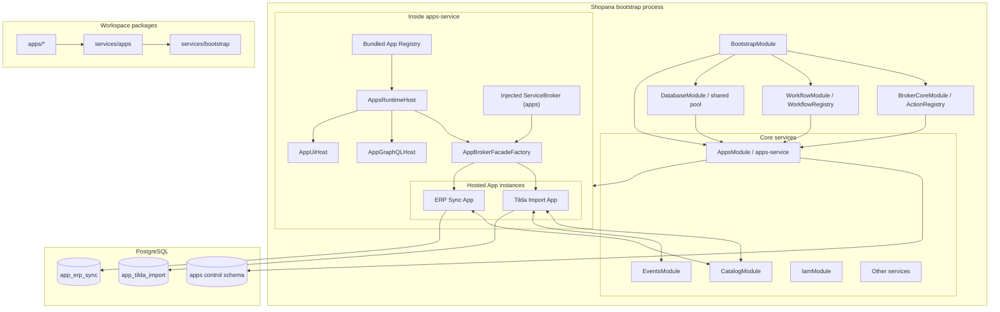
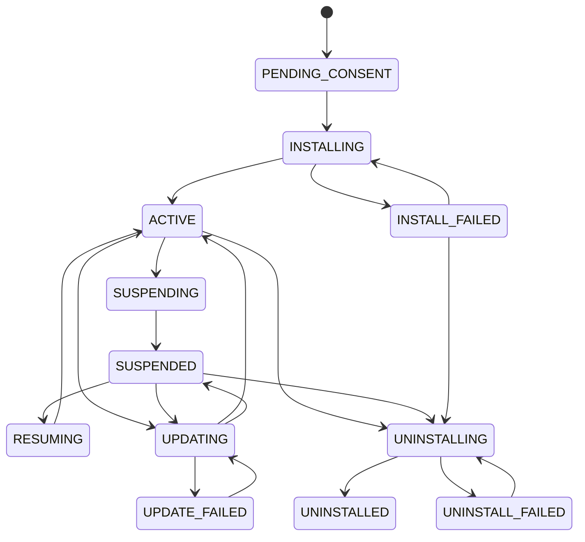

# Архитектура Apps Shopana, размещённых в `apps-service`

Статус: целевой план реализации
Дата: 2026-07-25
Область: `apps/*`, `services/apps`, `services/bootstrap`, service broker,
DBOS, migrations, GraphQL Federation, Admin
Язык документа: русский

## Содержание

1. [Резюме решения](#1-резюме-решения)
2. [Главное архитектурное разграничение](#2-главное-архитектурное-разграничение)
3. [Результаты анализа текущего проекта](#3-результаты-анализа-текущего-проекта)
4. [Термины](#4-термины)
5. [Цели](#5-цели)
6. [Что не входит в целевую модель](#6-что-не-входит-в-целевую-модель)
7. [Архитектурные принципы](#7-архитектурные-принципы)
8. [Целевая архитектура](#8-целевая-архитектура)
9. [Размещение и package model](#9-размещение-и-package-model)
10. [`apps-service` как runtime host](#10-apps-service-как-runtime-host)
11. [Регистрация App и передача broker](#11-регистрация-app-и-передача-broker)
12. [AppBroker facade и App context](#12-appbroker-facade-и-app-context)
13. [App manifest и bundled registry](#13-app-manifest-и-bundled-registry)
14. [Конфигурация App](#14-конфигурация-app)
15. [Runtime lifecycle App instance](#15-runtime-lifecycle-app-instance)
16. [Installation lifecycle](#16-installation-lifecycle)
17. [Модель данных control plane](#17-модель-данных-control-plane)
18. [База данных и миграции App](#18-база-данных-и-миграции-app)
19. [Actions, handlers, workflows и sagas](#19-actions-handlers-workflows-и-sagas)
20. [Capability routing и slots](#20-capability-routing-и-slots)
21. [Events и installation-aware handlers](#21-events-и-installation-aware-handlers)
22. [GraphQL Federation](#22-graphql-federation)
23. [Frontend App в Admin через iframe](#23-frontend-app-в-admin-через-iframe)
24. [IAM и авторизация](#24-iam-и-авторизация)
25. [GraphQL API control plane](#25-graphql-api-control-plane)
26. [Надёжность и idempotency](#26-надёжность-и-idempotency)
27. [Observability и audit](#27-observability-и-audit)
28. [Целевая структура кода](#28-целевая-структура-кода)
29. [Изменения build, CLI и Federation tooling](#29-изменения-build-cli-и-federation-tooling)
30. [Переход от текущей реализации](#30-переход-от-текущей-реализации)
31. [Этапы реализации](#31-этапы-реализации)
32. [Pilot: Tilda Import App](#32-pilot-tilda-import-app)
33. [Проверка реализации](#33-проверка-реализации)
34. [Критерии готовности](#34-критерии-готовности)
35. [Отклонённые альтернативы](#35-отклонённые-альтернативы)
36. [Принятые default decisions](#36-принятые-default-decisions)
37. [Связанные файлы](#37-связанные-файлы)

## 1. Резюме решения

Каждый Shopana App является отдельным App package, но не
подключается напрямую к `services/bootstrap`.

Apps располагаются в отдельной top-level директории:

```text
apps/
├── tilda-import/
├── erp-sync/
└── ...
```

Bootstrap подключает только обычный `AppsModule`:

```text
BootstrapModule
  └── AppsModule
```

`services/apps` является одновременно:

- control plane installations;
- runtime host для bundled Apps;
- владельцем bundled App registry;
- владельцем AppBroker facades;
- владельцем запуска и остановки App instances;
- владельцем App GraphQL и UI hosts;
- маршрутизатором lifecycle, capabilities и events.

При старте `apps-service`:

1. загружает статически собранный registry App definitions;
2. валидирует manifest каждого App;
3. загружает его секцию из `config.services.apps.applications`;
4. создаёт facade над broker service `apps`, привязанный к `appCode`;
5. передаёт этот broker facade и host dependencies App;
6. регистрирует App instance в `AppRuntimeRegistry`;
7. вызывает App hooks регистрации actions, handlers, workflows и sagas;
8. при необходимости запускает для App GraphQL subgraph и Admin UI server;
9. публикует App в runtime catalog.

App не импортируется в `BootstrapModule`, не добавляет Nest module в bootstrap
и не получает broker через `BrokerModule.forFeature()` самостоятельно.

Общий broker runtime всё равно создаётся bootstrap:

```text
Bootstrap
  -> BrokerCoreModule / ActionRegistry / WorkflowRegistry
  -> AppsModule
    -> AppsRuntimeHost
      -> ServiceBroker("apps")
        -> AppBroker facade (appCode="tilda-import")
        -> AppBroker facade (appCode="erp-sync")
```

Каждый App:

- идентифицируется стабильным `appCode`;
- получает broker от `apps-service`;
- регистрирует contracts в namespace `apps.<appCode>.*`;
- может вызывать actions/workflows core services;
- имеет собственный config внутри `config.services.apps.applications`;
- владеет собственной PostgreSQL schema и Catalog-style migrations;
- может предоставлять отдельный Federation subgraph;
- имеет собственный Admin frontend, открываемый через iframe.

Installation остаётся store-scoped control-plane entity. App package и App
runtime instance существуют на уровне deployment, а install/suspend/uninstall
управляют доступностью App для конкретного store.

## 2. Главное архитектурное разграничение

### 2.1. Что знает bootstrap

Bootstrap знает:

- `AppsModule`;
- shared `ActionRegistry`;
- shared `WorkflowRegistry`;
- shared database pool;
- общую platform configuration.

Bootstrap не знает:

- список конкретных Apps;
- package каждого App;
- App manifests;
- App lifecycle contracts;
- App GraphQL schemas;
- App UI assets.

Добавление нового App не изменяет:

- `services/bootstrap/src/bootstrap.module.ts`;
- `services/bootstrap/package.json`;
- список imports bootstrap.

### 2.2. Что знает `apps-service`

`apps-service` знает:

- какие App packages входят в текущий release;
- как создать App instance;
- какой AppBroker facade передать App;
- какой config принадлежит App;
- какие actions/workflows App должен зарегистрировать;
- какие GraphQL/UI surfaces нужно поднять;
- какие installations активны.

Добавление App изменяет registry и dependencies `services/apps`, но не
bootstrap.

### 2.3. Что представляет собой App

App не является самостоятельным Nest application context.

App является hosted component definition:

```typescript
interface ShopanaAppDefinition {
  manifest: AppManifest;
  create(host: AppHostContext): ShopanaApp;
  graphql?: AppGraphQLDefinition;
  adminUi?: AppAdminUiDefinition;
}
```

`apps-service` создаёт и размещает этот component внутри своего runtime.

### 2.4. Два lifecycle

Нужно различать:

1. **Runtime lifecycle** — register/start/stop App instance при старте и
   остановке процесса.
2. **Installation lifecycle** — install/update/suspend/resume/uninstall для
   конкретного store.

Runtime stop не равен tenant uninstall. Tenant uninstall не выгружает App
package и не deregister-ит его глобальные broker contracts.

## 3. Результаты анализа текущего проекта

### 3.1. Bootstrap уже создаёт общий broker runtime

`services/bootstrap/src/bootstrap.module.ts` импортирует:

- `BrokerCoreModule.forRoot()`;
- optional `WorkflowModule.forRoot()`;
- `AppsModule`;
- другие core modules.

`BrokerCoreModule` создаёт общий `ActionRegistry`.
`WorkflowModule` создаёт общий DBOS `WorkflowRegistry`.

Следовательно, `AppsModule` уже находится внутри правильного process и DI
boundary и может размещать Apps без изменений bootstrap.

### 3.2. App должен использовать broker service `apps`

Сейчас `BrokerModule.forFeature({ serviceName })` создаёт broker при построении
Nest module graph.

Hosted App не должен создавать ещё один service broker:

- App находится внутри `apps-service`;
- инфраструктурный caller остаётся `apps`;
- конкретный App определяется trusted `AppExecutionContext.appCode`;
- локальные contracts получают namespace `apps.<appCode>.*`.

Нужен `AppBroker` facade над существующим `@InjectBroker("apps")`. Facade
добавляет App namespace, context и allowlist, но не создаёт новый
`ServiceBroker` и новую service identity.

### 3.3. Текущий `apps-service` уже использует статический registry pattern

`services/apps/src/infrastructure/plugins/registry/index.ts` статически
импортирует plugin packages.

Этот pattern можно сохранить на другом уровне:

- вместо provider plugin registry используется bundled App registry;
- registry содержит App definitions/factories;
- `AppsPluginManager` заменяется `AppsRuntimeHost`;
- App получает broker, config и infrastructure context;
- App регистрирует полноценный service API.

### 3.4. Config допускает App sections

`@shopana/shared-service-config` хранит настройки `apps-service` в
`config.services.apps` и допускает custom fields через Zod `passthrough`.

Поэтому configs Apps хранятся внутри секции `apps`:

```yaml
services:
  apps:
    ports:
      admin_graphql: 10001
      metrics: 3033
    db:
      <<: *db_default
    applications:
      tilda-import:
        enabled: true
        ports:
          admin_graphql: 10101
          admin_ui: 11101
        max_concurrent_imports: 2
```

`appCode` является ключом `applications`. Отдельной service config entry и
отдельного host discriminator нет.

### 3.5. Catalog задаёт migration pattern

`services/catalog` использует:

- Drizzle models как runtime query contract;
- handwritten SQL migrations;
- `migrations/domains/**/*.sql`;
- `node-pg-migrate`;
- собственную PostgreSQL schema;
- собственную migration history.

Каждый App должен получить такой же migration ownership, даже если его runtime
размещён внутри `apps-service`.

### 3.6. Federation tooling сканирует только `services/*`

Текущие schema export и Mesh composition обнаруживают subgraphs через
`services/*/build.config.json`.

После переноса App packages в `apps/*` tooling должен сканировать обе группы:

```text
services/*
apps/*
```

App subgraph запускается `apps-service`, но schema и build metadata принадлежат
App package.

### 3.7. Events сейчас находят handlers по `config.services`

`EventDispatchWorkflow` ищет action:

```text
{serviceName}.{eventType}
```

App handlers не участвуют в этом core lookup. Они регистрируются как
`apps.<appCode>.<eventType>` и разрешаются через installation-aware action
`apps.resolveEventHandlers`.

### 3.8. Admin уже имеет необходимые точки расширения

Существуют:

- route `/system/integrations/apps`;
- module registry;
- catch-all routing;
- `useDynamicSidebarStore`.

Нужно заменить mock Apps data на control-plane GraphQL и добавить generic
iframe App Shell.

## 4. Термины

### 4.1. App

Устанавливаемая на store продуктовая возможность Shopana.

App имеет:

- stable `appCode`;
- hosted implementation;
- manifest;
- broker contracts;
- собственные данные и migrations;
- optional GraphQL;
- optional Admin frontend;
- installations.

### 4.2. App package

Отдельный workspace package в `apps/<code>`.

Он содержит:

- manifest;
- factory;
- runtime implementation;
- actions;
- handlers;
- workflows/sagas;
- repositories/models;
- migrations;
- GraphQL schemas/resolvers;
- Admin frontend.

### 4.3. Hosted App

Runtime instance App, созданный и управляемый `apps-service`.

Он имеет:

- unique `appCode`;
- отдельный config внутри `apps-service`;
- отдельный namespace внутри broker `apps`;
- отдельные actions/workflows;
- собственную DB schema;
- optional subgraph port.

Но он не является direct Nest import bootstrap.

### 4.4. `apps-service`

Shopana core service с `serviceName = "apps"`.

Он является:

- App runtime host;
- App registry owner;
- installation control plane;
- capability router;
- App GraphQL/UI host manager.

### 4.5. App definition

Статическое описание App, импортированное bundled registry:

- manifest;
- factory;
- GraphQL contribution;
- UI contribution;
- build/runtime metadata.

### 4.6. App instance

Один process-wide object, созданный из definition.

Один instance обслуживает installations всех stores. Tenant state всегда
разделяется по `installationId`.

### 4.7. App installation

Активация App для конкретного store.

Installation имеет:

- identity;
- status;
- configuration;
- scopes;
- secrets;
- capability bindings;
- event subscriptions;
- UI extensions;
- lifecycle history.

### 4.8. App broker

Ограниченный facade над `ServiceBroker` service `apps`, созданный
`apps-service` для конкретного `appCode`.

Local action `startImport` App `tilda-import` регистрируется как:

```text
apps.tilda-import.startImport
```

При вызове core service:

```text
caller.service = apps
context.app.appCode = tilda-import
```

### 4.9. Deployment config

Environment-level config App в
`config.services.apps.applications[appCode]`.

Он одинаков для всех installations данного процесса.

### 4.10. Installation config

Store-specific configuration, которой владеет `apps-service`.

### 4.11. Capability

Типизированная возможность App, вызываемая платформой через
`apps.executeCapability`.

### 4.12. UI extension

Декларативный navigation/page entry App в основном Admin.

## 5. Цели

1. Хранить Apps отдельно от core services в top-level `apps/*`.
2. Не изменять bootstrap при добавлении нового App.
3. Размещать все Apps через `services/apps`.
4. Передавать каждому App broker facade из `apps-service`.
5. Дать каждому App отдельный namespace `apps.<appCode>.*`.
6. Разрешить App регистрировать actions, handlers, workflows и sagas.
7. Разрешить App вызывать core broker contracts.
8. Дать App отдельный config внутри
   `config.services.apps.applications[appCode]`.
9. Дать App собственную PostgreSQL schema и Catalog-style migrations.
10. Разрешить App публиковать Federation GraphQL.
11. Дать App собственный iframe frontend.
12. Оставить lifecycle installations в `apps-service`.
13. Сделать capability и event routing installation-aware.
14. Сделать добавление App повторяемым и изолированным от bootstrap.

## 6. Что не входит в целевую модель

- direct App import в `BootstrapModule`;
- App dependency в `services/bootstrap/package.json`;
- отдельный Nest application context на App;
- отдельный OS process или deployment App;
- dynamic npm install по запросу tenant;
- arbitrary third-party code loading;
- remote HTTP transport между `apps-service` и backend App;
- OAuth `client_credentials` между App и core services;
- tenant-specific supergraph;
- загрузка App React code в основной Admin tree;
- per-store DB/schema;
- backward compatibility со старым `InstalledApp = Slot`;
- backfill старой plugin model.

## 7. Архитектурные принципы

### 7.1. Bootstrap зависит только от App host

Bootstrap composition root включает `AppsModule` один раз. Конкретные Apps
являются внутренними dependencies `apps-service`.

### 7.2. Apps находятся вне `services/*`

`services/*` содержит platform services.
`apps/*` содержит hosted App packages.

Это разделяет:

- platform ownership;
- App ownership;
- tooling classification;
- App lifecycle;
- package dependencies.

### 7.3. Registry статический, activation динамическая

Bundled App packages известны при build. Tenant installations создаются
runtime.

### 7.4. `apps-service` передаёт App broker

App не создаёт broker самостоятельно и не получает доступ к raw registries.
Host выдаёт facade с заранее определённым `appCode` и namespace.

### 7.5. Один App — один вложенный broker namespace

Все App contracts принадлежат broker service `apps`, но разделены по
`appCode`.

Используются namespaces:

```text
apps.*                    control-plane contracts apps-service
apps.tilda-import.*       Tilda App contracts
apps.erp-sync.*           ERP App contracts
```

App получает только локальные имена contracts. `AppBroker` добавляет prefix
`apps.<appCode>.` и не позволяет App регистрироваться вне своего namespace.

### 7.6. App не является Nest module bootstrap

App SDK использует explicit runtime registration hooks. Нельзя зависеть от
Nest `onModuleInit` App provider, который не находится в Nest graph.

### 7.7. Installation не управляет App instance

Install/suspend/uninstall меняют tenant routing, но process-wide App instance
остаётся зарегистрированным.

### 7.8. App владеет данными

App использует собственную PostgreSQL schema и не импортирует repositories
core services.

### 7.9. Federation принадлежит App, hosting принадлежит `apps-service`

SDL/resolvers находятся в App package. Server lifecycle и broker/context
integration предоставляет host.

### 7.10. Trusted code only

Apps выполняются в общем процессе. Они являются first-party или проверенным
trusted code.

## 8. Целевая архитектура



Dependency direction:

```text
services/bootstrap
  -> services/apps
    -> apps/tilda-import
    -> apps/erp-sync
```

Запрещённое направление:

```text
services/bootstrap
  -> apps/tilda-import
```

## 9. Размещение и package model

### 9.1. Workspace

В root `package.json` добавляется:

```json
{
  "workspaces": [
    "packages/*",
    "packages/shopana/*",
    "services/*",
    "apps/*",
    "apps/*/admin",
    "infra/federation",
    "workflows"
  ]
}
```

### 9.2. App directory

```text
apps/tilda-import/
├── app.manifest.ts
├── build.config.json
├── package.json
├── tsconfig.json
├── migrations/
│   └── domains/
├── src/
│   ├── index.ts
│   ├── TildaImportApp.ts
│   ├── actions/
│   ├── handlers/
│   ├── workflows/
│   ├── sagas/
│   ├── scripts/
│   ├── repositories/
│   └── graphql/
└── admin/
    ├── package.json
    ├── src/
    └── dist/
```

### 9.3. Package export

App package экспортирует definition:

```typescript
export default defineApp({
  manifest: tildaImportManifest,
  create: (host) => new TildaImportApp(host),
  graphql: tildaImportGraphQL,
  adminUi: tildaImportAdminUi,
});
```

App package не экспортирует Nest module для bootstrap.

### 9.4. Package dependency

`services/apps/package.json` содержит:

```json
{
  "dependencies": {
    "@shopana/app-tilda-import": "workspace:*"
  }
}
```

`services/bootstrap/package.json` зависит только от:

```text
@shopana/apps-service
```

### 9.5. Naming

Для одного App:

```text
directory:       apps/tilda-import
package:         @shopana/app-tilda-import
appCode:         tilda-import
broker service:  apps
broker namespace: apps.tilda-import
config path:     services.apps.applications.tilda-import
DB schema:       app_tilda_import
subgraph name:   apps-tilda-import-admin
```

## 10. `apps-service` как runtime host

### 10.1. Responsibilities

`AppsRuntimeHost` отвечает за:

- чтение bundled registry;
- manifest validation;
- App config resolution;
- AppBroker facade creation;
- App instance creation;
- actions/handlers/workflows registration;
- GraphQL host creation;
- UI host creation;
- runtime health;
- graceful shutdown.

### 10.2. Не является dynamic package loader

Host не:

- сканирует arbitrary node_modules;
- устанавливает packages;
- выполняет tenant-provided paths;
- импортирует URL;
- меняет registry без platform build.

Registry является compile-time code.

### 10.3. Host dependencies

`AppsRuntimeHost` получает через Nest DI:

- `ActionRegistry`;
- `WorkflowRegistry`;
- `DatabaseClient`;
- `ServiceConfig`;
- logger factory;
- secret resolver;
- runtime registry storage;
- GraphQL/UI server factories.

### 10.4. Host startup

Startup выполняется в `OnApplicationBootstrap`, когда shared infrastructure
уже готова:

1. validate registry;
2. resolve App config;
3. create AppBroker facade над broker `apps`;
4. build `AppHostContext`;
5. create App instance;
6. call `register()`;
7. validate registered contracts;
8. start App instance;
9. start GraphQL/UI surfaces;
10. mark App runtime ready.

`apps-service` control-plane GraphQL readiness не публикуется до завершения
регистрации всех enabled Apps.

### 10.5. Host shutdown

В обратном порядке:

1. прекратить новые App invocations;
2. закрыть UI/GraphQL servers;
3. вызвать `app.stop()`;
4. дождаться in-flight calls в пределах timeout;
5. deregister App actions/workflows;
6. закрыть App-owned resources;
7. не закрывать shared database pool.

## 11. Регистрация App и передача broker

### 11.1. Bundled registry

Целевой файл:

```text
services/apps/src/runtime/bundled-apps.ts
```

Пример:

```typescript
import tildaImport from "@shopana/app-tilda-import";
import erpSync from "@shopana/app-erp-sync";

export const bundledApps = [
  tildaImport,
  erpSync,
] satisfies readonly ShopanaAppDefinition[];
```

### 11.2. Registration flow

```typescript
for (const definition of bundledApps) {
  const appCode = definition.manifest.code;
  const config = resolveAppConfig(appsServiceConfig, appCode);
  const broker = appBrokerFacadeFactory.create({
    appCode,
    broker: appsBroker,
  });

  const app = definition.create({
    broker,
    config,
    databaseClient,
    logger: loggerFactory.create({ service: "apps", appCode }),
    installations: installationContextProvider,
    secrets: appSecretResolver.scope(appCode),
  });

  const runtimeApp = appRuntimeRegistry.register({
    definition,
    app,
    broker,
  });

  await runtimeApp.register();
  await runtimeApp.start();
}
```

### 11.3. App host context

```typescript
interface AppHostContext {
  readonly broker: AppBroker;
  readonly config: AppDeploymentConfig;
  readonly databaseClient: DatabaseClient;
  readonly logger: Logger;
  readonly installations: AppInstallationContextProvider;
  readonly secrets: AppSecretResolver;
}
```

Broker передаётся как готовый facade над broker service `apps`, привязанный к
`appCode`.

App не получает:

- raw `ActionRegistry`;
- возможность создать произвольную caller identity;
- config другого App;
- secrets другой installation;
- Nest application context.

### 11.4. Registration API

App SDK предоставляет explicit APIs:

```typescript
interface ShopanaApp {
  register(): Promise<void> | void;
  start(): Promise<void> | void;
  stop(): Promise<void> | void;
  health(): Promise<AppRuntimeHealth>;
}
```

В `register()` App:

- вызывает `broker.register()` для actions;
- регистрирует decorated handlers через App SDK;
- регистрирует workflows/sagas через AppBroker registrar;
- не выполняет tenant provisioning.

### 11.5. Registration rollback

Если registration/start одного App завершается ошибкой:

- его уже зарегистрированные contracts удаляются;
- его servers закрываются;
- runtime state помечается `FAILED`;
- bootstrap readiness по умолчанию завершается ошибкой;
- optional App может быть пропущен только при явной deployment policy.

Silent partial registration запрещена.

## 12. AppBroker facade и App context

### 12.1. Использовать broker service `apps`

У Apps нет отдельных broker service identities. `AppsModule` получает
существующий `ServiceBroker` через `@InjectBroker("apps")`, а
`AppsRuntimeHost` создаёт для каждого App ограниченный `AppBroker` facade.

Все исходящие вызовы App выполняются от имени service `apps`. Различение Apps
обеспечивают:

- namespace `apps.<appCode>.*` для зарегистрированных contracts;
- trusted `AppExecutionContext.appCode` для вызовов;
- `installationId`, `storeId` и granted scopes для tenant operations;
- App runtime registry для health и cleanup.

### 12.2. `AppBrokerFacadeFactory`

`AppBroker` является shared contract в App SDK, а
`AppBrokerFacadeFactory` — внутренней реализацией `services/apps`:

```typescript
interface AppBrokerFacadeFactory {
  create(input: {
    appCode: string;
    broker: ServiceBroker;
  }): AppBroker;
  release(appCode: string): Promise<void>;
}
```

`AppBroker` предоставляет App broker-oriented API:

```typescript
interface AppBroker {
  register(action: string, handler: ActionHandler): void;
  registerWorkflow(name: string, workflow: AppWorkflow): void;
  registerSaga(name: string, saga: AppSaga): void;
  call<TResult>(qualifiedAction: string, input: unknown): Promise<TResult>;
  runWorkflow<TResult>(
    qualifiedWorkflow: string,
    input: unknown,
    idempotency: IdempotencyContext,
  ): Promise<TResult>;
}
```

Factory не создаёт новый `ServiceBroker`. Она:

- использует broker service `apps`;
- добавляет namespace `apps.<appCode>.`;
- запрещает регистрацию fully-qualified имен и выход из App namespace;
- добавляет trusted App context к исходящим вызовам;
- применяет manifest allowlists;
- отслеживает зарегистрированные actions/workflows и in-flight calls App;
- поддерживает cleanup одного App без остановки broker `apps`.

`BrokerModule.forFeature()` не изменяется: отдельный feature broker для App не
создаётся.

Текущий shared kernel требует расширения: registration actions/workflows
должна возвращать host-owned cleanup handle либо принимать registration owner
`appCode`. Это позволяет удалить только `apps.<appCode>.*`, не вызывая
`ServiceBroker.onModuleDestroy()` для общего broker `apps`.

### 12.3. Qualification

App регистрирует:

```typescript
broker.register("startImport", handler);
```

Registry получает:

```text
apps.tilda-import.startImport
```

App вызывает core:

```typescript
await broker.call("catalog.catalogQuery", input);
```

Downstream получает:

```typescript
context.caller.service === "apps"
context.app.appCode === "tilda-import"
```

### 12.4. App execution context

Service identity не определяет tenant. Нужен trusted installation context:

```typescript
interface AppExecutionContext {
  appCode: string;
  installationId: string;
  organizationId: string;
  storeId: string;
  appVersion: string;
  grantedScopes: readonly string[];
  actor?: {
    type: "USER" | "SERVICE" | "EVENT" | "SYSTEM";
    id?: string;
  };
}
```

Context распространяется через AsyncLocalStorage и добавляется в trusted
`BrokerCallContext`.

Для этого `BrokerCallContext` расширяется optional полем `app`, а
`ServiceBroker` при создании call context читает только host-owned context
accessor. App input не сливается с trusted context. При вложенных core calls
App provenance сохраняется отдельно от непосредственного
`caller.service`.

### 12.5. Context creation

Создавать App context может только:

- `apps-service` lifecycle/capability router;
- App GraphQL host после проверки request/store/installation;
- Events service после target resolution;
- App scheduler через installation provider.

App input не может задавать trusted context.

### 12.6. Reserved namespaces

App не задаёт broker service name. Manifest задаёт только `appCode`.

`appCode`:

- уникален внутри bundled registry;
- соответствует directory/config key;
- не содержит точку;
- не может занимать зарезервированные host namespaces;
- используется host для построения `apps.<appCode>.*`.

## 13. App manifest и bundled registry

### 13.1. Manifest

```typescript
export const tildaImportManifest = defineAppManifest({
  schemaVersion: 1,
  code: "tilda-import",
  version: "0.1.0",
  displayName: "Tilda Import",
  description: "Импорт каталога из Tilda",
  lifecycle: {
    installWorkflow: "install",
    updateWorkflow: "update",
    suspendAction: "suspend",
    resumeAction: "resume",
    uninstallWorkflow: "uninstall",
    healthAction: "health",
  },
  permissions: [
    "catalog.products:read",
    "catalog.products:write",
    "catalog.categories:read",
    "media.files:write",
  ],
  capabilities: [
    {
      key: "import",
      operations: {
        start: "startImport",
        status: "getImportStatus",
        cancel: "cancelImport",
      },
    },
  ],
  events: [
    {
      type: "productUpdated",
      version: 1,
      handler: "productUpdated",
    },
  ],
  graphql: {
    admin: true,
    storefront: false,
  },
  adminUi: {
    entryPath: "/embedded",
    extensions: [
      {
        key: "imports",
        type: "NAVIGATION",
        location: "APPS",
        label: "Tilda imports",
        path: "/imports",
        order: 100,
      },
    ],
  },
});
```

### 13.2. Source of truth

Runtime catalog available Apps строится из bundled registry.

Control-plane database не позволяет создать arbitrary App definition через
GraphQL. Она хранит:

- installations;
- manifest snapshots;
- lifecycle state;
- runtime health projection.

### 13.3. Validation

До App start проверяются:

- manifest schema version;
- SemVer;
- unique `code`;
- package/directory naming;
- config entry в `services.apps.applications`;
- lifecycle contracts;
- capabilities;
- permissions;
- event versions;
- UI paths;
- GraphQL ports.

После `register()` дополнительно проверяется:

- все manifest actions существуют;
- все workflows существуют;
- все event handlers существуют;
- нет undeclared externally routable contracts;
- broker health соответствует definition.

### 13.4. Manifest snapshot

При install/update `apps-service` сохраняет canonical manifest snapshot и hash.

### 13.5. Registry generation

В первой версии registry может редактироваться явно.

Позже `shopana app create` может:

- добавить workspace dependency в `services/apps`;
- добавить import в bundled registry;
- обновить generated metadata.

Runtime filesystem auto-import не используется.

## 14. Конфигурация App

### 14.1. Config location

Каждый App имеет entry внутри configuration `apps-service`:

```yaml
services:
  apps:
    ports:
      admin_graphql: 10001
      metrics: 3033
    db:
      <<: *db_default
    applications:
      tilda-import:
        enabled: true
        required: true
        ports:
          admin_graphql: 10101
          admin_ui: 11101
        public_ui_origin: http://localhost:11101
        max_concurrent_imports: 2
        source_download_timeout_ms: 30000
```

### 14.2. Config ownership

`apps-service` вызывает:

```typescript
const appsConfig = getServiceConfig("apps");
const appConfig = appsConfig.service.applications[manifest.code];
```

и передаёт `appConfig` App.

App package не выбирает произвольный config key.

### 14.3. Configuration boundary

В `config.services` существует только service entry `apps`. Entries из
`services.apps.applications` не участвуют в bootstrap service discovery и не
создают broker services.

`apps-service`:

- сопоставляет `manifest.code` с ключом `applications`;
- валидирует App config собственной схемой manifest/definition;
- передаёт App только его секцию;
- использует её для GraphQL/UI host и runtime limits.

### 14.4. `enabled` и `required`

- `enabled: false` — App не регистрируется и не принимает installations;
- `required: true` — registration failure блокирует platform readiness;
- `required: false` — App может перейти в runtime `FAILED`, остальные Apps
  продолжают работать.

Для production first-party Apps рекомендуется `required: true`.

### 14.5. Deployment config не является installation config

Deployment config:

- ports;
- origins;
- resource limits;
- shared upstream settings.

Installation config:

- store-specific credentials;
- mapping rules;
- feature choices;
- tenant settings.

## 15. Runtime lifecycle App instance

### 15.1. States

```text
DISCOVERED
  -> REGISTERING
  -> REGISTERED
  -> STARTING
  -> READY
  -> STOPPING
  -> STOPPED

REGISTERING/STARTING
  -> FAILED
```

Runtime state не хранится как installation status.

### 15.2. `register()`

Разрешено:

- actions registration;
- handlers registration;
- workflows/sagas registration;
- repository construction;
- GraphQL resolver creation.

Запрещено:

- создавать store installation;
- применять migrations;
- вызывать tenant business operation;
- читать secrets без installation context.

### 15.3. `start()`

Разрешено:

- проверить App DB schema;
- создать App-owned schedulers;
- открыть App-owned non-GraphQL resources;
- сообщить health.

GraphQL/UI servers предпочтительно создаёт host, а не сам App, чтобы
унифицировать context, logging и shutdown.

### 15.4. `stop()`

App закрывает только собственные resources.
Shared broker registries и database pool освобождает host/bootstrap.

## 16. Installation lifecycle

### 16.1. Ownership

`apps-service` владеет orchestration.
App владеет App-specific install/update/uninstall logic.

### 16.2. Install

1. Admin запрашивает definition и permissions.
2. Пользователь подтверждает consent.
3. Control plane создаёт installation в `INSTALLING`.
4. Сохраняется manifest snapshot.
5. `apps-service` создаёт trusted App execution context.
6. Через `AppBroker` facade запускается:

```text
apps.tilda-import.install
```

7. App создаёт tenant rows в своей schema.
8. App может вызвать core services через broker.
9. Control plane создаёт slots, subscriptions и extensions.
10. Installation становится `ACTIVE`.

### 16.3. Install workflow input

```typescript
interface AppInstallInput {
  installationId: string;
  organizationId: string;
  storeId: string;
  version: string;
  configuration: Record<string, unknown>;
  grantedScopes: readonly string[];
}
```

Target `appCode` и lifecycle contract не принимаются от GraphQL caller. Они
разрешаются bundled registry по installation.

### 16.4. Suspend

1. отключить новые UI sessions;
2. отключить capability routes;
3. pause event subscriptions;
4. вызвать App suspend action;
5. перевести installation в `SUSPENDED`.

App instance остаётся `READY`.

### 16.5. Resume

1. проверить App runtime health;
2. проверить config;
3. вызвать resume;
4. активировать routes/subscriptions;
5. вернуть `ACTIVE`.

### 16.6. Update

App version меняется вместе с platform build.

Schema migrations применяются до запуска нового кода. После старта нового
runtime `apps-service` обновляет installations:

1. сравнивает manifest snapshots;
2. запрашивает новый consent при scope expansion;
3. запускает App update workflow;
4. обновляет tenant data/config;
5. пересоздаёт bindings/subscriptions/extensions;
6. сохраняет новый snapshot;
7. обновляет installed version.

### 16.7. Uninstall

1. installation становится `UNINSTALLING`;
2. UI/events/capabilities блокируются сразу;
3. отзываются sessions/secrets;
4. запускается App uninstall workflow;
5. App очищает tenant-owned data;
6. control plane удаляет active bindings;
7. installation становится `UNINSTALLED`.

App instance остаётся зарегистрированным для других stores.

### 16.8. Idempotency

Все lifecycle workflows используют stable identity:

```text
installationId + operation + targetVersion
```

## 17. Модель данных control plane

### 17.1. `app_installations`

| Поле | Описание |
|---|---|
| `id` | UUIDv7 |
| `app_code` | Stable App code |
| `organization_id` | Organization |
| `store_id` | Store |
| `status` | Installation state |
| `installed_version` | Applied App version |
| `target_version` | Current lifecycle target |
| `manifest_hash` | Installed manifest hash |
| `configuration` | Non-secret installation config |
| `configuration_version` | Optimistic lock |
| `installed_by_user_id` | Initiator |
| `health_status` | Installation health |
| timestamps | Lifecycle/audit timestamps |

Одна non-terminal installation одного App на store.

### 17.2. State machine



### 17.3. Supporting tables

- `app_installation_manifest_snapshots`;
- `app_installation_scopes`;
- `app_installation_secrets`;
- `app_installation_extensions`;
- `app_event_subscriptions`;
- `app_lifecycle_operations`;
- `app_launch_sessions`.

### 17.4. Runtime definitions

App definitions не дублируются как editable DB catalog. Runtime registry
является source of truth. Для diagnostics можно хранить read-only runtime
projection:

- code;
- version;
- broker namespace;
- manifest hash;
- runtime status;
- last startup error.

### 17.5. Slots

Slot перестаёт быть installation.

Slot хранит:

- installation id;
- capability;
- operation contract;
- target App code;
- target action;
- status.

Target всегда разрешён из manifest, а не из user input.

## 18. База данных и миграции App

### 18.1. App schema

Каждый App владеет schema:

```text
app_<normalized_code>
```

Пример:

```text
app_tilda_import
```

### 18.2. Shared database client

`AppsRuntimeHost` получает shared `DATABASE_CLIENT` через Nest DI и передаёт
его App.

App создаёт собственный Drizzle database:

```typescript
drizzle(databaseClient, { schema: appSchema });
```

App не закрывает shared client.

### 18.3. Catalog-style migrations

```text
apps/tilda-import/migrations/
└── domains/
    ├── 0000_foundation/
    │   ├── 0000_foundation__schema.sql
    │   └── 0001_foundation__types.sql
    ├── 0100_installation/
    │   └── 0100_installation__tables.sql
    └── 0200_import/
        ├── 0200_import__sources.sql
        └── 0201_import__jobs.sql
```

Правила:

- handwritten PostgreSQL SQL;
- `node-pg-migrate`;
- `migrations/domains/**/*.sql`;
- отдельная `app_tilda_import.pgmigrations`;
- forward-only;
- no backfills;
- UUIDv7;
- `store_id` не включается в PK/FK.

### 18.4. App build config

```json
{
  "kind": "app",
  "appCode": "tilda-import",
  "entryPoint": "src/index.ts",
  "outFile": "dist/index.js",
  "migrations": {
    "path": "dist/migrations",
    "type": "node-pg-migrate",
    "schema": "app_tilda_import",
    "table": "pgmigrations"
  },
  "assets": [
    {
      "include": "migrations/**/*",
      "outDir": "dist/migrations"
    }
  ]
}
```

### 18.5. Migration command

```text
shopana migrate --app tilda-import
```

CLI находит App по `appCode` в `apps/*` и не трактует его как service из
`services/*`.

### 18.6. Install не применяет migrations

Migrations являются deployment operation.
Tenant install создаёт rows в уже мигрированной schema.

## 19. Actions, handlers, workflows и sagas

### 19.1. App SDK registration

Поскольку App не является Nest provider, существующие `OnModuleInit` base
classes нельзя использовать неявно.

`@shopana/app-sdk` предоставляет explicit registrars:

```typescript
class TildaImportApp implements ShopanaApp {
  constructor(private readonly host: AppHostContext) {}

  register() {
    registerAppActions(this.host.broker, new TildaImportActions(this.host));
    registerAppHandlers(this.host.broker, new TildaImportHandlers(this.host));
    registerAppWorkflows(this.host.broker, [
      new TildaImportInstallWorkflow(this.host.broker),
      new TildaImportRunWorkflow(this.host.broker),
    ]);
  }
}
```

### 19.2. Actions

Actions регистрируются через переданный broker и автоматически получают App
namespace.

### 19.3. Handlers

Handlers регистрируются как broker actions с retry metadata, совместимой с
Events service.

### 19.4. Workflows

Workflow и saga регистрируются через App SDK registrar, который использует
переданный `AppBroker` и квалифицирует local name как
`apps.<appCode>.<name>`.

Текущие `BrokerWorkflows`/`BaseWorkflow` нельзя использовать без адаптера:
они квалифицируют имя только по service name. `AppWorkflowRegistrar` передаёт
полный App namespace в DBOS registry и возвращает cleanup handle host-у. Raw
`WorkflowRegistry` App не получает.

### 19.5. Sagas

App sagas используют тот же DBOS runtime и могут вызывать core actions.

### 19.6. Calling core services

App не импортирует core scripts/repositories.

Допустимо:

```typescript
await broker.call("catalog.catalogQuery", input);
await broker.call("media.createFile", input);
await broker.runWorkflow("catalog.updateProduct", input, idempotency);
```

### 19.7. Registration cleanup

Host должен знать contracts, зарегистрированные каждым App, чтобы удалить
только их при stop/failure.

## 20. Capability routing и slots

### 20.1. Invocation

Core caller использует control-plane contract:

```typescript
await broker.call("apps.executeCapability", {
  storeId,
  capability: "import",
  operation: "start",
  input,
});
```

### 20.2. Resolution

`apps-service`:

1. находит installation/assignment;
2. проверяет `ACTIVE`;
3. находит manifest capability;
4. получает target action;
5. создаёт App execution context;
6. получает `AppBroker` facade нужного `appCode` и вызывает local target;
7. нормализует result/error.

### 20.3. No arbitrary target

Caller не передаёт:

- App code;
- action;
- workflow;
- URL.

### 20.4. Typed contracts

Shared capability contracts:

```text
packages/app-contracts/
├── import/
├── shipping/
├── payment/
├── pricing/
└── notifications/
```

### 20.5. Multi-capability

Одна installation может иметь несколько slots, связанных с одним hosted App
instance.

## 21. Events и installation-aware handlers

### 21.1. Canonical store context

Event envelope должен содержать `storeId` в trusted context.

### 21.2. Core и App handlers

Events разделяет resolution:

- core handlers — существующий discovery top-level entries
  `config.services`;
- App handlers — через `apps.resolveEventHandlers`.

App config вложен в `config.services.apps.applications`, поэтому не является
отдельным service entry и не попадает в core discovery. Это исключает direct
delivery в обход installation-aware resolver.

### 21.3. Resolution call

```typescript
await broker.call("apps.resolveEventHandlers", {
  eventType,
  eventVersion,
  organizationId,
  storeId,
});
```

Возвращаются:

```typescript
interface AppEventTarget {
  installationId: string;
  appCode: string;
  handlerAction: string;
  retryPolicy: RetryPolicy;
}
```

### 21.4. Delivery job

`event_handler_jobs` хранит:

- installation id;
- app code;
- handler action;
- event version;
- retry state.

### 21.5. Status recheck

Перед retry:

- `ACTIVE` — доставить;
- `SUSPENDED` — pause;
- `UNINSTALLING/UNINSTALLED` — cancel.

### 21.6. Invocation

Events вызывает registered action:

```text
apps.tilda-import.productUpdated
```

с trusted App execution context.

### 21.7. At-least-once

App дедуплицирует по:

```text
installationId + eventId
```

## 22. GraphQL Federation

### 22.1. Ownership split

App package владеет:

- SDL;
- resolvers;
- generated types;
- schema-specific context requirements.

`apps-service` владеет:

- Apollo/Fastify server creation;
- broker injection;
- installation context;
- ports;
- lifecycle/shutdown;
- health.

### 22.2. App GraphQL definition

```typescript
interface AppGraphQLDefinition {
  admin?: {
    schemaPatterns: readonly string[];
    createResolvers(host: AppGraphQLHostContext): Resolvers;
  };
  storefront?: {
    schemaPatterns: readonly string[];
    createResolvers(host: AppGraphQLHostContext): Resolvers;
  };
}
```

### 22.3. Separate subgraph

Для каждого App с GraphQL `AppsRuntimeHost` запускает отдельный subgraph server
на port App config:

```yaml
services:
  apps:
    applications:
      tilda-import:
        ports:
          admin_graphql: 10101
```

Endpoint:

```text
http://localhost:10101/graphql
```

Это отдельный Federation subgraph, хотя его server lifecycle размещён внутри
`apps-service`.

### 22.4. Build config

```json
{
  "graphql": {
    "admin": [
      "src/graphql/admin/schema/**/*.graphql",
      "../../packages/shared-references/graphql/**/*.graphql"
    ]
  }
}
```

### 22.5. Tooling discovery

Schema exporter и Mesh composition сканируют:

```text
services/*
apps/*
```

Для App:

- subgraph name детерминированно строится из `appCode`;
- port берётся из
  `config.services.apps.applications[appCode].ports`;
- schema берётся из App package;
- runtime endpoint предоставляет `apps-service`.

### 22.6. Static schema

Subgraph входит в platform supergraph при build.
Install/uninstall не меняет schema composition.

### 22.7. Runtime guard

Resolver:

1. получает verified store context;
2. находит active installation;
3. создаёт App execution context;
4. проверяет user/scopes;
5. вызывает App logic.

### 22.8. Type naming

App-owned types используют App prefix:

```text
TildaImportJob
TildaImportSource
```

## 23. Frontend App в Admin через iframe

### 23.1. Source ownership

```text
apps/tilda-import/admin/
```

Frontend имеет собственный package/build и не входит в основной Admin bundle.

### 23.2. Hosting

App definition предоставляет UI assets metadata.
`AppUiHost` внутри `apps-service` обслуживает assets на App-specific port или
validated origin.

```yaml
services:
  apps:
    applications:
      tilda-import:
        ports:
          admin_ui: 11101
        public_ui_origin: http://localhost:11101
```

### 23.3. Generic App Shell

Основной Admin route:

```text
/:orgName/:storeName/apps/:appCode/:extensionPath*
```

Shell:

1. получает installation/extension;
2. создаёт launch session;
3. загружает iframe;
4. выполняет bridge handshake;
5. передаёт route/theme/locale;
6. показывает App errors.

### 23.4. Launch session

`apps-service` создаёт one-time short-lived launch code, связанный с:

- installation;
- user;
- store;
- extension/path;
- exact origin;
- nonce.

Admin bearer token не передаётся в iframe URL.

### 23.5. Sandbox

```html
<iframe
  sandbox="allow-scripts allow-forms allow-same-origin"
  referrerpolicy="no-referrer"
/>
```

Iframe origin отличается от Admin origin.

### 23.6. App Bridge

Разрешённые operations:

- `READY`;
- `INIT`;
- `NAVIGATE`;
- `RESIZE`;
- `SET_TITLE`;
- `SHOW_TOAST`;
- `OPEN_CONFIRM`;
- theme/locale updates.

Messages versioned, schema-validated и проверяют exact origin.

### 23.7. Dynamic navigation

`apps-service` возвращает active UI extensions.
Admin загружает их в `useDynamicSidebarStore`.

Sidebar ведёт в App Shell, а не прямо на внешний origin.

## 24. IAM и авторизация

### 24.1. Backend identity

App backend не использует OAuth token для in-process calls.

Identity:

```text
caller.service = apps
app.appCode = tilda-import
app.installationId = ...
app.storeId = ...
```

`caller.service` определяет доверенный platform service. `app.appCode`
определяет конкретный App внутри `apps-service`.

### 24.2. Effective permissions

Для user operation:

```text
manifest requested scopes
∩ installation granted scopes
∩ current user RBAC
∩ current store
```

### 24.3. Core action enforcement

Core broker action проверяет:

- trusted caller;
- App execution context;
- installation/store;
- scope;
- resource policy.

### 24.4. App entrypoint guard

Каждый tenant entrypoint проверяет:

- runtime App `READY`;
- installation state;
- App code/installation match;
- organization/store;
- required scopes;
- manifest declaration.

### 24.5. Trusted-code boundary

AppBroker facade и permissions не создают process sandbox.
Bundled Apps проходят repository code review.

## 25. GraphQL API control plane

### 25.1. Definitions

Available Apps возвращаются из bundled runtime registry:

```graphql
type AppDefinition {
  code: String!
  version: String!
  displayName: String!
  runtimeStatus: AppRuntimeStatus!
  permissions: [AppPermission!]!
  capabilities: [AppCapability!]!
  installed: Boolean!
  installation: AppInstallation
}
```

### 25.2. Installations

```graphql
type AppInstallation {
  id: ID!
  appCode: String!
  version: String!
  targetVersion: String
  status: AppInstallationStatus!
  healthStatus: AppHealthStatus!
  configurationVersion: Int!
  scopes: [AppInstallationScope!]!
  capabilities: [AppCapabilityBinding!]!
  extensions: [AppUiExtension!]!
  createdAt: DateTime!
  updatedAt: DateTime!
}
```

### 25.3. Queries

- available Apps;
- runtime health;
- installed Apps;
- installation;
- lifecycle operation;
- install/update preview;
- UI extensions.

### 25.4. Mutations

- install prepare/confirm;
- update prepare/confirm;
- suspend;
- resume;
- configure;
- retry;
- uninstall;
- launch create.

### 25.5. Payloads

Boolean mutations заменяются payload + `userErrors`.

## 26. Надёжность и idempotency

### 26.1. Shared failure domain

Все Apps работают в процессе bootstrap внутри `apps-service`.

App может повлиять на platform process через:

- unhandled error;
- CPU starvation;
- memory leak;
- resource leak.

Поэтому:

- only trusted Apps;
- тяжёлые операции через DBOS;
- I/O timeout;
- queue concurrency;
- runtime health;
- registration rollback.

### 26.2. Runtime isolation

App имеет отдельные:

- broker namespace и facade;
- config;
- logger;
- DB schema;
- servers;
- health state.

Но не имеет OS/process isolation.

### 26.3. Lifecycle idempotency

Stable key:

```text
organizationId + installationId + operation + targetVersion
```

### 26.4. Event idempotency

```text
installationId + eventId
```

### 26.5. Capability idempotency

Side-effect contracts требуют domain idempotency key.

### 26.6. Retry ownership

- lifecycle — `apps-service`;
- App workflow — App;
- event delivery — Events;
- upstream I/O — workflow step.

## 27. Observability и audit

### 27.1. Runtime health

Для каждого bundled App:

- runtime status;
- version;
- broker health;
- registered actions/workflows;
- GraphQL/UI server health;
- DB schema health;
- last startup error.

### 27.2. Structured context

- app code;
- version;
- installation id;
- organization/store;
- action/workflow/event;
- request/correlation id.

### 27.3. Metrics

Host:

- registration/start duration;
- runtime failures;
- App servers;
- in-flight calls.

Control plane:

- installations by state;
- lifecycle duration;
- version drift;
- launch failures.

App:

- action/workflow latency;
- queue depth;
- dependency errors.

### 27.4. Audit

- runtime registered/failed;
- installation lifecycle;
- permissions/config changes;
- launch sessions;
- capability invocation metadata.

Secrets не логируются.

## 28. Целевая структура кода

### 28.1. Top-level Apps

```text
apps/
├── tilda-import/
│   ├── app.manifest.ts
│   ├── build.config.json
│   ├── migrations/domains/
│   ├── src/
│   │   ├── index.ts
│   │   ├── TildaImportApp.ts
│   │   ├── actions/
│   │   ├── handlers/
│   │   ├── workflows/
│   │   ├── repositories/
│   │   └── graphql/
│   └── admin/
└── erp-sync/
```

### 28.2. `services/apps`

```text
services/apps/src/
├── apps.module.ts
├── apps.nest-service.ts
├── runtime/
│   ├── bundled-apps.ts
│   ├── AppsRuntimeHost.ts
│   ├── AppBrokerFacadeFactory.ts
│   ├── AppRuntimeRegistry.ts
│   ├── AppGraphQLHost.ts
│   └── AppUiHost.ts
├── lifecycle/
├── capabilities/
├── events/
├── installations/
├── repositories/
├── secrets/
└── api/graphql-admin/
```

### 28.3. Shared packages

```text
packages/
├── app-sdk/
│   ├── manifest/
│   ├── runtime/
│   ├── registration/
│   ├── execution-context/
│   └── graphql/
├── app-contracts/
└── app-bridge/
```

## 29. Изменения build, CLI и Federation tooling

### 29.1. Unified project unit discovery

Ввести единый discovery:

```typescript
type ProjectUnit =
  | { kind: "service"; path: "services/..." }
  | { kind: "app"; path: "apps/..." };
```

Он используется:

- build;
- dev watch;
- migrate;
- codegen;
- schema export;
- Federation composition;
- MCP service/app listing.

### 29.2. Build order

1. shared packages;
2. App packages;
3. App frontends;
4. core services, включая `services/apps`;
5. Federation schemas;
6. bootstrap.

### 29.3. `apps-service` dependency build

App packages должны быть собраны до `services/apps`, поскольку bundled registry
импортирует их definitions.

### 29.4. Dev watch

Изменение `apps/<code>/src`:

1. пересобирает App package;
2. пересобирает `apps-service`;
3. перезапускает общий bootstrap process.

Bootstrap source/dependencies вручную не изменяются.

### 29.5. Migrations

Migration CLI принимает `appCode` через `--app` и разрешает его в `apps/*`.

### 29.6. Codegen

GraphQL App участвует в codegen как project unit kind `app`.

### 29.7. Federation

Schema discovery сканирует `apps/*/build.config.json`.
Mesh port берёт из
`config.services.apps.applications[appCode].ports`.

### 29.8. MCP tools

Hardcoded списки Apps не подходят для растущего `apps/*`.

Нужно:

- динамическое discovery;
- отдельное поле `kind`;
- поддержка build/migrate/codegen App;
- отображение host `apps`.

### 29.9. App generator

```text
shopana app create <code>
```

Создаёт:

- `apps/<code>`;
- manifest/factory;
- actions/workflows skeleton;
- Catalog-style migrations;
- optional GraphQL;
- optional Admin frontend;
- config template;
- dependency и registry entry в `services/apps`.

Не изменяет bootstrap.

## 30. Переход от текущей реализации

### 30.1. Что сохраняется

- `AppsModule` в bootstrap;
- `services/apps` package;
- статический registry concept;
- slots/assignments;
- secret store;
- DBOS;
- shared broker;
- Apps GraphQL control plane;
- Admin dynamic sidebar.

### 30.2. Что заменяется

| Сейчас | Цель |
|---|---|
| plugin packages внутри registry | App definitions из `apps/*` |
| `AppsPluginManager` | `AppsRuntimeHost` |
| broker `apps` для provider execution | тот же broker `apps` + AppBroker facade и namespace на каждый App |
| provider factory | App factory |
| dynamic provider operation | typed App action |
| App = plugin manifest | App = hosted App definition |
| InstalledApp = slot | отдельная installation |
| provider config как App state | App schema + installation config |
| нет App subgraph host | AppGraphQLHost внутри `apps-service` |
| нет App frontend host | AppUiHost + iframe |

### 30.3. Что не меняется в bootstrap

Bootstrap продолжает импортировать только:

```typescript
import { AppsModule } from "@shopana/apps-service";
```

Ни Tilda, ни любой другой App не появляется в bootstrap source.

### 30.4. Что удаляется

- direct provider execution из `apps-service`;
- old InstalledApp GraphQL;
- Boolean install/uninstall;
- domain guessing;
- arbitrary operation ids;
- Apps mock store;
- plugin config migrations как App data migration.

### 30.5. Provider migration

Для каждого provider:

1. создать `apps/<code>`;
2. обернуть/перенести business implementation;
3. зарегистрировать App definition в `services/apps`;
4. перенести config/migrations;
5. заменить slot target на action `apps.<appCode>.*`;
6. удалить old plugin registry import.

Compatibility path не сохраняется.

## 31. Этапы реализации

### Этап 0. Зафиксировать hosted App contract

- `apps/*`;
- App definition/factory;
- `services/apps` host;
- naming/config conventions;
- runtime vs installation lifecycle.

### Этап 1. AppBroker facade

Реализовать:

- `AppBroker` contract;
- `AppBrokerFacadeFactory` над `@InjectBroker("apps")`;
- namespace qualification;
- trusted App context и allowlists;
- duplicate protection и cleanup.

Критерий:

- два App используют service identity `apps`, но регистрируются в независимых
  namespaces без Nest module imports.

### Этап 2. App SDK и runtime host

- manifest;
- definition;
- host context;
- explicit action/handler/workflow registration;
- runtime states;
- startup rollback;
- health.

Критерий:

- reference App получает broker от `apps-service` и регистрирует action.

### Этап 3. Workspace/tooling

- `apps/*` workspaces;
- unified discovery;
- build/dev/migrate/codegen;
- MCP support;
- generator foundation.

### Этап 4. Control-plane persistence

- installations;
- snapshots;
- scopes/secrets;
- operations;
- extensions/subscriptions;
- slots link.

### Этап 5. Durable installation lifecycle

- install/update/suspend/resume/uninstall;
- App workflow dispatch;
- retries/compensation.

### Этап 6. Capability routing

- typed contracts;
- AppBroker local target;
- App execution context;
- authorization.

### Этап 7. Events

- store in canonical context;
- App handler resolution;
- installation jobs;
- pause/cancel/retry.

### Этап 8. App GraphQL host

- App SDL/resolvers;
- per-App ports;
- schema discovery in `apps/*`;
- installation guard;
- composition.

### Этап 9. Admin control plane

- real GraphQL hooks;
- catalog;
- consent;
- lifecycle;
- diagnostics.

### Этап 10. App UI host

- frontend build;
- static host;
- launch sessions;
- iframe shell;
- bridge;
- dynamic navigation.

### Этап 11. Tilda pilot

- `apps/tilda-import`;
- App registration in `services/apps`;
- migrations;
- workflows;
- GraphQL;
- UI.

### Этап 12. Legacy cleanup

- remove Tilda plugin;
- remove old App execution;
- remove obsolete GraphQL/data model.

## 32. Pilot: Tilda Import App

### 32.1. Layout

```text
apps/tilda-import/
├── app.manifest.ts
├── src/
├── migrations/domains/
├── build.config.json
└── admin/
```

### 32.2. Registration

`services/apps` импортирует:

```typescript
import tildaImport from "@shopana/app-tilda-import";
```

Bootstrap не изменяется.

### 32.3. Broker

`AppsRuntimeHost` получает `@InjectBroker("apps")`, создаёт AppBroker facade с:

```text
appCode = tilda-import
namespace = apps.tilda-import
```

и передаёт его `TildaImportApp`. Новый `ServiceBroker` не создаётся.

### 32.4. Contracts

Actions:

- `startImport`;
- `getImportStatus`;
- `cancelImport`;
- `getSettings`;
- `updateSettings`;
- `suspend`;
- `resume`;
- `health`.

Workflows:

- `install`;
- `update`;
- `uninstall`;
- `runImport`.

### 32.5. Database

Schema:

```text
app_tilda_import
```

Tables:

- installations;
- import sources;
- jobs;
- job items;
- errors;
- cursors;
- processed events.

### 32.6. Federation

App package предоставляет SDL/resolvers.
`apps-service` запускает subgraph на App config port.

### 32.7. UI

`apps/tilda-import/admin` предоставляет:

- Imports;
- Import details;
- Sources;
- Settings.

`AppUiHost` обслуживает frontend, Admin открывает его через iframe.

## 33. Проверка реализации

### 33.1. Dependency boundaries

Проверить:

- bootstrap не зависит от App packages;
- `services/apps` зависит от bundled Apps;
- App не импортирует core repositories;
- App не получает Nest application context.

### 33.2. Registration

- shared broker service identity `apps`;
- unique namespace на App;
- config passed by host;
- actions/workflows registered;
- partial failure rollback;
- runtime health;
- graceful stop.

### 33.3. Build

- App package build;
- App frontend build;
- `apps-service` build;
- bootstrap build без direct App dependency;
- Federation composition;
- App migrations.

### 33.4. Installation lifecycle

- install;
- duplicate request;
- process restart;
- suspend/resume;
- update;
- uninstall one store while another remains active.

### 33.5. Broker security

- downstream видит `caller.service = apps`;
- конкретный App виден в trusted `context.app.appCode`;
- missing installation context rejected;
- cross-store rejected;
- undeclared action rejected.

### 33.6. Events

- active store delivery;
- store without installation;
- suspended/uninstalled App;
- duplicate/retry.

### 33.7. Federation

- schema discovered from `apps/*`;
- port resolved from `services.apps.applications`;
- server started by `apps-service`;
- resolver installation guard;
- successful supergraph composition.

### 33.8. UI

- App assets hosted by `apps-service`;
- iframe launch;
- origin checks;
- deep links;
- sidebar cleanup;
- no Admin token/DOM access.

## 34. Критерии готовности

1. Apps находятся в top-level `apps/*`.
2. Bootstrap не импортирует конкретные Apps.
3. Bootstrap импортирует только `AppsModule`.
4. Bundled App registry находится в `services/apps`.
5. `apps-service` создаёт App instances.
6. `apps-service` передаёт каждому App facade над broker service `apps`.
7. Apps используют одну service identity `apps` и разные
   namespaces `apps.<appCode>.*`.
8. App регистрирует actions, handlers, workflows и sagas.
9. App вызывает core broker contracts.
10. App имеет config в `config.services.apps.applications[appCode]`.
11. App config не является отдельной service entry.
12. App имеет собственную DB schema.
13. App имеет Catalog-style migrations в своём package.
14. Migration tooling обнаруживает `apps/*`.
15. Installation отделена от slot.
16. Lifecycle принадлежит `apps-service`.
17. Events installation-aware.
18. App может предоставить отдельный Federation subgraph.
19. Subgraph server запускает `apps-service`.
20. App frontend находится в App package.
21. UI server запускает `apps-service`.
22. Admin открывает UI через sandboxed iframe.
23. Tilda работает из `apps/tilda-import`.
24. Добавление Tilda не меняет bootstrap.
25. Legacy Tilda plugin execution удалён.

## 35. Отклонённые альтернативы

### 35.1. Подключать App напрямую в bootstrap

Отклонено.

Bootstrap должен зависеть только от `AppsModule`. App registry и hosting
принадлежат `apps-service`.

### 35.2. Размещать Apps в `services/app-*`

Отклонено.

Apps располагаются в отдельной top-level `apps/*`, чтобы не смешивать hosted
Apps с platform services.

### 35.3. Передавать App raw `ServiceBroker`

Отклонено. Apps используют общий broker service `apps`, но получают
ограниченный `AppBroker` facade, который фиксирует `appCode`, namespace,
allowlists и cleanup ownership.

### 35.4. Создавать App Nest module в bootstrap

Отклонено. App использует explicit runtime factory/registration contract.

### 35.5. Remote App backend

Отклонено для этой модели. Backend App находится в общем процессе и вызывает
broker напрямую.

### 35.6. Aggregating all App GraphQL в один `apps` subgraph

Не является default.

Отдельные App subgraphs:

- сохраняют schema ownership;
- имеют отдельные names/ports;
- допускают независимую schema evolution внутри platform release;
- не перегружают control-plane schema.

Hosting при этом остаётся внутри `apps-service`.

### 35.7. Динамический filesystem package loading

Отклонено. Registry статический и проверяемый build-ом.

### 35.8. Применять migrations при tenant install

Отклонено. Migrations применяются deployment pipeline.

### 35.9. Загружать App frontend в основной React tree

Отклонено. Используется iframe.

## 36. Принятые default decisions

- Apps directory: `apps/*`.
- App package не является bootstrap Nest module.
- Bootstrap знает только `AppsModule`.
- Bundled registry принадлежит `services/apps`.
- Registry импортирует App definitions статически.
- `apps-service` создаёт и запускает App instances.
- `apps-service` передаёт App facade над broker service `apps`.
- App manifest содержит `appCode`, но не service name.
- App contracts используют namespace `apps.<appCode>.*`.
- App config находится в `config.services.apps.applications[appCode]`.
- Один App runtime instance обслуживает все stores.
- Installations store-scoped.
- App data хранится в отдельной schema.
- Migrations повторяют Catalog domain SQL pattern.
- App GraphQL schema принадлежит App package.
- App GraphQL server запускает `apps-service`.
- Federation static per platform release.
- App UI принадлежит App package.
- App UI server запускает `apps-service`.
- Admin использует iframe.
- Tilda Import является reference App.

## 37. Связанные файлы

### Текущая реализация

- `services/bootstrap/src/bootstrap.module.ts`;
- `services/bootstrap/src/main.ts`;
- `services/apps/src/apps.module.ts`;
- `services/apps/src/apps.nest-service.ts`;
- `services/apps/src/infrastructure/plugins/registry/index.ts`;
- `services/apps/src/infrastructure/plugins/pluginManager.ts`;
- `services/apps/src/scripts/installAppScript.ts`;
- `services/apps/src/scripts/uninstallAppScript.ts`;
- `services/apps/src/repositories/models/slots.ts`;
- `services/apps/src/api/schema/apps.graphql`;
- `packages/shared-kernel/src/broker/BrokerCoreModule.ts`;
- `packages/shared-kernel/src/broker/BrokerModule.ts`;
- `packages/shared-kernel/src/broker/ServiceBroker.ts`;
- `packages/shared-kernel/src/broker/ActionRegistry.ts`;
- `packages/shared-kernel/src/broker/EventHandlers.ts`;
- `packages/shared-kernel/src/broker/BrokerWorkflows.ts`;
- `services/events/src/workflows/EventDispatchWorkflow.ts`;
- `services/catalog/build.config.json`;
- `services/catalog/migrations/domains/`;
- `packages/cli/src/scripts/build-services.ts`;
- `packages/cli/src/scripts/dev.ts`;
- `packages/cli/src/scripts/migrate.ts`;
- `packages/cli/src/scripts/schema.ts`;
- `infra/federation/scripts/mesh-utils.ts`;
- `config.yml`;
- `admin/src/domains/system/apps/`;
- `admin/src/domains/system/register.tsx`;
- `admin/src/layouts/app/components/sidebar/dynamic-sidebar-store.ts`.

### Knowledge base

- `knowledge/vault/architecture/overview.md`;
- `knowledge/vault/architecture/decisions.md`;
- `knowledge/vault/configuration/bootstrap-config.md`;
- `knowledge/vault/configuration/build-config.md`;
- `knowledge/vault/configuration/drizzle-config.md`;
- `knowledge/vault/configuration/federation-config.md`;
- `knowledge/vault/packages/shared-kernel/service-broker.md`;
- `knowledge/vault/packages/shared-kernel/base-classes.md`;
- `knowledge/vault/packages/shared-kernel/nestjs-modules.md`;
- `knowledge/vault/packages/dbos/workflows.md`;
- `knowledge/vault/patterns/federation.md`;
- `knowledge/vault/patterns/admin-graphql-layer.md`.
