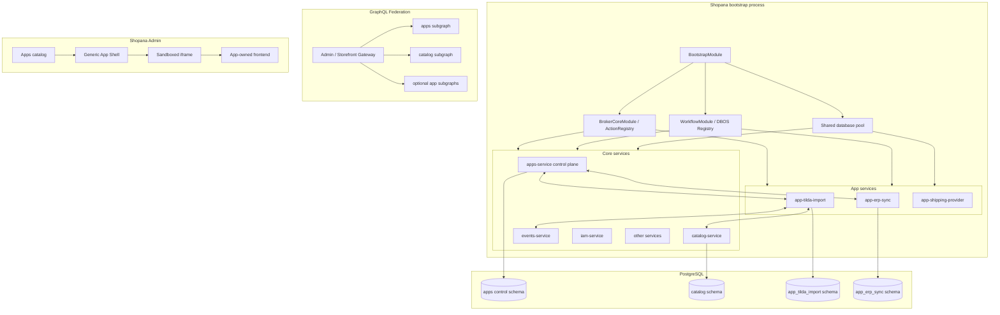
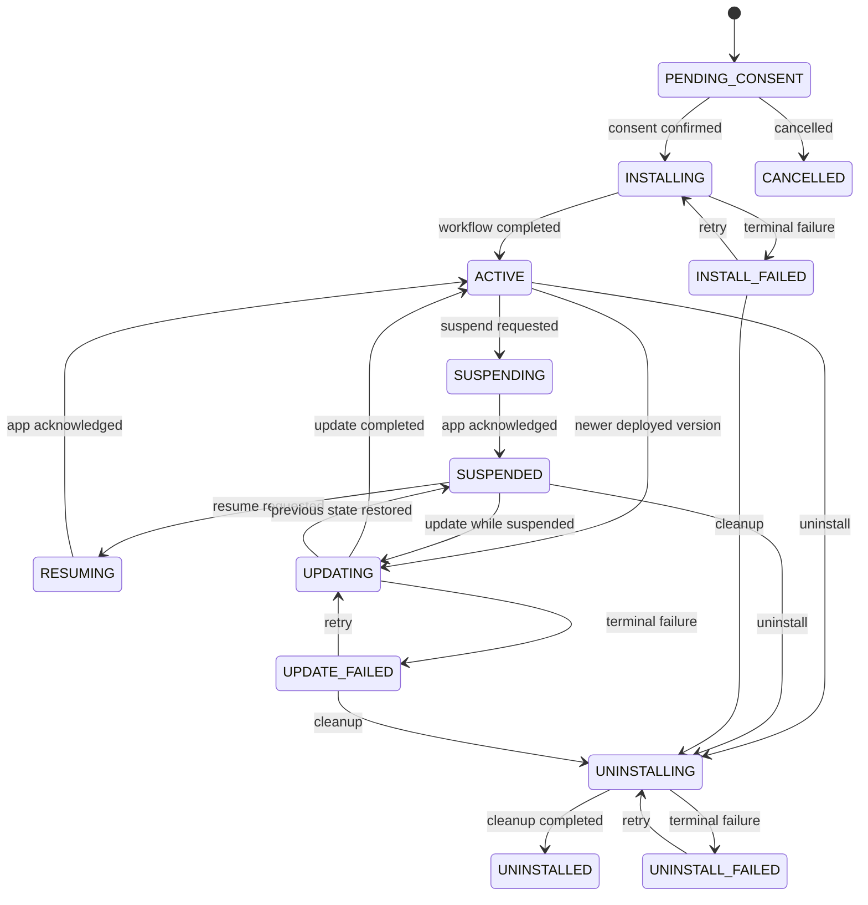

# Архитектура приложений Shopana как встроенных app-services

Статус: целевой план реализации
Дата: 2026-07-25
Область: `services/apps`, app-services, `services/bootstrap`, service broker,
DBOS, migrations, GraphQL Federation, Admin
Язык документа: русский

## Содержание

1. [Резюме решения](#1-резюме-решения)
2. [Результаты анализа текущего проекта](#2-результаты-анализа-текущего-проекта)
3. [Термины](#3-термины)
4. [Цели](#4-цели)
5. [Что не входит в целевую модель](#5-что-не-входит-в-целевую-модель)
6. [Архитектурные принципы](#6-архитектурные-принципы)
7. [Целевая архитектура](#7-целевая-архитектура)
8. [Модель app-service](#8-модель-app-service)
9. [Регистрация в bootstrap и конфигурация](#9-регистрация-в-bootstrap-и-конфигурация)
10. [App manifest и runtime registry](#10-app-manifest-и-runtime-registry)
11. [Broker, actions, handlers, workflows и sagas](#11-broker-actions-handlers-workflows-и-sagas)
12. [Ответственность `apps-service`](#12-ответственность-apps-service)
13. [Модель данных control plane](#13-модель-данных-control-plane)
14. [Lifecycle](#14-lifecycle)
15. [Capability routing и slots](#15-capability-routing-и-slots)
16. [База данных и миграции app-service](#16-база-данных-и-миграции-app-service)
17. [GraphQL Federation](#17-graphql-federation)
18. [Events и installation-aware handlers](#18-events-и-installation-aware-handlers)
19. [IAM и авторизация](#19-iam-и-авторизация)
20. [Frontend app в Admin через iframe](#20-frontend-app-в-admin-через-iframe)
21. [GraphQL API control plane](#21-graphql-api-control-plane)
22. [Надёжность, idempotency и отказоустойчивость](#22-надёжность-idempotency-и-отказоустойчивость)
23. [Observability и audit](#23-observability-и-audit)
24. [Целевая структура кода](#24-целевая-структура-кода)
25. [Изменения в build, CLI и federation tooling](#25-изменения-в-build-cli-и-federation-tooling)
26. [Переход от текущей реализации](#26-переход-от-текущей-реализации)
27. [Этапы реализации](#27-этапы-реализации)
28. [Pilot: Tilda Import App](#28-pilot-tilda-import-app)
29. [Проверка реализации](#29-проверка-реализации)
30. [Критерии готовности](#30-критерии-готовности)
31. [Отклонённые альтернативы](#31-отклонённые-альтернативы)
32. [Принятые default decisions](#32-принятые-default-decisions)
33. [Связанные файлы](#33-связанные-файлы)

## 1. Резюме решения

Shopana App не является remote service, загружаемым tenant-ом, и не является
плагином, исполняемым внутри `services/apps`.

Каждый App реализуется как отдельный полноценный Shopana service:

- находится в отдельном каталоге `services/app-<code>`;
- имеет собственный NestJS module;
- статически подключается в `services/bootstrap` так же, как `CatalogModule`,
  `OrdersModule` или любой другой core service;
- работает в том же Node.js процессе и в том же Nest application context, что
  и остальные сервисы;
- получает собственный `ServiceBroker` через
  `BrokerModule.forFeature({ serviceName })`;
- регистрирует собственные actions, event handlers, DBOS workflows и sagas;
- может вызывать broker contracts любых других сервисов;
- имеет отдельную секцию в `config.services`;
- владеет собственной PostgreSQL schema, repositories и миграциями;
- использует handwritten SQL migrations через `node-pg-migrate` по модели
  `catalog`;
- при необходимости публикует собственный Admin и/или Storefront GraphQL
  Federation subgraph;
- владеет отдельным Admin frontend, который открывается внутри основного Admin
  через sandboxed iframe.

`services/apps` остаётся отдельным control-plane service. Он не исполняет
бизнес-код Apps. Он управляет:

- каталогом доступных в текущей сборке Apps;
- установками App в stores;
- lifecycle `install/update/suspend/resume/uninstall`;
- разрешениями и installation configuration;
- capability bindings и slots;
- event subscriptions;
- Admin UI extensions;
- launch sessions для iframe;
- audit и диагностикой.

Ключевое различие между deployment и installation:

- app-service загружается один раз при старте bootstrap и существует на уровне
  всего процесса;
- App installation активирует этот уже запущенный сервис для конкретного
  store;
- install/uninstall не импортирует и не выгружает NestJS module;
- код, migrations и Federation schema меняются только вместе с release
  Shopana;
- installation state определяет, может ли конкретный store вызывать App,
  получать его event handlers и открывать его UI.

В целевой модели отсутствует remote HTTP transport между `apps-service` и App.
Все backend-вызовы проходят in-process через общий `ServiceBroker` и
`WorkflowRegistry`.

## 2. Результаты анализа текущего проекта

### 2.1. Bootstrap является modular monolith composition root

`services/bootstrap/src/bootstrap.module.ts` статически импортирует все
service modules. `BrokerCoreModule.forRoot()` создаёт единый `ActionRegistry`,
а `WorkflowModule.forRoot()` — единый DBOS `WorkflowRegistry`.

Это уже даёт необходимую runtime-модель для Apps:

```text
один Node.js process
  └── один Nest application context
      ├── один ActionRegistry
      ├── один WorkflowRegistry
      ├── AppsModule
      ├── CatalogModule
      ├── OrdersModule
      └── AppTildaImportModule
```

Важно: `Object.keys(config.services)` в текущем `bootstrap/main.ts` не загружает
модули динамически. Этот список сейчас используется только как
конфигурационная информация и для итогового сообщения. Для добавления нового
App недостаточно создать ключ в `config.yml`: его package и module должны быть
явно подключены в bootstrap.

### 2.2. Broker уже поддерживает необходимую модель

`BrokerCoreModule` предоставляет общий `ActionRegistry`.
`BrokerModule.forFeature({ serviceName })` создаёт отдельный broker identity на
каждый service.

Например, app-service с `serviceName = "app-tilda-import"`:

- регистрирует action `startImport` как
  `app-tilda-import.startImport`;
- вызывает `catalog.catalogQuery`;
- вызывает `media.*`;
- запускает `app-tilda-import.runImport`;
- запускает workflows других сервисов через fully-qualified name.

`BrokerCallContext.caller.service` позволяет downstream service видеть
доверенную identity вызывающего app-service.

### 2.3. Workflows уже разделены по service namespace

`BrokerWorkflows` и `BrokerSaga` получают service name из broker и
регистрируют DBOS definitions в общем `WorkflowRegistry`.

Следовательно, App может владеть:

- lifecycle workflows;
- background workflows;
- import/sync workflows;
- compensating sagas;
- workflow queues и idempotency policy.

Отдельный remote workflow runtime не нужен.

### 2.4. Config уже поддерживает произвольные service sections

`@shopana/shared-service-config` валидирует базовые поля `ports`, `db`, `s3`,
`workflows` и допускает custom fields через `passthrough`.

Каждый app-service может использовать:

```typescript
const { service, global } = getServiceConfig("app-tilda-import");
```

Для этого в `config.yml` должен существовать соответствующий ключ.

### 2.5. Catalog задаёт целевой migration pattern

`services/catalog` использует:

- Drizzle models как runtime query contract;
- handwritten PostgreSQL SQL;
- `migrations/domains/**/*.sql`;
- `node-pg-migrate`;
- собственную PostgreSQL schema;
- собственную таблицу `pgmigrations`;
- migrations assets в `build.config.json`.

App-services должны следовать этому pattern. Drizzle migration generation для
App не используется.

### 2.6. Federation уже определяется на уровне service

`build.config.json` каждого service объявляет `graphql.admin` и
`graphql.storefront`. Schema tooling сканирует `services/*`, экспортирует
subgraphs и строит supergraph из ports в `config.yml`.

Если App расположен в `services/app-<code>`, он может участвовать в Federation
тем же способом, что и Catalog.

Federation schema является частью platform release. Она не включается и не
исключается при install/uninstall App для отдельного store.

### 2.7. Event handlers сейчас не учитывают installation

`EventDispatchWorkflow` проходит по ключам `config.services`, ищет action
`{serviceName}.{eventType}` и вызывает все найденные handlers.

Для app-services этого недостаточно: статически загруженный App не должен
получать события stores, где он не установлен или suspended.

Целевая модель должна добавить installation-aware routing для app event
handlers.

### 2.8. Текущий `apps-service` является plugin manager

Сейчас `services/apps`:

- статически импортирует provider plugins;
- создаёт provider через `AppsPluginManager`;
- хранит `provider_configs`, `slots`, `slot_assignments` и secrets;
- трактует slot как installed App;
- выполняет dynamic provider method по строковому `operationId`.

Это не соответствует новой модели. `apps-service` должен перестать быть
контейнером бизнес-кода Apps и стать lifecycle/control-plane service.

### 2.9. Admin Apps пока не реализован

Текущая Apps page возвращает `null`, hooks используют mock store, а
install/uninstall не вызывают реальный GraphQL API.

При этом уже существуют:

- route `/system/integrations/apps`;
- module registry;
- catch-all routing;
- `useDynamicSidebarStore`.

Эти механизмы можно использовать для каталога Apps, generic App Shell и
динамической навигации установленных Apps.

## 3. Термины

### 3.1. App

Устанавливаемая на store продуктовая возможность Shopana.

App имеет:

- стабильный `appCode`;
- App manifest;
- одну или несколько installations;
- backend в виде app-service;
- собственные данные и migrations;
- опциональный Federation subgraph;
- опциональный iframe frontend;
- capabilities, permissions и event subscriptions.

### 3.2. App-service

Обычный Shopana service, реализующий конкретный App.

App-service:

- является compile-time dependency bootstrap;
- запускается в общем процессе;
- имеет уникальный `serviceName`;
- получает broker identity;
- регистрирует backend contracts;
- не управляет installation state самостоятельно;
- всегда проверяет installation context перед tenant-scoped операцией.

Пример:

```text
appCode:      tilda-import
serviceName:  app-tilda-import
package:      @shopana/app-tilda-import-service
directory:    services/app-tilda-import
db schema:    app_tilda_import
```

### 3.3. `apps-service`

Control-plane service с `serviceName = "apps"`.

Он управляет installations и маршрутизацией, но не содержит бизнес-логику
конкретного App.

### 3.4. App definition

Проверенный manifest App, зарегистрированный app-service при bootstrap.

Definition описывает:

- identity и version;
- service name;
- lifecycle contracts;
- capabilities;
- broker permissions;
- event subscriptions;
- GraphQL surfaces;
- Admin UI extensions.

### 3.5. App installation

Активация App для конкретного store.

Installation является основной tenant identity App и имеет отдельные:

- status;
- configuration;
- secrets;
- granted permissions;
- slots;
- subscriptions;
- UI extensions;
- lifecycle history.

### 3.6. Capability

Типизированная возможность, которую App предоставляет платформе.

Примеры:

- import;
- shipping;
- payment;
- pricing;
- notifications;
- inventory synchronization.

Capability связывается с конкретными broker actions app-service.

### 3.7. Deployment configuration

Конфигурация app-service в `config.services`.

Она принадлежит deployment и одинакова для всех stores в процессе:

- ports;
- database;
- S3;
- public UI origin;
- limits;
- upstream endpoints;
- deployment feature flags.

### 3.8. Installation configuration

Store-scoped конфигурация конкретной installation.

Она хранится в `apps-service` и передаётся App только внутри проверенного
installation context.

### 3.9. UI extension

Декларативная точка входа App в Admin:

- navigation item;
- full page;
- settings page;
- в будущем contextual action или resource panel.

В первой версии App UI всегда открывается через generic App Shell и iframe.

## 4. Цели

1. Сделать каждый App отдельным first-class Shopana service.
2. Запускать App в одном процессе и Nest context с core services.
3. Дать App собственный broker namespace.
4. Разрешить App регистрировать и вызывать actions, event handlers, workflows
   и sagas.
5. Сохранить `apps-service` как единый lifecycle/control-plane service.
6. Представить installation отдельной сущностью, а не slot.
7. Дать каждому App отдельную PostgreSQL schema и migrations.
8. Поддержать Admin и Storefront GraphQL Federation на уровне App.
9. Дать каждому App собственный Admin frontend через iframe.
10. Делать event delivery и capability routing installation-aware.
11. Обеспечить durable и idempotent lifecycle через DBOS.
12. Обеспечить явную tenant isolation по `installationId` и `storeId`.
13. Удалить runtime dynamic invocation через remote HTTP или произвольный URL.
14. Свести добавление App к повторяемому service pattern.

## 5. Что не входит в целевую модель

- загрузка third-party кода во время работы процесса;
- npm install App по запросу tenant;
- arbitrary Docker image deployment;
- отдельный процесс или отдельный deployment App;
- независимое масштабирование App;
- process-level fault isolation между App и core services;
- network transport между `apps-service` и App backend;
- OAuth `client_credentials` между App и Shopana backend;
- динамическое изменение supergraph на уровне store;
- tenant-specific GraphQL schema;
- remote JavaScript import или Module Federation в основном Admin tree;
- прямой доступ непроверенного внешнего кода к broker;
- per-store PostgreSQL database или schema;
- backward compatibility со старой моделью `InstalledApp = Slot`;
- backfill существующих данных.

Проект не имеет production data, поэтому переход выполняется прямой заменой
модели без compatibility layer.

## 6. Архитектурные принципы

### 6.1. App является service, installation является tenant state

App module существует на уровне deployment. Installation существует на уровне
store. Эти lifecycle не смешиваются.

### 6.2. Статическая композиция, динамическая активация

App code, migrations, GraphQL schema и frontend входят в platform build.
Install динамически активирует уже скомпилированный App для store.

### 6.3. Один service — один broker identity

Каждый app-service имеет уникальный service name:

```text
app-<appCode>
```

Все его actions и workflows находятся под этим namespace.

### 6.4. `apps-service` не исполняет бизнес-код App

Control plane вызывает app-service через broker и не импортирует App
repositories, scripts или domain services.

### 6.5. App владеет своими данными

Каждый App имеет собственную PostgreSQL schema и не выполняет direct queries в
schemas core services.

Доступ к core domains выполняется через broker contracts.

### 6.6. Installation context обязателен

Любая tenant-scoped операция App получает доверенный context:

- `installationId`;
- `organizationId`;
- `storeId`;
- `appCode`;
- `appVersion`;
- granted scopes;
- user identity, если операция инициирована Admin.

App не принимает store scope только из непроверенного input.

### 6.7. Lifecycle не управляет Nest module

Suspend или uninstall:

- блокирует routing;
- блокирует UI launch;
- блокирует event delivery;
- блокирует tenant-scoped App operations;
- не удаляет providers из Nest container;
- не deregister-ит глобальные actions и workflows.

### 6.8. Federation статична

Subgraph App присутствует во всех deployment instances, где app-service
включён в build. Resolver проверяет installation state для текущего store.

### 6.9. UI изолирован iframe boundary

App frontend не импортируется в React tree основного Admin и не получает
доступ к его DOM, cookies или bearer token.

### 6.10. Trusted code only

Общий процесс не является security sandbox. App-services считаются
first-party или прошедшим code review trusted code.

## 7. Целевая архитектура



Backend communication внутри процесса:

```text
Admin GraphQL
  -> apps-service install workflow
    -> broker.runWorkflow("app-tilda-import.install")
      -> app-owned schema
      -> broker.call("catalog.*")
      -> broker.call("media.*")
```

Capability invocation:

```text
core service
  -> apps.resolveCapability
  -> active installation + slot
  -> broker.call("app-tilda-import.startImport")
```

## 8. Модель app-service

### 8.1. Package

Каждый App размещается непосредственно в `services/*`, чтобы использовать
существующие service build, migration и Federation conventions.

Пример:

```text
services/app-tilda-import/
├── app.manifest.ts
├── build.config.json
├── package.json
├── tsconfig.json
├── migrations/
│   └── domains/
├── src/
│   ├── app-tilda-import.module.ts
│   ├── app-tilda-import.nest-service.ts
│   ├── actions/
│   ├── handlers/
│   ├── workflows/
│   ├── sagas/
│   ├── scripts/
│   ├── repositories/
│   └── api/
└── admin/
    ├── package.json
    ├── src/
    └── dist/
```

### 8.2. Nest module

App module следует тому же pattern, что и core service:

```typescript
@Module({
  imports: [
    AppRuntimeModule.forFeature(tildaImportManifest),
    BrokerModule.forFeature({ serviceName: "app-tilda-import" }),
  ],
  providers: [
    TildaImportNestService,
    TildaImportActions,
    TildaImportEventHandlers,
    TildaImportInstallWorkflow,
    TildaImportUpdateWorkflow,
    TildaImportUninstallWorkflow,
    TildaImportRunWorkflow,
  ],
})
export class AppTildaImportModule {}
```

`AppRuntimeModule.forFeature()`:

- валидирует manifest;
- регистрирует definition в общем `AppRuntimeRegistry`;
- проверяет уникальность `appCode` и `serviceName`;
- связывает App с config key;
- предоставляет App installation context helpers.

Он не заменяет `BrokerModule`. Broker остаётся стандартным broker Shopana.

### 8.3. App Nest service

`AppTildaImportNestService` отвечает только за process lifecycle:

- создаёт kernel и repositories;
- использует shared database client;
- поднимает optional GraphQL server;
- поднимает Admin UI HTTP server или static handler;
- проверяет deployment dependencies;
- корректно закрывает servers на shutdown.

Tenant install/uninstall не выполняется в `onModuleInit` или
`onModuleDestroy`.

### 8.4. App version

App version является версией кода, включённой в release:

```text
manifest.version = package.json version
```

Одна bootstrap build содержит ровно одну версию каждого app-service.

Per-store pin на произвольную старую runtime version не поддерживается, потому
что в процессе нет старого кода. Installation хранит:

- `installedVersion`;
- `targetVersion`;
- `manifestHash`;
- результат последнего update workflow.

После platform deployment installations с предыдущей версией переходят через
forward-only update lifecycle.

## 9. Регистрация в bootstrap и конфигурация

### 9.1. Статический import

Новый app-service добавляется в `services/bootstrap` так же, как core service:

```typescript
import { AppTildaImportModule } from "@shopana/app-tilda-import-service";
```

и затем включается в imports composition root:

```typescript
const imports = [
  DatabaseModule.forRoot(options.database),
  BrokerCoreModule.forRoot(options),
  AppRuntimeCoreModule.forRoot(),
  AppsModule,
  CatalogModule,
  AppTildaImportModule,
];
```

Статический import является обязательным. Runtime scan файловой системы не
должен динамически импортировать произвольный код.

### 9.2. Package dependency

`services/bootstrap/package.json` содержит workspace dependency:

```json
{
  "dependencies": {
    "@shopana/app-tilda-import-service": "workspace:*"
  }
}
```

### 9.3. Service configuration

Config key обязан совпадать с manifest `serviceName`:

```yaml
services:
  app-tilda-import:
    enabled: true
    ports:
      admin_graphql: 10101
      admin_ui: 11101
      metrics: 3051
    db:
      <<: *db_default
      schema: null
    app:
      public_ui_origin: http://localhost:11101
      max_concurrent_imports: 2
      source_download_timeout_ms: 30000
```

Правила:

- отсутствие config для подключённого App является startup error;
- `enabled: false` отключает App на уровне deployment и запрещает новые
  installations;
- deployment `enabled` не равен installation `ACTIVE`;
- ports уникальны;
- secrets deployment не попадают в manifest или GraphQL;
- store-specific settings не хранятся в `config.yml`.

### 9.4. Startup validation

До готовности bootstrap проверяет:

1. каждый импортированный App зарегистрировал manifest;
2. `serviceName` уникален;
3. `appCode` уникален;
4. для каждого App есть `config.services[serviceName]`;
5. app-service broker существует;
6. lifecycle workflows/actions из manifest зарегистрированы;
7. capability actions зарегистрированы;
8. event handlers зарегистрированы;
9. GraphQL ports существуют, если объявлен subgraph;
10. UI origin существует, если объявлен Admin UI.

Bootstrap не должен сообщать `Ready`, если runtime registry и конфигурация
расходятся.

## 10. App manifest и runtime registry

### 10.1. Source of truth

Manifest является versioned TypeScript/JSON definition, поставляемой вместе с
app-service. В первой версии отдельная marketplace database definitions не
нужна.

Runtime registry является source of truth для списка Apps, доступных в текущем
deployment. `apps-service` хранит installation snapshots, но не создаёт
произвольные App definitions через Admin API.

### 10.2. Manifest contract

Пример:

```typescript
export const tildaImportManifest = defineApp({
  schemaVersion: 1,
  code: "tilda-import",
  serviceName: "app-tilda-import",
  version: "0.1.0",
  displayName: "Tilda Import",
  description: "Импорт каталога из Tilda",
  lifecycle: {
    installWorkflow: "install",
    updateWorkflow: "update",
    suspendAction: "suspend",
    resumeAction: "resume",
    uninstallWorkflow: "uninstall",
    healthAction: "health",
  },
  permissions: [
    "catalog.products:read",
    "catalog.products:write",
    "catalog.categories:read",
    "media.files:write",
  ],
  capabilities: [
    {
      key: "import",
      operations: {
        start: "startImport",
        status: "getImportStatus",
        cancel: "cancelImport",
      },
    },
  ],
  events: [
    {
      type: "productUpdated",
      handler: "productUpdated",
      version: 1,
    },
  ],
  graphql: {
    admin: true,
    storefront: false,
  },
  adminUi: {
    entryPath: "/embedded",
    extensions: [
      {
        key: "imports",
        type: "NAVIGATION",
        location: "APPS",
        label: "Tilda imports",
        path: "/imports",
        order: 100,
      },
      {
        key: "settings",
        type: "PAGE",
        location: "APP_SETTINGS",
        label: "Settings",
        path: "/settings",
        order: 200,
      },
    ],
  },
});
```

### 10.3. Manifest не содержит runtime infrastructure values

Manifest не хранит:

- database credentials;
- ports;
- public host конкретного environment;
- secrets;
- store configuration;
- arbitrary URLs;
- user-provided code.

Эти значения берутся из `config.services[serviceName]` или installation.

### 10.4. Validation

При bootstrap отклоняются:

- неизвестная manifest schema version;
- невалидный SemVer;
- duplicate code или service name;
- service name, не начинающийся с `app-`;
- неизвестный capability;
- неизвестный permission;
- неизвестный event type/version;
- duplicate UI extension key;
- unsafe UI path;
- lifecycle contract без зарегистрированного action/workflow;
- manifest service name, не совпадающий с config key.

### 10.5. Manifest snapshot

При install `apps-service` сохраняет:

- app code;
- service name;
- version;
- canonical manifest hash;
- permissions snapshot;
- capabilities snapshot;
- UI extensions snapshot;
- event subscriptions snapshot.

Это позволяет audit и controlled update даже после изменения manifest в новом
release.

### 10.6. Двухфазная инициализация registry

Порядок Nest module imports не должен влиять на полноту App catalog.

Инициализация разделяется на две фазы:

1. каждый `AppRuntimeModule.forFeature()` регистрирует definition во время
   создания module graph;
2. `AppRuntimeCoreModule` финализирует registry в
   `OnApplicationBootstrap`, когда actions, handlers и workflows всех services
   уже зарегистрированы.

Именно при финализации выполняются cross-checks manifest с broker и workflow
registries. `apps-service` не поднимает GraphQL/control-plane readiness до
успешной финализации. Поэтому target implementation должен перенести
зависящий от полного registry startup из `onModuleInit` в
`onApplicationBootstrap` или использовать явный readiness barrier.

## 11. Broker, actions, handlers, workflows и sagas

### 11.1. Broker namespace

Для App используется namespace:

```text
app-<appCode>.<contract>
```

Примеры:

```text
app-tilda-import.install
app-tilda-import.startImport
app-tilda-import.getImportStatus
app-tilda-import.productUpdated
app-tilda-import.runImport
```

Action и workflow registries разделены, но имена всё равно должны быть
однозначными и описанными в manifest.

### 11.2. Вызов core actions

App вызывает только публичные broker contracts:

```typescript
await broker.call("catalog.catalogQuery", input);
await broker.call("media.createFile", input);
await broker.runWorkflow("catalog.updateProduct", input, idempotency);
```

App не импортирует core repositories или transaction scripts напрямую.

### 11.3. App execution context

Нужно добавить доверенный `AppExecutionContext`, распространяемый через
AsyncLocalStorage и broker calls:

```typescript
interface AppExecutionContext {
  appCode: string;
  serviceName: string;
  installationId: string;
  organizationId: string;
  storeId: string;
  appVersion: string;
  grantedScopes: readonly string[];
  actor?: {
    type: "USER" | "SERVICE" | "EVENT" | "SYSTEM";
    id?: string;
  };
}
```

Context создаётся только platform infrastructure:

- `apps-service` при capability/lifecycle invocation;
- App GraphQL middleware после проверки installation;
- Events при доставке installation subscription;
- scheduler/worker App при выборе active installation.

App input не может подменить этот context.

### 11.4. Расширение BrokerCallContext

Для app-originated calls:

```typescript
context.caller.service === "app-tilda-import"
context.app.installationId === "..."
context.app.storeId === "..."
```

Core handlers используют этот context для authorization и audit.

### 11.5. App entrypoint guard

Все tenant-scoped App entrypoints проходят общий guard:

1. execution context существует;
2. `appCode` и `serviceName` совпадают с текущим service;
3. installation существует;
4. installation status разрешает операцию;
5. store и organization совпадают;
6. требуемый scope granted;
7. operation объявлена manifest.

Guard применяется к:

- capability actions;
- App GraphQL resolvers;
- event handlers;
- background job entrypoints;
- App UI API.

Lifecycle handlers используют отдельный набор разрешённых transitional states.

### 11.6. Background work

App scheduler не может выполнить tenant operation без installation context.

Правильная модель:

1. App получает список активных installations через typed broker action
   `apps.listRunnableInstallations`;
2. выбирает installation;
3. запускает собственный workflow с `installationId`;
4. workflow восстанавливает trusted context через `apps-service`;
5. все downstream calls получают App identity.

### 11.7. Запрет dynamic arbitrary calls

Capability router не принимает произвольные:

- `serviceName`;
- `action`;
- `workflow`;
- URL;
- operation string.

Он разрешает только manifest operation key и преобразует его в заранее
проверенный broker target.

## 12. Ответственность `apps-service`

### 12.1. Владеет

- runtime App catalog projection;
- installations;
- installation state machine;
- permissions consent;
- installation configuration;
- installation secrets;
- lifecycle workflows;
- manifest snapshots;
- capability bindings;
- slots и slot assignments;
- event subscription activation;
- UI extension activation;
- iframe launch sessions;
- health projection;
- lifecycle operations и audit;
- installation-aware broker context creation.

### 12.2. Не владеет

- App business tables;
- App repositories;
- App domain logic;
- App business workflows;
- App GraphQL resolvers;
- App frontend source;
- App migration SQL;
- App-specific workers;
- App-specific upstream credentials, кроме encrypted installation secrets.

### 12.3. Runtime registry integration

`apps-service` получает `AppRuntimeRegistry` через DI и использует его для:

- available Apps query;
- install validation;
- version comparison;
- manifest snapshot;
- lifecycle target resolution;
- capability routing;
- event target resolution;
- UI descriptor creation;
- startup diagnostics.

### 12.4. Control plane не является service loader

`apps-service` не:

- вызывает dynamic `import()`;
- изменяет Nest module graph;
- устанавливает packages;
- перезапускает bootstrap;
- изменяет supergraph;
- применяет App schema migrations при tenant install.

## 13. Модель данных control plane

Названия таблиц целевые. Все persisted UUID должны быть UUIDv7.

### 13.1. `app_installations`

| Поле | Описание |
|---|---|
| `id` | UUIDv7 installation identity |
| `app_code` | Stable user-facing App code |
| `service_name` | Broker/config service identity |
| `organization_id` | Organization scope |
| `store_id` | Store scope |
| `status` | Lifecycle state |
| `installed_version` | Версия, для которой завершён lifecycle |
| `target_version` | Версия текущего install/update |
| `manifest_hash` | Canonical manifest snapshot hash |
| `configuration` | Non-secret store configuration |
| `configuration_version` | Optimistic concurrency version |
| `installed_by_user_id` | Initiator |
| `health_status` | `UNKNOWN`, `HEALTHY`, `DEGRADED`, `FAILED` |
| `last_health_check_at` | Последняя проверка |
| `activated_at` | Первая активация |
| `suspended_at` | Suspension timestamp |
| `uninstalled_at` | Terminal timestamp |
| `created_at`, `updated_at` | Audit timestamps |

Инвариант первой версии:

```text
не более одной non-UNINSTALLED installation на (store_id, app_code)
```

`store_id` не включается в primary или foreign keys. Для tenant lookup
используются отдельные indexes/unique constraints.

### 13.2. Installation states



`UNINSTALLED` сохраняется как audit state.

### 13.3. `app_installation_manifest_snapshots`

Хранит immutable canonical snapshot, использованный install/update:

- installation id;
- version;
- manifest JSON;
- manifest hash;
- created at.

Новый snapshot создаётся только после успешного version transition.

### 13.4. `app_installation_scopes`

- installation id;
- scope;
- source version;
- granted by user;
- granted at;
- revoked at.

Новый release, добавляющий scopes, переводит update в
`PENDING_CONSENT`, а не расширяет доступ автоматически.

### 13.5. `app_installation_secrets`

- installation id;
- key;
- encrypted value;
- key version;
- created/updated at.

Secret values:

- не возвращаются через GraphQL;
- не входят в manifest snapshot;
- не логируются;
- доступны App только через scoped secret resolver.

### 13.6. `app_installation_extensions`

- installation id;
- extension key;
- type;
- location;
- label;
- relative path;
- order;
- enabled;
- manifest version.

Rows materialизуются из manifest при install/update.

### 13.7. `app_event_subscriptions`

- installation id;
- event type;
- event version;
- handler action;
- status;
- created/updated at.

Subscription активна только при `installation.status = ACTIVE`.

### 13.8. `app_lifecycle_operations`

- id;
- installation id;
- type;
- requested by;
- from version;
- target version;
- DBOS workflow id;
- status;
- attempt;
- error code;
- safe error message;
- started/finished timestamps.

Один client idempotency key не может создать две lifecycle operations.

### 13.9. Slots

Текущая модель slots сохраняется как capability assignment mechanism, но slot
перестаёт быть installation.

Целевые поля slot:

- `installation_id`;
- `capability`;
- `operation_contract`;
- `target_service`;
- `target_action`;
- `status`;
- existing assignment fields.

В slot отсутствуют:

- remote URL;
- HTTP protocol;
- base URL;
- произвольный operation;
- plugin config как App database.

## 14. Lifecycle

### 14.1. Общий принцип

`apps-service` владеет orchestration workflow. Конкретный app-service владеет
App-specific lifecycle workflow/action.

```text
apps.install
  -> validate control-plane state
  -> start apps.installApp workflow
    -> create installation
    -> run app-tilda-import.install workflow
    -> materialize slots/subscriptions/extensions
    -> activate installation
```

### 14.2. Install

1. Admin запрашивает App definition и requested permissions.
2. Пользователь подтверждает consent.
3. `apps-service` создаёт installation в `INSTALLING`.
4. Сохраняется manifest snapshot.
5. Создаётся trusted App lifecycle context.
6. Запускается `{serviceName}.install` через DBOS.
7. App создаёт tenant-owned rows в своей schema.
8. App при необходимости вызывает core broker actions.
9. `apps-service` материализует scopes, UI extensions, subscriptions и slots.
10. Installation переводится в `ACTIVE`.
11. Публикуется audit/domain event.

Install workflow App получает:

```typescript
interface AppInstallInput {
  installationId: string;
  organizationId: string;
  storeId: string;
  appCode: string;
  version: string;
  configuration: Record<string, unknown>;
  grantedScopes: readonly string[];
}
```

### 14.3. Install compensation

Если App-specific install завершился, но активация control plane не
зафиксировалась, retry использует тот же workflow/idempotency identity.

Если install терминально неуспешен:

- installation становится `INSTALL_FAILED`;
- slots и subscriptions не активируются;
- App install workflow обязан поддерживать cleanup/retry;
- пользователь может retry или uninstall.

### 14.4. Suspend

Порядок:

1. control plane атомарно блокирует новые launch sessions и capability routes;
2. event subscriptions переходят в paused;
3. App получает `suspend` action;
4. активные durable workflows завершаются по App policy;
5. installation становится `SUSPENDED`.

Suspend не удаляет данные.

### 14.5. Resume

1. App выполняет health/config validation;
2. App получает `resume`;
3. capability routes и subscriptions активируются;
4. installation становится `ACTIVE`.

### 14.6. Update

Update запускается, если runtime registry version выше
`installed_version`.

1. Сравниваются old/new manifest.
2. Permission expansion требует нового consent.
3. Installation становится `UPDATING`.
4. Запускается `{serviceName}.update`.
5. App выполняет только tenant data/config transition.
6. Schema migrations уже применены deployment pipeline до старта нового кода.
7. Пересоздаются extensions, subscriptions и capability bindings.
8. Сохраняется новый manifest snapshot.
9. `installed_version` переключается на target.
10. Возвращается предыдущий active/suspended state.

Rollback на старую версию кода не является частью lifecycle. Updates
forward-only.

### 14.7. Uninstall

1. Installation становится `UNINSTALLING`.
2. Немедленно отключаются UI launch, events и capability routing.
3. Отзываются installation secrets/sessions.
4. Запускается `{serviceName}.uninstall`.
5. App удаляет или anonymize-ит tenant-owned данные по своей policy.
6. Удаляются active slots, assignments, subscriptions и extensions.
7. Installation становится `UNINSTALLED`.

Даже если App-specific cleanup завершился ошибкой, доступ остаётся
заблокированным. Состояние становится `UNINSTALL_FAILED`, а cleanup можно
повторить.

### 14.8. Health

`apps-service` вызывает manifest health action через broker.

Health result содержит:

- app version;
- database availability;
- required broker contracts availability;
- installation configuration validity;
- dependency state без secrets.

Health failure не uninstall-ит App автоматически.

## 15. Capability routing и slots

### 15.1. Resolution

Capability caller не знает app-service напрямую:

```typescript
const target = await broker.call("apps.resolveCapability", {
  storeId,
  capability: "import",
  operation: "start",
  aggregate,
});
```

Control plane:

1. находит active assignment;
2. проверяет installation;
3. проверяет manifest operation;
4. возвращает internal typed target или сам выполняет вызов;
5. создаёт trusted App execution context.

### 15.2. Предпочтительный API

Предпочтительно не возвращать target caller-у, а иметь control-plane action:

```typescript
await broker.call("apps.executeCapability", {
  storeId,
  capability: "import",
  operation: "start",
  input,
});
```

Так target service/action остаётся внутренней деталью и не может быть
подменён caller-ом.

### 15.3. Typed contracts

Каждый capability protocol определяется в shared package:

```text
packages/app-contracts/
├── import/
├── shipping/
├── payment/
├── pricing/
└── notifications/
```

Строковый `operationId` не заменяет TypeScript/Zod contract.

### 15.4. Multi-capability App

Одна installation может создать несколько slots. Все они:

- ссылаются на один installation id;
- используют один app-service;
- могут иметь разные assignments;
- автоматически блокируются при suspend/uninstall installation.

## 16. База данных и миграции app-service

### 16.1. Ownership

Каждый App владеет отдельной PostgreSQL schema:

```text
app_<normalized_app_code>
```

Пример:

```text
app_tilda_import
```

Core services не выполняют queries в эту schema. `apps-service` хранит только
control-plane state.

### 16.2. Shared pool

В текущем bootstrap используется один shared `DatabaseModule` pool. App
получает тот же `DATABASE_CLIENT`, что и Catalog, и создаёт Drizzle database с
собственными models.

Отдельная service config DB section пока не создаёт отдельный named pool.
Если в будущем потребуется database-per-app, сначала должен быть реализован
named `DatabaseModule`/connection registry. Это не является требованием первой
версии.

### 16.3. Migration style

App использует Catalog-style migrations:

```text
services/app-tilda-import/migrations/
└── domains/
    ├── 0000_foundation/
    │   ├── 0000_foundation__schema.sql
    │   └── 0001_foundation__types.sql
    ├── 0100_installation/
    │   └── 0100_installation__tables.sql
    └── 0200_import/
        ├── 0200_import__sources.sql
        └── 0201_import__jobs.sql
```

Правила:

- handwritten SQL;
- `node-pg-migrate`;
- recursive glob `migrations/domains/**/*.sql`;
- globally unique ordered basenames внутри App;
- отдельная migration history;
- `singleTransaction: false`;
- `checkOrder: true`;
- forward-only changes;
- никаких backfills или compatibility migrations.

### 16.4. Build configuration

```json
{
  "entryPoint": "src/app-tilda-import.module.ts",
  "serviceName": "app-tilda-import",
  "kind": "app",
  "migrations": {
    "path": "dist/migrations",
    "type": "node-pg-migrate",
    "schema": "app_tilda_import",
    "table": "pgmigrations"
  },
  "assets": [
    {
      "include": "migrations/**/*",
      "outDir": "dist/migrations"
    }
  ]
}
```

CLI build config schema и migration runner должны начать читать `schema` и
`table`, а не выводить migration schema из directory name с дефисами.

### 16.5. Tenant data model

App business tables содержат:

- stable UUIDv7 primary key;
- `installation_id`;
- `store_id` для tenant lookup и diagnostics;
- timestamps;
- explicit indexes.

Пример:

```sql
CREATE TABLE app_tilda_import.import_jobs (
  id UUID PRIMARY KEY DEFAULT uuidv7(),
  installation_id UUID NOT NULL,
  store_id UUID NOT NULL,
  status TEXT NOT NULL,
  created_at TIMESTAMPTZ NOT NULL DEFAULT now()
);

CREATE INDEX import_jobs_installation_created_idx
  ON app_tilda_import.import_jobs (installation_id, created_at DESC);
```

`store_id` не входит в primary или foreign keys.

### 16.6. Install lifecycle не применяет SQL migrations

Schema migrations применяются deployment command до запуска bootstrap:

```text
shopana migrate --service app-tilda-import
```

Tenant install создаёт только installation-owned rows в уже существующей
schema.

## 17. GraphQL Federation

### 17.1. App как обычный subgraph

App может объявить:

```json
{
  "graphql": {
    "admin": [
      "src/api/graphql-admin/schema/**/*.graphql",
      "../../packages/shared-references/graphql/**/*.graphql"
    ],
    "storefront": [
      "src/api/graphql-storefront/schema/**/*.graphql"
    ]
  }
}
```

Service config предоставляет ports:

```yaml
services:
  app-tilda-import:
    ports:
      admin_graphql: 10101
```

Schema export и composition обрабатывают App как любой другой service из
`services/*`.

### 17.2. Static schema, dynamic authorization

GraphQL types App всегда присутствуют в supergraph данного release.

Resolver перед выполнением:

1. получает store context;
2. находит active installation по `appCode`;
3. создаёт `AppExecutionContext`;
4. проверяет user RBAC и granted scopes;
5. выполняет App query/mutation.

Если App не установлен, resolver возвращает typed user error или `null` в
соответствии с contract. Он не скрывает schema из introspection.

### 17.3. Schema ownership

App:

- владеет app-specific types;
- может расширять core entities через Federation;
- не переопределяет поля core services;
- использует project federation conventions;
- избегает generic type names.

Рекомендуемый prefix для app-owned types:

```text
TildaImportJob
TildaImportSource
TildaImportSettings
```

### 17.4. Federation и installation lifecycle независимы

Install/uninstall не запускает:

- schema export;
- supergraph compose;
- gateway restart.

Federation меняется только при code release App.

### 17.5. App без GraphQL

GraphQL является optional. App, работающий только через capabilities,
handlers или iframe BFF, может не объявлять subgraph.

## 18. Events и installation-aware handlers

### 18.1. Проблема текущего discovery

Текущий Events service вызывает handler каждого configured service, если
action `{serviceName}.{eventType}` зарегистрирован.

Для app-service это привело бы к доставке события независимо от installation
state.

### 18.2. Canonical store scope

Domain event envelope должен содержать проверенный `storeId` в canonical
context, а не только внутри произвольного payload:

```typescript
interface DomainEventContext {
  organizationId: string;
  storeId: string;
  userId?: string;
  correlationId: string;
  causationId?: string;
}
```

Без `storeId` невозможно корректно выбрать store-scoped App installation.

### 18.3. Target resolution

`EventDispatchWorkflow` получает handlers из двух источников:

1. core service handlers — существующий config/registry discovery;
2. app handlers — `apps.resolveEventHandlers`.

Вызов:

```typescript
await broker.call("apps.resolveEventHandlers", {
  eventType,
  eventVersion,
  organizationId,
  storeId,
});
```

Результат содержит только active subscriptions:

```typescript
interface AppEventTarget {
  installationId: string;
  appCode: string;
  serviceName: string;
  handlerAction: string;
  retryPolicy: RetryPolicy;
}
```

### 18.4. Durable delivery

`event_handler_jobs` расширяется:

- `installation_id` nullable;
- `app_code` nullable;
- manifest event version;
- installation status snapshot при создании job.

Перед фактическим retry Events повторно проверяет installation:

- `ACTIVE` — delivery разрешена;
- `SUSPENDED` — job paused;
- `UNINSTALLING/UNINSTALLED` — job cancelled;
- version больше поддерживаемой — terminal contract error.

### 18.5. Invocation

Events service создаёт trusted App execution context и вызывает:

```text
app-tilda-import.productUpdated
```

Handler получает:

- canonical event;
- delivery attempt;
- idempotency key;
- installation context.

### 18.6. At-least-once semantics

App handlers:

- идемпотентны по `eventId + installationId`;
- не считают повторную доставку ошибкой;
- возвращают typed retryable/non-retryable error;
- не создают собственный бесконтрольный retry поверх Events retry.

### 18.7. Event subscriptions materialized per installation

Manifest описывает возможные subscriptions. Install materialизует их в
control plane. Пользователь или App может отключить optional subscription, но
не добавить handler, отсутствующий в manifest.

## 19. IAM и авторизация

### 19.1. Backend App identity

Поскольку App находится в том же процессе, отдельный OAuth machine principal
для backend-to-backend вызовов не нужен.

Backend identity формируется broker infrastructure:

```text
caller.service = app-tilda-import
app.installationId = ...
app.storeId = ...
```

Она не читается из request body.

### 19.2. Permissions

Manifest объявляет permissions, необходимые App. Installation хранит granted
subset.

Effective permission для Admin-initiated operation:

```text
manifest requested scopes
∩ installation granted scopes
∩ current user RBAC permissions
∩ current store scope
```

Background operation не имеет user RBAC, но всё равно ограничена installation
scopes и allowlisted broker contracts.

### 19.3. Broker enforcement

Core actions, доступные App, должны:

- проверять trusted caller;
- проверять installation context;
- проверять требуемый scope;
- использовать store из context;
- записывать App actor в audit.

`serviceName` сам по себе недостаточен: один app-service обслуживает несколько
stores.

### 19.4. App code trust boundary

Общий process означает, что злонамеренный App технически может попытаться
обойти SDK. Поэтому:

- поддерживаются только trusted App packages;
- package проходит обычный repository review;
- runtime installation permissions являются product/authorization boundary,
  но не process sandbox;
- third-party unreviewed Apps требуют отдельной будущей remote architecture и
  не входят в этот план.

### 19.5. Installation secrets

App получает secret только:

- для текущей installation;
- по известному manifest key;
- через scoped resolver;
- внутри active lifecycle/execution context.

Cross-installation secret access запрещён.

## 20. Frontend app в Admin через iframe

### 20.1. Ownership

Каждый app-service владеет своим frontend:

```text
services/app-tilda-import/admin/
```

Frontend:

- имеет собственный build;
- может использовать собственные React/Ant Design dependencies;
- не импортируется в основной Admin bundle;
- поставляется в том же platform release, что и backend App;
- обслуживается app-service или отдельным static server того же deployment.

### 20.2. App UI config

Manifest содержит только logical entry path и extension descriptors.
Environment origin берётся из service config:

```yaml
services:
  app-tilda-import:
    app:
      public_ui_origin: https://tilda-import.apps.shopana.local
```

`apps-service` строит launch URL только из validated deployment config.
Installation configuration не может подставить arbitrary origin.

### 20.3. Generic App Shell

Основной Admin регистрирует статический route:

```text
/:orgName/:storeName/apps/:appCode/:extensionPath*
```

App Shell:

1. загружает installation и extension descriptor;
2. проверяет status;
3. создаёт launch session;
4. строит iframe URL;
5. устанавливает sandbox/CSP policy;
6. выполняет bridge handshake;
7. показывает loading/error/retry state.

### 20.4. Launch session

Основной Admin token не передаётся в iframe URL.

`apps-service` создаёт короткоживущую one-time launch session:

- installation id;
- user id;
- store id;
- allowed extension/path;
- exact iframe origin;
- nonce;
- expiration;
- consumed at.

App UI обменивает one-time code на scoped session. Повторное использование
кода отклоняется.

### 20.5. Iframe sandbox

Default:

```html
<iframe
  sandbox="allow-scripts allow-forms allow-same-origin"
  referrerpolicy="no-referrer"
/>
```

Условия:

- iframe origin отличается от Admin origin;
- `allow-popups`, downloads и clipboard добавляются только отдельными
  capabilities;
- top navigation запрещена;
- exact origin проверяется для каждого message;
- wildcard `postMessage("*")` запрещён после initial handshake.

### 20.6. App Bridge

Разрешённый минимальный bridge:

- `READY`;
- `INIT`;
- `NAVIGATE`;
- `RESIZE`;
- `SET_TITLE`;
- `SHOW_TOAST`;
- `OPEN_CONFIRM`;
- `REQUEST_CLOSE`;
- theme/locale updates.

Messages:

- versioned;
- валидируются Zod schema;
- содержат channel id и nonce;
- используют `MessageChannel`;
- не позволяют выполнять arbitrary Admin command.

### 20.7. Dynamic sidebar

Admin загружает active `app_installation_extensions` и преобразует navigation
extensions в `SidebarItem`.

`useDynamicSidebarStore` добавляет их в отдельный Apps section или под
`system-integrations`.

Sidebar path всегда ведёт в generic App Shell, а не прямо на внешний URL.

### 20.8. Deep links

App Shell сохраняет relative App path:

```text
/:org/:store/apps/tilda-import/imports/019...
```

После reload:

1. Admin восстанавливает route;
2. создаёт новую launch session;
3. загружает iframe;
4. передаёт relative path через bridge.

### 20.9. Frontend API

App frontend может:

- вызывать app-owned BFF на своём origin;
- вызывать App Federation operations через scoped delegated session;
- просить bridge выполнить только явно разрешённые Admin actions.

Он не получает бессрочный Admin access token или refresh token.

## 21. GraphQL API control plane

### 21.1. Основные types

```graphql
type AppDefinition {
  code: String!
  serviceName: String!
  version: String!
  displayName: String!
  description: String
  permissions: [AppPermission!]!
  capabilities: [AppCapability!]!
  adminUi: AppAdminUi
  installed: Boolean!
  installation: AppInstallation
}

type AppInstallation {
  id: ID!
  appCode: String!
  version: String!
  targetVersion: String
  status: AppInstallationStatus!
  healthStatus: AppHealthStatus!
  configurationVersion: Int!
  scopes: [AppInstallationScope!]!
  capabilities: [AppCapabilityBinding!]!
  extensions: [AppUiExtension!]!
  createdAt: DateTime!
  updatedAt: DateTime!
}
```

### 21.2. Queries

- available Apps;
- installed Apps;
- installation by id;
- installation by app code;
- lifecycle operation;
- install/update preview;
- health;
- UI extensions for current store.

Queries используют pagination/filter/order conventions проекта там, где
список может расти.

### 21.3. Mutations

- `appInstallPrepare`;
- `appInstallConfirm`;
- `appInstallationUpdatePrepare`;
- `appInstallationUpdateConfirm`;
- `appInstallationSuspend`;
- `appInstallationResume`;
- `appInstallationConfigure`;
- `appInstallationRetry`;
- `appInstallationUninstall`;
- `appLaunchCreate`.

### 21.4. Payloads

Boolean mutations удаляются. Каждая mutation возвращает:

```graphql
type AppInstallPayload {
  installation: AppInstallation
  operation: AppLifecycleOperation
  userErrors: [GenericUserError!]!
}
```

Expected validation, permission и lifecycle errors возвращаются через
`userErrors`. Transport/runtime failures остаются GraphQL errors.

### 21.5. Store scope

`storeId` не принимается как свободный аргумент Admin mutation, если store уже
определён GraphQL context. Control plane использует verified context.

## 22. Надёжность, idempotency и отказоустойчивость

### 22.1. Process failure domain

App делит process с core services. Необработанная ошибка, memory leak или CPU
starvation App может повлиять на всю platform instance.

Следовательно:

- App code trusted;
- synchronous CPU-heavy work запрещён;
- длительные операции выполняются DBOS workflows;
- внешние I/O имеют timeout;
- concurrency ограничивается queues;
- unhandled rejection не допускается;
- App health виден в общем process health.

### 22.2. Lifecycle idempotency

Install/update/uninstall используют стабильный idempotency context:

```text
organizationId + installationId + operation + targetVersion
```

Повторный GraphQL request:

- возвращает существующую operation;
- не создаёт вторую installation;
- не запускает дублирующий App workflow.

### 22.3. Capability idempotency

Side-effect capability operation обязана иметь domain idempotency key.

`apps-service` передаёт его в App execution context и input contract.

### 22.4. Workflow ownership

Не должно быть двух независимых retry layers для одной операции.

- lifecycle retry владеет `apps-service`;
- App workflow retry владеет App;
- event delivery retry владеет Events;
- upstream HTTP retry владеет конкретный workflow step.

### 22.5. Shutdown

При shutdown:

- новые App invocations не принимаются;
- broker ждёт in-flight calls в существующих пределах;
- GraphQL/UI servers закрываются;
- App workflows остаются durable и восстанавливаются после restart;
- shared database client закрывается bootstrap, а не каждым App.

App не должен уничтожать общий pool в `onModuleDestroy`.

## 23. Observability и audit

### 23.1. Structured context

App logs и traces включают:

- app code;
- service name;
- app version;
- installation id;
- organization id;
- store id;
- action/workflow/event;
- request/correlation id;
- DBOS workflow id.

### 23.2. Metrics

Control plane:

- installations by status;
- lifecycle duration/failures;
- active/suspended installations;
- version drift;
- capability calls;
- launch failures.

App-service:

- action latency/error;
- workflow queue depth;
- workflow duration;
- external dependency latency;
- app database errors;
- UI server health.

Events:

- deliveries by App/installation;
- retries;
- paused/cancelled jobs;
- DLQ count;
- delivery lag.

### 23.3. Audit events

Минимум:

- `app.installation.created`;
- `app.installation.activated`;
- `app.installation.install_failed`;
- `app.installation.suspended`;
- `app.installation.resumed`;
- `app.installation.update_started`;
- `app.installation.updated`;
- `app.installation.update_failed`;
- `app.installation.uninstall_started`;
- `app.installation.uninstalled`;
- `app.installation.uninstall_failed`;
- `app.permissions.granted`;
- `app.permissions.changed`;
- `app.configuration.changed`;
- `app.launch.created`;
- `app.launch.failed`.

Audit не содержит secrets, launch codes или полный sensitive config.

## 24. Целевая структура кода

### 24.1. Control plane

```text
services/apps/
├── build.config.json
├── migrations/
│   └── domains/
└── src/
    ├── apps.module.ts
    ├── api/
    │   └── graphql-admin/
    ├── actions/
    ├── workflows/
    │   ├── InstallAppWorkflow.ts
    │   ├── UpdateAppWorkflow.ts
    │   ├── SuspendAppWorkflow.ts
    │   └── UninstallAppWorkflow.ts
    ├── domain/
    │   ├── installation/
    │   ├── capability/
    │   └── lifecycle/
    ├── repositories/
    ├── runtime/
    │   ├── AppRuntimeRegistryAdapter.ts
    │   └── AppExecutionContextFactory.ts
    ├── routing/
    │   ├── CapabilityRouter.ts
    │   └── EventTargetResolver.ts
    ├── ui/
    │   └── LaunchSessionService.ts
    └── secrets/
```

### 24.2. Shared App packages

```text
packages/
├── app-sdk/
│   ├── manifest/
│   ├── runtime-registry/
│   ├── nest/
│   ├── execution-context/
│   └── lifecycle/
├── app-contracts/
│   ├── import/
│   ├── shipping/
│   ├── payment/
│   └── notifications/
└── app-bridge/
    ├── protocol/
    └── react/
```

Назначение:

- `app-sdk` — backend App service contract;
- `app-contracts` — typed capability DTO/Zod contracts;
- `app-bridge` — iframe messaging и React helpers.

### 24.3. App package

```text
services/app-tilda-import/
├── app.manifest.ts
├── build.config.json
├── package.json
├── migrations/domains/
├── src/
│   ├── app-tilda-import.module.ts
│   ├── app-tilda-import.nest-service.ts
│   ├── actions/
│   ├── handlers/
│   ├── workflows/
│   ├── sagas/
│   ├── scripts/
│   ├── repositories/
│   │   └── models/
│   └── api/
│       ├── graphql-admin/
│       └── ui-server/
└── admin/
    ├── package.json
    ├── src/
    └── dist/
```

## 25. Изменения в build, CLI и federation tooling

### 25.1. Service discovery

Поскольку Apps размещаются в `services/app-*`, существующий filesystem
discovery build/schema/migrate может их видеть.

Нужно убрать расхождение между разными scanners и ввести единый
`discoverProjectServices()`:

- path;
- directory name;
- `serviceName`;
- package name;
- kind `core | app | bootstrap`;
- build config;
- capabilities.

Один discovery используется:

- build;
- dev watch;
- migrate;
- codegen;
- schema export;
- federation composition;
- `shopana_list_services`;
- shopana-cli MCP service lists.

### 25.2. Build config schema

Добавить:

- `serviceName`;
- `kind`;
- migration `schema`;
- migration `table`;
- optional `adminFrontend`;
- validation соответствия directory/config/manifest.

### 25.3. Build order

Полный build:

1. shared packages;
2. core services;
3. app-service backends;
4. app-owned Admin frontends;
5. GraphQL schema export/compose;
6. bootstrap last.

Bootstrap build должен падать, если импортируемый App package не собран или
manifest invalid.

### 25.4. Dev watch

`shopana dev` watches:

- `services/app-*/src`;
- `services/app-*/app.manifest.ts`;
- App GraphQL schemas;
- App admin source;
- build config;
- migrations не вызывают auto-migrate.

Изменение backend App пересобирает service и перезапускает общий bootstrap.
Изменение frontend пересобирает/обновляет только App UI dev server, если это
возможно.

### 25.5. Migrate

`shopana migrate --service app-tilda-import`:

- находит service через unified discovery;
- читает explicit migration schema;
- применяет recursive domain SQL;
- использует App-specific `pgmigrations`;
- не использует дефисный service name как PostgreSQL schema.

### 25.6. Codegen

App с GraphQL получает обычный service codegen command.

Hardcoded enum service names в shopana-cli MCP заменяются discovery-based
списком или обновляются генератором при добавлении App.

### 25.7. Federation

Schema export и Mesh composition используют `serviceName` из build config и
ports из `config.services[serviceName]`.

Добавление App subgraph должно требовать:

1. GraphQL globs;
2. config port;
3. runtime GraphQL server;
4. successful schema composition.

### 25.8. App scaffold

Добавить CLI command или generator:

```text
shopana app create <code>
```

Он создаёт:

- service package;
- manifest;
- module;
- broker setup;
- Catalog-style migrations;
- build config;
- optional GraphQL;
- optional Admin iframe frontend;
- bootstrap import/dependency;
- config template.

Generator не выполняет `npm install` и не создаёт changeset вручную.

## 26. Переход от текущей реализации

### 26.1. Прямая замена

Production data отсутствуют. Старые таблицы и GraphQL types можно заменить
напрямую без backfill и compatibility layer.

### 26.2. Что сохраняется

- `services/apps` как service;
- `slots` как capability routing abstraction;
- `slot_assignments`;
- encrypted secret storage concepts;
- GraphQL subgraph Apps;
- DBOS;
- shared broker;
- dynamic Admin sidebar store;
- provider domain contracts, если они пригодны как typed App capability
  contracts.

### 26.3. Что заменяется

| Текущее состояние | Целевая модель |
|---|---|
| App = plugin manifest | App = registered app-service manifest |
| InstalledApp = slot | отдельная `app_installation` |
| plugin code внутри `apps-service` | отдельный service module в bootstrap |
| dynamic provider method | typed broker action |
| config migrations plugin | App DB migrations + installation update workflow |
| install создаёт только slots | durable lifecycle workflow |
| uninstall угадывает domain | uninstall по installation id |
| event handler глобален | handler маршрутизируется по active installation |
| `baseURL` в generic config | UI origin из deployment service config |
| Admin mock store | реальный control-plane GraphQL |
| отсутствует App UI | App-owned iframe frontend |
| remote/HTTP App contract | in-process broker contract |

### 26.4. Что удаляется

- `AppsPluginManager` как runtime Apps engine;
- registry installable Apps из npm provider imports;
- `InstalledApp` в текущем виде;
- `baseURL` и generic `meta` API;
- Boolean install/uninstall mutations;
- domain guessing при uninstall;
- arbitrary `operationId`;
- App business state в `provider_configs`;
- remote endpoint registry;
- remote App transport;
- App OAuth machine principal для backend-to-backend calls;
- Admin Apps mocks после подключения GraphQL.

### 26.5. Existing provider packages

Существующие provider implementations переносятся по одному:

- сложный provider становится app-service;
- его текущий SDK provider может временно использоваться как внутренний
  adapter внутри app-service;
- `apps-service` больше не создаёт provider напрямую;
- slot target переключается на app-service broker action.

Compatibility routing не сохраняется. После переноса конкретного provider его
старый path удаляется.

## 27. Этапы реализации

### Этап 0. Зафиксировать service App contract

Реализовать/описать:

- naming `appCode`, `serviceName`, package, DB schema;
- manifest schema;
- app-service directory pattern;
- lifecycle contracts;
- capability contracts;
- installation context;
- trusted-code boundary.

Критерий выхода:

- App больше не определяется как remote service или plugin.

### Этап 1. App SDK и runtime registry

Реализовать:

- `defineApp`;
- manifest validation;
- `AppRuntimeCoreModule`;
- `AppRuntimeModule.forFeature`;
- `AppRuntimeRegistry`;
- startup consistency checks;
- execution context primitives.

Критерий выхода:

- reference app-service регистрируется в bootstrap и виден `apps-service`.

### Этап 2. Unified service tooling

Реализовать:

- единый service discovery;
- build config additions;
- MCP dynamic service list;
- App backend build;
- migration schema/table config;
- App frontend build metadata;
- dev watch.

Критерий выхода:

- App собирается, мигрируется и запускается стандартными Shopana commands.

### Этап 3. Control-plane persistence

Заменить текущую slot-based installation model:

- installations;
- manifest snapshots;
- scopes;
- secrets;
- lifecycle operations;
- extensions;
- event subscriptions;
- installation link в slots.

Критерий выхода:

- одна multi-capability App отображается одной installation.

### Этап 4. Durable lifecycle

Реализовать DBOS workflows:

- install;
- suspend;
- resume;
- update;
- uninstall;
- retry/compensation;
- health projection.

Критерий выхода:

- restart процесса не создаёт duplicate installation и не теряет operation.

### Этап 5. Broker capability routing

Реализовать:

- typed capability registry;
- operation-to-action validation;
- installation-aware invocation;
- App execution context;
- slot bindings;
- downstream authorization hooks.

Критерий выхода:

- core service вызывает capability App через broker без remote transport.

### Этап 6. Event routing

Реализовать:

- canonical `storeId` в event context;
- `apps.resolveEventHandlers`;
- installation id в handler jobs;
- pause/cancel semantics;
- App handler context;
- event idempotency.

Критерий выхода:

- App получает events только для active installations соответствующего store.

### Этап 7. App Federation

Реализовать:

- optional App GraphQL servers;
- schema export;
- config port resolution;
- context middleware;
- installation guard;
- successful Admin/Storefront composition.

Критерий выхода:

- reference App type/query доступен через gateway и закрыт для неустановленного
  store.

### Этап 8. Admin control plane

Реализовать:

- Apps catalog;
- installation details;
- consent;
- install/update/suspend/resume/uninstall;
- lifecycle operation state;
- health;
- реальные GraphQL hooks;
- удалить mock Apps store.

Критерий выхода:

- весь lifecycle управляется из Admin.

### Этап 9. Iframe App UI

Реализовать:

- App Shell route;
- launch sessions;
- iframe policy;
- App Bridge;
- dynamic sidebar loader;
- deep links;
- App UI build/serve.

Критерий выхода:

- App frontend открывается внутри Admin и не получает Admin DOM/cookies/token.

### Этап 10. Pilot Tilda Import

Вынести Tilda из plugin registry в
`services/app-tilda-import`.

Критерий выхода:

- Tilda работает только как app-service;
- старый `@shopana/import-plugin-tilda` path удалён из `apps-service`;
- installation, DB, workflow, Federation и iframe UI работают вместе.

### Этап 11. Удаление legacy plugin Apps runtime

После миграции выбранных Apps удалить:

- plugin catalog из `apps-service`;
- old install/uninstall scripts;
- old InstalledApp GraphQL;
- generic plugin execution path для Apps;
- неиспользуемые provider config fields.

## 28. Pilot: Tilda Import App

### 28.1. Почему Tilda

Tilda подходит как reference App:

- требует persistent jobs;
- выполняет длительные workflows;
- вызывает Catalog и Media;
- нуждается в progress UI;
- имеет понятный import capability;
- показывает installation-scoped data;
- может продемонстрировать Federation и event handling.

### 28.2. Service identity

```text
appCode:       tilda-import
serviceName:   app-tilda-import
package:       @shopana/app-tilda-import-service
database:      app_tilda_import
admin port:    config.services.app-tilda-import.ports.admin_graphql
ui port:       config.services.app-tilda-import.ports.admin_ui
```

### 28.3. Tables

- `installations`;
- `import_sources`;
- `import_jobs`;
- `import_job_items`;
- `import_errors`;
- `sync_cursors`;
- `processed_events`.

Business tables принадлежат `app_tilda_import`, control-plane installation —
`apps-service`.

### 28.4. Broker actions

- `startImport`;
- `getImportStatus`;
- `cancelImport`;
- `getSettings`;
- `updateSettings`;
- `health`;
- `suspend`;
- `resume`.

### 28.5. Workflows

- `install`;
- `update`;
- `uninstall`;
- `runImport`;
- `cancelImport`;
- optional compensation saga для частично созданных catalog entities.

### 28.6. Federation

Admin schema:

- `TildaImportInstallation`;
- `TildaImportSource`;
- `TildaImportJob`;
- queries jobs/sources/settings;
- mutations start/cancel/configure.

Каждый resolver требует active installation.

### 28.7. Frontend

Iframe pages:

- Imports;
- Import details;
- Sources;
- Settings.

Navigation extensions:

- main Apps item;
- Settings page.

### 28.8. Import flow

1. UI вызывает start mutation.
2. App resolver создаёт trusted execution context.
3. App запускает `app-tilda-import.runImport`.
4. Workflow загружает source с timeout.
5. Валидирует и сохраняет job items.
6. Читает Catalog через broker.
7. Выполняет idempotent Catalog/Media mutations.
8. Сохраняет progress в App schema.
9. UI читает progress через App GraphQL.

## 29. Проверка реализации

### 29.1. Static consistency

Проверить:

- manifest schema;
- уникальность app/service names;
- bootstrap import;
- config section;
- broker targets;
- lifecycle workflow registration;
- migration config;
- GraphQL port;
- UI origin;
- extension paths.

### 29.2. Build gates

Через Shopana CLI:

- build App backend;
- build App frontend;
- build bootstrap;
- export и compose Federation schema;
- применить migrations в isolated database.

### 29.3. Lifecycle scenarios

- successful install;
- duplicate install request;
- crash во время install;
- install workflow failure;
- retry install;
- suspend active App;
- resume;
- update without new scopes;
- update with scope expansion;
- update failure;
- uninstall active App;
- App-specific cleanup failure;
- retry uninstall;
- repeated uninstall.

### 29.4. Broker scenarios

- App calls allowed core action;
- missing installation context;
- wrong store;
- suspended installation;
- missing scope;
- arbitrary operation;
- action absent from manifest;
- nested workflow call;
- App background workflow restores context.

### 29.5. Event scenarios

- event for store with active installation;
- event for store without installation;
- suspended installation;
- uninstall between job creation and delivery;
- duplicate delivery;
- retryable failure;
- terminal failure;
- unsupported event version;
- batch handler.

### 29.6. Federation scenarios

- successful composition;
- App query for active installation;
- App query without installation;
- cross-store request;
- Federation entity extension;
- App disabled at deployment;
- App UI does not depend on tenant-specific schema composition.

### 29.7. UI scenarios

- catalog load;
- install consent;
- launch active App;
- suspended App;
- expired launch code;
- consumed launch code;
- wrong iframe origin;
- bridge timeout;
- deep link/reload;
- theme/locale change;
- dynamic sidebar cleanup after uninstall;
- iframe cannot access Admin DOM/cookies;
- App frontend unavailable.

## 30. Критерии готовности

Первая версия готова, когда:

1. Каждый App является отдельным service package в `services/app-*`.
2. Каждый App явно импортирован в bootstrap.
3. Каждый App имеет собственный broker namespace.
4. App может регистрировать actions, handlers, workflows и sagas.
5. App может вызывать core broker contracts.
6. App имеет отдельную секцию `config.services`.
7. App имеет собственную PostgreSQL schema.
8. App migrations используют Catalog-style handwritten domain SQL.
9. App installation является отдельной control-plane entity.
10. Slot больше не используется как installation identity.
11. Install/update/uninstall выполняются DBOS workflows.
12. Lifecycle не загружает и не выгружает Nest module.
13. Capability routing проверяет active installation.
14. Event delivery проверяет active installation и store.
15. App GraphQL может участвовать в статическом Federation supergraph.
16. GraphQL resolver блокирует неустановленный/suspended App.
17. App имеет собственный Admin frontend.
18. Frontend открывается только через generic sandboxed iframe shell.
19. Admin не использует Apps mocks.
20. Tilda Import полностью работает как reference app-service.
21. Legacy plugin execution path Tilda удалён.
22. Все runtime definitions, config, bootstrap imports и tooling discovery
    проходят consistency validation.

## 31. Отклонённые альтернативы

### 31.1. Remote App service

Отклонено для этой архитектуры.

Причины:

- Apps должны жить в том же процессе, что и Shopana services;
- нужен прямой доступ к broker actions/workflows;
- отдельный HTTP protocol дублирует существующий broker;
- отдельный OAuth machine actor не нужен;
- deployment/versioning Apps должен совпадать с platform release.

### 31.2. Выполнять App внутри `apps-service`

Отклонено.

Причины:

- `apps-service` теряет control-plane boundary;
- App не имеет собственного service namespace;
- migrations и GraphQL ownership смешиваются;
- невозможно использовать обычный service pattern;
- один огромный module становится точкой архитектурной связанности.

### 31.3. Динамически импортировать App из файловой системы

Отклонено.

Причины:

- обходит compile-time dependency graph;
- усложняет Nest DI;
- создаёт непроверенный code-loading path;
- расходится с текущим bootstrap composition root;
- не нужен для trusted first-party Apps.

### 31.4. Отдельный top-level runtime вне `services/*`

Отклонено для первой версии.

Размещение в `services/app-*` позволяет сразу переиспользовать build,
migrations, codegen и Federation conventions.

### 31.5. Динамический tenant-specific Federation

Отклонено.

Supergraph является global deployment artifact. Installation state
проверяется resolvers, а не composition.

### 31.6. Встраивать App React bundle в основной Admin

Отклонено.

App frontend имеет собственный dependency/runtime boundary и загружается через
iframe.

### 31.7. Использовать App service config как installation config

Отклонено.

`config.yml` принадлежит deployment. Store configuration хранится в
control-plane installation.

### 31.8. Применять App SQL migrations во время install

Отклонено.

Schema migrations относятся к deployment и применяются до запуска кода.
Install создаёт tenant state только в актуальной schema.

### 31.9. Считать broker identity достаточной tenant authorization

Отклонено.

Service identity не определяет installation/store. Нужен trusted App execution
context.

## 32. Принятые default decisions

- App code является trusted compile-time code.
- App directory: `services/app-<code>`.
- User-facing app code использует kebab-case.
- Broker/config service name: `app-<code>`.
- PostgreSQL schema: `app_<normalized_code>`.
- App module статически импортируется bootstrap.
- Один App service обслуживает installations всех stores.
- Одна non-terminal installation одного App на store.
- App version совпадает с версией кода в platform release.
- Updates только forward-only.
- `apps-service` владеет lifecycle.
- App владеет App-specific lifecycle implementation.
- Backend communication только через broker/DBOS.
- App не читает core database schemas.
- App migrations повторяют Catalog `node-pg-migrate` domain pattern.
- Federation schema статична на deployment.
- Event routing installation-aware.
- App UI поставляется отдельно от основного Admin bundle.
- iframe является единственным App UI runtime первой версии.
- UI origin берётся только из deployment config.
- Tilda Import является первым reference App.

## 33. Связанные файлы

### Текущая реализация

- `services/bootstrap/src/bootstrap.module.ts`;
- `services/bootstrap/src/main.ts`;
- `packages/shared-kernel/src/broker/BrokerCoreModule.ts`;
- `packages/shared-kernel/src/broker/BrokerModule.ts`;
- `packages/shared-kernel/src/broker/ServiceBroker.ts`;
- `packages/shared-kernel/src/broker/EventHandlers.ts`;
- `packages/shared-kernel/src/broker/BrokerWorkflows.ts`;
- `services/catalog/src/catalog.module.ts`;
- `services/catalog/build.config.json`;
- `services/catalog/src/infrastructure/db/migrate.ts`;
- `services/catalog/migrations/domains/`;
- `services/apps/src/apps.module.ts`;
- `services/apps/src/apps.nest-service.ts`;
- `services/apps/src/infrastructure/plugins/pluginManager.ts`;
- `services/apps/src/infrastructure/plugins/registry/index.ts`;
- `services/apps/src/scripts/installAppScript.ts`;
- `services/apps/src/scripts/uninstallAppScript.ts`;
- `services/apps/src/repositories/models/slots.ts`;
- `services/apps/src/api/schema/apps.graphql`;
- `services/events/src/workflows/EventDispatchWorkflow.ts`;
- `packages/cli/src/scripts/build-services.ts`;
- `packages/cli/src/scripts/dev.ts`;
- `packages/cli/src/scripts/migrate.ts`;
- `packages/cli/src/scripts/schema.ts`;
- `infra/federation/scripts/mesh-utils.ts`;
- `config.yml`;
- `admin/src/domains/system/apps/`;
- `admin/src/domains/system/register.tsx`;
- `admin/src/layouts/app/components/sidebar/dynamic-sidebar-store.ts`.

### Knowledge base

- `knowledge/vault/architecture/overview.md`;
- `knowledge/vault/architecture/decisions.md`;
- `knowledge/vault/configuration/bootstrap-config.md`;
- `knowledge/vault/configuration/build-config.md`;
- `knowledge/vault/configuration/drizzle-config.md`;
- `knowledge/vault/configuration/federation-config.md`;
- `knowledge/vault/packages/shared-kernel/service-broker.md`;
- `knowledge/vault/packages/shared-kernel/base-classes.md`;
- `knowledge/vault/packages/shared-kernel/nestjs-modules.md`;
- `knowledge/vault/packages/dbos/workflows.md`;
- `knowledge/vault/patterns/federation.md`;
- `knowledge/vault/patterns/admin-graphql-layer.md`.
