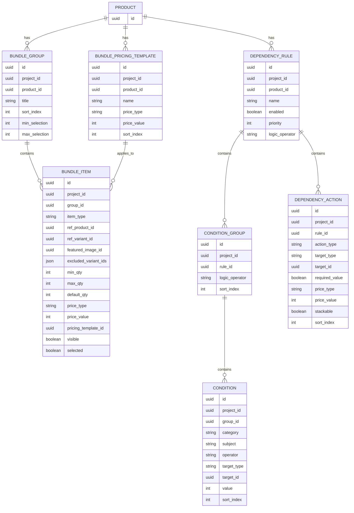
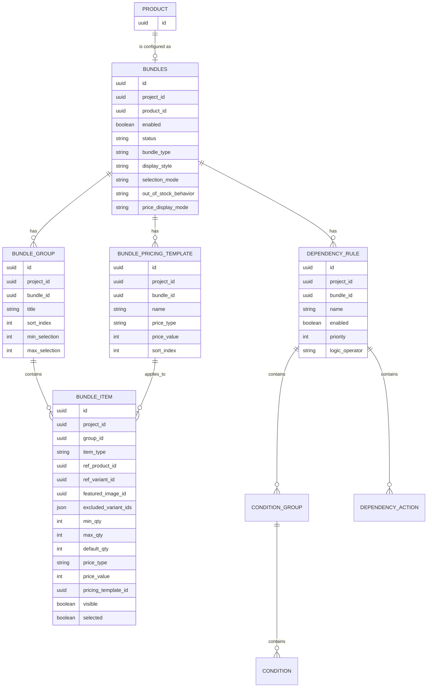

# Bundles API Database Plan

## Цель

Описать фактическую схему базы данных для bundles в catalog service и зафиксировать, каких данных не хватает для полноценной интеграции bundles с admin API, storefront API, inventory offers и checkout.

Текущая реализация хранит bundle как набор таблиц, которые напрямую ссылаются на product через `product_id`.

Целевая модель должна быть другой: нужна отдельная таблица `bundles`, которая является aggregate root для bundle configuration. Product связан с `bundles` отношением 1:1. Наличие row в `bundles` для `product_id` является признаком, что product является bundle. Группы, pricing templates, dependency rules и остальные bundle-настройки должны ссылаться на `bundle_id`, а не напрямую на `product_id`.

## Текущая схема

Фактическая схема находится в `services/catalog/src/repositories/models/bundle.ts` и уже создана в `catalog` schema.

### `bundle_pricing_template`

Переиспользуемый шаблон цены для bundle items.

| Колонка | Тип | Обязательность | Назначение |
| --- | --- | --- | --- |
| `id` | `uuid` | yes | Primary key. |
| `project_id` | `uuid` | yes | Tenant/project scope. |
| `product_id` | `uuid` | yes | Product, которому принадлежит bundle config. Логическая ссылка на product. |
| `name` | `varchar(255)` | yes | Название шаблона. |
| `price_type` | `varchar(32)` | yes | Тип pricing rule. |
| `price_value` | `integer` | no | Значение в minor units или процентах, зависит от `price_type`. |
| `sort_index` | `integer` | yes | Порядок отображения шаблонов. |

Индексы:

- `idx_bundle_pricing_template_product_id(product_id)`
- `idx_bundle_pricing_template_project_id(project_id)`

### `bundle_group`

Группа выбора внутри bundle, например "Choose processor" или "Accessories".

| Колонка | Тип | Обязательность | Назначение |
| --- | --- | --- | --- |
| `id` | `uuid` | yes | Primary key. |
| `project_id` | `uuid` | yes | Tenant/project scope. |
| `product_id` | `uuid` | yes | Product, которому принадлежит группа. |
| `title` | `varchar(255)` | yes | Название группы. |
| `sort_index` | `integer` | yes | Порядок группы внутри bundle. |
| `min_selection` | `integer` | no | Минимальное количество выбранных items в группе. |
| `max_selection` | `integer` | no | Максимальное количество выбранных items в группе. |
| `created_at` | `timestamp with timezone` | yes | Creation timestamp. |
| `updated_at` | `timestamp with timezone` | yes | Update timestamp. |

Индексы:

- `idx_bundle_group_product_id(product_id)`
- `idx_bundle_group_sort(product_id, sort_index)`
- `idx_bundle_group_project_id(project_id)`

### `bundle_item`

Опция внутри группы. Может ссылаться на product или на конкретный variant.

| Колонка | Тип | Обязательность | Назначение |
| --- | --- | --- | --- |
| `id` | `uuid` | yes | Primary key. |
| `project_id` | `uuid` | yes | Tenant/project scope. |
| `group_id` | `uuid` | yes | FK на `bundle_group.id`, cascade delete. |
| `item_type` | `varchar(32)` | yes | `PRODUCT` или `VARIANT`. |
| `sort_index` | `integer` | yes | Порядок item внутри группы. |
| `ref_product_id` | `uuid` | no | Product reference для `PRODUCT` item. |
| `ref_variant_id` | `uuid` | no | Variant reference для `VARIANT` item. |
| `title` | `varchar(255)` | no | Override названия item. |
| `featured_image_id` | `uuid` | no | Override изображения. Логическая ссылка на media file. |
| `excluded_variant_ids` | `jsonb string[]` | no | Исключенные variants для `PRODUCT` item. |
| `min_qty` | `integer` | no | Минимальное количество этого item. Default в модели: `1`. |
| `max_qty` | `integer` | no | Максимальное количество этого item. |
| `default_qty` | `integer` | no | Количество по умолчанию. Default в модели: `1`. |
| `price_type` | `varchar(32)` | no | Inline pricing rule. |
| `price_value` | `integer` | no | Inline pricing value. |
| `pricing_template_id` | `uuid` | no | FK на `bundle_pricing_template.id`, `set null` on delete. |
| `visible` | `boolean` | yes | Видимость в configurator. |
| `selected` | `boolean` | yes | Выбран по умолчанию. |
| `created_at` | `timestamp with timezone` | yes | Creation timestamp. |
| `updated_at` | `timestamp with timezone` | yes | Update timestamp. |

Индексы:

- `idx_bundle_item_group_id(group_id)`
- `idx_bundle_item_ref_product_id(ref_product_id)`
- `idx_bundle_item_ref_variant_id(ref_variant_id)`
- `idx_bundle_item_sort(group_id, sort_index)`
- `idx_bundle_item_project_id(project_id)`

### `dependency_rule`

Правило, которое управляет поведением bundle configurator.

| Колонка | Тип | Обязательность | Назначение |
| --- | --- | --- | --- |
| `id` | `uuid` | yes | Primary key. |
| `project_id` | `uuid` | yes | Tenant/project scope. |
| `product_id` | `uuid` | yes | Product, которому принадлежит rule. |
| `name` | `varchar(255)` | yes | Название rule. |
| `enabled` | `boolean` | yes | Включено ли правило. |
| `priority` | `integer` | yes | Приоритет выполнения. |
| `logic_operator` | `varchar(8)` | yes | `AND` или `OR` для condition groups. |
| `created_at` | `timestamp with timezone` | yes | Creation timestamp. |
| `updated_at` | `timestamp with timezone` | yes | Update timestamp. |

Индексы:

- `idx_dependency_rule_product_id(product_id)`
- `idx_dependency_rule_priority(product_id, priority)`
- `idx_dependency_rule_project_id(project_id)`

### `condition_group`

Группа условий внутри dependency rule.

| Колонка | Тип | Обязательность | Назначение |
| --- | --- | --- | --- |
| `id` | `uuid` | yes | Primary key. |
| `project_id` | `uuid` | yes | Tenant/project scope. |
| `rule_id` | `uuid` | yes | FK на `dependency_rule.id`, cascade delete. |
| `logic_operator` | `varchar(8)` | yes | `AND` или `OR` для conditions внутри группы. |
| `sort_index` | `integer` | yes | Порядок condition group. |

Индексы:

- `idx_condition_group_rule_id(rule_id)`
- `idx_condition_group_project_id(project_id)`

### `condition`

Одно условие dependency rule.

| Колонка | Тип | Обязательность | Назначение |
| --- | --- | --- | --- |
| `id` | `uuid` | yes | Primary key. |
| `project_id` | `uuid` | yes | Tenant/project scope. |
| `group_id` | `uuid` | yes | FK на `condition_group.id`, cascade delete. |
| `category` | `varchar(32)` | yes | `STATE_CHECK` или `NUMERIC`. |
| `subject` | `varchar(32)` | yes | `ITEM_SELECTED`, `ITEM_QTY`, `GROUP_TOTAL_QTY`. |
| `operator` | `varchar(32)` | yes | Operator для category/subject. |
| `target_type` | `varchar(32)` | yes | `ITEM`, `GROUP`, `BUNDLE`. |
| `target_id` | `uuid` | yes | ID target entity. Для `BUNDLE` текущая модель всё равно требует UUID. |
| `value` | `integer` | no | Numeric value для numeric conditions. |
| `sort_index` | `integer` | yes | Порядок условия внутри condition group. |

Индексы:

- `idx_condition_group_id(group_id)`
- `idx_condition_target(target_type, target_id)`
- `idx_condition_project_id(project_id)`

### `dependency_action`

Действие, которое применяется при совпадении dependency rule.

| Колонка | Тип | Обязательность | Назначение |
| --- | --- | --- | --- |
| `id` | `uuid` | yes | Primary key. |
| `project_id` | `uuid` | yes | Tenant/project scope. |
| `rule_id` | `uuid` | yes | FK на `dependency_rule.id`, cascade delete. |
| `action_type` | `varchar(32)` | yes | `SHOW`, `HIDE`, `SET_REQUIRED`, `ADJUST_PRICE`. |
| `target_type` | `varchar(32)` | yes | `ITEM`, `GROUP`, `BUNDLE`. |
| `target_id` | `uuid` | no | ID target entity. Nullable для `BUNDLE`. |
| `required_value` | `boolean` | no | Значение для `SET_REQUIRED`. |
| `price_type` | `varchar(32)` | no | Pricing action type для `ADJUST_PRICE`. |
| `price_value` | `integer` | no | Pricing action value. |
| `stackable` | `boolean` | yes | Можно ли складывать action с другими actions. |
| `sort_index` | `integer` | yes | Порядок actions внутри rule. |

Индексы:

- `idx_dependency_action_rule_id(rule_id)`
- `idx_dependency_action_target(target_type, target_id)`
- `idx_dependency_action_project_id(project_id)`

## Текущая ER-модель



## Целевая модель

### Главный принцип

`product` отвечает за товарную сущность: handle, publish status, title, variants, media, SEO.

`bundles` отвечает за bundle configuration: группы, items, templates, dependency rules, storefront behavior и checkout behavior.

Связь:

```text
product 1:0..1 bundles
bundles 1:N bundle_group
bundles 1:N bundle_pricing_template
bundles 1:N dependency_rule
```

Если для product существует row в `bundles`, этот product считается bundle product.

### Новая таблица `bundles`

Aggregate root для bundle configuration.

| Колонка | Тип | Обязательность | Назначение |
| --- | --- | --- | --- |
| `id` | `uuid` | yes | Primary key. Используется как `Bundle.id` в API. |
| `project_id` | `uuid` | yes | Tenant/project scope. |
| `product_id` | `uuid` | yes | Product, который является bundle product. |
| `enabled` | `boolean` | yes | Включено ли bundle behavior для storefront/checkout. |
| `status` | `varchar(32)` | no | Статус bundle config, если product status недостаточен: `DRAFT`, `ACTIVE`, `ARCHIVED`. |
| `bundle_type` | `varchar(32)` | no | Admin preset/type: `FIXED`, `MIX_AND_MATCH`, `CUSTOM`, etc. |
| `display_style` | `varchar(32)` | no | Storefront UI: `ACCORDION`, `TABS`, `FLAT`, `WIZARD`. |
| `selection_mode` | `varchar(32)` | no | Модель выбора items, например guided/free-form. |
| `out_of_stock_behavior` | `varchar(32)` | no | `HIDE`, `DISABLE`, `BACKORDER`. |
| `price_display_mode` | `varchar(32)` | no | Как показывать bundle price breakdown. |
| `created_at` | `timestamp with timezone` | yes | Creation timestamp. |
| `updated_at` | `timestamp with timezone` | yes | Update timestamp. |

Индексы/constraints:

- primary key `(id)`
- unique `(project_id, product_id)`
- index `(project_id, enabled)`
- index `(project_id, status)`

Важно: `product_id` остается только на `bundles`. Остальные bundle tables должны получать принадлежность к product через `bundle_id -> bundles.product_id`.

### Изменения существующих таблиц

#### `bundle_pricing_template`

Текущая колонка `product_id` должна быть заменена на `bundle_id`.

Целевые поля владельца:

| Колонка | Тип | Назначение |
| --- | --- | --- |
| `bundle_id` | `uuid` | FK на `bundles.id`, cascade delete. |
| `project_id` | `uuid` | Tenant/project scope, остается для быстрых scoped queries. |

Целевые индексы:

- `idx_bundle_pricing_template_bundle_id(bundle_id)`
- `idx_bundle_pricing_template_project_id(project_id)`
- optional `idx_bundle_pricing_template_sort(bundle_id, sort_index)`

#### `bundle_group`

Текущая колонка `product_id` должна быть заменена на `bundle_id`.

Целевые поля владельца:

| Колонка | Тип | Назначение |
| --- | --- | --- |
| `bundle_id` | `uuid` | FK на `bundles.id`, cascade delete. |
| `project_id` | `uuid` | Tenant/project scope. |

Целевые индексы:

- `idx_bundle_group_bundle_id(bundle_id)`
- `idx_bundle_group_sort(bundle_id, sort_index)`
- `idx_bundle_group_project_id(project_id)`

#### `dependency_rule`

Текущая колонка `product_id` должна быть заменена на `bundle_id`.

Целевые поля владельца:

| Колонка | Тип | Назначение |
| --- | --- | --- |
| `bundle_id` | `uuid` | FK на `bundles.id`, cascade delete. |
| `project_id` | `uuid` | Tenant/project scope. |

Целевые индексы:

- `idx_dependency_rule_bundle_id(bundle_id)`
- `idx_dependency_rule_priority(bundle_id, priority)`
- `idx_dependency_rule_project_id(project_id)`

#### `bundle_item`

`bundle_item` уже принадлежит bundle через `group_id -> bundle_group`. Прямой `bundle_id` не обязателен.

Оставить:

- `group_id` как FK на `bundle_group.id`.
- `project_id` для scoped queries.
- `ref_product_id`/`ref_variant_id` как ссылки на товар или variant, которые входят в bundle.

Опционально можно добавить denormalized `bundle_id` только если это нужно для быстрых queries и constraints. На первом этапе лучше не дублировать owner, чтобы не получить рассинхронизацию.

#### `condition_group`, `condition`, `dependency_action`

Эти таблицы уже принадлежат bundle через `rule_id -> dependency_rule -> bundles`. Прямой `bundle_id` не обязателен.

`condition.target_id` для `target_type = BUNDLE` должен ссылаться на `bundles.id`. Это снимает текущую неоднозначность, где target bundle мог означать product id или nullable target.

### Целевая ER-модель



## Что нужно спроектировать

### 1. `bundles` as aggregate root

Нужно создать таблицу `bundles` и перевести owner-связи с `product_id` на `bundle_id`.

Зачем это нужно:

- `bundles` list query без тяжелого join по groups.
- Явное включение/выключение bundle behavior.
- Настройки storefront configurator.
- Разделение product publish status и bundle config readiness.
- Единый target id для dependency rules на уровне всего bundle.
- Явный признак, что product является bundle: наличие row `(project_id, product_id)` в `bundles`.

### 2. Stable public bundle identity

После добавления `bundles` публичная identity должна быть `bundles.id`.

API aggregate должен отдавать оба поля:

```graphql
type Bundle implements Node {
  id: ID!
  product: Product!
  productId: ID!
  enabled: Boolean!
  groups: [BundleGroup!]!
  pricingTemplates: [BundlePricingTemplate!]!
  dependencyRules: [DependencyRule!]!
}
```

`Product.bundle` должен возвращать `Bundle | null`. Если `bundle != null`, product является bundle product.

### 3. Storefront projection fields

Storefront и inventory plugin нуждаются в denormalized read shape:

- parent product id;
- groups in display order;
- items in display order;
- resolved variant/product data;
- effective price config после template fallback;
- visibility/default selection;
- quantity limits;
- dependency rules, если configurator применяет их на клиенте.

Можно не создавать отдельную таблицу на первом этапе, но нужно спроектировать read model или resolver contract. Если производительность станет проблемой, добавить projection table.

Вариант projection table: `bundle_storefront_projection`.

| Колонка | Тип | Назначение |
| --- | --- | --- |
| `project_id` | `uuid` | Tenant/project scope. |
| `bundle_id` | `uuid` | Bundle owner. |
| `product_id` | `uuid` | Denormalized product owner, optional. Можно получить через `bundles.product_id`. |
| `revision` | `integer` | Revision source для cache invalidation. |
| `payload` | `jsonb` | Собранный storefront bundle contract. |
| `updated_at` | `timestamp with timezone` | Projection timestamp. |

Constraints:

- primary/unique `(project_id, bundle_id)`

### 4. Price type compatibility

В текущей catalog schema price type хранится как string, а API enum сейчас такой:

- `BASE`
- `FREE`
- `FIXED`
- `PERCENT_OFF`
- `AMOUNT_OFF`

Checkout/inventory используют другой набор:

- `BASE`
- `FREE`
- `DISCOUNT_AMOUNT`
- `DISCOUNT_PERCENT`
- `MARKUP_AMOUNT`
- `MARKUP_PERCENT`
- `OVERRIDE`

Нужно спроектировать canonical enum и mapping. Без этого storefront bundle config и checkout line `priceConfig` будут расходиться.

Рекомендация:

- В catalog хранить canonical bundle price type, близкий к checkout semantics:
  `BASE`, `FREE`, `OVERRIDE`, `DISCOUNT_AMOUNT`, `DISCOUNT_PERCENT`, `MARKUP_AMOUNT`, `MARKUP_PERCENT`.
- В admin API можно временно маппить старые names:
  `FIXED -> OVERRIDE`, `PERCENT_OFF -> DISCOUNT_PERCENT`, `AMOUNT_OFF -> DISCOUNT_AMOUNT`.
- Для процентов хранить `price_value` как basis points или numeric percent. Сейчас `integer` не фиксирует смысл, это нужно явно описать.

### 5. Money and currency model

`price_value` сейчас integer без currency. Это нормально для relative discount, но недостаточно для fixed/override amount, если product prices мультивалютные.

Нужно выбрать один вариант:

1. `price_value` всегда в minor units default currency проекта.
2. Добавить `currency_code` к `bundle_pricing_template`, `bundle_item`, `dependency_action`.
3. Вынести amount pricing в price list/pricing service, а bundle хранит только price adjustment rule.

Рекомендация для первого API этапа: хранить fixed amount в currency checkout/product price context и явно документировать, что `price_value` применяется в minor units текущей currency только если pricing layer может это гарантировать. Если нет, добавить `currency_code`.

### 6. Item reference integrity

`bundle_item` допускает обе nullable ссылки: `ref_product_id`, `ref_variant_id`. Нужно добавить DB-level или script-level constraints:

- `item_type = PRODUCT` требует `ref_product_id IS NOT NULL` и `ref_variant_id IS NULL`.
- `item_type = VARIANT` требует `ref_variant_id IS NOT NULL` и `ref_product_id IS NULL`.
- `pricing_template_id`, если указан, должен принадлежать тому же `project_id` и тому же `bundle_id`.
- `featured_image_id`, если указан, должен быть доступен в том же project.

DB-level check constraints в Drizzle можно добавить отдельно. Если cross-table ownership сложно проверить в DB, это должно быть обязательной script validation.

### 7. Selection validation model

Сейчас есть:

- group-level `min_selection`, `max_selection`;
- item-level `min_qty`, `max_qty`, `default_qty`, `selected`;
- dependency action `SET_REQUIRED`.

Не хватает явного результата validation для checkout:

- какая группа обязательна после dependency rules;
- какие items видимы/доступны;
- какие default selections применены;
- почему выбор невалиден.

Это можно решать без новых таблиц, но нужен API model:

```graphql
type BundleSelectionValidation {
  valid: Boolean!
  errors: [BundleSelectionError!]!
  normalizedSelection: BundleSelection!
  appliedActions: [BundleAppliedAction!]!
}
```

Если validation должна быть auditable, добавить таблицу не нужно; checkout snapshot должен хранить applied config.

### 8. Checkout snapshot fields

Checkout line уже хранит parent/child hierarchy и `priceConfig`, но API input принимает только `purchasableId` child item. Этого мало, если один variant встречается в нескольких bundle items или groups.

Нужно спроектировать хранение в checkout line snapshot:

| Данные | Назначение |
| --- | --- |
| `bundle_id` | Bundle aggregate id. |
| `bundle_product_id` | Parent bundle product. Можно денормализовать из `bundles.product_id`. |
| `bundle_group_id` | Из какой группы выбран child. |
| `bundle_item_id` | Какой bundle item выбран. |
| `bundle_rule_revision` | Какая версия bundle config применена. |
| `applied_price_type` | Canonical price type. |
| `applied_price_value` | Applied value. |

Это может быть отдельными колонками в checkout line table или частью existing snapshot JSON. Для query/filter/debug лучше отдельные nullable columns на child lines.

### 9. Dependency target consistency

`condition.target_id` сейчас non-null, но `target_type = BUNDLE` не имеет естественного target id в текущей схеме, кроме product id.

После введения `bundles` решение должно быть однозначным: для `target_type = BUNDLE` использовать `bundles.id` как `target_id` и валидировать это в scripts.

### 10. Reorder and batch update data

Текущий `sort_index` подходит для drag-and-drop, но API должен поддерживать batch mutations:

- reorder groups внутри product;
- reorder items внутри group;
- reorder templates;
- reorder rules/actions/conditions.

Для этого не нужны новые таблицы, но нужны repository methods и mutation inputs, которые обновляют complete ordered list атомарно.

### 11. Back references for "included in bundles"

Product details UI показывает bundles, в которые входит product. Сейчас это можно получить через:

- `bundle_item.ref_product_id = product.id`;
- `bundle_item.ref_variant_id IN product variants`.

Для API list это потенциально дорогой запрос. Нужно спроектировать либо optimized query, либо projection table.

Вариант table: `bundle_item_reference_projection`.

| Колонка | Тип | Назначение |
| --- | --- | --- |
| `project_id` | `uuid` | Tenant/project scope. |
| `bundle_id` | `uuid` | Bundle owner. |
| `bundle_product_id` | `uuid` | Product, который является bundle owner. Optional denormalized field. |
| `referenced_product_id` | `uuid` | Product, который входит в bundle. |
| `referenced_variant_id` | `uuid` | Variant, который входит в bundle, nullable. |
| `bundle_item_id` | `uuid` | Source bundle item. |

Эту projection можно отложить до появления проблем с performance.

## Рекомендуемая целевая схема

Минимальный набор новых данных для API integration:

1. `bundles`
   - Явный aggregate root для bundle.
   - Хранит status/settings/display behavior.
   - Дает стабильный `Bundle.id`.
   - Связан с product 1:1 через unique `(project_id, product_id)`.
   - Является признаком, что product это bundle.

2. Canonical price enum/mapping
   - Не обязательно новая таблица.
   - Нужно миграционное решение для existing `price_type` strings.

3. Checkout bundle selection metadata
   - Либо nullable columns на checkout lines, либо structured snapshot.
   - Нужна связь child line с `bundle_group_id` и `bundle_item_id`.

4. Storefront projection
   - Можно начать с resolver/read model без таблицы.
   - Таблицу добавить, если query станет тяжелым.

Опционально позже:

5. `bundle_item_reference_projection`
   - Для быстрых "included in bundles" списков в admin product details.

## Миграционный порядок

1. Добавить таблицу `bundles`.
2. Backfill `bundles` по уникальному набору `product_id` из `bundle_group`, `bundle_pricing_template`, `dependency_rule`.
3. Добавить nullable `bundle_id` в `bundle_group`, `bundle_pricing_template`, `dependency_rule`.
4. Backfill `bundle_id` через `bundles.product_id`.
5. Перевести repositories/loaders/resolvers/scripts на `bundle_id`.
6. Сделать `bundle_id` not null и добавить FK на `bundles.id`.
7. Удалить или deprecated `product_id` из child tables после миграционного окна.
8. Добавить API aggregate `Bundle`, который читает `bundles` и child tables по `bundle_id`.
9. Зафиксировать canonical price enum и добавить mapper старых значений.
10. Расширить storefront API bundle shape.
11. Расширить checkout input/snapshot для `bundleId`, `bundleGroupId` и `bundleItemId`.
12. После стабилизации API решить, нужна ли projection table для storefront и back references.

## Открытые решения

1. Bundle lifecycle должен наследовать product status или иметь отдельный `bundles.status`.
2. Fixed/override bundle prices должны быть currency-aware или всегда вычисляться pricing layer.
3. Dependency rules исполняются на storefront, в catalog validation API, в inventory offers или в checkout.
4. `PRODUCT` bundle item должен раскрывать все variants на storefront или требовать выбора конкретного variant до checkout.
5. Нужен ли denormalized `product_id` в projection/read tables, если canonical owner уже `bundle_id`.
