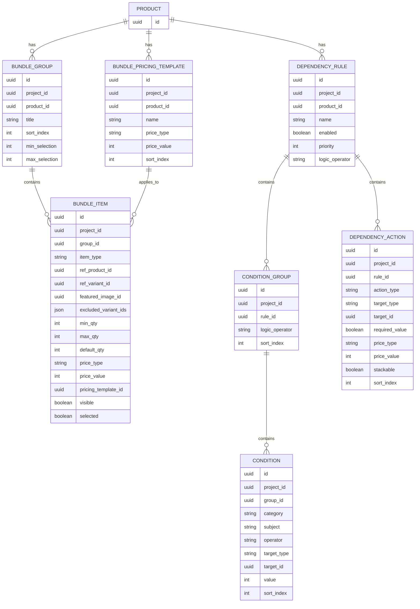
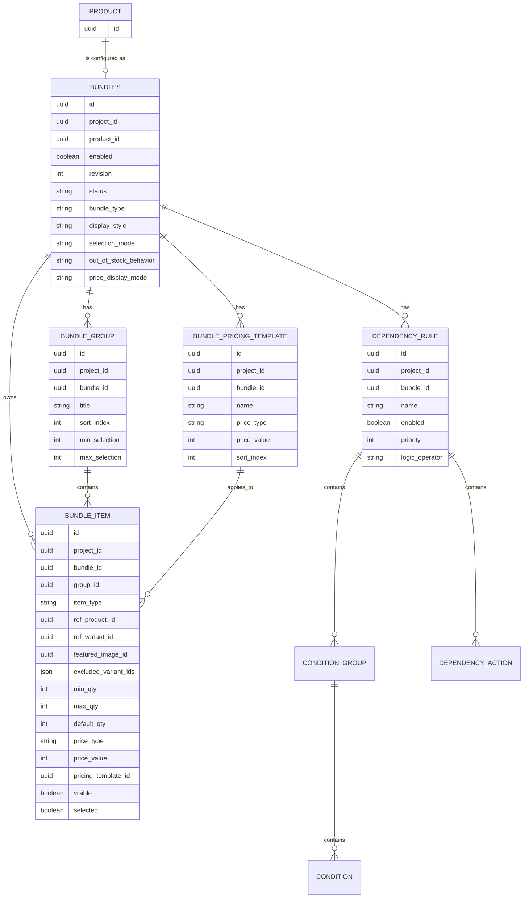

# Bundles API Database Plan

## Цель

Описать фактическую схему базы данных для bundles в catalog service и зафиксировать, каких данных не хватает для полноценной интеграции bundles с admin API, storefront API, inventory offers и checkout.

Текущая реализация хранит bundle как набор таблиц, которые напрямую ссылаются на product через `product_id`.

Целевая модель должна быть другой: нужна отдельная таблица `bundles`, которая является aggregate root для bundle configuration. Product связан с `bundles` отношением 1:1. Наличие row в `bundles` для `product_id` является признаком, что product является bundle. Группы, pricing templates, dependency rules и остальные bundle-настройки должны ссылаться на `bundle_id`, а не напрямую на `product_id`.

## Текущая схема

Фактическая схема находится в `services/catalog/src/repositories/models/bundle.ts` и уже создана в `catalog` schema.

### `bundle_pricing_template`

Переиспользуемый шаблон цены для bundle items.

| Колонка | Тип | Обязательность | Назначение |
| --- | --- | --- | --- |
| `id` | `uuid` | yes | Primary key. |
| `project_id` | `uuid` | yes | Tenant/project scope. |
| `product_id` | `uuid` | yes | Product, которому принадлежит bundle config. Логическая ссылка на product. |
| `name` | `varchar(255)` | yes | Название шаблона. |
| `price_type` | `varchar(32)` | yes | Тип pricing rule. |
| `price_value` | `integer` | no | Значение в minor units или процентах, зависит от `price_type`. |
| `sort_index` | `integer` | yes | Порядок отображения шаблонов. |

Индексы:

- `idx_bundle_pricing_template_product_id(product_id)`
- `idx_bundle_pricing_template_project_id(project_id)`

### `bundle_group`

Группа выбора внутри bundle, например "Choose processor" или "Accessories".

| Колонка | Тип | Обязательность | Назначение |
| --- | --- | --- | --- |
| `id` | `uuid` | yes | Primary key. |
| `project_id` | `uuid` | yes | Tenant/project scope. |
| `product_id` | `uuid` | yes | Product, которому принадлежит группа. |
| `title` | `varchar(255)` | yes | Название группы. |
| `sort_index` | `integer` | yes | Порядок группы внутри bundle. |
| `min_selection` | `integer` | no | Минимальное количество выбранных items в группе. |
| `max_selection` | `integer` | no | Максимальное количество выбранных items в группе. |
| `created_at` | `timestamp with timezone` | yes | Creation timestamp. |
| `updated_at` | `timestamp with timezone` | yes | Update timestamp. |

Индексы:

- `idx_bundle_group_product_id(product_id)`
- `idx_bundle_group_sort(product_id, sort_index)`
- `idx_bundle_group_project_id(project_id)`

### `bundle_item`

Опция внутри группы. Может ссылаться на product или на конкретный variant.

| Колонка | Тип | Обязательность | Назначение |
| --- | --- | --- | --- |
| `id` | `uuid` | yes | Primary key. |
| `project_id` | `uuid` | yes | Tenant/project scope. |
| `group_id` | `uuid` | yes | FK на `bundle_group.id`, cascade delete. |
| `item_type` | `varchar(32)` | yes | `PRODUCT` или `VARIANT`. |
| `sort_index` | `integer` | yes | Порядок item внутри группы. |
| `ref_product_id` | `uuid` | no | Product reference для `PRODUCT` item. |
| `ref_variant_id` | `uuid` | no | Variant reference для `VARIANT` item. |
| `title` | `varchar(255)` | no | Override названия item. |
| `featured_image_id` | `uuid` | no | Override изображения. Логическая ссылка на media file. |
| `excluded_variant_ids` | `jsonb string[]` | no | Исключенные variants для `PRODUCT` item. |
| `min_qty` | `integer` | no | Минимальное количество этого item. Default в модели: `1`. |
| `max_qty` | `integer` | no | Максимальное количество этого item. |
| `default_qty` | `integer` | no | Количество по умолчанию. Default в модели: `1`. |
| `price_type` | `varchar(32)` | no | Inline pricing rule. |
| `price_value` | `integer` | no | Inline pricing value. |
| `pricing_template_id` | `uuid` | no | FK на `bundle_pricing_template.id`, `set null` on delete. |
| `visible` | `boolean` | yes | Видимость в configurator. |
| `selected` | `boolean` | yes | Выбран по умолчанию. |
| `created_at` | `timestamp with timezone` | yes | Creation timestamp. |
| `updated_at` | `timestamp with timezone` | yes | Update timestamp. |

Индексы:

- `idx_bundle_item_group_id(group_id)`
- `idx_bundle_item_ref_product_id(ref_product_id)`
- `idx_bundle_item_ref_variant_id(ref_variant_id)`
- `idx_bundle_item_sort(group_id, sort_index)`
- `idx_bundle_item_project_id(project_id)`

### `dependency_rule`

Правило, которое управляет поведением bundle configurator.

| Колонка | Тип | Обязательность | Назначение |
| --- | --- | --- | --- |
| `id` | `uuid` | yes | Primary key. |
| `project_id` | `uuid` | yes | Tenant/project scope. |
| `product_id` | `uuid` | yes | Product, которому принадлежит rule. |
| `name` | `varchar(255)` | yes | Название rule. |
| `enabled` | `boolean` | yes | Включено ли правило. |
| `priority` | `integer` | yes | Приоритет выполнения. |
| `logic_operator` | `varchar(8)` | yes | `AND` или `OR` для condition groups. |
| `created_at` | `timestamp with timezone` | yes | Creation timestamp. |
| `updated_at` | `timestamp with timezone` | yes | Update timestamp. |

Индексы:

- `idx_dependency_rule_product_id(product_id)`
- `idx_dependency_rule_priority(product_id, priority)`
- `idx_dependency_rule_project_id(project_id)`

### `condition_group`

Группа условий внутри dependency rule.

| Колонка | Тип | Обязательность | Назначение |
| --- | --- | --- | --- |
| `id` | `uuid` | yes | Primary key. |
| `project_id` | `uuid` | yes | Tenant/project scope. |
| `rule_id` | `uuid` | yes | FK на `dependency_rule.id`, cascade delete. |
| `logic_operator` | `varchar(8)` | yes | `AND` или `OR` для conditions внутри группы. |
| `sort_index` | `integer` | yes | Порядок condition group. |

Индексы:

- `idx_condition_group_rule_id(rule_id)`
- `idx_condition_group_project_id(project_id)`

### `condition`

Одно условие dependency rule.

| Колонка | Тип | Обязательность | Назначение |
| --- | --- | --- | --- |
| `id` | `uuid` | yes | Primary key. |
| `project_id` | `uuid` | yes | Tenant/project scope. |
| `group_id` | `uuid` | yes | FK на `condition_group.id`, cascade delete. |
| `category` | `varchar(32)` | yes | `STATE_CHECK` или `NUMERIC`. |
| `subject` | `varchar(32)` | yes | `ITEM_SELECTED`, `ITEM_QTY`, `GROUP_TOTAL_QTY`. |
| `operator` | `varchar(32)` | yes | Operator для category/subject. |
| `target_type` | `varchar(32)` | yes | `ITEM`, `GROUP`, `BUNDLE`. |
| `target_id` | `uuid` | yes | ID target entity. Для `BUNDLE` текущая модель всё равно требует UUID. |
| `value` | `integer` | no | Numeric value для numeric conditions. |
| `sort_index` | `integer` | yes | Порядок условия внутри condition group. |

Индексы:

- `idx_condition_group_id(group_id)`
- `idx_condition_target(target_type, target_id)`
- `idx_condition_project_id(project_id)`

### `dependency_action`

Действие, которое применяется при совпадении dependency rule.

| Колонка | Тип | Обязательность | Назначение |
| --- | --- | --- | --- |
| `id` | `uuid` | yes | Primary key. |
| `project_id` | `uuid` | yes | Tenant/project scope. |
| `rule_id` | `uuid` | yes | FK на `dependency_rule.id`, cascade delete. |
| `action_type` | `varchar(32)` | yes | `SHOW`, `HIDE`, `SET_REQUIRED`, `ADJUST_PRICE`. |
| `target_type` | `varchar(32)` | yes | `ITEM`, `GROUP`, `BUNDLE`. |
| `target_id` | `uuid` | no | ID target entity. Nullable для `BUNDLE`. |
| `required_value` | `boolean` | no | Значение для `SET_REQUIRED`. |
| `price_type` | `varchar(32)` | no | Pricing action type для `ADJUST_PRICE`. |
| `price_value` | `integer` | no | Pricing action value. |
| `stackable` | `boolean` | yes | Можно ли складывать action с другими actions. |
| `sort_index` | `integer` | yes | Порядок actions внутри rule. |

Индексы:

- `idx_dependency_action_rule_id(rule_id)`
- `idx_dependency_action_target(target_type, target_id)`
- `idx_dependency_action_project_id(project_id)`

## Текущая ER-модель



## Целевая модель

### Главный принцип

`product` отвечает за товарную сущность: handle, publish status, title, variants, media, SEO.

`bundles` отвечает за bundle configuration: группы, items, templates, dependency rules, storefront behavior и checkout behavior.

Связь:

```text
product 1:0..1 bundles
bundles 1:N bundle_group
bundles 1:N bundle_item (denormalized owner for DB-level integrity)
bundles 1:N bundle_pricing_template
bundles 1:N dependency_rule
```

Если для product существует row в `bundles`, этот product считается bundle product.

### Новая таблица `bundles`

Aggregate root для bundle configuration.

| Колонка | Тип | Обязательность | Назначение |
| --- | --- | --- | --- |
| `id` | `uuid` | yes | Primary key. Используется как `Bundle.id` в API. |
| `project_id` | `uuid` | yes | Tenant/project scope. |
| `product_id` | `uuid` | yes | Product, который является bundle product. |
| `enabled` | `boolean` | yes | Включено ли bundle behavior для storefront/checkout. |
| `revision` | `integer` | yes | Версия bundle configuration для cache invalidation, storefront projection и checkout snapshot. Default `0`. |
| `status` | `varchar(32)` | no | Статус bundle config, если product status недостаточен: `DRAFT`, `ACTIVE`, `ARCHIVED`. |
| `bundle_type` | `varchar(32)` | no | Admin preset/type: `FIXED`, `MIX_AND_MATCH`, `CUSTOM`, etc. |
| `display_style` | `varchar(32)` | no | Storefront UI: `ACCORDION`, `TABS`, `FLAT`, `WIZARD`. |
| `selection_mode` | `varchar(32)` | no | Модель выбора items, например guided/free-form. |
| `out_of_stock_behavior` | `varchar(32)` | no | `HIDE`, `DISABLE`, `BACKORDER`. |
| `price_display_mode` | `varchar(32)` | no | Как показывать bundle price breakdown. |
| `created_at` | `timestamp with timezone` | yes | Creation timestamp. |
| `updated_at` | `timestamp with timezone` | yes | Update timestamp. |

Индексы/constraints:

- primary key `(id)`
- unique `(project_id, id)` для составных FK и tenant-safe references
- unique `(project_id, product_id)`
- FK `(project_id, product_id)` -> `product(project_id, id)`, `cascade` on delete
- index `(project_id, enabled)`
- index `(project_id, status)`

Важно:

- `product_id` остается только на `bundles`. Остальные bundle tables должны получать принадлежность к product через `bundle_id -> bundles.product_id`.
- Все FK из bundle child tables должны быть tenant-safe: `(project_id, bundle_id)` -> `bundles(project_id, id)`, а не только `bundle_id -> bundles.id`.
- Все repositories/loaders/resolvers продолжают фильтровать по `project_id`/`storeId`.
- `revision` инкрементится при любом изменении bundle configuration: groups, items, templates, dependency rules, conditions, actions и storefront/checkout behavior fields. Checkout snapshot должен хранить revision, с которым была провалидирована selection.

### Изменения существующих таблиц

#### `bundle_pricing_template`

Текущая колонка `product_id` должна быть заменена на `bundle_id`.

Целевые поля владельца:

| Колонка | Тип | Назначение |
| --- | --- | --- |
| `bundle_id` | `uuid` | FK на `bundles.id`, cascade delete. |
| `project_id` | `uuid` | Tenant/project scope, остается для быстрых scoped queries. |

Целевые индексы:

- `idx_bundle_pricing_template_bundle_id(bundle_id)`
- `idx_bundle_pricing_template_project_id(project_id)`
- optional `idx_bundle_pricing_template_sort(bundle_id, sort_index)`

Целевые constraints:

- unique `(project_id, id)` для tenant-safe references.
- unique `(project_id, bundle_id, id)` для same-bundle references из `bundle_item`.
- FK `(project_id, bundle_id)` -> `bundles(project_id, id)`, cascade delete.

#### `bundle_group`

Текущая колонка `product_id` должна быть заменена на `bundle_id`.

Целевые поля владельца:

| Колонка | Тип | Назначение |
| --- | --- | --- |
| `bundle_id` | `uuid` | FK на `bundles.id`, cascade delete. |
| `project_id` | `uuid` | Tenant/project scope. |

Целевые индексы:

- `idx_bundle_group_bundle_id(bundle_id)`
- `idx_bundle_group_sort(bundle_id, sort_index)`
- `idx_bundle_group_project_id(project_id)`

Целевые constraints:

- unique `(project_id, id)` для tenant-safe references из `bundle_item`.
- unique `(project_id, bundle_id, id)` для защиты `bundle_item.bundle_id` от рассинхронизации с `group_id`.
- FK `(project_id, bundle_id)` -> `bundles(project_id, id)`, cascade delete.

#### `dependency_rule`

Текущая колонка `product_id` должна быть заменена на `bundle_id`.

Целевые поля владельца:

| Колонка | Тип | Назначение |
| --- | --- | --- |
| `bundle_id` | `uuid` | FK на `bundles.id`, cascade delete. |
| `project_id` | `uuid` | Tenant/project scope. |

Целевые индексы:

- `idx_dependency_rule_bundle_id(bundle_id)`
- `idx_dependency_rule_priority(bundle_id, priority)`
- `idx_dependency_rule_project_id(project_id)`

Целевые constraints:

- unique `(project_id, id)` для tenant-safe references из `condition_group` и `dependency_action`.
- FK `(project_id, bundle_id)` -> `bundles(project_id, id)`, cascade delete.

#### `bundle_item`

`bundle_item` должен получить denormalized `bundle_id`.

Причина: без `bundle_id` в `bundle_item` невозможно обычным FK проверить invariant, что `pricing_template_id`, если указан, принадлежит тому же bundle, что и item. Для первого API этапа целевая модель выбирает DB-level integrity вместо минимальной миграции.

Целевые поля владельца:

| Колонка | Тип | Назначение |
| --- | --- | --- |
| `bundle_id` | `uuid` | Denormalized owner. Должен совпадать с `bundle_group.bundle_id`. |
| `group_id` | `uuid` | FK на `bundle_group.id`. |
| `project_id` | `uuid` | Tenant/project scope. |

Оставить `ref_product_id`/`ref_variant_id` как ссылки на товар или variant, которые входят в bundle.

Целевые индексы:

- `idx_bundle_item_bundle_id(bundle_id)`
- `idx_bundle_item_group_id(group_id)`
- `idx_bundle_item_sort(group_id, sort_index)`
- `idx_bundle_item_project_id(project_id)`

Целевые constraints/validation:

- FK `(project_id, bundle_id)` -> `bundles(project_id, id)`, cascade delete.
- FK `(project_id, bundle_id, group_id)` -> `bundle_group(project_id, bundle_id, id)`, cascade delete. Это закрывает риск рассинхронизации между `bundle_item.bundle_id` и `bundle_group.bundle_id`.
- FK `(project_id, bundle_id, pricing_template_id)` -> `bundle_pricing_template(project_id, bundle_id, id)`, `set null` on delete. Это закрывает same-bundle invariant для pricing templates на DB уровне.
- Script layer все равно должен валидировать user-facing ошибки до записи: group exists, template exists, template belongs to bundle, refs доступны в том же project.

#### `condition_group`, `condition`, `dependency_action`

Эти таблицы уже принадлежат bundle через `rule_id -> dependency_rule -> bundles`. Прямой `bundle_id` не обязателен.

Целевые constraints:

- `condition_group`: FK `(project_id, rule_id)` -> `dependency_rule(project_id, id)`, cascade delete.
- `condition`: FK `(project_id, group_id)` -> `condition_group(project_id, id)`, cascade delete.
- `dependency_action`: FK `(project_id, rule_id)` -> `dependency_rule(project_id, id)`, cascade delete.

`condition.target_id` и `dependency_action.target_id` для `target_type = BUNDLE` должны ссылаться на `bundles.id`. Это снимает текущую неоднозначность, где target bundle мог означать product id или nullable target.

После backfill `dependency_action.target_id` лучше сделать required на API уровне для всех target types. На DB уровне можно сделать `NOT NULL` после миграции старых `BUNDLE` actions, если не требуется legacy nullable behavior.

### Целевая ER-модель



## Что нужно спроектировать

### 1. `bundles` as aggregate root

Нужно создать таблицу `bundles` и перевести owner-связи с `product_id` на `bundle_id`.

Зачем это нужно:

- `bundles` list query без тяжелого join по groups.
- Явное включение/выключение bundle behavior.
- Настройки storefront configurator.
- Разделение product publish status и bundle config readiness.
- Единый target id для dependency rules на уровне всего bundle.
- Явный признак, что product является bundle: наличие row `(project_id, product_id)` в `bundles`.
- Единый `revision` для invalidation storefront projection, inventory offers и checkout snapshot.

### 2. Stable public bundle identity

После добавления `bundles` публичная identity должна быть `bundles.id`.

API aggregate должен отдавать оба поля:

```graphql
type Bundle implements Node {
  id: ID!
  product: Product!
  productId: ID!
  enabled: Boolean!
  revision: Int!
  groups: [BundleGroup!]!
  pricingTemplates: [BundlePricingTemplate!]!
  dependencyRules: [DependencyRule!]!
}
```

`Product.bundle` должен возвращать `Bundle | null`. Если `bundle != null`, product является bundle product.

GraphQL/global ID изменения:

- Добавить `GlobalIdEntity.Bundle` в `packages/shared-graphql-guid`.
- `Bundle.id` должен кодировать `bundles.id`, не `product.id`.
- Добавить Node resolution для `Bundle`.
- Добавить `BundleRepository`, `bundle` loader by id и `bundleByProductId` loader для `Product.bundle`.
- Existing child IDs (`BundleGroup`, `BundleItem`, `BundlePricingTemplate`, `DependencyRule`, `ConditionGroup`, `Condition`, `DependencyAction`) остаются прежними.

Compatibility layer:

- Старые product-centric root queries (`bundleGroups(productId)`, `bundlePricingTemplates(productId)`, `dependencyRules(productId)`) оставить на миграционный период как wrappers: `productId -> bundleByProductId -> child tables by bundleId`.
- Новые mutations должны принимать `bundleId` для groups/templates/rules. Legacy mutations с `productId` могут создавать/read-through `bundles` row и возвращать warning/deprecation в userErrors только если это согласовано с API contract.
- `Product.bundle` становится canonical entrypoint для product details UI.

### 3. Storefront projection fields

Storefront и inventory plugin нуждаются в denormalized read shape:

- parent product id;
- groups in display order;
- items in display order;
- resolved variant/product data;
- effective price config после template fallback;
- visibility/default selection;
- quantity limits;
- dependency rules, если configurator применяет их на клиенте.

Можно не создавать отдельную таблицу на первом этапе, но нужно спроектировать read model или resolver contract. Если производительность станет проблемой, добавить projection table.

Вариант projection table: `bundle_storefront_projection`.

| Колонка | Тип | Назначение |
| --- | --- | --- |
| `project_id` | `uuid` | Tenant/project scope. |
| `bundle_id` | `uuid` | Bundle owner. |
| `product_id` | `uuid` | Denormalized product owner, optional. Можно получить через `bundles.product_id`. |
| `revision` | `integer` | Значение `bundles.revision`, на котором собран payload. |
| `payload` | `jsonb` | Собранный storefront bundle contract. |
| `updated_at` | `timestamp with timezone` | Projection timestamp. |

Constraints:

- primary/unique `(project_id, bundle_id)`
- FK `(project_id, bundle_id)` -> `bundles(project_id, id)`, cascade delete

Если projection table не создается на первом этапе, resolver/read model contract все равно должен отдавать `revision`, чтобы storefront, inventory plugin и checkout могли связать validation result с конкретной версией bundle config.

### 4. Price type compatibility

В текущей catalog schema price type хранится как string, а API enum сейчас такой:

- `BASE`
- `FREE`
- `FIXED`
- `PERCENT_OFF`
- `AMOUNT_OFF`

Checkout/inventory используют другой набор:

- `BASE`
- `FREE`
- `DISCOUNT_AMOUNT`
- `DISCOUNT_PERCENT`
- `MARKUP_AMOUNT`
- `MARKUP_PERCENT`
- `OVERRIDE`

Нужно спроектировать canonical enum и mapping. Без этого storefront bundle config и checkout line `priceConfig` будут расходиться.

Рекомендация:

- В catalog хранить canonical bundle price type, близкий к checkout semantics:
  `BASE`, `FREE`, `OVERRIDE`, `DISCOUNT_AMOUNT`, `DISCOUNT_PERCENT`, `MARKUP_AMOUNT`, `MARKUP_PERCENT`.
- В admin API можно временно маппить старые names:
  `FIXED -> OVERRIDE`, `PERCENT_OFF -> DISCOUNT_PERCENT`, `AMOUNT_OFF -> DISCOUNT_AMOUNT`.
- Для `DISCOUNT_PERCENT` и `MARKUP_PERCENT` хранить `price_value` в basis points (`1000` = `10%`). API/SDK может продолжать отдавать percent как decimal number (`10` = `10%`), но DB storage должен быть integer basis points.
- Миграция legacy `PERCENT_OFF` должна нормализовать старые значения. Если старый API принимал whole percent (`10` = `10%`), при миграции нужно записать `1000`.

### 5. Money and currency model

`price_value` сейчас integer без currency. Для первого API этапа нужно зафиксировать один контракт:

- Для amount types (`OVERRIDE`, `DISCOUNT_AMOUNT`, `MARKUP_AMOUNT`) `price_value` хранится в minor units default currency проекта.
- Для percent types (`DISCOUNT_PERCENT`, `MARKUP_PERCENT`) `price_value` хранится в basis points.
- Для `BASE` и `FREE` `price_value` должен быть `null`.
- Не добавлять `currency_code` к `bundle_pricing_template`, `bundle_item`, `dependency_action` в v1. По проектному правилу стандартные monetary API values считаются normalized к default currency проекта.
- Если позже появится multi-currency bundle pricing, это должен быть отдельный explicit pricing model/projection, а не переиспользование per-record `currency_code` как display source.

### 6. Item reference integrity

`bundle_item` допускает обе nullable ссылки: `ref_product_id`, `ref_variant_id`. Нужно добавить DB-level или script-level constraints:

- `item_type = PRODUCT` требует `ref_product_id IS NOT NULL` и `ref_variant_id IS NULL`.
- `item_type = VARIANT` требует `ref_variant_id IS NOT NULL` и `ref_product_id IS NULL`.
- `pricing_template_id`, если указан, должен принадлежать тому же `project_id` и тому же `bundle_id`; это должно быть DB-level FK через `(project_id, bundle_id, pricing_template_id)`.
- `group_id` должен принадлежать тому же `project_id` и тому же `bundle_id`; это должно быть DB-level FK через `(project_id, bundle_id, group_id)`.
- `featured_image_id`, если указан, должен быть доступен в том же project.
- `ref_product_id`, если указан, должен принадлежать тому же `project_id`.
- `ref_variant_id`, если указан, должен принадлежать тому же `project_id`; для `PRODUCT` item `excluded_variant_ids` должны принадлежать `ref_product_id`.

DB-level check constraints в Drizzle нужно добавить для взаимоисключающих nullable refs и quantity limits. Cross-table ownership, который не покрывается FK (`featured_image_id` same project, variant belongs to product, excluded variants belong to product), должно быть обязательной script validation.

### 7. Selection validation model

Сейчас есть:

- group-level `min_selection`, `max_selection`;
- item-level `min_qty`, `max_qty`, `default_qty`, `selected`;
- dependency action `SET_REQUIRED`.

Не хватает явного результата validation для checkout:

- какая группа обязательна после dependency rules;
- какие items видимы/доступны;
- какие default selections применены;
- почему выбор невалиден.

Это можно решать без новых таблиц, но нужен API model:

```graphql
type BundleSelectionValidation {
  valid: Boolean!
  errors: [BundleSelectionError!]!
  normalizedSelection: BundleSelection!
  appliedActions: [BundleAppliedAction!]!
}
```

Если validation должна быть auditable, добавить таблицу не нужно; checkout snapshot должен хранить applied config.

### 8. Checkout snapshot fields

Checkout line уже хранит parent/child hierarchy и `priceConfig`, но API input принимает только `purchasableId` child item. Этого мало, если один variant встречается в нескольких bundle items или groups.

Нужно расширить contract на трех уровнях:

1. Storefront/checkout input должен передавать identity выбранной bundle option.
2. Checkout -> inventory offers contract должен передавать эту identity дальше, чтобы inventory plugin не искал child только по variant id.
3. Checkout line snapshot должен сохранять applied bundle metadata для order/debug/reprice/audit.

Целевой child input:

```graphql
input CheckoutChildLineInput {
  quantity: Int!
  purchasableId: ID!
  bundleId: ID!
  bundleGroupId: ID!
  bundleItemId: ID!
  bundleRevision: Int!
  purchasableSnapshot: PurchasableSnapshotInput
}
```

Целевой inventory provider input:

```typescript
type GetOffersChildInput = {
  lineId: string;
  purchasableId: string;
  quantity: number;
  bundleId: string;
  bundleGroupId: string;
  bundleItemId: string;
  bundleRevision: number;
};
```

Inventory plugin должен валидировать child по `bundleItemId`, а не только по `purchasableId`. Это обязательно, потому что один variant может встречаться в нескольких bundle items с разными quantity limits, visibility и price config.

Нужно спроектировать хранение в checkout line snapshot:

| Данные | Назначение |
| --- | --- |
| `bundle_id` | Bundle aggregate id. |
| `bundle_product_id` | Parent bundle product. Можно денормализовать из `bundles.product_id`. |
| `bundle_group_id` | Из какой группы выбран child. |
| `bundle_item_id` | Какой bundle item выбран. |
| `bundle_revision` | Какая версия `bundles.revision` применена. |
| `applied_price_type` | Canonical price type. |
| `applied_price_value` | Applied value. |
| `applied_actions` | Optional JSON snapshot applied dependency actions, если dependency engine влияет на validation/price. |

Это может быть отдельными колонками в checkout line table или частью existing snapshot JSON. Для query/filter/debug лучше отдельные nullable columns на child lines.

Если checkout хранит отдельные columns, `bundle_id`, `bundle_group_id`, `bundle_item_id`, `bundle_revision`, `applied_price_type`, `applied_price_value` должны попадать в write model, read model, checkout SDK DTO и order line creation.

### 9. Dependency target consistency

`condition.target_id` сейчас non-null, но `target_type = BUNDLE` не имеет естественного target id в текущей схеме, кроме product id.

После введения `bundles` решение должно быть однозначным:

- Для `condition.target_type = BUNDLE` использовать `bundles.id` как `target_id`.
- Для `dependency_action.target_type = BUNDLE` тоже использовать `bundles.id` как `target_id`.
- Resolvers должны кодировать такой target через `GlobalIdEntity.Bundle`.
- Scripts должны валидировать, что target принадлежит тому же `project_id` и тому же `bundle_id`, что и owning rule.
- Legacy nullable `dependency_action.target_id` для `BUNDLE` нужно backfill на owning `dependency_rule.bundle_id`; после этого API должен требовать `targetId` для всех target types.

### 10. Reorder and batch update data

Текущий `sort_index` подходит для drag-and-drop, но API должен поддерживать batch mutations:

- reorder groups внутри bundle;
- reorder items внутри group;
- reorder templates;
- reorder rules/actions/conditions.

Для этого не нужны новые таблицы, но нужны repository methods и mutation inputs, которые обновляют complete ordered list атомарно.

После введения `bundles` reorder scope должен быть `bundleId`, не `productId`:

- reorder groups внутри bundle;
- reorder templates внутри bundle;
- reorder rules внутри bundle.

Каждая batch mutation должна проверять, что передан полный список siblings в рамках owner scope, выполнять update в transaction и инкрементить `bundles.revision`.

### 11. Back references for "included in bundles"

Product details UI показывает bundles, в которые входит product. Сейчас это можно получить через:

- `bundle_item.ref_product_id = product.id`;
- `bundle_item.ref_variant_id IN product variants`.

Для API list это потенциально дорогой запрос. Нужно спроектировать либо optimized query, либо projection table.

Вариант table: `bundle_item_reference_projection`.

| Колонка | Тип | Назначение |
| --- | --- | --- |
| `project_id` | `uuid` | Tenant/project scope. |
| `bundle_id` | `uuid` | Bundle owner. |
| `bundle_product_id` | `uuid` | Product, который является bundle owner. Optional denormalized field. |
| `referenced_product_id` | `uuid` | Product, который входит в bundle. |
| `referenced_variant_id` | `uuid` | Variant, который входит в bundle, nullable. |
| `bundle_item_id` | `uuid` | Source bundle item. |

Эту projection можно отложить до появления проблем с performance.

## Рекомендуемая целевая схема

Минимальный набор новых данных для API integration:

1. `bundles`
   - Явный aggregate root для bundle.
   - Хранит status/settings/display behavior.
   - Хранит `revision` для cache invalidation и checkout snapshot.
   - Дает стабильный `Bundle.id`.
   - Связан с product 1:1 через unique `(project_id, product_id)`.
   - Является признаком, что product это bundle.
   - Имеет tenant-safe constraints/FK через `(project_id, id)`.

2. `bundle_item.bundle_id`
   - Denormalized owner для DB-level same-bundle constraints.
   - Закрывает invariant `pricing_template_id` belongs to same bundle.
   - Рассинхронизация с group owner закрывается FK `(project_id, bundle_id, group_id)` -> `bundle_group(project_id, bundle_id, id)`.

3. `Bundle` API/global identity
   - `GlobalIdEntity.Bundle`.
   - `Bundle implements Node`.
   - `Product.bundle: Bundle | null`.
   - Compatibility wrappers для старых product-centric queries/mutations.

4. Canonical price enum/mapping
   - Не обязательно новая таблица.
   - Нужно миграционное решение для existing `price_type` strings.
   - Percent хранится в basis points.
   - Amount хранится в minor units default currency проекта.

5. Checkout/inventory bundle selection metadata
   - Либо nullable columns на checkout lines, либо structured snapshot.
   - Нужна связь child line с `bundle_group_id` и `bundle_item_id`.
   - `bundleId`, `bundleGroupId`, `bundleItemId`, `bundleRevision` должны идти в checkout input и inventory `GetOffersChildInput`.

6. Storefront projection
   - Можно начать с resolver/read model без таблицы.
   - Таблицу добавить, если query станет тяжелым.
   - Read model должен отдавать `revision`.

Опционально позже:

7. `bundle_item_reference_projection`
   - Для быстрых "included in bundles" списков в admin product details.

## Миграционный порядок

1. Добавить таблицу `bundles` с `revision`, `enabled`, status/settings fields, unique `(project_id, id)`, unique `(project_id, product_id)` и FK `(project_id, product_id)` -> `product(project_id, id)`.
2. Backfill `bundles` по уникальному набору `(project_id, product_id)` из `bundle_group`, `bundle_pricing_template`, `dependency_rule`.
3. Добавить nullable `bundle_id` в `bundle_group`, `bundle_pricing_template`, `dependency_rule` и `bundle_item`.
4. Backfill `bundle_id` в `bundle_group`, `bundle_pricing_template`, `dependency_rule` через join `child.project_id = bundles.project_id AND child.product_id = bundles.product_id`.
5. Backfill `bundle_item.bundle_id` через join `bundle_item.project_id = bundle_group.project_id AND bundle_item.group_id = bundle_group.id`.
6. Добавить новые indexes на `bundle_id` и временно оставить старые indexes на `product_id`.
7. Добавить `GlobalIdEntity.Bundle`, `BundleRepository`, loaders (`bundle`, `bundleByProductId`), `BundleResolver`, Node resolution и `Product.bundle`.
8. Добавить bundle-based repository methods/loaders/resolvers/scripts. Старые product-based API entrypoints оставить как compatibility wrappers.
9. Перевести новые mutations на `bundleId`; legacy mutations с `productId` должны находить или создавать `bundles` row перед записью child records.
10. Backfill `condition.target_id` и `dependency_action.target_id` для `target_type = BUNDLE` на `bundles.id`; обновить resolvers/scripts на `GlobalIdEntity.Bundle`.
11. Сделать `bundle_id` not null в `bundle_group`, `bundle_pricing_template`, `dependency_rule`, `bundle_item` и добавить FK `(project_id, bundle_id)` -> `bundles(project_id, id)`.
12. Добавить tenant-safe FK/unique constraints для child tables:
    - `bundle_group`: unique `(project_id, bundle_id, id)`.
    - `bundle_pricing_template`: unique `(project_id, bundle_id, id)`.
    - `bundle_item`: FK `(project_id, bundle_id, group_id)` -> `bundle_group(project_id, bundle_id, id)`.
    - `bundle_item`: FK `(project_id, bundle_id, pricing_template_id)` -> `bundle_pricing_template(project_id, bundle_id, id)`, `set null` on delete.
    - `condition_group`, `condition`, `dependency_action`: tenant-safe FK through `(project_id, ...)`.
13. Зафиксировать canonical price enum, добавить mapper старых значений и миграцию legacy `price_type`/`price_value` (`FIXED -> OVERRIDE`, `PERCENT_OFF -> DISCOUNT_PERCENT`, `AMOUNT_OFF -> DISCOUNT_AMOUNT`, percent -> basis points).
14. Расширить storefront API bundle shape/read model с `revision` и effective price config.
15. Расширить checkout input, checkout DTOs, inventory `GetOffersChildInput`, inventory plugin validation и checkout line snapshot для `bundleId`, `bundleGroupId`, `bundleItemId`, `bundleRevision`, applied price metadata.
16. Инкрементить `bundles.revision` во всех scripts, которые меняют bundle config или reorder data.
17. После миграционного окна deprecated/удалить `product_id` из `bundle_group`, `bundle_pricing_template`, `dependency_rule` и product-based API entrypoints.
18. После стабилизации API решить, нужна ли projection table для storefront и back references.

## Открытые решения

1. Bundle lifecycle должен наследовать product status или иметь отдельный `bundles.status`.
2. Dependency rules исполняются на storefront, в catalog validation API, в inventory offers или в checkout.
3. `PRODUCT` bundle item должен раскрывать все variants на storefront или требовать выбора конкретного variant до checkout.
4. Нужен ли denormalized `product_id` в projection/read tables, если canonical owner уже `bundle_id`.
5. Нужна ли physical projection table для storefront сразу или достаточно resolver/read model на первом этапе.
