# План архитектуры backend-сервиса уведомлений

## Статус документа

Целевой архитектурный план нового `notifications` service. Документ не является
описанием уже существующей реализации.

Основание:

- [`admin/docs/system-notifications-design.md`](../../admin/docs/system-notifications-design.md);
- фактические паттерны `catalog`, `listing` и `reviews`;
- `@shopana/shared-kernel`: `BrokerActions`, `EventHandlers`, DBOS workflows,
  transaction scripts и tenant context;
- текущая plugin/slot-модель `apps` и `@shopana/plugin-sdk`;
- durable event dispatch, retry и DLQ в `events` service.

## Цель

Создать новый bounded context `notifications`, который:

- принимает строго типизированные доменные события через `EventHandlers`;
- принимает явные команды через broker actions для ручных и тестовых отправок;
- однозначно сопоставляет тип события с одним или несколькими из 56
  зафиксированных типов уведомлений;
- хранит настройки, шаблоны, версии шаблонов, получателей сотрудников,
  webhook-подписки и историю доставок;
- валидирует данные события по схеме конкретного типа уведомления;
- собирает готовый Email/SMS-контент безопасным шаблонизатором;
- передаёт готовый delivery envelope в `apps`;
- не знает SDK конкретных провайдеров и не содержит SMTP/Twilio/SendGrid-код;
- обеспечивает идемпотентное создание доставок, durable retry, аудит и ручной
  replay;
- обслуживает Admin GraphQL API для экранов из исходного дизайн-документа.

## Ключевые архитектурные решения

1. Новый сервис и broker prefix называются `notifications`.
2. `notifications` владеет orchestration, шаблонами и delivery state.
3. `apps` остаётся единственным владельцем plugin registry, provider config,
   credentials, slot resolution и выполнения provider methods.
4. Доменные сервисы публикуют факты и готовый минимальный notification snapshot,
   но не выбирают шаблон, провайдера и retry policy.
5. Сопоставление `eventType -> notification definition[]` хранится в кодовом
   registry и не редактируется через БД.
6. Список definition keys закрытый и содержит ровно 56 элементов из
   `system-notifications-design.md`.
7. Event handler не отправляет сообщение синхронно. Он запускает
   идемпотентный ingestion workflow и возвращает успех после durable
   материализации delivery intents.
8. Каждая внешняя отправка является отдельным durable delivery workflow.
9. Шаблонизатор работает до plugin boundary. Plugin получает готовые
   `subject/html/text`, SMS text или структурированный integration payload.
10. Для side-effectful операции `send` запрещён текущий режим
    `executeOnAll`: иначе несколько установленных провайдеров отправят дубликаты.
11. Доставка имеет семантику **at least once**. Exactly-once возможен только
    когда конкретный provider поддерживает idempotency key или status lookup.
12. `notifications` не читает таблицы других сервисов и не делает
    cross-service SQL joins.

## Что не входит в ownership сервиса

- создание и изменение заказа, checkout, payment, shipment, return или
  customer account;
- определение момента возникновения доменного факта;
- хранение provider credentials;
- реализация API SMTP/Twilio/SendGrid/других vendors;
- business retry платежа или fulfillment;
- маркетинговые кампании, сегментация и массовые рассылки;
- произвольное создание новых system notification types через Admin UI.

Маркетинговый double opt-in из списка 56 системных шаблонов входит в scope.
Полноценный marketing automation service — нет.

---

## Границы ответственности

| Компонент | Ответственность |
|---|---|
| Domain producer (`orders`, `checkout`, `payments`, `customers`, `iam`, `delivery`) | Зафиксировать доменный факт, собрать immutable notification snapshot и emit-нуть типизированное событие |
| `events` | Durable persistence события, поиск handlers, retry ingestion handler и event DLQ |
| `notifications` event handler | Проверить producer/type, запустить ingestion workflow с idempotency по `eventId` |
| `notifications` registry | Сопоставить событие с definition keys, схемами данных, audience, recipient policy и разрешёнными каналами |
| `notifications` renderer | Разрешить template revision/locale, проверить переменные, собрать готовый channel content |
| `notifications` delivery workflow | Создать delivery, выбрать маршрут, вызвать `apps`, классифицировать результат и выполнить retry |
| `apps` | Разрешить активный slot/provider, получить и проверить config, раскрыть secrets только внутри provider context, вызвать plugin |
| Provider plugin | Преобразовать нормализованный envelope в vendor API, вернуть нормализованный receipt/error |

## Высокоуровневый поток

```mermaid
flowchart LR
  Producer["Domain workflow"] -->|"events.emit"| Events["events service"]
  Events -->|"@EventHandler"| Ingest["notifications ingestion"]
  Ingest --> Registry["Definition registry"]
  Registry --> DB[("notifications DB")]
  DB --> Delivery["Delivery workflow"]
  Delivery --> Renderer["Template renderer"]
  Renderer --> Apps["apps.executeAssigned"]
  Apps --> Slot["Slot + provider config"]
  Slot --> Plugin["Notification plugin"]
  Plugin --> Vendor["SMTP / SMS API / HTTP / other"]
  Vendor --> Plugin
  Plugin --> Delivery
  Delivery --> DB
```



Критическое разделение:

- event retry отвечает только за надёжный ingress;
- delivery retry отвечает только за внешний side effect;
- повтор event handler не создаёт новую доставку;
- ошибка одного канала или получателя не повторяет уже успешные доставки.

---

## Типы входа

### 1. Доменные события — основной путь

Событие остаётся обычным `DomainEvent` из `@shopana/events`. Его payload
содержит доменные идентификаторы и минимальный immutable snapshot, необходимый
для рендера.

```ts
interface NotificationSnapshot<TData> {
  storeId: string;
  locale?: string;
  recipients?: readonly NotificationRecipientSnapshot[];
  data: TData;
}

interface NotificationRecipientSnapshot {
  recipientId?: string;
  customerId?: string;
  email?: string;
  phone?: string;
  locale?: string;
  name?: string;
}
```

Пример расширенного `orderCreated`:

```ts
interface OrderCreatedNotificationData {
  order: {
    id: string;
    number: string;
    statusUrl: string;
    currencyCode: string;
    totalAmount: number;
    createdAt: string;
  };
  customer: {
    id: string;
    firstName: string | null;
    lastName: string | null;
    email: string | null;
    phone: string | null;
  };
  items: ReadonlyArray<{
    title: string;
    quantity: number;
    unitAmount: number;
    lineAmount: number;
  }>;
  store: {
    id: string;
    displayName: string;
    defaultLocale: string;
    timezone: string;
  };
}

interface OrderCreatedEvent
  extends DomainEvent<
    "orderCreated",
    {
      orderId: string;
      storeId: string;
      notification: NotificationSnapshot<OrderCreatedNotificationData>;
    }
  > {}
```

Правила payload:

- не передавать provider config, credentials, template content и provider code;
- передавать денежные значения в minor units вместе с currency code;
- передавать даты в ISO 8601;
- передавать уже известный customer contact snapshot, чтобы retry не отправил
  письмо на адрес, изменённый после события;
- не передавать произвольный HTML;
- не класть в payload секреты и authentication tokens, кроме специально
  созданных одноразовых ссылок;
- для одноразовой ссылки хранить только значение, необходимое получателю, и
  применять сокращённый retention события;
- каждый payload проверяется Zod-схемой до записи delivery intents.

### 2. Broker actions — явные и ручные операции

Actions используются, когда само действие пользователя и есть команда на
отправку:

- `Contact customer`;
- повторная отправка invoice/order link;
- preview;
- test Email/SMS/provider connection;
- ручной retry/replay;
- scheduled staff summary.

Action принимает закрытый `NotificationDefinitionKey`, а не произвольное имя
шаблона.

```ts
interface EnqueueNotificationParams<TKey extends NotificationDefinitionKey> {
  key: TKey;
  storeId: string;
  recipients?: readonly NotificationRecipientSnapshot[];
  locale?: string;
  data: NotificationDataByKey[TKey];
  idempotencyKey: string;
}
```

Для внутренних actions обязательны:

- trusted `BrokerCallContext`;
- allow-list допустимых caller services для каждого key;
- tenant ID из доверенного context, а не из неподтверждённого клиентского поля;
- явный idempotency key.

### 3. Scheduled notifications

`Store order summary`, abandoned checkout и payment reminder требуют времени,
а не только пользовательской mutation.

- `checkout` определяет, когда checkout стал abandoned, и emit-ит
  `checkoutAbandoned`;
- `orders/payments` определяет наступление payment reminder и emit-ит
  `paymentReminderDue`;
- расписание staff summary хранит `notifications`;
- scheduler запускает `notifications.storeOrderSummaryDispatch`;
- workflow получает summary snapshot через typed broker read action `orders`,
  затем входит в тот же ingestion pipeline.

`notifications` не читает orders DB напрямую.

---

## Закрытый registry из 56 типов

### Модель definition

```ts
type NotificationTrigger =
  | {
      kind: "EVENT";
      eventType: string;
      allowedProducerServices: readonly string[];
    }
  | {
      kind: "ACTION";
      allowedCallerServices: readonly string[];
    }
  | {
      kind: "SCHEDULE";
      scheduleOwner: "notifications";
    };

interface NotificationDefinition<TKey, TData> {
  key: TKey;
  triggers: readonly NotificationTrigger[];
  audience: "CUSTOMER" | "STAFF" | "INTEGRATION";
  optional: boolean;
  allowedChannels: readonly NotificationChannel[];
  defaultChannels: readonly NotificationChannel[];
  dataSchema: z.ZodType<TData>;
  recipientPolicy: RecipientPolicy;
  variableCatalog: TemplateVariableCatalog;
  retentionPolicy: RetentionPolicy;
}
```

Registry является compile-time объектом с:

- `satisfies Record<NotificationDefinitionKey, NotificationDefinition<...>>`;
- проверкой уникальности key;
- обратным индексом `eventType -> definitions[]`;
- явным количеством `56`;
- runtime assertion при старте сервиса;
- проверкой, что для каждого definition существует default template manifest.

DB может менять:

- enabled/disabled только для разрешённых optional types;
- активные каналы;
- locale templates;
- template content/revision;
- routing и получателей.

DB не может менять:

- definition key;
- triggers и их producer/caller ownership;
- producer allow-list;
- data schema;
- смысл системного события.

### Полная карта

Имена event triggers ниже являются целевыми контрактами. Если producer уже
имеет эквивалентное событие, нужно расширить существующий payload, а не emit-ить
дублирующий факт. Значение `action:<service>` означает вызов закрытого
`notifications.enqueue` из указанного сервиса. Такие actions используются для
команд и security-sensitive сообщений, которые не должны оставлять OTP/reset
credentials в долговременно хранимом domain event. `schedule:notifications`
означает notifications-owned scheduled workflow.

| № | Definition key | Source trigger | Audience | Optional |
|---:|---|---|---|---|
| 1 | `customer.order.confirmation` | `orderCreated` | Customer | Нет |
| 2 | `customer.draft_order.invoice` | `draftOrderInvoiceRequested` | Customer | Нет |
| 3 | `customer.shipping.confirmation` | `orderFulfilled` | Customer | Нет |
| 4 | `customer.local_pickup.ready` | `localPickupReady` | Customer | Нет |
| 5 | `customer.local_pickup.picked_up` | `localPickupCompleted` | Customer | Нет |
| 6 | `customer.local_delivery.out_for_delivery` | `localDeliveryStarted` | Customer | Да |
| 7 | `customer.local_delivery.delivered` | `localDeliveryCompleted` | Customer | Да |
| 8 | `customer.local_delivery.missed` | `localDeliveryMissed` | Customer | Да |
| 9 | `customer.gift_card.new` | `giftCardIssued` | Customer | Нет |
| 10 | `customer.gift_card.receipt` | `giftCardRecipientAssigned` | Customer | Нет |
| 11 | `customer.store_credit.issued` | `storeCreditIssued` | Customer | Нет |
| 12 | `customer.order.invoice` | `orderInvoiceRequested` | Customer | Нет |
| 13 | `customer.order.edited` | `orderEdited` | Customer | Нет |
| 14 | `customer.order.cancelled` | `orderCancelled` | Customer | Нет |
| 15 | `customer.order.payment_receipt` | `orderPaymentReceiptRequested` | Customer | Нет |
| 16 | `customer.order.refund` | `orderRefunded` | Customer | Нет |
| 17 | `customer.checkout.abandoned` | `checkoutAbandoned` | Customer | Нет |
| 18 | `customer.order.link` | `orderStatusLinkRequested` | Customer | Нет |
| 19 | `customer.payment.error` | `checkoutPaymentFailed` | Customer | Нет |
| 20 | `customer.payment.pending_error` | `pendingPaymentFailed` | Customer | Нет |
| 21 | `customer.payment.pending_success` | `pendingPaymentSucceeded` | Customer | Нет |
| 22 | `customer.payment.reminder` | `paymentReminderDue` | Customer | Нет |
| 23 | `customer.pos.abandoned_checkout` | `posCheckoutAbandoned` | Customer | Нет |
| 24 | `customer.pos.email_to_customer` | `posCartEmailRequested` | Customer | Нет |
| 25 | `customer.pos.receipt` | `posReceiptRequested` | Customer | Нет |
| 26 | `customer.pos.exchange_receipt` | `posExchangeReceiptRequested` | Customer | Нет |
| 27 | `customer.shipping.updated` | `shippingTrackingUpdated` | Customer | Нет |
| 28 | `customer.shipping.out_for_delivery` | `shipmentOutForDelivery` | Customer | Да |
| 29 | `customer.shipping.delivered` | `shipmentDelivered` | Customer | Да |
| 30 | `customer.return.created` | `returnCreated` | Customer | Нет |
| 31 | `customer.return.order_label_created` | `returnLabelCreated` | Customer | Нет |
| 32 | `customer.return.request_received` | `returnRequestReceived` | Customer | Нет |
| 33 | `customer.return.request_approved` | `returnRequestApproved` | Customer | Нет |
| 34 | `customer.return.request_declined` | `returnRequestDeclined` | Customer | Нет |
| 35 | `customer.change_request.received` | `orderChangeRequestReceived` | Customer | Нет |
| 36 | `customer.cancellation_request.declined` | `cancellationRequestDeclined` | Customer | Нет |
| 37 | `customer.account.invite` | `action:customers` | Customer | Нет |
| 38 | `customer.account.welcome` | `customerAccountActivated` | Customer | Нет |
| 39 | `customer.account.password_reset` | `action:customers` | Customer | Нет |
| 40 | `customer.account.payment_method_add_request` | `action:customers` | Customer | Нет |
| 41 | `customer.b2b.access` | `b2bAccessGranted` | Customer | Нет |
| 42 | `customer.b2b.location_payment_method_update` | `action:customers` | Customer | Нет |
| 43 | `customer.contact` | `action:orders/customers` | Customer | Нет |
| 44 | `customer.email_change.confirmation` | `action:customers` | Customer | Нет |
| 45 | `customer.auth.email_verification` | `action:iam` | Customer | Нет |
| 46 | `customer.auth.login_code` | `action:iam` | Customer | Нет |
| 47 | `customer.auth.new_login_alert` | `customerNewLoginDetected` | Customer | Да |
| 48 | `customer.auth.password_reset` | `action:iam` | Customer | Нет |
| 49 | `customer.auth.account_deletion_confirmation` | `action:iam` | Customer | Нет |
| 50 | `customer.marketing.confirmation` | `action:customers` | Customer | Да |
| 51 | `staff.order.summary` | `schedule:notifications` | Staff | Да |
| 52 | `staff.order.new` | `orderCreated` | Staff | Да |
| 53 | `staff.order.change_request.new` | `orderChangeRequestReceived` | Staff | Да |
| 54 | `staff.order.sales_attribution_edited` | `orderSalesAttributionEdited` | Staff | Да |
| 55 | `staff.draft_order.new` | `draftOrderSubmitted` | Staff | Да |
| 56 | `integration.fulfillment.request` | `orderFulfilled` | Integration | Нет |

Следствия:

- один `orderCreated` создаёт customer confirmation и, если включено,
  staff new-order notification;
- один `orderFulfilled` создаёт shipping confirmation и fulfillment request;
- один `orderChangeRequestReceived` может создать customer acknowledgement и
  staff notification;
- отсутствие staff recipients даёт `SKIPPED_NO_RECIPIENT`, а не бесконечный
  retry;
- optional flags строго совпадают с семью customer toggles из дизайна, а все
  пять staff events управляются переключателями.

### Требующая продуктового подтверждения часть

Исходный документ фиксирует названия и смысл 56 шаблонов, но не содержит:

- полного текста 56 default templates;
- точного набора Email/SMS каналов для каждого definition;
- полного списка переменных;
- различия между двумя password-reset templates;
- точного payload fulfillment provider.

До реализации registry нужен отдельный content manifest review. Нельзя
придумывать production copy из названий экранов. Архитектура при этом уже
фиксирует ключи и event ownership.

---

## Event handlers

Handlers группируются по producer domain, но используют общий ingress:

```text
handlers/
  OrderNotificationEventHandlers.ts
  CheckoutNotificationEventHandlers.ts
  PaymentNotificationEventHandlers.ts
  DeliveryNotificationEventHandlers.ts
  CustomerNotificationEventHandlers.ts
  AuthNotificationEventHandlers.ts
  GiftCardNotificationEventHandlers.ts
```

Каждый decorated method минимален:

```ts
@EventHandler("orderCreated", { retry: { maxAttempts: 5 } })
async handleOrderCreated(params: {
  event: OrderCreatedEvent;
  delivery: EventHandlerDelivery;
}): Promise<EventHandlerResponse> {
  return this.ingress.enqueue(params.event, params.delivery);
}
```

`NotificationIngressService`:

1. проверяет `event.source` и trusted event caller;
2. находит definitions по `event.eventType`;
3. проверяет `storeId` и `organizationId`;
4. проверяет notification snapshot;
5. запускает `notifications.ingestEvent`;
6. использует content idempotency:
   `organizationId + eventId + registryVersion`;
7. возвращает retryable error только если ingestion не стал durable.

Provider failure никогда не возвращается из event handler в `events`.

---

## Broker API `notifications`

Контракты добавляются в
`packages/broker-types/src/actions/notifications.ts`.

### Внутренние write actions

| Action | Назначение |
|---|---|
| `notifications.enqueue` | Явно создать notification occurrence по закрытому key |
| `notifications.retryDelivery` | Повторить failed/unknown delivery с новым attempt |
| `notifications.cancelDelivery` | Отменить только ещё не начатую доставку |
| `notifications.sendTest` | Тест выбранного канала/provider route |
| `notifications.dispatchStoreOrderSummary` | Запустить scheduled staff summary |
| `notifications.rotateWebhookSecret` | Ротация webhook secret |

### Read actions

| Action | Назначение |
|---|---|
| `notifications.getDefinition` | Definition metadata и variable catalog |
| `notifications.getTemplate` | Эффективный template с locale fallback |
| `notifications.preview` | Рендер без создания delivery |
| `notifications.getDelivery` | Статус occurrence/delivery |
| `notifications.listDeliveryAttempts` | История attempts без чувствительного content |

### Ограничения

- `notifications.enqueue` не принимает произвольный template body;
- caller service проверяется по registry;
- Admin API не вызывает internal enqueue напрямую без policy;
- retry создаёт новый attempt, но не новый logical delivery;
- preview использует тот же renderer и те же schemas, что production send;
- test send маркируется `purpose: TEST` и не попадает в business delivery metrics.

---

## Plugin-интерфейс и изменения `apps`

### Почему provider нельзя размещать в `notifications`

Текущая архитектура уже имеет:

- plugin manifests;
- config Zod schemas и migrations;
- allow-list/API compatibility;
- provider configs;
- domain slots;
- slot assignments и precedence;
- resilience runner;
- provider lifecycle hooks.

Дублирование этих механизмов в новом сервисе создаст двух владельцев
credentials и routing. Поэтому `notifications` вызывает только broker API
`apps`, а не импортирует packages конкретных plugins.

### Новый plugin domain

Добавить в `@shopana/plugin-sdk`:

```ts
enum Domain {
  // existing...
  NOTIFICATIONS = "notifications",
}
```

И новый public module:

```text
packages/plugin-sdk/src/notifications.ts
```

### Каналы

```ts
type NotificationChannel =
  | "EMAIL"
  | "SMS"
  | "WEBHOOK"
  | "INTEGRATION";
```

`INTEGRATION` предназначен для provider-specific structured dispatch, например
fulfillment API. Новые UI-создаваемые system channels не допускаются: plugin
может расширить transport, но не список 56 definition keys.

### Нормализованный provider contract

```ts
type NotificationDeliveryInput =
  | EmailDeliveryInput
  | SmsDeliveryInput
  | WebhookDeliveryInput
  | IntegrationDeliveryInput;

interface DeliveryBase {
  deliveryId: string;
  idempotencyKey: string;
  storeId: string;
  notificationKey: NotificationDefinitionKey;
  correlationId: string;
  metadata: {
    eventId?: string;
    templateRevision?: number;
    locale?: string;
  };
}

interface EmailDeliveryInput extends DeliveryBase {
  channel: "EMAIL";
  to: ReadonlyArray<{ email: string; name?: string }>;
  from?: { email: string; name?: string };
  replyTo?: string;
  subject: string;
  html?: string;
  text: string;
  headers?: Record<string, string>;
}

interface SmsDeliveryInput extends DeliveryBase {
  channel: "SMS";
  to: string;
  from?: string;
  text: string;
  encoding: "GSM_7" | "UCS_2";
  segmentCount: number;
}

interface WebhookDeliveryInput extends DeliveryBase {
  channel: "WEBHOOK";
  url: string;
  method: "POST";
  headers: Record<string, string>;
  body: string;
  contentType: "application/json" | "application/xml";
}

interface IntegrationDeliveryInput extends DeliveryBase {
  channel: "INTEGRATION";
  integrationType: string;
  payload: JsonValue;
}

interface NotificationDeliveryReceipt {
  state: "ACCEPTED" | "DELIVERED" | "REJECTED" | "UNKNOWN";
  providerCode: string;
  providerMessageId?: string;
  acceptedAt?: string;
  deliveredAt?: string;
  responseCode?: string;
  retryAfterMs?: number;
}

interface NotificationProvider {
  notifications: {
    deliver(input: NotificationDeliveryInput):
      Promise<NotificationDeliveryReceipt>;
    testConnection?(input: NotificationProviderTestInput):
      Promise<NotificationProviderTestResult>;
    getStatus?(input: NotificationStatusInput):
      Promise<NotificationDeliveryReceipt>;
  };
}
```

### Manifest

```ts
interface NotificationPluginManifest extends BasePluginManifest {
  domains: readonly ["notifications", ...string[]];
  notification: {
    channels: readonly NotificationChannel[];
    supportsIdempotencyKey: boolean;
    supportsStatusLookup: boolean;
    supportsBatch: boolean;
  };
}
```

Apps копирует `notification.channels` в slot capabilities. Это позволяет
выбирать EMAIL provider отдельно от SMS provider при одном domain.

### Ошибки provider

Plugin обязан возвращать/бросать нормализованную классификацию:

```ts
type NotificationProviderError = {
  kind:
    | "CONFIGURATION"
    | "AUTHENTICATION"
    | "VALIDATION"
    | "RATE_LIMIT"
    | "TEMPORARY"
    | "PERMANENT"
    | "UNKNOWN";
  message: string;
  safeToRetry: boolean;
  acceptedByProvider?: boolean;
  retryAfterMs?: number;
  providerCode?: string;
};
```

Нельзя автоматически переключаться на fallback provider после timeout или
`UNKNOWN`: первый provider мог принять сообщение. Failover разрешён только
для ошибки до начала внешнего запроса, например inactive config или open
circuit без вызова vendor.

### Новый side-effect-safe action `apps.executeAssigned`

Текущий `apps.execute` по умолчанию вызывает все slots. Для отправки это
недопустимо. Добавить отдельный action:

```ts
interface ExecuteAssignedParams<TInput> {
  storeId: string;
  domain: "notifications";
  capability: NotificationChannel;
  operation: "deliver" | "testConnection" | "getStatus";
  assignment: {
    aggregate: "notifications";
    aggregateId: NotificationChannel;
  };
  input: TInput;
  idempotencyKey: string;
}
```

`apps.executeAssigned`:

1. находит active assignments по precedence;
2. проверяет `provider_config.status = active`;
3. проверяет capability;
4. выбирает ровно один provider;
5. валидирует/migrate-ит config;
6. раскрывает secrets внутри Apps;
7. вызывает plugin;
8. возвращает provider code, slot ID и нормализованный receipt;
9. не возвращает raw config.

Route conventions:

| Channel | Assignment |
|---|---|
| Email | `aggregate=notifications`, `aggregateId=EMAIL` |
| SMS | `aggregate=notifications`, `aggregateId=SMS` |
| Webhook | `aggregate=notifications`, `aggregateId=WEBHOOK` |
| Other integration | `aggregate=notifications`, `aggregateId=INTEGRATION` |

### Credentials

Текущий `platform.provider_configs.data` является JSONB и сам по себе не
удовлетворяет требованию безопасного хранения SMTP/SMS secrets.

До подключения production providers требуется:

- `AppsSecretStore` abstraction;
- хранение в `provider_configs.data` только secret references;
- шифрование at rest в development и KMS/Vault-compatible backend позже;
- отдельные actions set/replace secret;
- masked read model;
- запрет возврата password/token из GraphQL или broker;
- аудит reveal/replace/test;
- redaction в logs и telemetry.

### Первые plugins

| Package | Capabilities | Назначение |
|---|---|---|
| `@shopana/notification-plugin-smtp` | `EMAIL` | SMTP host/port/security/credentials/sender |
| `@shopana/notification-plugin-twilio` | `SMS` | Twilio credentials/sender/region |
| `@shopana/notification-plugin-http-webhook` | `WEBHOOK` | Подписанный HTTP POST |

Следующие providers подключаются без изменения `notifications`:

- SendGrid, Mailgun, Postmark, SES;
- Vonage, MessageBird, локальные SMS providers;
- provider-specific fulfillment integration;
- Slack/Teams-like integration plugin через `INTEGRATION`.

---

## Шаблонизатор

### Выбор синтаксиса

UI называет формат `HTML + Handlebars`, поэтому backend фиксирует один dialect:

- Handlebars strict mode;
- `{{#each}}`, `{{#if}}`, `{{else}}`;
- безопасные helpers;
- запрет arbitrary JavaScript, dynamic partial loading и prototype access.

Пример из дизайна `{{ line_total | money }}` визуально похож на Liquid filter.
В целевой реализации следует использовать валидный Handlebars:

```handlebars
{{money line_total}}
```

Если UI должен сохранить pipe syntax, нужен небольшой parser transform,
который преобразует только allow-listed filters до компиляции. Одновременная
поддержка двух неформализованных dialects запрещена.

### Renderer pipeline

1. Получить definition и data schema.
2. Провалидировать data.
3. Разрешить locale:
   `recipient.locale -> event.locale -> store.defaultLocale -> en`.
4. Найти store override для key/channel/locale.
5. Иначе взять versioned default template.
6. Проверить, что template revision активна.
7. Скомпилировать/взять compiled template из cache.
8. Выполнить strict render.
9. Для Email построить `subject`, HTML и plain-text fallback.
10. Для SMS определить GSM-7/UCS-2 и количество segments.
11. Зафиксировать template key, revision, locale и content hash в delivery.
12. Передать готовый content в plugin.

### Helpers

Минимальный allow-list:

- `money amount currencyCode locale`;
- `date value timezone locale`;
- `number value locale`;
- `url value`;
- `default value fallback`;
- `eq`, `and`, `or`, `not`;
- `uppercase`, `lowercase`.

Helper:

- детерминирован;
- не делает network/DB calls;
- не читает process/env/filesystem;
- имеет ограничение времени/размера;
- возвращает escaped text, если явно не является trusted HTML helper.

### Variable catalog

Для каждого definition хранится типизированное дерево переменных:

```ts
interface TemplateVariable {
  path: string;
  type: "STRING" | "NUMBER" | "MONEY" | "DATE" | "URL" | "BOOLEAN" | "ARRAY";
  required: boolean;
  description: string;
  children?: readonly TemplateVariable[];
}
```

Кнопка `Variables` читает этот registry через GraphQL. Backend при сохранении:

- парсит AST;
- отклоняет неизвестные paths/helpers;
- проверяет scope переменных внутри `each`;
- возвращает line/column/code;
- не сохраняет невалидную активную revision.

### Preview

Preview:

- использует тот же renderer;
- принимает sanitized sample data или выбирает встроенный fixture definition;
- не читает реальный заказ без отдельной permission;
- не отправляет сообщение;
- возвращает rendered subject/html/text, warnings и SMS statistics.

### Ограничения

- maximum template source size;
- maximum rendered output size;
- maximum loop iterations;
- maximum nesting depth;
- timeout компиляции/рендера;
- escaped interpolation по умолчанию;
- sanitize/validate Email HTML;
- URL scheme allow-list;
- запрет remote partials.

---

## Получатели и channel policy

### Customer

Customer recipient snapshot приходит в событии или action. При ingestion
значение копируется в recipient record и больше не переопределяется.

Если активен канал:

- Email без email -> `SKIPPED_MISSING_ADDRESS`;
- SMS без phone -> `SKIPPED_MISSING_ADDRESS`;
- невалидный адрес -> permanent failure до plugin;
- suppression/unsubscribe проверяется до рендера там, где это допускает тип.

Транзакционные mandatory уведомления не должны использовать marketing
unsubscribe policy. Marketing confirmation использует consent-specific policy.

### Staff

`notifications` хранит:

- recipient identity snapshot: name/email/userId;
- выбранные staff event keys;
- scope `ALL_ORDERS` или будущий ограниченный scope;
- enabled status;
- locale/timezone;
- schedule для summary.

На каждый staff event получатели материализуются при ingestion. Изменение
списка после события не меняет уже созданные deliveries.

### Fulfillment integration

Definition `integration.fulfillment.request` использует:

- явный integration recipient/route;
- Email template, если provider работает через email;
- `INTEGRATION` payload, если установлен API plugin;
- один definition key и разные channel renderers, без дублирования business
  event.

### Channel enablement

Effective channel policy:

```text
definition allowed channels
  ∩ store-enabled channels
  ∩ template-enabled channels
  ∩ available provider routes
  ∩ recipient has address/capability
```

Отсутствие route:

- mandatory notification -> `BLOCKED_NO_PROVIDER`, visible operational alert;
- optional notification -> `SKIPPED_NO_PROVIDER`, если канал не был явно
  активирован;
- test -> immediate user error.

---

## Data model

Все таблицы находятся в PostgreSQL schema `notifications` и содержат
`store_id` для tenant isolation.

### Domain 0000 — foundation

Enums:

- `notification_audience`;
- `notification_channel`;
- `notification_purpose`;
- `notification_occurrence_status`;
- `notification_delivery_status`;
- `notification_attempt_status`;
- `webhook_format`;
- `webhook_status`.

Extensions и общие constraints создаются в foundation migration по паттерну
`catalog/listing/reviews`.

### Domain 0100 — settings

#### `notification_definition_settings`

Store overrides только для управляемых registry attributes:

- `store_id`;
- `definition_key`;
- `enabled`;
- `updated_at`;
- `updated_by`;
- `version`.

Unique: `(store_id, definition_key)`.

#### `notification_channel_settings`

- `store_id`;
- `definition_key`;
- `channel`;
- `enabled`;
- sender/reply-to logical settings без credentials;
- `version`;
- timestamps.

Unique: `(store_id, definition_key, channel)`.

### Domain 0200 — templates

#### `notification_template_revisions`

- `id`;
- `store_id`;
- `definition_key`;
- `channel`;
- `locale`;
- `revision`;
- `subject_template` nullable;
- `body_template`;
- `plain_text_template` nullable;
- `source_hash`;
- `validation_status`;
- `created_by`;
- `created_at`.

Immutable после insert.

Unique: `(store_id, definition_key, channel, locale, revision)`.

#### `notification_template_active_revisions`

- `store_id`;
- `definition_key`;
- `channel`;
- `locale`;
- `revision_id`;
- `updated_by`;
- `updated_at`.

Этот pointer меняется optimistic-lock mutation. Rollback — переключение pointer
на старую revision, а не изменение истории.

Default templates хранятся versioned assets в code package. В БД попадают
только store overrides.

### Domain 0300 — staff recipients

#### `staff_notification_recipients`

- `id`;
- `store_id`;
- `user_id` nullable;
- `name`;
- `email`;
- `locale`;
- `timezone`;
- `scope`;
- `enabled`;
- timestamps.

#### `staff_notification_recipient_events`

- `store_id`;
- `recipient_id`;
- `definition_key`;
- `enabled`.

#### `staff_notification_schedules`

- `store_id`;
- `definition_key`;
- timezone-aware schedule;
- next/last run timestamps;
- enabled/version.

### Domain 0400 — occurrences and deliveries

#### `notification_occurrences`

Один логический факт notification definition:

- `id`;
- `store_id`;
- `organization_id`;
- `definition_key`;
- `source_event_id` nullable;
- `source_event_type` nullable;
- `source_service`;
- `source_idempotency_key`;
- `subject_type`;
- `subject_id`;
- `correlation_id`;
- `data_snapshot` encrypted/retention-controlled JSONB;
- `status`;
- timestamps.

Unique:

```text
(organization_id, source_idempotency_key, definition_key)
```

#### `notification_recipients`

Frozen delivery recipient:

- `id`;
- `occurrence_id`;
- recipient/customer/user refs;
- encrypted email/phone;
- normalized address hash;
- locale;
- display name;
- suppression result.

#### `notification_deliveries`

Один logical recipient + channel:

- `id`;
- `store_id`;
- `occurrence_id`;
- `recipient_id`;
- `channel`;
- `purpose`;
- `status`;
- `provider_code` nullable;
- `provider_slot_id` nullable;
- `provider_message_id` nullable;
- `template_revision_id` nullable;
- `template_source_version` nullable;
- `locale`;
- `content_hash`;
- `idempotency_key`;
- `next_attempt_at`;
- `attempt_count`;
- `last_error_kind/code`;
- timestamps.

Unique:

```text
(occurrence_id, recipient_id, channel)
```

#### `notification_delivery_attempts`

- `id`;
- `delivery_id`;
- `attempt_number`;
- `workflow_id`;
- provider/slot;
- started/finished timestamps;
- result status;
- normalized error;
- provider response code;
- provider message ID;
- redacted diagnostics.

Unique: `(delivery_id, attempt_number)`.

Rendered content по умолчанию не хранится целиком бессрочно. Достаточно:

- template revision;
- content hash;
- короткий retention encrypted content для support/debug;
- permanent audit metadata без PII body.

### Domain 0500 — webhooks

#### `webhook_subscriptions`

- `id`;
- `store_id`;
- event type;
- format `JSON/XML`;
- HTTPS URL;
- API version;
- status;
- secret version/ref;
- timestamps;
- optimistic version.

#### `webhook_secret_versions`

- store/subscription scope;
- secret reference;
- version;
- active/previous grace period;
- created/rotated metadata.

Secret plaintext не хранится и не возвращается после первичного создания.

Webhook delivery использует общие occurrence/delivery/attempt tables, а не
отдельную несовместимую retry систему.

### Domain 0600 — audit

`notification_audit_events`:

- template update/activate/rollback;
- definition/channel toggle;
- recipient add/update/delete;
- provider route change/test;
- webhook create/update/disable/rotate/reveal;
- manual retry/cancel.

Audit payload не содержит credentials или полный message body.

### Domain 9000 — read models

Views:

- effective template list;
- notification definition list с channel/provider statuses;
- staff recipients list;
- delivery operational list;
- webhook subscription list.

Read models принадлежат только schema `notifications`; provider status
добавляется через broker/DataLoader, не SQL join к `platform.*`.

---

## Workflow architecture

### `notifications.ingestEvent`

Input:

- полный trusted event envelope;
- registry version;
- handler delivery metadata.

Steps:

1. validate source/type/payload;
2. resolve matching definitions;
3. для каждого definition проверить enabled policy;
4. resolve/freeze recipients;
5. materialize occurrence;
6. materialize deliveries;
7. enqueue отдельный delivery workflow для каждой delivery;
8. вернуть IDs и skipped reasons.

Idempotency:

```text
tenant = organizationId
resource = eventId
operation = notifications.ingestEvent:<registryVersion>
```

Database constraints остаются второй линией защиты.

### `notifications.enqueue`

Общий workflow для action path:

- проверяет caller/key allow-list;
- использует client/manual idempotency key;
- после validation входит в те же materialization steps.

### `notifications.deliver`

Один workflow на `deliveryId`:

1. claim pending/retryable delivery;
2. проверить cancellation/suppression/current route;
3. разрешить template revision и locale;
4. render;
5. сохранить content hash и attempt;
6. вызвать `apps.executeAssigned` в отдельном workflow step;
7. записать receipt/error;
8. завершить или назначить `next_attempt_at`;
9. при `UNKNOWN` запустить status reconciliation, если plugin поддерживает;
10. после исчерпания попыток перевести delivery в `DEAD`.

### Retry policy

Единственный владелец retry внешней отправки — delivery workflow.

- `VALIDATION`, `CONFIGURATION`, `AUTHENTICATION`, `PERMANENT` не retry-ятся
  автоматически;
- `RATE_LIMIT` использует `retryAfterMs`;
- `TEMPORARY` использует exponential backoff + jitter;
- `UNKNOWN` не отправляется повторно до reconciliation/manual decision;
- provider runner для `deliver` получает `retries: 0`, чтобы не создавать
  скрытый второй retry layer;
- circuit breaker и rate limiter в Apps сохраняются;
- максимальное число/интервалы задаются по channel policy.

Пример policy:

| Channel | Attempts | Backoff |
|---|---:|---|
| Email | 5 | 1m, 5m, 30m, 2h |
| SMS | 4 | 1m, 10m, 1h |
| Webhook | 8 | 1m, 5m, 30m, 2h, 8h, 24h |
| Integration | По definition/provider policy | Ограниченный exponential |

Точные значения выносятся в config, таблица показывает initial defaults.

### Delivery status state machine

```text
PENDING
  -> RENDERING
  -> SENDING
  -> ACCEPTED
  -> DELIVERED

PENDING/RENDERING/SENDING
  -> RETRY_SCHEDULED
  -> PENDING

SENDING
  -> UNKNOWN
  -> ACCEPTED/DELIVERED/DEAD

PENDING/RETRY_SCHEDULED
  -> CANCELLED

any pre-success state
  -> FAILED_PERMANENT/DEAD/SKIPPED
```

### Crash ambiguity

Сценарий «provider принял сообщение, процесс упал до записи receipt» нельзя
полностью решить локальной транзакцией.

Меры:

- стабильный `idempotencyKey = deliveryId`;
- передача key provider;
- сохранение attempt до внешнего вызова;
- status lookup по provider message/client reference;
- состояние `UNKNOWN`, а не слепой resend;
- ручное решение для SMTP-like providers без idempotency/status API.

---

## Webhooks

Webhooks являются структурированным notification channel, но не используют
Email/SMS template body.

### Payload

Envelope versioned:

```json
{
  "id": "delivery-id",
  "eventId": "source-event-id",
  "type": "orderCreated",
  "apiVersion": "2026-07",
  "createdAt": "2026-07-24T12:00:00.000Z",
  "storeId": "store-id",
  "data": {}
}
```

### Signature

- HMAC SHA-256;
- подпись включает timestamp + delivery ID + raw body;
- headers: signature version, timestamp, delivery ID;
- constant-time verification guidance;
- replay window;
- current и previous secret во время rotation grace period;
- один и тот же raw body используется для подписи и отправки.

### Безопасность endpoint

При create/update:

- только абсолютный HTTPS URL;
- запрет credentials в URL;
- DNS/IP validation;
- запрет loopback, link-local, private ranges и cloud metadata;
- повторная проверка после redirect;
- redirects disabled по умолчанию;
- ограничение response size/time;
- DNS rebinding protection;
- allow-list ports.

### API version

`unstable` разрешён только с явным warning. Сохранённая подписка фиксирует
версию payload contract; upgrade не происходит автоматически.

---

## Service structure

Новый сервис повторяет актуальный class-based script/workflow pattern
`catalog/listing/reviews`:

```text
services/notifications/
  package.json
  build.config.json
  codegen.ts
  drizzle.config.ts
  migrations/
    domains/
      0000_foundation/
      0100_settings/
      0200_templates/
      0300_staff/
      0400_delivery/
      0500_webhooks/
      0600_audit/
      9000_read_models/
  src/
    notifications.module.ts
    notifications.nest-service.ts
    index.ts
    context/
    kernel/
      Authorizable.ts
      BaseScript.ts
      Kernel.ts
      types.ts
    infrastructure/
      db/
      templates/
        HandlebarsTemplateEngine.ts
        TemplateDefinitionRegistry.ts
        TemplateVariableValidator.ts
        SmsSegmentCalculator.ts
      secrets/
    repositories/
      BaseRepository.ts
      Repository.ts
      models/
      settings/
      templates/
      staff/
      deliveries/
      webhooks/
      audit/
    loaders/
    scripts/
      settings/
      templates/
      staff/
      deliveries/
      webhooks/
    actions/
      NotificationBrokerActions.ts
    handlers/
      OrderNotificationEventHandlers.ts
      CheckoutNotificationEventHandlers.ts
      PaymentNotificationEventHandlers.ts
      DeliveryNotificationEventHandlers.ts
      CustomerNotificationEventHandlers.ts
      AuthNotificationEventHandlers.ts
    workflows/
      NotificationIngestEventWorkflow.ts
      NotificationEnqueueWorkflow.ts
      NotificationDeliveryWorkflow.ts
      NotificationDeliveryReconcileWorkflow.ts
      StoreOrderSummaryWorkflow.ts
    api/
      graphql-admin/
        schema/
        resolvers/
        server.ts
    templates/
      manifest.ts
      en/
```

`NotificationKernelServices`:

```ts
interface NotificationKernelServices extends BaseKernelServices {
  repository: Repository;
  workflow: WorkflowRegistry;
  cache: Cache;
  definitions: TemplateDefinitionRegistry;
  renderer: NotificationTemplateRenderer;
}
```

`NotificationsModule`:

```ts
@Module({
  imports: [BrokerModule.forFeature({ serviceName: "notifications" })],
  providers: [
    NotificationsNestService,
    NotificationBrokerActions,
    ...eventHandlers,
    ...workflows,
  ],
})
export class NotificationsModule {}
```

`NotificationsNestService` создаёт Kernel, запускает Admin GraphQL server и
корректно закрывает server/cache/resources по образцу `reviews`.

---

## Admin GraphQL API

Сервис владеет namespace:

```graphql
extend type Query {
  notificationsQuery: NotificationsQuery!
}

extend type Mutation {
  notificationsMutation: NotificationsMutation!
}
```

### Queries

- overview/settings;
- customer template definitions grouped by section;
- staff events/settings;
- template(key, channel, locale);
- variables(key);
- staff recipients;
- provider route status by channel;
- webhook subscriptions;
- delivery/attempt history;
- operational counts.

### Mutations

- template update/activate/rollback;
- preview;
- definition/channel toggle;
- staff recipient add/update/delete;
- staff summary schedule update;
- provider route bind/unbind;
- SMTP/SMS configuration delegation to Apps;
- test connection/test message;
- webhook create/update/disable/delete;
- reveal/rotate webhook secret с отдельной permission;
- retry/cancel delivery.

### Resolver rules

- GraphQL resolver только нормализует input и запускает script/workflow;
- business validation находится в scripts/registry;
- repositories всегда tenant-scoped;
- provider status/config читаются через typed Apps broker actions;
- secrets не попадают в GraphQL generated types;
- mutations используют optimistic version.

---

## Изменения в общих packages и composition root

### `@shopana/events`

- добавить notification-bearing event payload types;
- расширить `ShopanaEvent` union;
- не дублировать уже существующие события;
- сохранить camelCase naming, используемый текущим event registry;
- добавить schemas/fixtures для notification snapshots.

### `@shopana/broker-types`

- `actions/notifications.ts`;
- typed `apps.executeAssigned` contract;
- export notification keys/channel/result types без `unknown`;
- убрать расхождение текущего `Apps.ExecuteParams` с фактическим action input.

### `@shopana/plugin-sdk`

- `Domain.NOTIFICATIONS`;
- `notifications.ts`;
- manifest/provider/input/result/error contracts;
- public re-export;
- contract helpers для plugin authors.

### `apps`

- зарегистрировать notification plugins;
- безопасные provider config/actions;
- capability-aware assigned resolution;
- side-effect-safe `executeAssigned`;
- provider status/test;
- no raw config/secrets in responses;
- delivery operations без внутреннего retry.

### Bootstrap/config/gateway

- добавить `@shopana/notifications-service` dependency в bootstrap;
- импортировать `NotificationsModule`;
- добавить `services.notifications` в `config.yml` и `config.e2e.yml`;
- выделить свободный Admin GraphQL/metrics port;
- добавить subgraph в federation compose/config;
- добавить build/migration/schema/codegen assets;
- обновить Docker/infra service lists, где они перечислены явно.

---

## Multi-tenancy и authorization

### Tenant isolation

- каждый row содержит `store_id`;
- repository queries всегда фильтруют store;
- `organization_id` берётся из trusted event context;
- payload `storeId` должен принадлежать event organization;
- broker action caller не может подменить caller service;
- provider slot выбирается только внутри того же store;
- webhook URL/secret и delivery history не пересекают stores.

### Permissions

Рекомендуемые resources/actions:

| Resource | Actions |
|---|---|
| `notification_settings` | `read`, `update` |
| `notification_template` | `read`, `update`, `activate`, `preview` |
| `notification_provider` | `read`, `configure`, `test` |
| `notification_recipient` | `read`, `create`, `update`, `delete` |
| `notification_webhook` | `read`, `create`, `update`, `delete`, `rotate_secret`, `reveal_secret` |
| `notification_delivery` | `read`, `retry`, `cancel` |

### Producer authorization

Registry содержит allow-list:

```ts
allowedProducerServices: ["orders"]
```

Handler сверяет:

- `event.source`;
- `BrokerCallContext.caller.kind === "event"`;
- `caller.service === event.source`;
- producer разрешён для event/definition.

Для actions аналогичная проверка использует
`BrokerCallContext.caller.service`.

---

## Privacy и retention

Notification payload содержит PII и иногда одноразовые ссылки.

Требования:

- шифрование email/phone/data snapshot at rest;
- адрес hash для поиска/дедупликации без раскрытия;
- redaction structured logs;
- configurable retention по definition;
- короткий retention rendered body;
- удаление/анонимизация PII после retention при сохранении operational metadata;
- отдельная политика authentication events;
- отсутствие provider raw response body в постоянном audit;
- customer deletion workflow очищает notification-owned PII в рамках legal
  retention policy.

---

## Observability

### Structured logs

Разрешённые поля:

- `notificationId`, `deliveryId`, `attemptId`;
- `eventId`, `eventType`;
- `definitionKey`, `channel`;
- `storeId`, `correlationId`;
- provider code;
- normalized status/error code;
- duration.

Запрещены:

- credentials;
- полный email/phone;
- template data/body;
- webhook secret/signature;
- authentication links/codes.

### Metrics

- ingestion total/failure/deduplicated;
- occurrences by definition;
- deliveries by channel/status/provider;
- render failure;
- provider latency/error/rate-limit/circuit-open;
- retry scheduled/exhausted;
- oldest pending age;
- webhook delivery latency/status;
- SMS segments;
- skipped reasons;
- queue depth.

### Operational alerts

- mandatory delivery blocked without provider;
- sustained provider auth/config failure;
- circuit open;
- oldest pending threshold exceeded;
- DLQ/dead deliveries;
- template render regression;
- webhook failure rate.

---

## Порядок реализации

### Этап 0. Зафиксировать контракты

1. Утвердить 56 definition keys.
2. Утвердить event/action triggers и producer/caller ownership.
3. Для каждого event описать Zod data schema.
4. Разрешить двойное использование `orderCreated`, `orderFulfilled`,
   `orderChangeRequestReceived`.
5. Утвердить allowed/default channels.
6. Развести два password-reset use case.
7. Утвердить fulfillment Email/API behavior.
8. Получить исходный production copy/default templates.

Результат: versioned registry manifest без БД и provider dependencies.

### Этап 1. Notification plugin SDK и Apps boundary

1. Добавить notification domain/contracts в plugin SDK.
2. Добавить typed broker contracts.
3. Реализовать capability-aware slot resolution.
4. Реализовать `apps.executeAssigned`.
5. Убрать retry внутри `deliver`.
6. Добавить secret store/masked provider config.
7. Добавить SMTP plugin.
8. Добавить Twilio SMS plugin.
9. Добавить HTTP webhook plugin.

Результат: provider можно установить, настроить, назначить каналу, проверить и
вызвать через Apps без участия `notifications`.

### Этап 2. Skeleton нового сервиса

1. Создать package/build/codegen/drizzle configs.
2. Создать module/nest service/context/kernel/base script.
3. Создать domain migrations.
4. Создать repositories и tenant-safe base repository.
5. Подключить service в bootstrap/config/federation.
6. Добавить Admin GraphQL namespace.

Результат: сервис собирается и отдаёт health/пустой GraphQL subgraph.

### Этап 3. Registry и renderer

1. Реализовать закрытый registry.
2. Добавить default template manifest/assets.
3. Реализовать Handlebars strict engine.
4. Реализовать AST variable validation.
5. Добавить helpers.
6. Добавить locale fallback.
7. Добавить SMS encoding/segment calculator.
8. Реализовать preview и template revision scripts.

Результат: любой из 56 keys валидируется и рендерится детерминированно без
отправки.

### Этап 4. Durable ingestion/delivery

1. Реализовать occurrence/recipient/delivery repositories.
2. Реализовать ingestion workflow.
3. Реализовать action enqueue workflow.
4. Реализовать delivery workflow.
5. Реализовать retry/reconcile/cancel.
6. Добавить operational states и audit.
7. Добавить event handlers по domains.

Результат: событие создаёт ровно по одной logical delivery на
definition/recipient/channel; provider failure не повторяет ingestion.

### Этап 5. Settings/Staff/Webhooks API

1. Overview and template catalog.
2. Template editor/preview/variables.
3. Toggles и channel settings.
4. Staff recipients и schedule.
5. SMTP/SMS delegated provider settings.
6. Webhook CRUD/signing/rotation.
7. Delivery history/retry.

Результат: backend покрывает девять экранов исходного документа и необходимые
непоказанные состояния.

### Этап 6. Producer migration

Подключать producer services вертикальными slices:

1. `orderCreated`: customer confirmation + staff new order;
2. `orderFulfilled`: shipping confirmation + fulfillment request;
3. payment events;
4. shipping/local delivery/pickup;
5. returns/change requests;
6. customer/account/auth;
7. gift card/store credit;
8. POS;
9. scheduled summary/reminders/abandoned checkout.

Для каждого slice:

- event contract;
- producer workflow emit;
- registry mapping;
- default template;
- preview fixture;
- recipient behavior;
- provider sandbox delivery;
- observability.

Не включать сразу все 56 handlers без рабочих producer contracts.

### Этап 7. Hardening

1. Secret storage/rotation audit.
2. PII retention jobs.
3. Webhook SSRF/replay protection.
4. Provider reconciliation.
5. Dead delivery operator flow.
6. Metrics/alerts/dashboards.
7. Load/backpressure limits.
8. Permission review.

---

## Проверка реализации

С учётом проектных правил verification выполняется через `shopana-cli`; не
используются отдельные `test` или `tsc` команды.

Минимальные проверки каждого этапа:

- build затронутых packages/services через `shopana-cli`;
- migration на чистой БД;
- schema build/federation composition;
- codegen через `shopana-cli`;
- registry invariant: ровно 56 уникальных keys;
- duplicate delivery constraint на повторе одного event;
- preview/render fixtures;
- provider sandbox для Email/SMS;
- crash/retry сценарии до и после provider acceptance;
- tenant isolation;
- secret/PII log redaction;
- webhook signature/rotation/SSRF cases;
- Admin Playwright flows через `shopana-cli`, когда UI будет подключён.

## Критерии готовности

Архитектура считается реализованной, когда:

1. Все 56 definitions представлены в registry и Admin API.
2. Ни один producer не выбирает provider и не рендерит template.
3. Ни один provider plugin не получает raw template или произвольный domain
   object.
4. `notifications` не импортирует конкретные provider packages.
5. `notifications` не читает DB другого сервиса.
6. Повтор одного event не создаёт duplicate logical delivery.
7. Ошибка одной доставки не повторяет успешные доставки fan-out.
8. Email/SMS/webhook проходят через назначенный Apps slot.
9. Несколько установленных providers не вызывают fan-out side effect.
10. Credentials не возвращаются и не логируются.
11. Template preview и production send используют один renderer.
12. История содержит provider receipt, attempts и понятный normalized error.
13. Unknown provider outcome не приводит к слепому resend.
14. Optional toggles совпадают с исходным дизайном.
15. Webhooks подписываются, versioned и защищены от SSRF/replay.

## Основные риски

| Риск | Мера |
|---|---|
| Дубликат после crash во время provider call | Stable idempotency key, receipt/status lookup, `UNKNOWN` state |
| Двойной retry в Events/Apps/Notifications | Events retry только ingress, Apps `deliver` retries 0, delivery workflow владеет retry |
| Несколько providers отправляют одно сообщение | Только `apps.executeAssigned`, запрет `executeOnAll` для side effects |
| Template и payload расходятся | Per-definition Zod schema + AST variable validation |
| Store override ломается после изменения default schema | Registry/template version, validation on activation, controlled migration |
| PII остаётся в event/delivery history | Encryption, redaction, per-definition retention |
| Credentials лежат в JSONB | Secret references и AppsSecretStore до provider rollout |
| Producer начинает знать transport details | Event contract содержит только domain snapshot |
| Notification service превращается в integration monolith | Provider execution остаётся в Apps/plugins; service хранит только orchestration |
| Webhook используется для SSRF | HTTPS, DNS/IP policy, no redirects, revalidation |

## Итоговая целевая формула

```text
Domain fact
  -> Events durable dispatch
  -> Notifications definition registry
  -> Frozen recipients + delivery intents
  -> Safe template render
  -> Apps assigned provider slot
  -> Plugin normalized delivery
  -> Durable receipt/retry/audit
```

Это сохраняет текущую архитектуру Shopana: доменные сервисы публикуют события,
`notifications` владеет своим bounded context и durable workflows, а `apps`
остаётся универсальной plugin boundary для любого провайдера доставки.
