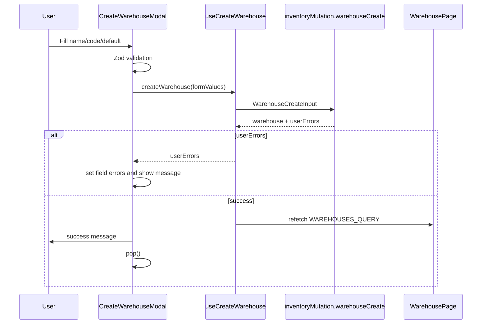

# Warehouse UI -> API Integration Plan

## Context

This plan covers the Admin UI warehouse page and its integration with the Inventory Admin GraphQL API.

Current state:

- UI route exists at `/:orgName/:storeName/warehouses` via `admin/src/domains/inventory/warehouse/register.tsx`.
- Current page `admin/src/domains/inventory/warehouse/page/page.tsx` renders an empty AG Grid with local `WarehouseRow`.
- Inventory API already exposes `inventoryQuery.warehouses`, `inventoryQuery.warehouse`, `inventoryMutation.warehouseCreate`, `warehouseUpdate`, and `warehouseDelete`.
- API-backed UI modules should follow `knowledge/vault/patterns/admin-graphql-layer.md`: module-local `graphql/`, `hooks/`, `mappers/`, generated API types imported directly from `@/graphql/types`.

Important constraint:

- Do not keep the current `location` column in the first API-backed version. `Warehouse` has no location/address fields in the current Inventory API.
- `Warehouse.variantsCount` exists in GraphQL, but `WarehouseResolver.variantsCount()` currently returns `0`. If the UI displays this metric, fix the resolver to call the existing stock count path first.
- `WarehouseConnection.totalCount` currently comes from an unfiltered repository count. If search or default-only filtering is included, fix filtered `totalCount` before wiring those controls.
- Current `warehouseDelete` deletes the warehouse and cascades warehouse stock. The first UI can add strong confirmation, but it must not claim that the API blocks deletion for default or stocked warehouses unless backend hardening is added.

## Current Warehouse API Contract

Inventory schema fields available for the UI:

```graphql
type Warehouse implements Node @key(fields: "id") {
  id: ID!
  code: String!
  name: String!
  isDefault: Boolean!
  createdAt: DateTime!
  updatedAt: DateTime!
  stock(
    first: Int
    after: String
    last: Int
    before: String
    where: WarehouseStockWhereInput
    orderBy: [WarehouseStockOrderByInput!]
  ): WarehouseStockConnection!
  variantsCount: Int!
}

input WarehouseCreateInput {
  code: String!
  name: String!
  isDefault: Boolean
}

input WarehouseUpdateInput {
  id: ID!
  code: String
  name: String
  isDefault: Boolean
}

input WarehouseDeleteInput {
  id: ID!
}
```

Supported list filters/sorts:

- filters: `id`, `code`, `name`, `isDefault`, `createdAt`, `updatedAt`;
- sort fields: `id`, `code`, `name`, `isDefault`, `createdAt`, `updatedAt`;
- string search operators: use `StringFilter._containsi`, `_startsWithi`, or exact `_eq`; `_ilike` is not supported by the generated filter schema;
- repository max page size: `100`.

## Target UX Summary

The warehouse page should be an operational list, not a marketing-style screen.

Primary workflows:

1. Show all warehouses from `inventoryQuery.warehouses` with cursor pagination.
2. Show the most important warehouse columns: name, code, default flag, stocked variants count, updated time.
3. Open `New` from the page header and create a warehouse in a modal.
4. Open warehouse details by row click.
5. Edit warehouse details through small dedicated modals, following the Product details pattern.

Non-goals for the first integration:

- Address/location management, because API fields do not exist yet.
- Warehouse contact, operating hours, fulfillment zones, and transfer settings, because API fields do not exist yet.
- Full stock bulk editing from the warehouse page unless it reuses existing inventory item update APIs.

## Target File Structure

Create the warehouse module as a normal API-backed Admin module:

```text
admin/src/domains/inventory/warehouse/
  graphql/
    fragments.ts
    queries.ts
    mutations.ts
    operation-types.ts
    index.ts
  hooks/
    use-warehouses.ts
    use-warehouse.ts
    use-create-warehouse.ts
    use-update-warehouse.ts
    use-delete-warehouse.ts
    index.ts
  mappers/
    warehouse-form.mapper.ts
    warehouse-errors.mapper.ts
    index.ts
  components/
    warehouse-name-cell.tsx
    warehouse-default-tag.tsx
    warehouse-details-card/
      warehouse-details-card.tsx
      sections/
        identity-section.tsx
        stock-section.tsx
        activity-section.tsx
  modals/
    index.ts
    warehouse-modal/
      warehouse-modal.tsx
      index.ts
    create-warehouse-modal/
      create-warehouse-modal.tsx
      general-section.tsx
      behavior-section.tsx
      schema.ts
      types.ts
      index.ts
    edit-identity-modal/
      edit-identity-modal.tsx
      schema.ts
      types.ts
      index.ts
    edit-default-modal/
      edit-default-modal.tsx
      index.ts
    delete-warehouse-modal/
      delete-warehouse-modal.tsx
      index.ts
  page/
    page.tsx
```

Register new modal stack entries in `admin/src/domains/modals.tsx`:

- `warehouse`
- `warehouse-create`
- `warehouse-edit-identity`
- `warehouse-edit-default`
- `warehouse-delete`

Add typed modal hooks in `admin/src/domains/inventory/warehouse/modals/index.ts`, mirroring `admin/src/domains/inventory/products/modals.ts`.

## GraphQL Operations

### Fragments

`WarehouseListFields` should stay compact:

```graphql
fragment WarehouseListFields on Warehouse {
  id
  code
  name
  isDefault
  variantsCount
  createdAt
  updatedAt
}
```

`WarehouseDetailsFields` should include the details header fields and the first stock page:

```graphql
fragment WarehouseDetailsFields on Warehouse {
  id
  code
  name
  isDefault
  variantsCount
  createdAt
  updatedAt
  stock(first: $stockFirst, after: $stockAfter) {
    edges {
      cursor
      node {
        id
        variantId
        quantityOnHand
        reservedQuantity
        unavailableQuantity
        availableForSale
        updatedAt
        variant {
          id
          title
          handle
        }
      }
    }
    pageInfo {
      hasNextPage
      hasPreviousPage
      startCursor
      endCursor
    }
    totalCount
  }
}
```

If GraphQL Codegen rejects variable usage inside a fragment, inline the `stock` selection in `WAREHOUSE_DETAILS_QUERY` and keep `WarehouseDetailsFields` limited to scalar warehouse fields.

### Queries

```graphql
query Warehouses(
  $first: Int
  $after: String
  $last: Int
  $before: String
  $where: WarehouseWhereInput
  $orderBy: [WarehouseOrderByInput!]
) {
  inventoryQuery {
    warehouses(
      first: $first
      after: $after
      last: $last
      before: $before
      where: $where
      orderBy: $orderBy
    ) {
      edges {
        cursor
        node {
          ...WarehouseListFields
        }
      }
      pageInfo {
        hasNextPage
        hasPreviousPage
        startCursor
        endCursor
      }
      totalCount
    }
  }
}
```

```graphql
query WarehouseDetails($id: ID!, $stockFirst: Int, $stockAfter: String) {
  inventoryQuery {
    warehouse(id: $id) {
      id
      code
      name
      isDefault
      variantsCount
      createdAt
      updatedAt
      stock(first: $stockFirst, after: $stockAfter) {
        edges {
          cursor
          node {
            id
            variantId
            quantityOnHand
            reservedQuantity
            unavailableQuantity
            availableForSale
            updatedAt
            variant {
              id
              title
              handle
            }
          }
        }
        pageInfo {
          hasNextPage
          hasPreviousPage
          startCursor
          endCursor
        }
        totalCount
      }
    }
  }
}
```

### Mutations

All mutations must request `userErrors { code field message }`.

```graphql
mutation WarehouseCreate($input: WarehouseCreateInput!) {
  inventoryMutation {
    warehouseCreate(input: $input) {
      warehouse {
        ...WarehouseListFields
      }
      userErrors {
        code
        field
        message
      }
    }
  }
}
```

```graphql
mutation WarehouseUpdate($input: WarehouseUpdateInput!) {
  inventoryMutation {
    warehouseUpdate(input: $input) {
      warehouse {
        ...WarehouseListFields
      }
      userErrors {
        code
        field
        message
      }
    }
  }
}
```

```graphql
mutation WarehouseDelete($input: WarehouseDeleteInput!) {
  inventoryMutation {
    warehouseDelete(input: $input) {
      deletedWarehouseId
      userErrors {
        code
        field
        message
      }
    }
  }
}
```

## Hooks and Data Flow

### `useWarehouses`

Responsibilities:

- Own `useQuery(WAREHOUSES_QUERY)`.
- Accept `first`, `after`, `last`, `before`, `where`, `orderBy`, `skip`.
- Return API-shaped rows:

```ts
interface UseWarehousesReturn {
  warehouses: ApiWarehouse[];
  connection: ApiWarehouseConnection | null;
  totalCount: number;
  pageInfo: ApiPageInfo | null;
  loading: boolean;
  error: Error | null;
  refetch: () => Promise<unknown>;
}
```

### `useWarehouse`

Responsibilities:

- Own `useQuery(WAREHOUSE_DETAILS_QUERY)`.
- Skip query when `id` is missing.
- Return `warehouse`, `loading`, `error`, `refetch`.
- Keep stock pagination local to the details modal, same as product variants pagination in `ProductModal`.

### Mutation hooks

Use result shape consistent with product hooks:

```ts
interface WarehouseMutationResult {
  warehouse: ApiWarehouse | null;
  userErrors: ApiGenericUserError[];
}
```

`useCreateWarehouse`:

- Map form values to `ApiWarehouseCreateInput`.
- Refetch `WAREHOUSES_QUERY` with caller-provided current list variables after success.
- Do not hard-code `{ first: 20, after: null, last: null, before: null }` in the hook. Either accept `listQueryVariables` from the page or expose a success callback so the page refetches its current query.
- Return API `userErrors` to the modal.

`useUpdateWarehouse`:

- Accept `ApiWarehouseUpdateInput`.
- Refetch `WAREHOUSES_QUERY` with current list variables and `WAREHOUSE_DETAILS_QUERY` with current details variables if the details modal is open.
- For the first implementation, `refetchQueries` is acceptable. Move to `cache.modify` only after cache identity/pagination policy is stable.

`useDeleteWarehouse`:

- Accept `{ id }`.
- On success, close details modal and refetch the list.
- Surface API errors. With the current API, expected errors are not-found, delete failed, and unexpected errors; stock/default blocking requires a backend policy change first.

## Warehouse List Page Design

### Layout

Use the existing `DataLayout` + AG Grid pattern:

- `DataLayout name="warehouse" title="Warehouse" count={totalCount}`
- Header action button: `New` with `PlusOutlined`
- Optional toolbar: search field and default-only filter can be added after `where` wiring and filtered `totalCount` are correct
- AG Grid rows should use `ApiWarehouse` directly
- Pagination should use `useRelayCursorPagination`
- When `where` or `orderBy` changes, pass a stable `resetKey` to `useRelayCursorPagination` so cursor state resets to the first page.

### Columns

Minimum useful columns:

| Column | API source | Notes |
| --- | --- | --- |
| Warehouse | `name`, `isDefault` | name + small Default tag |
| Code | `code` | stable operational identifier |
| Stocked variants | `variantsCount` | fix backend first or hide until fixed |
| Updated | `updatedAt` | display boundary formatting only |
| Created | `createdAt` | optional, useful for audit |

Do not render `location` until a warehouse address/location schema exists.

### List Wireframe

```text
+----------------------------------------------------------------------------+
| Warehouse                                               [ + New ]           |
|                                                                            |
| [ Search warehouses...                 ] [Default: All v] [Columns]        |
|                                                                            |
| +------------------------------------------------------------------------+ |
| | Warehouse                         | Code      | Default | Stock | Updated | |
| |-----------------------------------|-----------|---------|-------|---------| |
| | Main fulfillment center  [Default]| MAIN      | Yes     | 482   | Jun 21  | |
| | Kyiv overflow                    | KYIV-OVF  | No      | 138   | Jun 18  | |
| | Returns inspection               | RETURNS   | No      | 27    | Jun 12  | |
| +------------------------------------------------------------------------+ |
|                                                         < Prev  1  Next >   |
+----------------------------------------------------------------------------+
```

Row click:

- Opens `warehouse` details modal: `push("warehouse", { entityId: warehouse.id })`.
- Checkbox selection is optional for the first implementation. If added, keep it isolated with `useAgGridRowSelection`.

## Create Warehouse Modal Design

The create modal should be inspired by `CreateProductModal`:

- `ModalLayout name="create-warehouse"`
- `ModalHeader title="New Warehouse"` with Save button
- `react-hook-form` + `zodResolver`
- `Paper` sections with compact enterprise form layout
- API errors mapped through `warehouse-errors.mapper.ts`

### Form Values

```ts
interface CreateWarehouseFormValues {
  name: string;
  code: string;
  isDefault: boolean;
}
```

Validation:

- `name`: required, trimmed, min 2.
- `code`: required, uppercase slug/code style, max 32 to match DB `varchar(32)`.
- `isDefault`: boolean.
- The generated backend Zod schema only validates primitive types for these fields, so UI validation and the form-to-input mapper must enforce trimming, uppercase normalization, safe characters, and the `varchar(32)` limit before calling the API.

Code behavior:

- Auto-generate `code` from `name` until manually edited.
- Normalize to uppercase and safe characters: `MAIN`, `KYIV-01`, `RETURNS`.

### Create Modal Wireframe

```text
+----------------------------------------------------------------------------+
| [x] esc  New Warehouse                                             [Save]   |
+----------------------------------------------------------------------------+
|                                                                            |
|  +------------------------------------------------------------------------+ |
|  | General                                                                | |
|  |                                                                        | |
|  | Name                              Code                                 | |
|  | [ Main fulfillment center       ] [ MAIN-FULFILLMENT                 ] | |
|  |                                                                        | |
|  | Code is used in operations, imports, and stock reports.                | |
|  +------------------------------------------------------------------------+ |
|                                                                            |
|  +------------------------------------------------------------------------+ |
|  | Behavior                                                               | |
|  |                                                                        | |
|  | [ ] Set as default warehouse                                           | |
|  |     New inventory and fallback stock operations use the default.        | |
|  +------------------------------------------------------------------------+ |
|                                                                            |
+----------------------------------------------------------------------------+
```

### Create Flow



## Warehouse Details Modal Design

The details modal should mirror `ProductModal` and `ProductDetailsCard`:

- `WarehouseModal` owns fetching, loading/error/not-found states, stock pagination state.
- `WarehouseDetailsCard` receives `ApiWarehouse` directly.
- Dedicated sections own presentation and edit actions.
- Edits open smaller modals rather than turning the details modal into a large form.

### Details Modal Wireframe

```text
+----------------------------------------------------------------------------+
| [x] esc  Warehouse                                             [Actions v] |
+----------------------------------------------------------------------------+
|                                                                            |
|  Main fulfillment center                         [Default]                 |
|  MAIN-FULFILLMENT    Created Jun 12, 2026    Updated Jun 21, 2026          |
|                                                                            |
|  +--------------------+  +--------------------+  +----------------------+  |
|  | Stocked variants   |  | Available records  |  | Default behavior    |  |
|  | 482                |  | from stock total    |  | Used for fallback   |  |
|  +--------------------+  +--------------------+  +----------------------+  |
|                                                                            |
|  +------------------------------------------------------------------------+ |
|  | Identity                                                     [ ... ]   | |
|  | Name                  Main fulfillment center                         | |
|  | Code                  MAIN-FULFILLMENT                                | |
|  | Default warehouse     Yes                                             | |
|  +------------------------------------------------------------------------+ |
|                                                                            |
|  +------------------------------------------------------------------------+ |
|  | Stock                                                       [Columns]  | |
|  | Product / Variant                 On hand  Reserved  Unavailable  Avl | |
|  | Hoodie / Black M                  42       3         0            39  | |
|  | Mug / 330 ml                      18       1         2            15  | |
|  |                                                   < Prev  1  Next >    | |
|  +------------------------------------------------------------------------+ |
|                                                                            |
|  +------------------------------------------------------------------------+ |
|  | Activity                                                               | |
|  | Created at       Jun 12, 2026                                          | |
|  | Last updated     Jun 21, 2026                                          | |
|  +------------------------------------------------------------------------+ |
|                                                                            |
+----------------------------------------------------------------------------+
```

### Details Sections

`IdentitySection`:

- Shows `name`, `code`, `isDefault`.
- Actions menu:
  - Edit identity
  - Set as default / Default settings
  - Delete warehouse

`StockSection`:

- Shows `warehouse.stock` connection.
- Columns:
  - variant title
  - quantity on hand
  - reserved
  - unavailable
  - available for sale
  - updated at
- First version can be read-only.
- If editable, use a separate stock adjustment modal and the existing `inventoryItemUpdate` mutation path; do not overload `warehouseUpdate`.

`ActivitySection`:

- Shows `createdAt` and `updatedAt`.
- Later can include event history if Inventory exposes one.

## Edit Modal Scheme

Editing is split into smaller task-oriented modals, as in Product details.

### Edit Identity Modal

API:

- `inventoryMutation.warehouseUpdate(input: { id, name, code })`

Wireframe:

```text
+----------------------------------------------------------------------------+
| [x] esc  Edit warehouse identity                                  [Save]   |
+----------------------------------------------------------------------------+
|  +------------------------------------------------------------------------+ |
|  | General                                                                | |
|  | Name                              Code                                 | |
|  | [ Main fulfillment center       ] [ MAIN-FULFILLMENT                 ] | |
|  |                                                                        | |
|  | Changing the code can affect imports, reports, and integrations.       | |
|  +------------------------------------------------------------------------+ |
+----------------------------------------------------------------------------+
```

Behavior:

- Pre-fill from `ApiWarehouse`.
- Save through `useUpdateWarehouse`.
- On success, show message, close modal, refresh details and list.
- Map `code` uniqueness errors to the `code` field.

### Edit Default Modal

API:

- `inventoryMutation.warehouseUpdate(input: { id, isDefault: true })`

Wireframe:

```text
+----------------------------------------------------------------------------+
| [x] esc  Set default warehouse                                    [Save]   |
+----------------------------------------------------------------------------+
|  +------------------------------------------------------------------------+ |
|  | Default behavior                                                       | |
|  |                                                                        | |
|  | (i) Only one warehouse can be default for a store.                     | |
|  |                                                                        | |
|  | [x] Make "Main fulfillment center" the default warehouse               | |
|  |                                                                        | |
|  | Current default will be replaced after saving.                         | |
|  +------------------------------------------------------------------------+ |
+----------------------------------------------------------------------------+
```

Behavior:

- For non-default warehouse, allow setting it as default.
- For current default warehouse, either disable unsetting or require a clear product decision. The database allows no default, but operational UI should avoid accidental removal unless the business explicitly wants that.

### Delete Warehouse Modal

API:

- `inventoryMutation.warehouseDelete(input: { id })`

Wireframe:

```text
+----------------------------------------------------------------------------+
| [x] esc  Delete warehouse                                        [Delete]  |
+----------------------------------------------------------------------------+
|  +------------------------------------------------------------------------+ |
|  | Delete "Main fulfillment center"?                                      | |
|  |                                                                        | |
|  | Code: MAIN-FULFILLMENT                                                 | |
|  | Stocked variants: 482                                                  | |
|  |                                                                        | |
|  | This removes the warehouse and associated warehouse stock records if    | |
|  | the API allows deletion. This action should not be shown as a casual    | |
|  | inline table action.                                                    | |
|  |                                                                        | |
|  | Type MAIN-FULFILLMENT to confirm                                       | |
|  | [ MAIN-FULFILLMENT                                                   ] | |
|  +------------------------------------------------------------------------+ |
+----------------------------------------------------------------------------+
```

Behavior:

- Use a danger primary button.
- Require code confirmation when `variantsCount > 0` or when warehouse is default.
- With the current API, deleting a warehouse also deletes associated warehouse stock via cascade. Keep the copy explicit about that behavior.
- If product policy requires blocking deletion of stocked or default warehouses, add backend checks to `WarehouseDeleteScript` before exposing that promise in the UI.
- On API `userErrors`, keep modal open and display the error.
- On success, close the delete modal and details modal, refetch list.

### Optional Stock Adjustment Modal

Only implement if stock editing is part of the warehouse details scope.

API path:

- Load the variant's `inventoryItem`.
- Save with `inventoryMutation.inventoryItemUpdate(input: { id: inventoryItemId, stock: { warehouseId, onHand, unavailable } })`.
- The read-only details query does not need `inventoryItem`. If stock editing is enabled later, either include `variant { inventoryItem { id } }` in the stock row selection through federation or fetch `inventoryQuery.inventoryItemByVariant(variantId)` before saving.

Wireframe:

```text
+----------------------------------------------------------------------------+
| [x] esc  Adjust stock                                             [Save]   |
+----------------------------------------------------------------------------+
|  Product / Variant                                                        |
|  Hoodie / Black M                                                         |
|                                                                            |
|  +------------------------------------------------------------------------+ |
|  | Quantities                                                             | |
|  | On hand             Unavailable             Reserved                   | |
|  | [ 42              ] [ 0                   ]  3 read-only               | |
|  |                                                                        | |
|  | Available for sale: 39                                                 | |
|  +------------------------------------------------------------------------+ |
+----------------------------------------------------------------------------+
```

Reserved quantity should remain read-only unless Inventory exposes reservation editing.

## API Hardening Before UI Uses Metrics And Filters

Before showing `variantsCount`, update Inventory resolver:

Current:

```ts
async variantsCount(): Promise<number> {
  // TODO: implement via loader when needed
  return 0;
}
```

Target:

```ts
async variantsCount(): Promise<number> {
  return this.$ctx.kernel.repository.stock.countByFilter(this.$props);
}
```

If a more explicit repository method is preferred, add `countByWarehouse(warehouseId: string)` that delegates to `countByFilter(warehouseId)`.

Before wiring list search/default filters, fix `WarehouseRepository.getConnection()` so `totalCount` uses the same merged `where` as the connection query. The current code executes the paginated query with `where` but uses `this.count()` for `totalCount`, which returns all warehouses for the store.

While touching the warehouse repository, remove temporary `console.log` calls from `create()` and `getByIds()` and rely on the project logger at the script/service boundary.

Before implementing a destructive delete UX, decide whether the current cascade behavior is acceptable. If not, add explicit backend user errors for default warehouse or stocked warehouse deletion before claiming blocked deletion in the UI.

## Implementation Phases

### Phase 1: GraphQL UI Module

1. Add `warehouse/graphql/fragments.ts`.
2. Add `warehouse/graphql/queries.ts`.
3. Add `warehouse/graphql/mutations.ts`.
4. Add `warehouse/graphql/operation-types.ts` using generated API types from `@/graphql/types`.
5. Add `warehouse/graphql/index.ts`.

Acceptance:

- No generated API types are re-exported from module barrels.
- All mutations request `userErrors`.

### Phase 2: Hooks and Mappers

1. Add `useWarehouses`.
2. Add `useWarehouse`.
3. Add `useCreateWarehouse`.
4. Add `useUpdateWarehouse`.
5. Add `useDeleteWarehouse`.
6. Add form-to-input mapper.
7. Add user-error-to-form-field mapper.

Acceptance:

- Components do not unwrap raw `data.inventoryMutation.warehouseCreate` paths.
- Components receive `ApiWarehouse[]`, `ApiWarehouse | null`, `userErrors`, and `error`.
- Mutation hooks do not hard-code list pagination variables; they use caller-provided current variables or caller refetch callbacks.

### Phase 3: List Page

1. Replace local `WarehouseRow` with `ApiWarehouse`.
2. Wire `useWarehouses` with `useRelayCursorPagination`.
3. Render list columns from API fields only.
4. Add `New` button and open `warehouse-create`.
5. Add row click and open `warehouse`.
6. Show AG Grid loading and empty states.
7. If search/default filter is included in this phase, map it to supported `StringFilter`/`BooleanFilter` operators and reset pagination when `where` changes.

Acceptance:

- Page renders actual warehouses from Inventory.
- Count badge matches `warehouses.totalCount`.
- Pagination uses API `pageInfo`.
- No `location` column in first API-backed version.
- If filters are enabled, `totalCount` reflects the filtered result set.

### Phase 4: Create Modal

1. Add modal type and typed hook.
2. Add dynamic modal registration.
3. Implement create form with `Paper` sections.
4. Submit through `useCreateWarehouse`.
5. Map API user errors to fields.
6. Refetch list and close on success.

Acceptance:

- `New` opens modal.
- Valid input creates a warehouse.
- Duplicate code errors appear on the code field.
- Default checkbox maps to `isDefault`.
- Successful create refreshes the current list/query state without hard-coded first-page variables inside the hook.

### Phase 5: Details Modal

1. Add `WarehouseModal`.
2. Add `WarehouseDetailsCard`.
3. Add identity, stock, and activity sections.
4. Add details stock pagination.
5. Add loading/error/not-found states.

Acceptance:

- Row click opens details.
- Details use `inventoryQuery.warehouse`.
- Stock section renders `warehouse.stock` connection.
- Esc/close behavior matches Product modal.

### Phase 6: Edit Modals

1. Add edit identity modal.
2. Add edit default modal.
3. Add delete modal.
4. Wire section action menus.
5. Refresh details and list after successful mutations.

Acceptance:

- Each edit task is a focused modal.
- `warehouseUpdate` is not overloaded with stock edits.
- Delete flow is guarded, API error-aware, and its copy matches the chosen backend behavior: current cascade deletion or explicit backend blocking.

### Phase 7: API Hardening

1. Fix `WarehouseResolver.variantsCount`.
2. Optionally add a repository method with explicit naming.
3. If search/default filtering is included, fix filtered `WarehouseConnection.totalCount`.
4. Remove temporary warehouse repository `console.log` statements.
5. If destructive delete should be blocked for default or stocked warehouses, implement those `WarehouseDeleteScript` user errors.
6. Run build only if a new generated or compiled version is needed.

Acceptance:

- `variantsCount` returns the warehouse stock count instead of constant `0`.
- Filtered warehouse list count matches the active `where` clause when filters are enabled.
- Warehouse repository does not write debug output through `console.log`.
- Delete API behavior matches the UI copy and confirmation flow.

## Risks and Decisions

| Risk / decision | Resolution |
| --- | --- |
| UI currently has `location`, API does not | Remove from first API-backed UI. Add later through Inventory schema migration if needed. |
| `variantsCount` currently returns `0` | Fix before showing as a metric, or hide column temporarily. |
| Search UI requires filter mapping | Start with exact API list. If adding search, map to supported filters such as `where: { _or: [{ name: { _containsi: query } }, { code: { _containsi: query } }] }`; `_ilike` is not supported. |
| Filtered counts can be wrong | Fix `WarehouseRepository.getConnection().totalCount` to count with the active merged `where` before enabling search/default filter controls. |
| Default warehouse unsetting | Prefer set-default-only UI until product/business decision says stores can have no default. |
| Warehouse deletion currently cascades stock | Either keep the cascade behavior and make confirmation copy explicit, or add backend blocking errors before claiming stocked/default warehouses cannot be deleted. |
| Stock editing from warehouse details | Keep read-only first. If editing is required, use InventoryItem update path in a separate stock modal. |
| Cache updates with Relay pagination | Use `refetchQueries` for first integration. Optimize later with `cache.modify`. |

## Recommended First Slice

Implement the smallest useful API-backed slice:

1. Fix `variantsCount` or hide it.
2. Add warehouse GraphQL operations and hooks.
3. Replace empty warehouse list with API data.
4. Add create warehouse modal.
5. Add details modal with identity and read-only stock.
6. Add edit identity and set-default modals.

This gives a complete operational workflow while keeping the data model aligned with the current Inventory API.

Keep search/default filters and delete behavior out of the first slice unless the related backend hardening is included in the same implementation.
