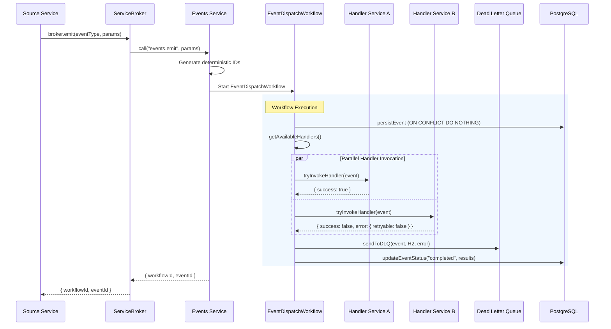
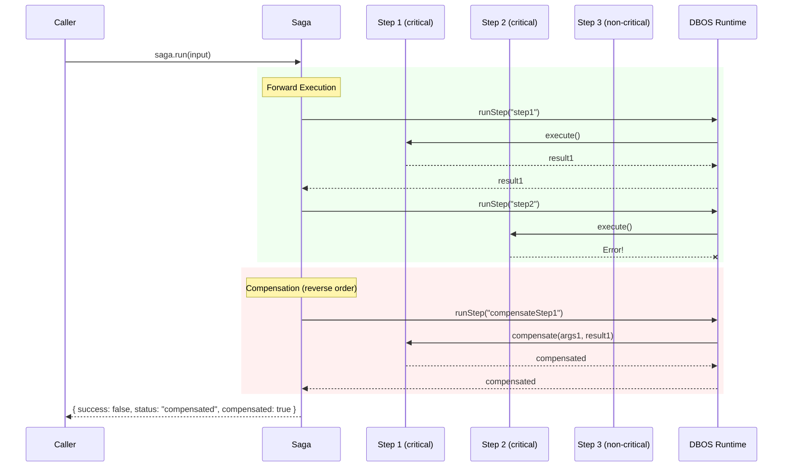
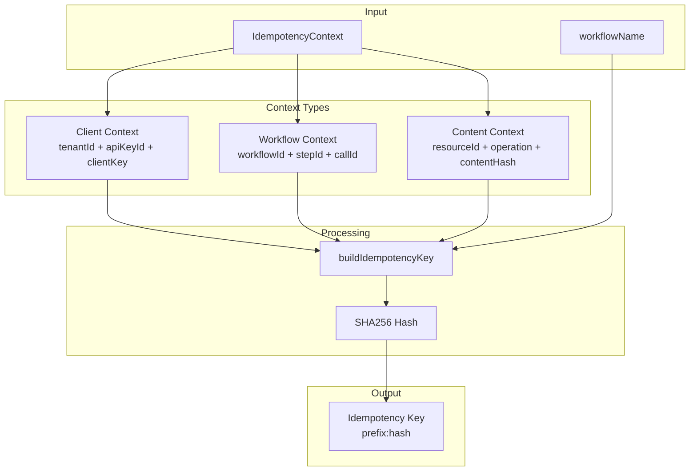
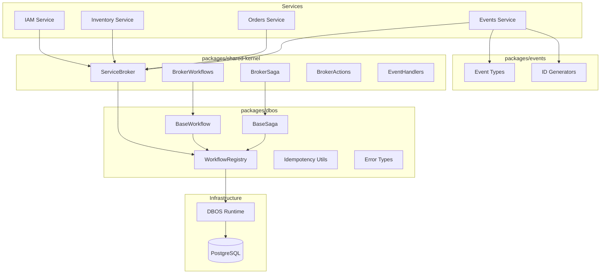

# Workflows / Sagas / Events Architecture

> **Document Version:** 2.1.0
> **Last Updated:** 2026-01-21
> **Status:** Active
> **Maintainers:** Platform Team
> **Applies to:** @shopana/dbos ^1.0.0, @shopana/shared-kernel ^1.0.0, services/events

---

## Table of Contents

1. [Overview](#1-overview)
2. [System Components](#2-system-components)
3. [Architectural Decisions](#3-architectural-decisions)
4. [Architecture Diagrams](#4-architecture-diagrams)
5. [Contracts and Types](#5-contracts-and-types)
6. [Execution Flows](#6-execution-flows)
7. [Data Model](#7-data-model)
8. [Scheduled Jobs](#8-scheduled-jobs)
9. [Usage Examples](#9-usage-examples)
10. [Error Handling](#10-error-handling)
11. [Key Invariants](#11-key-invariants)
12. [Migration Guide](#12-migration-guide)
13. [Glossary](#13-glossary)
14. [References](#14-references)

---

## 1) Overview

This document describes the durable workflows, sagas, and event dispatch system built on `@shopana/dbos`, `@shopana/shared-kernel`, and `services/events`.

### 1.1 Purpose

The framework provides:

- **Durability**: Workflows survive process crashes and restarts via DBOS deterministic replay
- **Idempotency**: Duplicate requests produce identical results without side effects
- **Compensation**: Sagas automatically rollback on failure via convention-based compensation
- **Cancellation**: Steps support AbortSignal for timeout-based cancellation of I/O operations
- **Event-Driven Architecture**: Decoupled services communicate through domain events
- **Observability**: Built-in correlation IDs, handler results tracking, and DLQ for failures

### 1.2 Design Principles

| Principle | Implementation |
|-----------|----------------|
| Deterministic Replay | All side effects captured via DBOS workflow steps |
| Idempotency First | Workflow IDs derived from `IdempotencyContext`, DB upserts with `ON CONFLICT DO NOTHING` |
| Convention over Configuration | Compensation methods auto-discovered via naming pattern |
| Eventual Consistency | Event handlers are independent; dispatch always completes |
| Fail-Safe | Errors go to DLQ, never block the dispatch workflow |

---

## 2) System Components

```
┌─────────────────────────────────────────────────────────────────────────────┐
│                              Service Layer                                   │
│  ┌─────────────┐  ┌─────────────┐  ┌─────────────┐  ┌─────────────┐        │
│  │   IAM       │  │  Inventory  │  │   Orders    │  │   Media     │  ...   │
│  │  Service    │  │   Service   │  │   Service   │  │   Service   │        │
│  └──────┬──────┘  └──────┬──────┘  └──────┬──────┘  └──────┬──────┘        │
│         │                │                │                │                │
│         └────────────────┴────────────────┴────────────────┘                │
│                                   │                                          │
│                          ┌────────▼────────┐                                │
│                          │  ServiceBroker  │                                │
│                          │  (shared-kernel)│                                │
│                          └────────┬────────┘                                │
└───────────────────────────────────┼─────────────────────────────────────────┘
                                    │
┌───────────────────────────────────┼─────────────────────────────────────────┐
│                          ┌────────▼────────┐                                │
│                          │  Events Service │                                │
│                          │  ┌────────────┐ │                                │
│                          │  │ Dispatch   │ │                                │
│                          │  │ Workflow   │ │                                │
│                          │  └────────────┘ │                                │
│                          │  ┌────────────┐ │                                │
│                          │  │    DLQ     │ │                                │
│                          │  └────────────┘ │                                │
│                          └─────────────────┘                                │
│                              Events Layer                                    │
└─────────────────────────────────────────────────────────────────────────────┘
                                    │
┌───────────────────────────────────┼─────────────────────────────────────────┐
│                          ┌────────▼────────┐                                │
│                          │      DBOS       │                                │
│                          │  (Durability)   │                                │
│                          └─────────────────┘                                │
│                            Infrastructure                                    │
└─────────────────────────────────────────────────────────────────────────────┘
```

### 2.1 @shopana/dbos (`packages/dbos`)

Durable layer on top of DBOS providing:

| Component | Purpose |
|-----------|---------|
| `WorkflowRegistry` | Workflow registration, start, run, retrieve |
| `@Workflow` / `@WorkflowStep` | Decorators for durable workflows |
| `@Saga` / `@SagaStep` | Decorators for compensating transactions |
| `IdempotencyContext` | Idempotency key derivation |
| `RetryableError` / `FatalError` | Error classification for retry logic |
| `BaseWorkflow` / `BaseSaga` | Abstract base classes with auto-registration |
| `getSignal()` | Get AbortSignal for step cancellation on timeout |

### 2.2 @shopana/shared-kernel (`packages/shared-kernel`)

Broker layer providing:

| Component | Purpose |
|-----------|---------|
| `ServiceBroker` | Inter-service communication, action registry |
| `BrokerWorkflows` | Base class for workflows with broker access |
| `BrokerSaga` | Base class for sagas with broker access |
| `BrokerActions` | Base class for action handlers |
| `EventHandlers` | Base class for event handlers |
| `@Action` / `@EventHandler` | Decorators for broker registration |

### 2.3 Events Service (`services/events`)

Event infrastructure providing:

| Component | Purpose |
|-----------|---------|
| `EventDispatchWorkflow` | Fan-out events to handlers with retry |
| `events.emit` / `events.emitAndWait` | Actions for event emission |
| `domain_events` table | Event store with handler results |
| `dead_letter_queue` table | Failed handler storage |
| `CleanupScheduler` | Automated data retention management |

### 2.4 @shopana/events (`packages/events`)

Types and utilities only (no runtime dependencies):

| Component | Purpose |
|-----------|---------|
| `DomainEvent` | Event type definitions |
| `EventHandlerResponse` | Handler response contract |
| `makeDispatchWorkflowId` | Deterministic workflow ID generation |
| `makeEventId` | Deterministic event ID generation |

---

## 3) Architectural Decisions

### ADR-001: DBOS as the Durability Layer

**Decision:** All workflows and sagas are built on DBOS workflow/step primitives.

**Rationale:**
- Deterministic replay without custom orchestrator
- Built-in retries with configurable policies
- Observability via DBOS dashboard

**Consequences:**
- `run(...)` entrypoint is mandatory for all workflows
- Steps execute through DBOS (`WorkflowStep` / `runStep`)
- Workflow ID must be deterministic for replay

### ADR-002: Event Dispatch as Durable Workflow

**Decision:** Event fan-out is executed by `EventDispatchWorkflow`.

**Rationale:**
- Guarantee delivery/retries per handler
- Isolate handler failures from each other
- Persist handler results for debugging

**Consequences:**
- Producers are fire-and-forget
- Handlers are independent (one failure doesn't affect others)
- System converges via eventual consistency

### ADR-003: Dedicated Events Service

**Decision:** Event store, DLQ, and scheduling live in `services/events`.

**Rationale:**
- Single place for retention, monitoring, and event history
- Centralized observability for all domain events
- Consistent cleanup policies

**Consequences:**
- All services communicate via broker actions
- Events service is a critical infrastructure component

### ADR-004: Types-Only Events Package

**Decision:** `@shopana/events` has no dependencies on DBOS/Kernel/Broker.

**Rationale:**
- Clean contract for all services
- Minimal dependencies
- Can be used in frontend/shared code

**Consequences:**
- Any service can import types without runtime coupling
- Idempotency utilities are pure functions

### ADR-005: Idempotency as First-Class

**Decision:** `workflowId` is deterministically derived from `IdempotencyContext`; `emitKey` is required.

**Rationale:**
- Prevent duplicates at the workflow level
- Produce deterministic `eventId` values
- Safe retries without side effects

**Consequences:**
- Repeated calls with same context produce identical results
- Domain-level `ON CONFLICT DO NOTHING` reinforces idempotency
- `emitKey` must be provided and non-empty

### ADR-006: Convention-Based Compensation

**Decision:** Saga steps auto-detect criticality based on compensation method existence.

**Rationale:**
- Reduce boilerplate configuration
- Enforce consistent naming patterns
- Make compensation explicit in code

**Consequences:**
- Compensation method: `compensate${PascalCase(stepMethod)}`
- Step with compensation → critical (throws on error)
- Step without compensation → non-critical (returns `undefined` on error)

### ADR-007: Event Handlers as Broker Actions

**Decision:** Handlers are actions `service.eventType` with retry metadata from `@EventHandler`.

**Rationale:**
- Unified action contract for all broker calls
- Deterministic handler configuration at workflow step time
- Consistent retry policies

**Consequences:**
- `EventDispatchWorkflow` reads retry policy via `ActionMetadata`
- Default retry: `maxAttempts=3, intervalSeconds=1, backoffRate=2`

### ADR-008: DLQ as Required Path for Fatal Errors

**Decision:** Non-retryable errors and timeouts go to DLQ with upsert by `(event, handler)`.

**Rationale:**
- Never block dispatch workflow
- Preserve failure evidence for manual handling
- Enable future retry/resolution workflows

**Consequences:**
- Dispatch always completes the workflow
- Errors are stored separately in DLQ
- 30-day TTL with automated cleanup

### ADR-009: Real-Time Timestamps in Steps

**Decision:** `timestamp` is set in the `persistEvent` step.

**Rationale:**
- Capture wall-clock time for ordering
- Keep deterministic replay (step result is persisted)

**Consequences:**
- Workflow replay yields the same `timestamp`
- Events have accurate creation time

### ADR-010: Step Cancellation via AbortSignal

**Decision:** Each step execution provides an `AbortSignal` accessible via `getSignal()`.

**Rationale:**
- Prevent resource leaks when step times out (HTTP requests, DB queries continue running)
- Allow graceful cancellation of long-running I/O operations
- Standard Web API pattern (`AbortController`/`AbortSignal`)

**Implementation:**
- `withTimeout()` wraps step execution with `AbortController`
- Signal is stored in `AsyncLocalStorage` during step execution
- `getSignal()` retrieves signal from context (throws if called outside step)

**Consequences:**
- External I/O operations can be cancelled on timeout
- Step code must explicitly use `getSignal()` and pass to I/O calls
- Compensation methods do NOT have cancellation (must complete)

---

## 4) Architecture Diagrams

### 4.1 Event Emission and Dispatch Flow



### 4.2 Saga Execution and Compensation Flow



### 4.3 Idempotency Key Generation



### 4.4 Component Dependencies



---

## 5) Contracts and Types

### 5.1 Idempotency (`packages/dbos`)

#### IdempotencyContext

```typescript
// Client-initiated requests (API calls with idempotency header)
interface ClientIdempotencyContext {
  source: "client";
  clientKey: string;    // Client-provided idempotency key
  tenantId: string;     // Tenant/organization ID
  apiKeyId: string;     // API key used for the request
}

// Workflow-initiated operations (child workflows, steps)
interface WorkflowIdempotencyContext {
  source: "workflow";
  workflowId: string;   // Parent workflow ID
  stepId: string;       // Step name within workflow
  callId?: string;      // Unique ID for fan-out operations
}

// Content-based deduplication (imports, bulk operations)
interface ContentIdempotencyContext {
  source: "content";
  resourceId: string;   // Resource identifier (SKU, productId)
  operation: string;    // Operation name
  contentHash: string;  // SHA256 of canonicalized payload
}

type IdempotencyContext =
  | ClientIdempotencyContext
  | WorkflowIdempotencyContext
  | ContentIdempotencyContext;
```

#### Key Generation

```typescript
function buildIdempotencyKey(workflowName: string, ctx: IdempotencyContext): string;

// Output formats:
// client:   "client:{sha256(v1:client:tenantId:apiKeyId:workflowName:clientKey)}"
// workflow: "workflow:{sha256(v1:workflow:workflowId:stepId:callId:workflowName)}"
// content:  "content:{sha256(v1:content:resourceId:operation:contentHash:workflowName)}"

function hashContent(payload: unknown): string;  // SHA256 of canonical JSON
```

### 5.2 Workflows (`packages/dbos`)

#### WorkflowRegistry

```typescript
interface WorkflowRegistry {
  register(qualifiedName: string, descriptor: WorkflowDescriptor): void;
  deregister(qualifiedName: string): void;
  start<T, P>(qualifiedName: string, params: P, ctx: IdempotencyContext): Promise<WorkflowHandle<T>>;
  run<T, P>(qualifiedName: string, params: P, ctx: IdempotencyContext): Promise<T>;
  retrieve<T>(workflowId: string): WorkflowHandle<T>;
}

interface WorkflowHandle<T> {
  workflowId: string;
  getResult(): Promise<T>;
  getStatus(): Promise<DBOSWorkflowStatus | null>;
}
```

#### @Workflow Decorator

```typescript
function Workflow(
  name: string,
  options?: {
    idempotencyStrategy?: "client" | "workflow" | "content";
  }
): MethodDecorator;
```

#### @WorkflowStep Decorator

```typescript
interface StepOptions {
  name?: string;              // Step name (default: method name)
  timeoutMs?: number;         // Timeout in ms (default: 30000)
  retry?: RetryPolicy;        // Retry configuration
  retriesAllowed?: boolean;   // Override retry check
}

interface RetryPolicy {
  maxAttempts: number;        // Maximum retry attempts
  intervalSeconds: number;    // Initial delay between retries
  backoffRate: number;        // Multiplier for exponential backoff
}

function WorkflowStep(options?: StepOptions): MethodDecorator;
```

**Step Behavior:**

| Scenario | Behavior |
|----------|----------|
| Timeout exceeded | `StepTimeoutError` (non-retryable), AbortSignal aborted |
| `RetryableError` thrown | DBOS retry per policy |
| `FatalError` thrown | Immediate failure, no retry |
| `error.retryable = true` | DBOS retry per policy |
| `error.retryable = false` | Immediate failure, no retry |

#### Step Cancellation

```typescript
import { getSignal } from '@shopana/dbos';

// Get AbortSignal for current step (throws if called outside step)
function getSignal(): AbortSignal;
```

**Usage:**
- Call `getSignal()` inside step methods to get the current AbortSignal
- Pass signal to I/O operations that support cancellation (`fetch`, `axios`, etc.)
- Signal is aborted automatically when step timeout is exceeded
- Throws error if called outside of step execution context

### 5.3 Sagas (`packages/dbos`)

#### @Saga Decorator

```typescript
interface SagaExecutorConfig {
  compensationRetryPolicy?: RetryPolicy;  // Default: maxAttempts=10, interval=1s, backoff=2
  onCompensationExhausted?: (
    step: string,
    method: string,
    error: Error,
    ctx: SagaContext
  ) => void;
}

function Saga(name: string, config?: SagaExecutorConfig): MethodDecorator;
```

#### @SagaStep Decorator

```typescript
interface SagaStepConfig {
  name?: string;          // Step name (default: method name)
  retry?: RetryPolicy;    // Retry configuration
  timeoutMs?: number;     // Timeout in ms (default: 30000)
}

function SagaStep(config?: SagaStepConfig): MethodDecorator;
```

**Criticality Detection:**

| Has Compensation Method | Behavior on Error |
|------------------------|-------------------|
| Yes (`compensate${PascalCase(step)}` exists) | Step is **critical** → throws error, triggers compensation |
| No | Step is **non-critical** → returns `undefined`, saga continues |

#### SagaResult

```typescript
type SagaStatus =
  | "pending"       // Not started
  | "running"       // In progress
  | "completed"     // All steps succeeded
  | "compensating"  // Compensation in progress
  | "compensated"   // Compensation succeeded
  | "failed";       // Compensation failed

interface SagaResult<TOutput = unknown> {
  success: boolean;
  status: SagaStatus;
  data?: TOutput;           // Result on success
  error?: OperationError;   // Error on failure
  failedStep?: string;      // Step where failure occurred
  compensated: boolean;     // Whether all compensations succeeded
}
```

### 5.4 Errors (`packages/dbos`)

```typescript
// Base class for classified errors
abstract class OperationException extends Error {
  abstract readonly retryable: boolean;
  code?: string;
}

// Transient errors (network issues, timeouts, service unavailable)
class RetryableError extends OperationException {
  readonly retryable = true;
  constructor(message: string, cause?: Error);
}

// Permanent errors (validation, business logic, not found)
class FatalError extends OperationException {
  readonly retryable = false;
  constructor(message: string, cause?: Error, code?: string);
}

// Step timeout (non-retryable)
class StepTimeoutError extends FatalError {
  constructor(stepName: string, timeoutMs: number);
}

// Step execution wrapper
class StepExecutionError extends Error {
  constructor(
    stepName: string,
    methodName: string,
    cause: Error
  );
}

// Structured error for serialization
interface OperationError {
  message: string;
  code?: string;
  retryable: boolean;
  name?: string;
  stack?: string;  // Only in development
}
```

**Constants:**

```typescript
const DEFAULT_STEP_TIMEOUT_MS = 30_000;
const DEFAULT_RETRY_POLICY: RetryPolicy = { maxAttempts: 1, intervalSeconds: 0, backoffRate: 1 };
const DEFAULT_COMPENSATION_RETRY: RetryPolicy = { maxAttempts: 10, intervalSeconds: 1, backoffRate: 2 };
```

### 5.5 Broker Contracts (`packages/shared-kernel`)

#### ServiceBroker

```typescript
interface ServiceBroker {
  // Action management
  register<P, R>(action: string, handler: ActionHandler<P, R>, metadata?: ActionMetadata): void;
  call<R, P>(action: string, params?: P): Promise<R>;
  hasAction(action: string): boolean;
  getActionMetadata(action: string): ActionMetadata | undefined;

  // Workflow execution
  runWorkflow<R, P>(workflow: string, params: P, ctx: IdempotencyContext): Promise<R>;
  runSaga<R, P>(sagaName: string, params: P, ctx: IdempotencyContext): Promise<SagaResult<R>>;
  hasWorkflow(workflow: string): boolean;

  // Event emission
  emit(eventType: string, params: EmitParams): Promise<{ workflowId: string; eventId: string }>;

  // Health
  isHealthy(): boolean;
  getHealth(): { serviceName: string; registeredActions: string[]; inFlight: number };
}
```

#### EmitParams

```typescript
interface EmitParams {
  payload: unknown;
  context: {
    tenantId: string;
    userId?: string;
    correlationId?: string;
    causationId?: string;
  };
  subject: {
    type: string;  // Entity type (Product, Order, Store)
    id: string;    // Entity ID
  };
  actor?: {
    type: "user" | "service" | "system";
    id?: string;
  };
  emitKey: string;  // Required, must be non-empty
}
```

#### ActionMetadata

```typescript
interface ActionMetadata {
  retryPolicy?: {
    maxAttempts: number;
    intervalSeconds: number;
    backoffRate: number;
  };
}
```

#### @EventHandler Decorator

```typescript
interface EventHandlerOptions {
  retry?: Partial<{
    maxAttempts: number;     // Default: 3
    intervalSeconds: number; // Default: 1
    backoffRate: number;     // Default: 2
  }>;
}

function EventHandler(eventType: string, options?: EventHandlerOptions): MethodDecorator;
```

### 5.6 Events Contracts (`packages/events`)

#### DomainEvent

```typescript
interface DomainEvent<TPayload = unknown> {
  eventId: string;
  eventType: string;
  timestamp: Date;
  source: string;           // Service that emitted
  payload: TPayload;
  emitKey: string;
  parentWorkflowId?: string;

  context: {
    tenantId: string;
    userId?: string;
    correlationId: string;
    causationId?: string;
  };

  subject: {
    type: string;
    id: string;
  };

  actor?: {
    type: "user" | "service" | "system";
    id?: string;
  };
}
```

#### EventHandlerResponse

```typescript
// Success response
interface EventHandlerSuccessResponse {
  success: true;
  data?: unknown;
}

// Failure response
interface EventHandlerFailureResponse {
  success: false;
  error: {
    message: string;
    code?: string;
    retryable: boolean;
  };
}

type EventHandlerResponse = EventHandlerSuccessResponse | EventHandlerFailureResponse;
```

> **Note:** Legacy `{ ok: true | false }` format is deprecated and not supported.

#### EventDispatchResult

```typescript
interface EventDispatchResult {
  eventId: string;
  eventType: string;
  status: "completed";
  servicesNotified: string[];
  results: HandlerInvocationResult[];
}

interface HandlerInvocationResult {
  service: string;
  status: "success" | "failed";
  error?: string;
  durationMs: number;
}
```

#### Events Service Actions

| Action | Input | Output |
|--------|-------|--------|
| `events.emit` | `EmitParams & { eventType, source }` | `{ workflowId, eventId }` |
| `events.emitAndWait` | `EmitParams & { eventType, source }` | `EventDispatchResult` |
| `events.cleanupDLQ` | `{ batchSize?: number }` | `{ deleted: number }` |
| `events.cleanupDomainEvents` | `{ retentionDays?: number, batchSize?: number }` | `{ deleted: number }` |

---

## 6) Execution Flows

### 6.1 Starting a Workflow/Saga

```
1. Client/service builds IdempotencyContext
2. ServiceBroker.runWorkflow("service.workflow", params, ctx)
3. WorkflowRegistry.start() builds workflowId via buildIdempotencyKey()
4. DBOS runs workflow with deterministic replay
5. Result returned to caller
```

### 6.2 Event Emission Flow

**Preconditions:**
- Must be called from within a DBOS workflow (`DBOS.workflowID` required)
- `emitKey` must be provided and non-empty

**Steps:**

```
1. Workflow calls broker.emit(eventType, params)
2. Broker calls events.emit action with source auto-injected
3. Events service generates deterministic IDs:
   - dispatchWorkflowId = makeDispatchWorkflowId(parentWorkflowId, eventType, emitKey)
   - eventId = makeEventId(tenantId, dispatchWorkflowId)
   - correlationId = params.correlationId || makeDeterministicCorrelationId(parentWorkflowId)
4. Start EventDispatchWorkflow with idempotencyCtx:
   { source: "workflow", workflowId: dispatchWorkflowId, stepId: "emit" }
5. Return { workflowId, eventId } immediately (fire-and-forget)
```

### 6.3 EventDispatchWorkflow Execution

```
Step 1: persistEvent
├── Insert into domain_events with ON CONFLICT DO NOTHING
├── Set dispatch_started_at and real timestamp
└── Return event with assigned timestamp

Step 2: getAvailableHandlers
├── Get service list from getConfig().services
├── Check broker.hasAction(service.eventType) for each
└── Return list of handler actions

Step 3: tryInvokeHandler (parallel for each handler)
├── DBOS.runStep(name="handler:<action>:<eventId>")
├── Get retry policy from broker.getActionMetadata(action)
├── Call handler with event
├── Handle response:
│   ├── success=true → OK
│   ├── success=false, retryable=false → DLQ, no retry
│   ├── StepTimeoutError → DLQ, no retry
│   └── success=false, retryable=true → DBOS retry per policy
└── Default timeout: 30 seconds

Step 4: updateEventStatus
├── Set status="completed"
├── Store handler_results JSONB
└── Set dispatch_completed_at
```

### 6.4 DLQ Entry

`sendToDLQ` performs an upsert by `(event_id, handler_service, handler_action)`:

| Field | Value |
|-------|-------|
| `status` | `"failed"` |
| `attempts` | Number of attempts made |
| `error` | Error message |
| `error_code` | Error code (if available) |
| `expires_at` | `now() + 30 days` |

---

## 7) Data Model

### 7.1 domain_events

```sql
CREATE TABLE domain_events (
  -- Identity
  event_id          TEXT PRIMARY KEY,
  event_type        TEXT NOT NULL,
  source            TEXT NOT NULL,
  timestamp         TIMESTAMPTZ NOT NULL,

  -- Context
  tenant_id         TEXT NOT NULL,
  user_id           TEXT,
  correlation_id    TEXT NOT NULL,
  causation_id      TEXT,

  -- Idempotency
  emit_key          TEXT NOT NULL,
  parent_workflow_id TEXT,
  payload_hash      TEXT,  -- SHA256 of canonical JSON

  -- Subject
  subject_type      TEXT NOT NULL,
  subject_id        TEXT NOT NULL,

  -- Actor
  actor_type        TEXT DEFAULT 'service',
  actor_id          TEXT,

  -- Dispatch state
  status            TEXT DEFAULT 'dispatching',  -- dispatching | completed
  dispatch_started_at  TIMESTAMPTZ,
  dispatch_completed_at TIMESTAMPTZ,
  handler_results   JSONB,  -- Array of HandlerInvocationResult

  -- Timestamps
  created_at        TIMESTAMPTZ DEFAULT NOW(),
  updated_at        TIMESTAMPTZ DEFAULT NOW()
);

-- Indexes
CREATE INDEX idx_events_type ON domain_events(event_type);
CREATE INDEX idx_events_correlation ON domain_events(correlation_id);
CREATE INDEX idx_events_parent_workflow ON domain_events(parent_workflow_id, event_type);
CREATE INDEX idx_events_tenant_timestamp ON domain_events(tenant_id, timestamp DESC);
CREATE INDEX idx_events_subject_timeline ON domain_events(tenant_id, subject_type, subject_id, timestamp DESC);
CREATE INDEX idx_events_type_timestamp ON domain_events(tenant_id, event_type, timestamp DESC);
```

### 7.2 dead_letter_queue

```sql
CREATE TABLE dead_letter_queue (
  -- Identity
  id                UUID PRIMARY KEY DEFAULT gen_random_uuid(),

  -- Event reference
  event_id          TEXT NOT NULL,
  event_type        TEXT NOT NULL,

  -- Handler reference
  handler_service   TEXT NOT NULL,
  handler_action    TEXT NOT NULL,

  -- Error details
  error             TEXT NOT NULL,
  error_code        TEXT,
  attempts          INTEGER NOT NULL,

  -- Context
  tenant_id         TEXT NOT NULL,
  correlation_id    TEXT,

  -- State
  status            TEXT DEFAULT 'failed',  -- failed | retried | resolved
  failed_at         TIMESTAMPTZ DEFAULT NOW(),
  expires_at        TIMESTAMPTZ,

  -- Uniqueness constraint
  UNIQUE (event_id, handler_service, handler_action)
);

-- Indexes
CREATE INDEX idx_dlq_status ON dead_letter_queue(status);
CREATE INDEX idx_dlq_event_type ON dead_letter_queue(event_type, status);
CREATE INDEX idx_dlq_tenant ON dead_letter_queue(tenant_id, status);
CREATE INDEX idx_dlq_expires ON dead_letter_queue(expires_at) WHERE expires_at IS NOT NULL;
```

---

## 8) Scheduled Jobs

### CleanupScheduler

| Job | Schedule | Action | Parameters |
|-----|----------|--------|------------|
| DLQ Cleanup | Daily 03:00 | `cleanupDLQ` | `batchSize: 1000` |
| Event Cleanup | Daily 04:00 | `cleanupDomainEvents` | `retentionDays: 90, batchSize: 5000` |

**Behavior:**
- Both jobs run in batches to avoid large transactions
- Continue until no more items to delete
- 100ms pause between batches to reduce DB load
- Log total deleted count

---

## 9) Usage Examples

### 9.1 Simple Saga with Compensation

```typescript
@Injectable()
export class OrderCreateSaga extends BrokerSaga<OrderCreateInput, OrderCreateOutput> {

  @Saga("orderCreate")
  async run(input: OrderCreateInput): Promise<OrderCreateOutput> {
    // Step 1: Reserve inventory
    const reservation = await this.reserveInventory(input);

    // Step 2: Create order record
    const order = await this.createOrder(input, reservation);

    // Step 3: Emit event (non-critical, no compensation)
    await this.emitOrderCreated(order);

    return { orderId: order.id };
  }

  @SagaStep()
  private async reserveInventory(input: OrderCreateInput): Promise<Reservation> {
    const result = await this.broker.call<ReservationResult>(
      "inventory.reserveItems",
      { items: input.items }
    );
    if (!result.success) {
      throw new FatalError(result.error, undefined, "RESERVATION_FAILED");
    }
    return result.reservation;
  }

  // Compensation: release the reservation
  async compensateReserveInventory(
    _input: OrderCreateInput,
    reservation: Reservation
  ): Promise<void> {
    await this.broker.call("inventory.releaseReservation", {
      reservationId: reservation.id
    });
    this.logger.log({ reservationId: reservation.id }, "Compensated: released reservation");
  }

  @SagaStep()
  private async createOrder(
    input: OrderCreateInput,
    reservation: Reservation
  ): Promise<Order> {
    return this.kernel.repository.order.create({
      ...input,
      reservationId: reservation.id,
    });
  }

  // Compensation: delete the order
  async compensateCreateOrder(
    _input: OrderCreateInput,
    _reservation: Reservation,
    order: Order
  ): Promise<void> {
    await this.kernel.repository.order.delete(order.id);
    this.logger.log({ orderId: order.id }, "Compensated: deleted order");
  }

  @SagaStep()
  private async emitOrderCreated(order: Order): Promise<void> {
    // No compensation method = non-critical step
    await this.broker.emit("orderCreated", {
      payload: { orderId: order.id },
      context: { tenantId: order.tenantId },
      subject: { type: "Order", id: order.id },
      emitKey: `order:${order.id}:created`,
    });
  }
}
```

### 9.2 Event Handler with Retry

```typescript
@Injectable()
export class InventoryEventHandlers extends EventHandlers {

  @EventHandler("orderCreated", {
    retry: { maxAttempts: 5, intervalSeconds: 2, backoffRate: 2 }
  })
  async handleOrderCreated({ event }: { event: DomainEvent }): Promise<EventHandlerResponse> {
    try {
      const { orderId } = event.payload as { orderId: string };

      await this.kernel.repository.inventory.decrementStock(orderId);

      return { success: true };
    } catch (error) {
      if (error instanceof StockNotAvailableError) {
        // Non-retryable: stock is genuinely unavailable
        return {
          success: false,
          error: {
            message: error.message,
            code: "STOCK_NOT_AVAILABLE",
            retryable: false,
          },
        };
      }

      // Retryable: transient error
      return {
        success: false,
        error: {
          message: error.message,
          retryable: true,
        },
      };
    }
  }
}
```

### 9.3 Workflow with Idempotency

```typescript
@Injectable()
export class ImportProductsWorkflow extends BrokerWorkflows<ImportInput, ImportResult> {

  @Workflow("importProducts", { idempotencyStrategy: "content" })
  async run(input: ImportInput): Promise<ImportResult> {
    const results: ProductResult[] = [];

    for (const [index, product] of input.products.entries()) {
      const result = await this.importProduct(product, index);
      results.push(result);
    }

    return { imported: results.filter(r => r.success).length, results };
  }

  @WorkflowStep({
    retry: { maxAttempts: 3, intervalSeconds: 1, backoffRate: 2 },
    timeoutMs: 10_000,
  })
  private async importProduct(
    product: ProductData,
    index: number
  ): Promise<ProductResult> {
    try {
      const created = await this.kernel.repository.product.upsert(product);
      return { success: true, productId: created.id };
    } catch (error) {
      if (isRetryableError(error)) {
        throw new RetryableError(error.message, error);
      }
      return { success: false, error: error.message };
    }
  }
}

// Starting the workflow with content-based idempotency
const result = await broker.runWorkflow(
  "inventory.importProducts",
  { products: [...] },
  {
    source: "content",
    resourceId: "import-batch-123",
    operation: "importProducts",
    contentHash: hashContent({ products: [...] }),
  }
);
```

### 9.4 Calling Workflows from API Layer

```typescript
@Resolver()
export class OrderResolver {
  constructor(private readonly broker: ServiceBroker) {}

  @Mutation(() => OrderCreatePayload)
  async orderCreate(
    @Args("input") input: OrderCreateInput,
    @Ctx() ctx: GraphQLContext
  ): Promise<OrderCreatePayload> {
    // Use client-provided idempotency key from header
    const idempotencyKey = ctx.request.headers["x-idempotency-key"];

    const result = await this.broker.runSaga<OrderCreateOutput>(
      "orders.orderCreate",
      input,
      {
        source: "client",
        clientKey: idempotencyKey,
        tenantId: ctx.tenantId,
        apiKeyId: ctx.apiKeyId,
      }
    );

    if (!result.success) {
      throw new UserInputError(result.error?.message ?? "Order creation failed");
    }

    return { orderId: result.data.orderId };
  }
}
```

### 9.5 Step Cancellation with AbortSignal

```typescript
import { getSignal, WorkflowStep, FatalError } from '@shopana/dbos';

@Injectable()
export class ExternalApiWorkflow extends BrokerWorkflows<ApiInput, ApiResult> {

  @Workflow("callExternalApi")
  async run(input: ApiInput): Promise<ApiResult> {
    const data = await this.fetchFromExternalApi(input.url);
    const processed = await this.processData(data);
    return { result: processed };
  }

  @WorkflowStep({ timeoutMs: 10_000 })
  private async fetchFromExternalApi(url: string): Promise<ExternalData> {
    const signal = getSignal();

    // fetch will be aborted if step times out
    const response = await fetch(url, {
      signal,
      headers: { "Content-Type": "application/json" },
    });

    if (!response.ok) {
      throw new FatalError(`API error: ${response.status}`);
    }

    return response.json();
  }

  @WorkflowStep({ timeoutMs: 5_000 })
  private async processData(data: ExternalData): Promise<ProcessedData> {
    const signal = getSignal();

    // For long-running loops, check signal periodically
    const results: ProcessedItem[] = [];

    for (const item of data.items) {
      // Throw if aborted
      signal.throwIfAborted();

      const processed = await this.transformItem(item);
      results.push(processed);
    }

    return { items: results };
  }
}
```

**Key patterns:**

| Pattern | Use Case | Example |
|---------|----------|---------|
| Pass to fetch/axios | HTTP requests | `fetch(url, { signal })` |
| Pass to DB client | Database queries | `db.query(sql, { signal })` |
| Check in loops | Long iterations | `signal.throwIfAborted()` |
| Listen to event | Custom cleanup | `signal.addEventListener('abort', cleanup)` |

---

## 10) Error Handling

### 10.1 Error Classification Matrix

| Error Type | `retryable` | Behavior | Example |
|------------|-------------|----------|---------|
| `RetryableError` | `true` | DBOS retry per policy | Network timeout |
| `FatalError` | `false` | Immediate failure | Validation error |
| `StepTimeoutError` | `false` | Immediate failure | Step exceeded timeout |
| Error with `retryable: true` | `true` | DBOS retry per policy | 503 Service Unavailable |
| Error with `retryable: false` | `false` | Immediate failure | 400 Bad Request |
| Unknown error | `false` | Immediate failure | Unhandled exception |

### 10.2 Automatic Retryable Detection

Errors matching these patterns are automatically classified as retryable:

```
ECONNREFUSED, ECONNRESET, ETIMEDOUT, ENOTFOUND
socket hang up, network, timeout, unavailable
service_unavailable, 502, 503, 504
```

### 10.3 Handler Error Response Format

```typescript
// Retryable error - will be retried
return {
  success: false,
  error: {
    message: "Database connection lost",
    retryable: true,
  },
};

// Non-retryable error - goes to DLQ
return {
  success: false,
  error: {
    message: "Invalid product ID format",
    code: "INVALID_PRODUCT_ID",
    retryable: false,
  },
};
```

---

## 11) Key Invariants

1. **Naming Convention**: All workflows/sagas are named `service.name`
2. **Qualified Names**: `ServiceBroker.runWorkflow` requires fully-qualified names
3. **Workflow Context**: `events.emit` is allowed only inside a DBOS workflow
4. **Idempotency Chain**:
   - Deterministic `workflowId` from `IdempotencyContext`
   - `ON CONFLICT DO NOTHING` when writing `domain_events`
5. **Handler Isolation**: Handler errors do not block dispatch; failures go to DLQ
6. **Compensation Detection**: Step criticality determined by compensation method existence
7. **Event Completion**: Dispatch workflow always completes (never fails due to handlers)

---

## 12) Migration Guide

### 12.1 Migrating from `{ ok: true/false }` to `{ success: true/false }`

**Before (deprecated):**
```typescript
@EventHandler("orderCreated")
async handleOrderCreated({ event }): Promise<{ ok: boolean }> {
  try {
    await this.process(event);
    return { ok: true };
  } catch {
    return { ok: false };
  }
}
```

**After:**
```typescript
@EventHandler("orderCreated")
async handleOrderCreated({ event }): Promise<EventHandlerResponse> {
  try {
    await this.process(event);
    return { success: true };
  } catch (error) {
    return {
      success: false,
      error: {
        message: error.message,
        retryable: isRetryableError(error),
      },
    };
  }
}
```

### 12.2 Migrating from `critical` Flag to Convention-Based Compensation

**Before (deprecated):**
```typescript
@SagaStep({ critical: true })
private async createOrder(input: Input): Promise<Order> {
  return this.repository.create(input);
}
```

**After:**
```typescript
@SagaStep()
private async createOrder(input: Input): Promise<Order> {
  return this.repository.create(input);
}

// Add compensation method to make step critical
async compensateCreateOrder(input: Input, order: Order): Promise<void> {
  await this.repository.delete(order.id);
}
```

### 12.3 Migrating from Manual to Auto-Registration

**Before:**
```typescript
@Injectable()
export class MyWorkflow {
  constructor(private registry: WorkflowRegistry) {
    registry.register("my.workflow", { run: this.run.bind(this) });
  }
}
```

**After:**
```typescript
@Injectable()
export class MyWorkflow extends BrokerWorkflows<Input, Output> {
  @Workflow("myWorkflow")
  async run(input: Input): Promise<Output> {
    // Auto-registered as "serviceName.myWorkflow"
  }
}
```

---

## 13) Glossary

| Term | Definition |
|------|------------|
| **DBOS** | Durable execution runtime providing workflow persistence and replay |
| **Workflow** | Durable function that survives crashes via deterministic replay |
| **Saga** | Workflow with automatic compensation on failure |
| **Step** | Individual operation within a workflow that is persisted |
| **Compensation** | Rollback operation for a saga step |
| **Critical Step** | Step that triggers compensation chain on failure |
| **Non-Critical Step** | Step that returns `undefined` on failure without triggering compensation |
| **DLQ** | Dead Letter Queue for failed event handler invocations |
| **Idempotency** | Property ensuring repeated operations produce identical results |
| **Broker** | Service communication layer for actions and events |
| **Action** | Synchronous RPC-style operation registered with broker |
| **Event** | Asynchronous domain event dispatched to handlers |
| **Handler** | Action that processes domain events |
| **AbortSignal** | Web API for signaling cancellation to async operations |
| **getSignal()** | Function to retrieve current step's AbortSignal for cancellation |

---

## 14) References

### Internal Documentation

- [DBOS Package README](../../packages/dbos/README.md)
- [Shared Kernel README](../../packages/shared-kernel/README.md)
- [Events Package README](../../packages/events/README.md)

### External Resources

- [DBOS Documentation](https://docs.dbos.dev/)
- [Saga Pattern](https://microservices.io/patterns/data/saga.html)
- [Event-Driven Architecture](https://martinfowler.com/articles/201701-event-driven.html)

---

## Appendix A: Default Configuration Values

| Configuration | Default Value |
|---------------|---------------|
| Step timeout | 30,000 ms |
| Handler timeout | 30,000 ms |
| Default retry policy | `{ maxAttempts: 1, intervalSeconds: 0, backoffRate: 1 }` |
| Compensation retry policy | `{ maxAttempts: 10, intervalSeconds: 1, backoffRate: 2 }` |
| Event handler retry policy | `{ maxAttempts: 3, intervalSeconds: 1, backoffRate: 2 }` |
| DLQ TTL | 30 days |
| Event retention | 90 days |
| DLQ cleanup batch size | 1,000 |
| Event cleanup batch size | 5,000 |

---

## Appendix B: Checklist for New Services

- [ ] Extend `BrokerSaga` or `BrokerWorkflows` for durable operations
- [ ] Extend `BrokerActions` for synchronous actions
- [ ] Extend `EventHandlers` for event consumption
- [ ] Use `@Saga` / `@SagaStep` with compensation methods for critical operations
- [ ] Always provide `emitKey` when emitting events
- [ ] Return `EventHandlerResponse` with `retryable` flag from handlers
- [ ] Use `FatalError` for non-retryable business errors
- [ ] Use `RetryableError` for transient errors
- [ ] Configure appropriate retry policies for inter-service calls
- [ ] Use `getSignal()` in steps with external I/O for proper timeout cancellation
